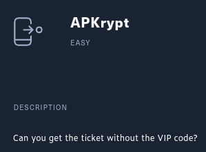

# Hackthebox - Intro to Android Exploitation - Track

- Requires a VIP account to access the retired box and challenges
- For this track you will need a setup for Android App Hacking. You can see how to set this up [here](../mobile-app/android.md)

## Challenge - Pinned

  

- Here is the readme

```txt
1. Install this application in an API Level 29 or earlier (i.e. Android 10.0 (Google APIs)).
```

- For this challenge we need to bypass certificate pinning.

- Take frida server from [here](https://github.com/frida/frida/releases)
- `unxz frida-server-version-android-x86.xz` to decompress the file
- `mkdir frida-on-venv` In my opt folder, I created a new folder for frida.
- `sudo python3 -m venv frida` Create the virtual env for frida
- `source frida/bin/activate` Activate the env
- `pip3 install frida-tools` Install Frida
- Install the apk file in your virtual machine (you can drag and drop it)
- Launch it and keep it on screen
- `adb push frida-server-16.0.8-android-x86 /data/local/tmp/frida-server`
- `adb root` (it should be already rooted but just for sanity)
- `adb shell "chmod 755 /data/local/tmp/frida-server"` so that you can launch it ;)
- In another terminal tab `adb shell` to drop in your android shell
- `su`
- `/data/local/tmp/frida-server &` to launch frida-server  

  

- `frida-ps -U -ai` from your host (will list the process) you should see pinned in the list  

  

- Take [this script](https://raw.githubusercontent.com/httptoolkit/frida-android-unpinning/main/frida-script.js)  `wget https://raw.githubusercontent.com/httptoolkit/frida-android-unpinning/main/frida-script.js`
- Then you just need to run `frida -U -l ./frida-script.js -f com.example.pinned`  

  

- Now we should be able to intercept the traffic and actually see it in Burp (frida server should still be running for this process)
- Click login in your screen  

  

- And we got the flag from Burp  


## Challenge - Manager

  

- Here is the readme

```txt

```

- We need to exactly the same process as we did for Pinned and bypass cert pining.
- For it to work I used Android 7 API 25  

  

- You should now be able to intercept the traffic.
- Connect to the instance you started
- Create an account
- When I logged in with my account I saw there was this role parameter that looked interesting  

  

- I tried to register a member with an admin role but without success. However I tried admin and got this error `Username already taken!`

  

- So we know that there is a user admin.
- And after some exploration I saw that to change the password it just need a username and a password.
- So why not try to change the password for the admin user  

  

- It works!  
- We can now login as admin and we get the flag

  

## Challenge Anchored


- Here is the readme

```txt
1. Install this application in an API Level 29 or earlier (i.e. Android 10.0 (Google Play)).

2. Install this application in a non-rooted device (i.e. In Android Studio AVD Manager select an image that includes (Google Play)).
```

- So for the other challenged I used Genymotion, but for this one I am going to use android studio (with burp and all the necessary setup)
- It seems like we will need to bypass cert pining without root rights
- So we have a non-rooted Android 10 VM  

  

- In order to do this we need objection and objection needs clean version of apktool (not the one that has `-dirty` in the end)

```bash
$ apktool --version
2.7.0
```

- Now we need to patch the apk `objection patchapk -s ~/Documents/kali-shared/hackthebox/Anchored/Anchored/Anchored.apk`

```bash
$ objection patchapk -s Anchored.apk 
No architecture specified. Determining it using `adb`...
Detected target device architecture as: x86
Using latest Github gadget version: 16.0.8
Patcher will be using Gadget version: 16.0.8
Detected apktool version as: 2.7.0
Running apktool empty-framework-dir...
I: Removing 1.apk framework file...
Unpacking Anchored.apk
App already has android.permission.INTERNET
Target class not specified, searching for launchable activity instead...
Reading smali from: /tmp/tmpfr2zcaji.apktemp/smali/com/example/anchored/MainActivity.smali
Injecting into an existing constructor
Injecting loadLibrary call at line: 18
Attempting to fix the constructors .locals count
Current locals value is 1, updating to 2:
Writing patched smali back to: /tmp/tmpfr2zcaji.apktemp/smali/com/example/anchored/MainActivity.smali
Copying Frida gadget to libs path...
Rebuilding the APK with the frida-gadget loaded...
Built new APK with injected loadLibrary and frida-gadget
Performing zipalign
Zipalign completed
Signing new APK.
Signed the new APK
Copying final apk from /tmp/tmpfr2zcaji.apktemp.aligned.objection.apk to Anchored.objection.apk in current directory...
Cleaning up temp files
```

- After this we get a version of the apk with objection in the name `Anchored.objection.apk`
- We can install it in our VM `adb install Anchored.objection.apk`
- We can lauch it. The app will be frozen (it's normal)
- `objection explore`
- And now we have to disable ssl pinning `android sslpinning disable`  

  

- It will launch the screen and you will see the traffic in burp
- Here is the app we can try to enter a random email and request access  

  

- And we get the flag (do not forget to put it in `HTB{}` before submitting it)  

  

## Challenge APKrypt

  

- Here is the readme

```bash
1. Install this application in an API Level 29 or earlier (i.e. Android 10.0 (Google APIs)).
```

- Let's have a look at the code `./jadx-gui` 
- Having a look at the java code, we can see that it takes a string it md5 it and compares it to this md5 hash `735c3628699822c4c1c09219f317a8e9`
- Here is the snippet from jadx-gui  

  

- Let's see if we can crack it. We are not successful with crackstation or hashcat.
- We know we could modify the smali code. Maybe we could change the hash to a custom hash like my name in md5 or test or anything.
- We could also modify the condition
- So yes, with access to the code and possibility to modify it we can do multiple things
- So let decompile the apk with apktool `apktool d ../APKrypt.apk`
- We get these files  

  

- Let's open the folder in a code editor (I use VSCodium see my page about it [here](https://csbygb.gitbook.io/pentips/digital-skills/vscodium)) and look for the md5 hash `735c3628699822c4c1c09219f317a8e9`. We find it in `/APKrypt/smali/com/example/apkrypt/MainActivity$1.smali`  

  

- So let's change the md5 hash

```bash
$ echo -n "test" | md5sum
098f6bcd4621d373cade4e832627b4f6  -
```

- Spoiler alert: this does not work. Let's change the condition instead
- We need to change this `if-eqz p1, :cond_0` to this `if-nez p1, :cond_0`


- Let's save it and recompile it 
  - `apktool b APKrypt/`


- Now we need to sign or we will not be able to debug it. We can use this command that we found in [this thread](https://stackoverflow.com/questions/3997748/how-can-i-create-a-keystore) of stack overflow to generate the key (it will ask for a password you will need it to sign the apk)
  - `keytool -genkey -v -keystore my-release-key.keystore -alias alias_name -keyalg RSA -keysize 2048 -validity 10000`
  - So for me `keytool -genkey -v -keystore my-release-key.keystore -alias apkrypt -keyalg RSA -keysize 2048 -validity 10000`
- Now that we have the key we can sign the apk with jarsigner see [this thread](https://stackoverflow.com/questions/21457538/how-to-use-jarsigner-for-signing-an-apk) on stackoverflow for a command `jarsigner -verbose -sigalg SHA1withRSA -digestalg SHA1 -keystore my-release-key.keystore
my_application.apk alias_name`
  - In my case `jarsigner -verbose -sigalg SHA1withRSA -digestalg SHA1 -keystore my-release-key.keystore
APKrypt.apk apkrypt`  

  

- Let's open our new file with Android Studio to debug it 
- In android studio we go to `file>profile and debug apk`


- And with the modified condition it works so even if what we type is not equal to the hash we will get the code  

  

- This is also our flag `HTB{3nj0y_y0ur_v1p_subscr1pt1on}`

## Challenge - SeeTheSharpFlag


### Writeup coming as soon as this challenge is still live
