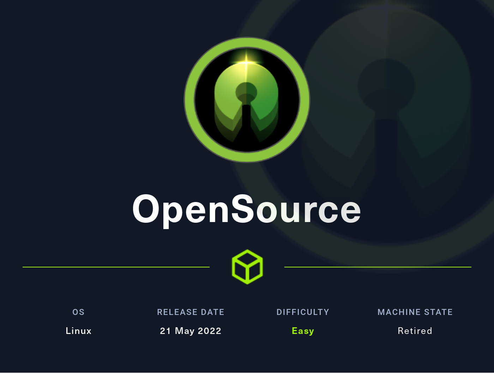
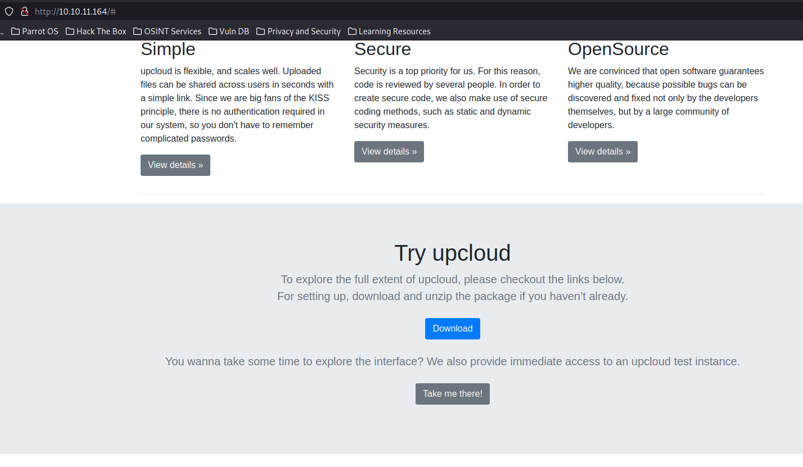
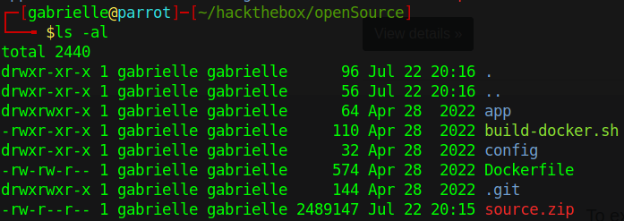
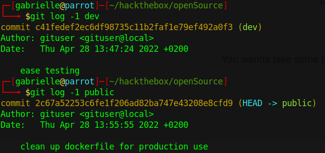
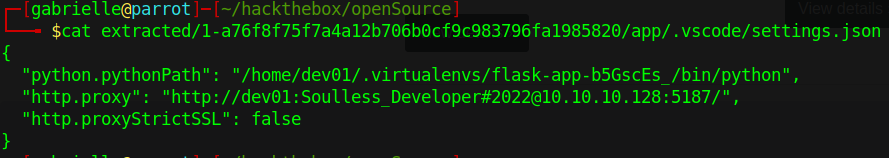

# Hackthebox - OpenSource



- [Opensource on Hackthebox](https://app.hackthebox.com/machines/471)

## Nmap

```bash
PORT     STATE    SERVICE VERSION
22/tcp   open     ssh     OpenSSH 7.6p1 Ubuntu 4ubuntu0.7 (Ubuntu Linux; protocol 2.0)
| ssh-hostkey: 
|   2048 1e59057ca958c923900f7523823d055f (RSA)
|   256 48a853e7e008aa1d968652bb8856a0b7 (ECDSA)
|_  256 021f979e3c8e7a1c7caf9d5a254bb8c8 (ED25519)
80/tcp   open     http    Werkzeug/2.1.2 Python/3.10.3
|_http-server-header: Werkzeug/2.1.2 Python/3.10.3
|_http-title: upcloud - Upload files for Free!
| fingerprint-strings: 
|   GetRequest: 
|     HTTP/1.1 200 OK
|     Server: Werkzeug/2.1.2 Python/3.10.3
|     Date: Sun, 23 Jul 2023 00:03:02 GMT
|     Content-Type: text/html; charset=utf-8
|     Content-Length: 5316
|     Connection: close
|     <html lang="en">
|     <head>
|     <meta charset="UTF-8">
|     <meta name="viewport" content="width=device-width, initial-scale=1.0">
|     <title>upcloud - Upload files for Free!</title>
|     <script src="/static/vendor/jquery/jquery-3.4.1.min.js"></script>
|     <script src="/static/vendor/popper/popper.min.js"></script>
|     <script src="/static/vendor/bootstrap/js/bootstrap.min.js"></script>
|     <script src="/static/js/ie10-viewport-bug-workaround.js"></script>
|     <link rel="stylesheet" href="/static/vendor/bootstrap/css/bootstrap.css"/>
|     <link rel="stylesheet" href=" /static/vendor/bootstrap/css/bootstrap-grid.css"/>
|     <link rel="stylesheet" href=" /static/vendor/bootstrap/css/bootstrap-reboot.css"/>
|     <link rel=
|   HTTPOptions: 
|     HTTP/1.1 200 OK
|     Server: Werkzeug/2.1.2 Python/3.10.3
|     Date: Sun, 23 Jul 2023 00:03:03 GMT
|     Content-Type: text/html; charset=utf-8
|     Allow: OPTIONS, GET, HEAD
|     Content-Length: 0
|     Connection: close
|   RTSPRequest: 
|     <!DOCTYPE HTML PUBLIC "-//W3C//DTD HTML 4.01//EN"
|     "http://www.w3.org/TR/html4/strict.dtd">
|     <html>
|     <head>
|     <meta http-equiv="Content-Type" content="text/html;charset=utf-8">
|     <title>Error response</title>
|     </head>
|     <body>
|     <h1>Error response</h1>
|     <p>Error code: 400</p>
|     <p>Message: Bad request version ('RTSP/1.0').</p>
|     <p>Error code explanation: HTTPStatus.BAD_REQUEST - Bad request syntax or unsupported method.</p>
|     </body>
|_    </html>
3000/tcp filtered ppp
1 service unrecognized despite returning data. If you know the service/version, please submit the following fingerprint at https://nmap.org/cgi-bin/submit.cgi?new-service :
SF-Port80-TCP:V=7.93%I=7%D=7/22%Time=64BC6E36%P=x86_64-pc-linux-gnu%r(GetR
SF:equest,1573,"HTTP/1\.1\x20200\x20OK\r\nServer:\x20Werkzeug/2\.1\.2\x20P
SF:ython/3\.10\.3\r\nDate:\x20Sun,\x2023\x20Jul\x202023\x2000:03:02\x20GMT
SF:\r\nContent-Type:\x20text/html;\x20charset=utf-8\r\nContent-Length:\x20
SF:5316\r\nConnection:\x20close\r\n\r\n<html\x20lang=\"en\">\n<head>\n\x20
SF:\x20\x20\x20<meta\x20charset=\"UTF-8\">\n\x20\x20\x20\x20<meta\x20name=
SF:\"viewport\"\x20content=\"width=device-width,\x20initial-scale=1\.0\">\
SF:n\x20\x20\x20\x20<title>upcloud\x20-\x20Upload\x20files\x20for\x20Free!
SF:</title>\n\n\x20\x20\x20\x20<script\x20src=\"/static/vendor/jquery/jque
SF:ry-3\.4\.1\.min\.js\"></script>\n\x20\x20\x20\x20<script\x20src=\"/stat
SF:ic/vendor/popper/popper\.min\.js\"></script>\n\n\x20\x20\x20\x20<script
SF:\x20src=\"/static/vendor/bootstrap/js/bootstrap\.min\.js\"></script>\n\
SF:x20\x20\x20\x20<script\x20src=\"/static/js/ie10-viewport-bug-workaround
SF:\.js\"></script>\n\n\x20\x20\x20\x20<link\x20rel=\"stylesheet\"\x20href
SF:=\"/static/vendor/bootstrap/css/bootstrap\.css\"/>\n\x20\x20\x20\x20<li
SF:nk\x20rel=\"stylesheet\"\x20href=\"\x20/static/vendor/bootstrap/css/boo
SF:tstrap-grid\.css\"/>\n\x20\x20\x20\x20<link\x20rel=\"stylesheet\"\x20hr
SF:ef=\"\x20/static/vendor/bootstrap/css/bootstrap-reboot\.css\"/>\n\n\x20
SF:\x20\x20\x20<link\x20rel=")%r(HTTPOptions,C7,"HTTP/1\.1\x20200\x20OK\r\
SF:nServer:\x20Werkzeug/2\.1\.2\x20Python/3\.10\.3\r\nDate:\x20Sun,\x2023\
SF:x20Jul\x202023\x2000:03:03\x20GMT\r\nContent-Type:\x20text/html;\x20cha
SF:rset=utf-8\r\nAllow:\x20OPTIONS,\x20GET,\x20HEAD\r\nContent-Length:\x20
SF:0\r\nConnection:\x20close\r\n\r\n")%r(RTSPRequest,1F4,"<!DOCTYPE\x20HTM
SF:L\x20PUBLIC\x20\"-//W3C//DTD\x20HTML\x204\.01//EN\"\n\x20\x20\x20\x20\x
SF:20\x20\x20\x20\"http://www\.w3\.org/TR/html4/strict\.dtd\">\n<html>\n\x
SF:20\x20\x20\x20<head>\n\x20\x20\x20\x20\x20\x20\x20\x20<meta\x20http-equ
SF:iv=\"Content-Type\"\x20content=\"text/html;charset=utf-8\">\n\x20\x20\x
SF:20\x20\x20\x20\x20\x20<title>Error\x20response</title>\n\x20\x20\x20\x2
SF:0</head>\n\x20\x20\x20\x20<body>\n\x20\x20\x20\x20\x20\x20\x20\x20<h1>E
SF:rror\x20response</h1>\n\x20\x20\x20\x20\x20\x20\x20\x20<p>Error\x20code
SF::\x20400</p>\n\x20\x20\x20\x20\x20\x20\x20\x20<p>Message:\x20Bad\x20req
SF:uest\x20version\x20\('RTSP/1\.0'\)\.</p>\n\x20\x20\x20\x20\x20\x20\x20\
SF:x20<p>Error\x20code\x20explanation:\x20HTTPStatus\.BAD_REQUEST\x20-\x20
SF:Bad\x20request\x20syntax\x20or\x20unsupported\x20method\.</p>\n\x20\x20
SF:\x20\x20</body>\n</html>\n");
Service Info: OS: Linux; CPE: cpe:/o:linux:linux_kernel

Service detection performed. Please report any incorrect results at https://nmap.org/submit/ .
Nmap done: 1 IP address (1 host up) scanned in 103.67 seconds
```

## Port 80

We land here  

  

When we click on "Take me there!" we get to a file upload functionality  

And when clicking on download we get a zip file named `source.zip`  
We get a git folder  

  

We can explore a little.  

  

We can try to use gitTools Extractor and look in the folders of previous version we got.  
Doing this method we find a json file in .vscode with credentials  

  

## COMING SOON