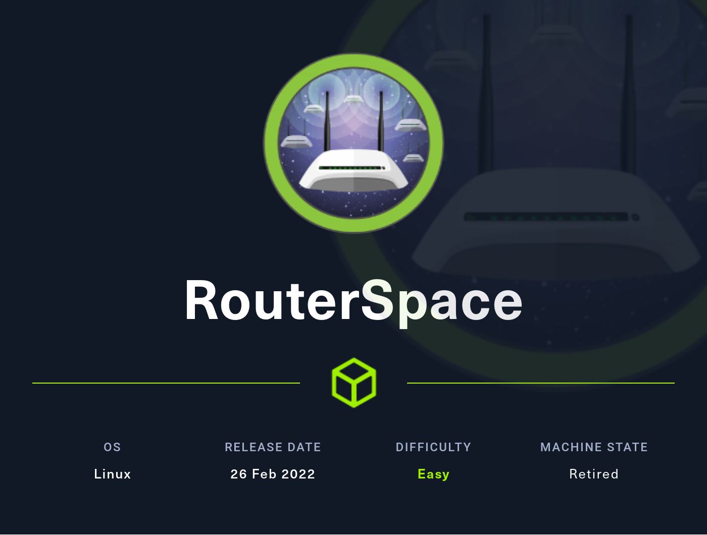

# Hackthebox - RouterSpace - Linux



## Nmap

```
┌──(root💀kali)-[~/Documents/hackthebox/routerspace]
└─# nmap -T5 -sC -sV -O -Pn -p- 10.10.11.148
Starting Nmap 7.92 ( https://nmap.org ) at 2022-05-14 17:40 EDT
sendto in send_ip_packet_sd: sendto(5, packet, 44, 0, 10.10.11.148, 16) => Operation not permitted
Offending packet: TCP 10.10.14.11:62477 > 10.10.11.148:14426 S ttl=54 id=40535 iplen=44  seq=3554380708 win=1024 <mss 1460>
Nmap scan report for 10.10.11.148
Host is up (0.022s latency).
Not shown: 65533 filtered tcp ports (no-response)
PORT   STATE SERVICE VERSION
22/tcp open  ssh     (protocol 2.0)
| fingerprint-strings: 
|   NULL: 
|_    SSH-2.0-RouterSpace Packet Filtering V1
| ssh-hostkey: 
|   3072 f4:e4:c8:0a:a6:af:66:93:af:69:5a:a9:bc:75:f9:0c (RSA)
|   256 7f:05:cd:8c:42:7b:a9:4a:b2:e6:35:2c:c4:59:78:02 (ECDSA)
|_  256 2f:d7:a8:8b:be:2d:10:b0:c9:b4:29:52:a8:94:24:78 (ED25519)
80/tcp open  http
|_http-trane-info: Problem with XML parsing of /evox/about
|_http-title: RouterSpace
| fingerprint-strings: 
|   FourOhFourRequest: 
|     HTTP/1.1 200 OK
|     X-Powered-By: RouterSpace
|     X-Cdn: RouterSpace-7888
|     Content-Type: text/html; charset=utf-8
|     Content-Length: 71
|     ETag: W/"47-sX+54c6peisKtGNZVOIFN0Fam58"
|     Date: Sat, 14 May 2022 21:49:15 GMT
|     Connection: close
|     Suspicious activity detected !!! {RequestID: p rA9A JaHgw G OJe }
|   GetRequest: 
|     HTTP/1.1 200 OK
|     X-Powered-By: RouterSpace
|     X-Cdn: RouterSpace-17500
|     Accept-Ranges: bytes
|     Cache-Control: public, max-age=0
|     Last-Modified: Mon, 22 Nov 2021 11:33:57 GMT
|     ETag: W/"652c-17d476c9285"
|     Content-Type: text/html; charset=UTF-8
|     Content-Length: 25900
|     Date: Sat, 14 May 2022 21:49:15 GMT
|     Connection: close
|     <!doctype html>
|     <html class="no-js" lang="zxx">
|     <head>
|     <meta charset="utf-8">
|     <meta http-equiv="x-ua-compatible" content="ie=edge">
|     <title>RouterSpace</title>
|     <meta name="description" content="">
|     <meta name="viewport" content="width=device-width, initial-scale=1">
|     <link rel="stylesheet" href="css/bootstrap.min.css">
|     <link rel="stylesheet" href="css/owl.carousel.min.css">
|     <link rel="stylesheet" href="css/magnific-popup.css">
|     <link rel="stylesheet" href="css/font-awesome.min.css">
|     <link rel="stylesheet" href="css/themify-icons.css">
|   HTTPOptions: 
|     HTTP/1.1 200 OK
|     X-Powered-By: RouterSpace
|     X-Cdn: RouterSpace-83120
|     Allow: GET,HEAD,POST
|     Content-Type: text/html; charset=utf-8
|     Content-Length: 13
|     ETag: W/"d-bMedpZYGrVt1nR4x+qdNZ2GqyRo"
|     Date: Sat, 14 May 2022 21:49:15 GMT
|     Connection: close
|     GET,HEAD,POST
|   RTSPRequest, X11Probe: 
|     HTTP/1.1 400 Bad Request
|_    Connection: close
2 services unrecognized despite returning data. If you know the service/version, please submit the following fingerprints at https://nmap.org/cgi-bin/submit.cgi?new-service :
==============NEXT SERVICE FINGERPRINT (SUBMIT INDIVIDUALLY)==============
SF-Port22-TCP:V=7.92%I=7%D=5/14%Time=6280220D%P=x86_64-pc-linux-gnu%r(NULL
SF:,29,"SSH-2\.0-RouterSpace\x20Packet\x20Filtering\x20V1\r\n");
==============NEXT SERVICE FINGERPRINT (SUBMIT INDIVIDUALLY)==============
SF-Port80-TCP:V=7.92%I=7%D=5/14%Time=6280220D%P=x86_64-pc-linux-gnu%r(GetR
SF:equest,31BA,"HTTP/1\.1\x20200\x20OK\r\nX-Powered-By:\x20RouterSpace\r\n
SF:X-Cdn:\x20RouterSpace-17500\r\nAccept-Ranges:\x20bytes\r\nCache-Control
SF::\x20public,\x20max-age=0\r\nLast-Modified:\x20Mon,\x2022\x20Nov\x20202
SF:1\x2011:33:57\x20GMT\r\nETag:\x20W/\"652c-17d476c9285\"\r\nContent-Type
SF::\x20text/html;\x20charset=UTF-8\r\nContent-Length:\x2025900\r\nDate:\x
SF:20Sat,\x2014\x20May\x202022\x2021:49:15\x20GMT\r\nConnection:\x20close\
SF:r\n\r\n<!doctype\x20html>\n<html\x20class=\"no-js\"\x20lang=\"zxx\">\n<
SF:head>\n\x20\x20\x20\x20<meta\x20charset=\"utf-8\">\n\x20\x20\x20\x20<me
SF:ta\x20http-equiv=\"x-ua-compatible\"\x20content=\"ie=edge\">\n\x20\x20\
SF:x20\x20<title>RouterSpace</title>\n\x20\x20\x20\x20<meta\x20name=\"desc
SF:ription\"\x20content=\"\">\n\x20\x20\x20\x20<meta\x20name=\"viewport\"\
SF:x20content=\"width=device-width,\x20initial-scale=1\">\n\n\x20\x20\x20\
SF:x20<link\x20rel=\"stylesheet\"\x20href=\"css/bootstrap\.min\.css\">\n\x
SF:20\x20\x20\x20<link\x20rel=\"stylesheet\"\x20href=\"css/owl\.carousel\.
SF:min\.css\">\n\x20\x20\x20\x20<link\x20rel=\"stylesheet\"\x20href=\"css/
SF:magnific-popup\.css\">\n\x20\x20\x20\x20<link\x20rel=\"stylesheet\"\x20
SF:href=\"css/font-awesome\.min\.css\">\n\x20\x20\x20\x20<link\x20rel=\"st
SF:ylesheet\"\x20href=\"css/themify-icons\.css\">\n\x20")%r(HTTPOptions,10
SF:8,"HTTP/1\.1\x20200\x20OK\r\nX-Powered-By:\x20RouterSpace\r\nX-Cdn:\x20
SF:RouterSpace-83120\r\nAllow:\x20GET,HEAD,POST\r\nContent-Type:\x20text/h
SF:tml;\x20charset=utf-8\r\nContent-Length:\x2013\r\nETag:\x20W/\"d-bMedpZ
SF:YGrVt1nR4x\+qdNZ2GqyRo\"\r\nDate:\x20Sat,\x2014\x20May\x202022\x2021:49
SF::15\x20GMT\r\nConnection:\x20close\r\n\r\nGET,HEAD,POST")%r(RTSPRequest
SF:,2F,"HTTP/1\.1\x20400\x20Bad\x20Request\r\nConnection:\x20close\r\n\r\n
SF:")%r(X11Probe,2F,"HTTP/1\.1\x20400\x20Bad\x20Request\r\nConnection:\x20
SF:close\r\n\r\n")%r(FourOhFourRequest,12C,"HTTP/1\.1\x20200\x20OK\r\nX-Po
SF:wered-By:\x20RouterSpace\r\nX-Cdn:\x20RouterSpace-7888\r\nContent-Type:
SF:\x20text/html;\x20charset=utf-8\r\nContent-Length:\x2071\r\nETag:\x20W/
SF:\"47-sX\+54c6peisKtGNZVOIFN0Fam58\"\r\nDate:\x20Sat,\x2014\x20May\x2020
SF:22\x2021:49:15\x20GMT\r\nConnection:\x20close\r\n\r\nSuspicious\x20acti
SF:vity\x20detected\x20!!!\x20{RequestID:\x20p\x20\x20rA9A\x20\x20\x20JaHg
SF:w\x20\x20G\x20OJe\x20}\n\n");
Warning: OSScan results may be unreliable because we could not find at least 1 open and 1 closed port
Aggressive OS guesses: Linux 4.15 - 5.6 (92%), Linux 5.0 (92%), Linux 5.0 - 5.4 (91%), Linux 5.3 - 5.4 (91%), Linux 2.6.32 (91%), Crestron XPanel control system (90%), Linux 5.0 - 5.3 (89%), Linux 5.4 (89%), ASUS RT-N56U WAP (Linux 3.4) (87%), Linux 3.1 (87%)
No exact OS matches for host (test conditions non-ideal).

OS and Service detection performed. Please report any incorrect results at https://nmap.org/submit/ .
Nmap done: 1 IP address (1 host up) scanned in 74.49 seconds                                                               
```

## Port 80

- We have this page  
  
- If we click on download we get and apk file:   
  
- Let's open it with jadx-gui, there's nothing that stands out in the manifest
- I am just going to try to lanch it from android studio  
  
- We click on next and we have a router we can check status  
  
- I am also going to intercept the traffic using burp
- So we have to launch it and set up a new proxy listener as follow  
  
- Our settings in Android studio should look like this:  
  
