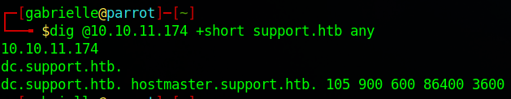

# Hackthebox - Support

- Windows


- [Box on HTB](https://app.hackthebox.com/machines/484)

## Nmap

```bash
┌─[✗]─[gabrielle@parrot]─[~]
└──╼ $sudo nmap -T4 -sC -sV -O -Pn -p- 10.10.11.174
[sudo] password for gabrielle: 
Starting Nmap 7.92 ( https://nmap.org ) at 2023-02-04 17:51 EST
Nmap scan report for 10.10.11.174
Host is up (0.030s latency).
Not shown: 65516 filtered tcp ports (no-response)
PORT      STATE SERVICE       VERSION
53/tcp    open  domain        Simple DNS Plus
88/tcp    open  kerberos-sec  Microsoft Windows Kerberos (server time: 2023-02-04 22:53:27Z)
135/tcp   open  msrpc         Microsoft Windows RPC
139/tcp   open  netbios-ssn   Microsoft Windows netbios-ssn
389/tcp   open  ldap          Microsoft Windows Active Directory LDAP (Domain: support.htb0., Site: Default-First-Site-Name)
445/tcp   open  microsoft-ds?
464/tcp   open  kpasswd5?
593/tcp   open  ncacn_http    Microsoft Windows RPC over HTTP 1.0
636/tcp   open  tcpwrapped
3268/tcp  open  ldap          Microsoft Windows Active Directory LDAP (Domain: support.htb0., Site: Default-First-Site-Name)
3269/tcp  open  tcpwrapped
5985/tcp  open  http          Microsoft HTTPAPI httpd 2.0 (SSDP/UPnP)
|_http-title: Not Found
|_http-server-header: Microsoft-HTTPAPI/2.0
9389/tcp  open  mc-nmf        .NET Message Framing
49664/tcp open  msrpc         Microsoft Windows RPC
49667/tcp open  msrpc         Microsoft Windows RPC
49674/tcp open  ncacn_http    Microsoft Windows RPC over HTTP 1.0
49686/tcp open  msrpc         Microsoft Windows RPC
49700/tcp open  msrpc         Microsoft Windows RPC
64153/tcp open  msrpc         Microsoft Windows RPC
Warning: OSScan results may be unreliable because we could not find at least 1 open and 1 closed port
Device type: general purpose
Running (JUST GUESSING): Microsoft Windows 2016 (85%)
OS CPE: cpe:/o:microsoft:windows_server_2016
Aggressive OS guesses: Microsoft Windows Server 2016 (85%)
No exact OS matches for host (test conditions non-ideal).
Service Info: Host: DC; OS: Windows; CPE: cpe:/o:microsoft:windows

Host script results:
| smb2-security-mode: 
|   3.1.1: 
|_    Message signing enabled and required
| smb2-time: 
|   date: 2023-02-04T22:54:22
|_  start_date: N/A

OS and Service detection performed. Please report any incorrect results at https://nmap.org/submit/ .
Nmap done: 1 IP address (1 host up) scanned in 189.62 seconds
```

- We can put `support.htb` to our /etc/hosts file

## DNS enumeration

There are a lot of open ports and I am having a hard time to find the name of the dc.

- Let's try the [dig](https://www.geeksforgeeks.org/dig-command-in-linux-with-examples/) command  



- We can update our host file

## ldap

ldapsearch was not really helpful as it needs a username or something

```bash
┌─[✗]─[gabrielle@parrot]─[~]
└──╼ $ldapsearch -x -b "dc=support,dc=htb" -H ldap://dc.support.htb
# extended LDIF
#
# LDAPv3
# base <dc=support,dc=htb> with scope subtree
# filter: (objectclass=*)
# requesting: ALL
#

# search result
search: 2
result: 1 Operations error
text: 000004DC: LdapErr: DSID-0C090A5A, comment: In order to perform this opera
 tion a successful bind must be completed on the connection., data 0, v4f7c

# numResponses: 1
```

```bash
┌─[gabrielle@parrot]─[~/Documents/userinfo]
└──╼ $nmap -Pn -n -sV --script "ldap* and not brute" 10.10.11.174
Starting Nmap 7.92 ( https://nmap.org ) at 2023-02-04 19:38 EST
Nmap scan report for 10.10.11.174
Host is up (0.033s latency).
Not shown: 989 filtered tcp ports (no-response)
PORT     STATE SERVICE       VERSION
53/tcp   open  domain        Simple DNS Plus
88/tcp   open  kerberos-sec  Microsoft Windows Kerberos (server time: 2023-02-05 00:38:50Z)
135/tcp  open  msrpc         Microsoft Windows RPC
139/tcp  open  netbios-ssn   Microsoft Windows netbios-ssn
389/tcp  open  ldap          Microsoft Windows Active Directory LDAP (Domain: support.htb, Site: Default-First-Site-Name)
| ldap-rootdse: 
| LDAP Results
|   <ROOT>
|       domainFunctionality: 7
|       forestFunctionality: 7
|       domainControllerFunctionality: 7
|       rootDomainNamingContext: DC=support,DC=htb
|       ldapServiceName: support.htb:dc$@SUPPORT.HTB
|       isGlobalCatalogReady: TRUE
|       supportedSASLMechanisms: GSSAPI
|       supportedSASLMechanisms: GSS-SPNEGO
|       supportedSASLMechanisms: EXTERNAL
|       supportedSASLMechanisms: DIGEST-MD5
|       supportedLDAPVersion: 3
|       supportedLDAPVersion: 2
|       supportedLDAPPolicies: MaxPoolThreads
|       supportedLDAPPolicies: MaxPercentDirSyncRequests
|       supportedLDAPPolicies: MaxDatagramRecv
|       supportedLDAPPolicies: MaxReceiveBuffer
|       supportedLDAPPolicies: InitRecvTimeout
|       supportedLDAPPolicies: MaxConnections
|       supportedLDAPPolicies: MaxConnIdleTime
|       supportedLDAPPolicies: MaxPageSize
|       supportedLDAPPolicies: MaxBatchReturnMessages
|       supportedLDAPPolicies: MaxQueryDuration
|       supportedLDAPPolicies: MaxDirSyncDuration
|       supportedLDAPPolicies: MaxTempTableSize
|       supportedLDAPPolicies: MaxResultSetSize
|       supportedLDAPPolicies: MinResultSets
|       supportedLDAPPolicies: MaxResultSetsPerConn
|       supportedLDAPPolicies: MaxNotificationPerConn
|       supportedLDAPPolicies: MaxValRange
|       supportedLDAPPolicies: MaxValRangeTransitive
|       supportedLDAPPolicies: ThreadMemoryLimit
|       supportedLDAPPolicies: SystemMemoryLimitPercent
|       supportedControl: 1.2.840.113556.1.4.319
|       supportedControl: 1.2.840.113556.1.4.801
|       supportedControl: 1.2.840.113556.1.4.473
|       supportedControl: 1.2.840.113556.1.4.528
|       supportedControl: 1.2.840.113556.1.4.417
|       supportedControl: 1.2.840.113556.1.4.619
|       supportedControl: 1.2.840.113556.1.4.841
|       supportedControl: 1.2.840.113556.1.4.529
|       supportedControl: 1.2.840.113556.1.4.805
|       supportedControl: 1.2.840.113556.1.4.521
|       supportedControl: 1.2.840.113556.1.4.970
|       supportedControl: 1.2.840.113556.1.4.1338
|       supportedControl: 1.2.840.113556.1.4.474
|       supportedControl: 1.2.840.113556.1.4.1339
|       supportedControl: 1.2.840.113556.1.4.1340
|       supportedControl: 1.2.840.113556.1.4.1413
|       supportedControl: 2.16.840.1.113730.3.4.9
|       supportedControl: 2.16.840.1.113730.3.4.10
|       supportedControl: 1.2.840.113556.1.4.1504
|       supportedControl: 1.2.840.113556.1.4.1852
|       supportedControl: 1.2.840.113556.1.4.802
|       supportedControl: 1.2.840.113556.1.4.1907
|       supportedControl: 1.2.840.113556.1.4.1948
|       supportedControl: 1.2.840.113556.1.4.1974
|       supportedControl: 1.2.840.113556.1.4.1341
|       supportedControl: 1.2.840.113556.1.4.2026
|       supportedControl: 1.2.840.113556.1.4.2064
|       supportedControl: 1.2.840.113556.1.4.2065
|       supportedControl: 1.2.840.113556.1.4.2066
|       supportedControl: 1.2.840.113556.1.4.2090
|       supportedControl: 1.2.840.113556.1.4.2205
|       supportedControl: 1.2.840.113556.1.4.2204
|       supportedControl: 1.2.840.113556.1.4.2206
|       supportedControl: 1.2.840.113556.1.4.2211
|       supportedControl: 1.2.840.113556.1.4.2239
|       supportedControl: 1.2.840.113556.1.4.2255
|       supportedControl: 1.2.840.113556.1.4.2256
|       supportedControl: 1.2.840.113556.1.4.2309
|       supportedControl: 1.2.840.113556.1.4.2330
|       supportedControl: 1.2.840.113556.1.4.2354
|       supportedCapabilities: 1.2.840.113556.1.4.800
|       supportedCapabilities: 1.2.840.113556.1.4.1670
|       supportedCapabilities: 1.2.840.113556.1.4.1791
|       supportedCapabilities: 1.2.840.113556.1.4.1935
|       supportedCapabilities: 1.2.840.113556.1.4.2080
|       supportedCapabilities: 1.2.840.113556.1.4.2237
|       subschemaSubentry: CN=Aggregate,CN=Schema,CN=Configuration,DC=support,DC=htb
|       serverName: CN=DC,CN=Servers,CN=Default-First-Site-Name,CN=Sites,CN=Configuration,DC=support,DC=htb
|       schemaNamingContext: CN=Schema,CN=Configuration,DC=support,DC=htb
|       namingContexts: DC=support,DC=htb
|       namingContexts: CN=Configuration,DC=support,DC=htb
|       namingContexts: CN=Schema,CN=Configuration,DC=support,DC=htb
|       namingContexts: DC=DomainDnsZones,DC=support,DC=htb
|       namingContexts: DC=ForestDnsZones,DC=support,DC=htb
|       isSynchronized: TRUE
|       highestCommittedUSN: 81995
|       dsServiceName: CN=NTDS Settings,CN=DC,CN=Servers,CN=Default-First-Site-Name,CN=Sites,CN=Configuration,DC=support,DC=htb
|       dnsHostName: dc.support.htb
|       defaultNamingContext: DC=support,DC=htb
|       currentTime: 20230205003852.0Z
|_      configurationNamingContext: CN=Configuration,DC=support,DC=htb
445/tcp  open  microsoft-ds?
464/tcp  open  kpasswd5?
593/tcp  open  ncacn_http    Microsoft Windows RPC over HTTP 1.0
636/tcp  open  tcpwrapped
3268/tcp open  ldap          Microsoft Windows Active Directory LDAP (Domain: support.htb, Site: Default-First-Site-Name)
| ldap-rootdse: 
| LDAP Results
|   <ROOT>
|       domainFunctionality: 7
|       forestFunctionality: 7
|       domainControllerFunctionality: 7
|       rootDomainNamingContext: DC=support,DC=htb
|       ldapServiceName: support.htb:dc$@SUPPORT.HTB
|       isGlobalCatalogReady: TRUE
|       supportedSASLMechanisms: GSSAPI
|       supportedSASLMechanisms: GSS-SPNEGO
|       supportedSASLMechanisms: EXTERNAL
|       supportedSASLMechanisms: DIGEST-MD5
|       supportedLDAPVersion: 3
|       supportedLDAPVersion: 2
|       supportedLDAPPolicies: MaxPoolThreads
|       supportedLDAPPolicies: MaxPercentDirSyncRequests
|       supportedLDAPPolicies: MaxDatagramRecv
|       supportedLDAPPolicies: MaxReceiveBuffer
|       supportedLDAPPolicies: InitRecvTimeout
|       supportedLDAPPolicies: MaxConnections
|       supportedLDAPPolicies: MaxConnIdleTime
|       supportedLDAPPolicies: MaxPageSize
|       supportedLDAPPolicies: MaxBatchReturnMessages
|       supportedLDAPPolicies: MaxQueryDuration
|       supportedLDAPPolicies: MaxDirSyncDuration
|       supportedLDAPPolicies: MaxTempTableSize
|       supportedLDAPPolicies: MaxResultSetSize
|       supportedLDAPPolicies: MinResultSets
|       supportedLDAPPolicies: MaxResultSetsPerConn
|       supportedLDAPPolicies: MaxNotificationPerConn
|       supportedLDAPPolicies: MaxValRange
|       supportedLDAPPolicies: MaxValRangeTransitive
|       supportedLDAPPolicies: ThreadMemoryLimit
|       supportedLDAPPolicies: SystemMemoryLimitPercent
|       supportedControl: 1.2.840.113556.1.4.319
|       supportedControl: 1.2.840.113556.1.4.801
|       supportedControl: 1.2.840.113556.1.4.473
|       supportedControl: 1.2.840.113556.1.4.528
|       supportedControl: 1.2.840.113556.1.4.417
|       supportedControl: 1.2.840.113556.1.4.619
|       supportedControl: 1.2.840.113556.1.4.841
|       supportedControl: 1.2.840.113556.1.4.529
|       supportedControl: 1.2.840.113556.1.4.805
|       supportedControl: 1.2.840.113556.1.4.521
|       supportedControl: 1.2.840.113556.1.4.970
|       supportedControl: 1.2.840.113556.1.4.1338
|       supportedControl: 1.2.840.113556.1.4.474
|       supportedControl: 1.2.840.113556.1.4.1339
|       supportedControl: 1.2.840.113556.1.4.1340
|       supportedControl: 1.2.840.113556.1.4.1413
|       supportedControl: 2.16.840.1.113730.3.4.9
|       supportedControl: 2.16.840.1.113730.3.4.10
|       supportedControl: 1.2.840.113556.1.4.1504
|       supportedControl: 1.2.840.113556.1.4.1852
|       supportedControl: 1.2.840.113556.1.4.802
|       supportedControl: 1.2.840.113556.1.4.1907
|       supportedControl: 1.2.840.113556.1.4.1948
|       supportedControl: 1.2.840.113556.1.4.1974
|       supportedControl: 1.2.840.113556.1.4.1341
|       supportedControl: 1.2.840.113556.1.4.2026
|       supportedControl: 1.2.840.113556.1.4.2064
|       supportedControl: 1.2.840.113556.1.4.2065
|       supportedControl: 1.2.840.113556.1.4.2066
|       supportedControl: 1.2.840.113556.1.4.2090
|       supportedControl: 1.2.840.113556.1.4.2205
|       supportedControl: 1.2.840.113556.1.4.2204
|       supportedControl: 1.2.840.113556.1.4.2206
|       supportedControl: 1.2.840.113556.1.4.2211
|       supportedControl: 1.2.840.113556.1.4.2239
|       supportedControl: 1.2.840.113556.1.4.2255
|       supportedControl: 1.2.840.113556.1.4.2256
|       supportedControl: 1.2.840.113556.1.4.2309
|       supportedControl: 1.2.840.113556.1.4.2330
|       supportedControl: 1.2.840.113556.1.4.2354
|       supportedCapabilities: 1.2.840.113556.1.4.800
|       supportedCapabilities: 1.2.840.113556.1.4.1670
|       supportedCapabilities: 1.2.840.113556.1.4.1791
|       supportedCapabilities: 1.2.840.113556.1.4.1935
|       supportedCapabilities: 1.2.840.113556.1.4.2080
|       supportedCapabilities: 1.2.840.113556.1.4.2237
|       subschemaSubentry: CN=Aggregate,CN=Schema,CN=Configuration,DC=support,DC=htb
|       serverName: CN=DC,CN=Servers,CN=Default-First-Site-Name,CN=Sites,CN=Configuration,DC=support,DC=htb
|       schemaNamingContext: CN=Schema,CN=Configuration,DC=support,DC=htb
|       namingContexts: DC=support,DC=htb
|       namingContexts: CN=Configuration,DC=support,DC=htb
|       namingContexts: CN=Schema,CN=Configuration,DC=support,DC=htb
|       namingContexts: DC=DomainDnsZones,DC=support,DC=htb
|       namingContexts: DC=ForestDnsZones,DC=support,DC=htb
|       isSynchronized: TRUE
|       highestCommittedUSN: 81995
|       dsServiceName: CN=NTDS Settings,CN=DC,CN=Servers,CN=Default-First-Site-Name,CN=Sites,CN=Configuration,DC=support,DC=htb
|       dnsHostName: dc.support.htb
|       defaultNamingContext: DC=support,DC=htb
|       currentTime: 20230205003852.0Z
|_      configurationNamingContext: CN=Configuration,DC=support,DC=htb
3269/tcp open  tcpwrapped
Service Info: Host: DC; OS: Windows; CPE: cpe:/o:microsoft:windows

Service detection performed. Please report any incorrect results at https://nmap.org/submit/ .
Nmap done: 1 IP address (1 host up) scanned in 12.87 seconds
```

## SMB

```bash
┌─[gabrielle@parrot]─[~]
└──╼ $smbclient //10.10.11.174/support-tools
Password for [WORKGROUP\gabrielle]:
Try "help" to get a list of possible commands.
smb: \> ls
  .                                   D        0  Wed Jul 20 13:01:06 2022
  ..                                  D        0  Sat May 28 07:18:25 2022
  7-ZipPortable_21.07.paf.exe         A  2880728  Sat May 28 07:19:19 2022
  npp.8.4.1.portable.x64.zip          A  5439245  Sat May 28 07:19:55 2022
  putty.exe                           A  1273576  Sat May 28 07:20:06 2022
  SysinternalsSuite.zip               A 48102161  Sat May 28 07:19:31 2022
  UserInfo.exe.zip                    A   277499  Wed Jul 20 13:01:07 2022
  windirstat1_1_2_setup.exe           A    79171  Sat May 28 07:20:17 2022
  WiresharkPortable64_3.6.5.paf.exe      A 44398000  Sat May 28 07:19:43 2022

		4026367 blocks of size 4096. 969931 blocks available
smb: \> 
```

- Let's check this userinfo file. If we look it up we find this [page](https://www.mkssoftware.com/docs/man1/userinfo.1.asp)

**Coming soon**
