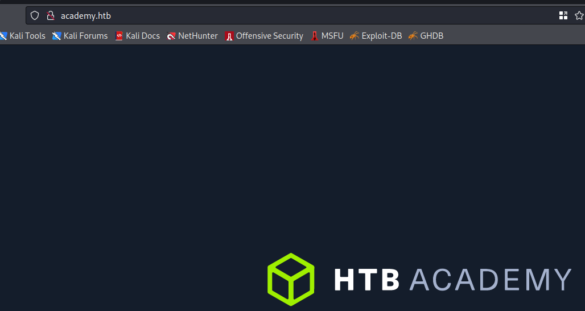
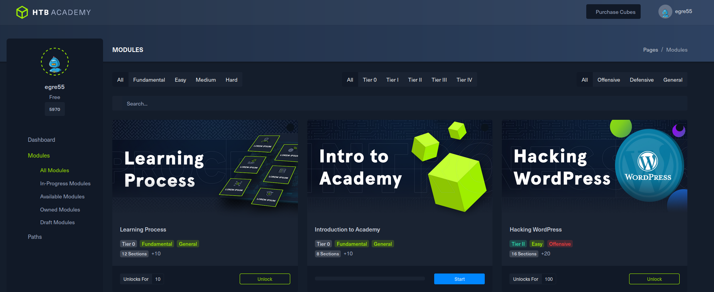

# Hackthebox - Academy 

- Linux


- [Box on HTB](https://app.hackthebox.com/machines/297)

## Nmap

```
nmap -Pn -sV -sC -p- 10.10.10.215 
Starting Nmap 7.92 ( https://nmap.org ) at 2022-08-31 07:52 EDT
Nmap scan report for 10.10.10.215
Host is up (0.029s latency).
Not shown: 65532 closed tcp ports (conn-refused)
PORT      STATE SERVICE VERSION
22/tcp    open  ssh     OpenSSH 8.2p1 Ubuntu 4ubuntu0.1 (Ubuntu Linux; protocol 2.0)
| ssh-hostkey: 
|   3072 c0:90:a3:d8:35:25:6f:fa:33:06:cf:80:13:a0:a5:53 (RSA)
|   256 2a:d5:4b:d0:46:f0:ed:c9:3c:8d:f6:5d:ab:ae:77:96 (ECDSA)
|_  256 e1:64:14:c3:cc:51:b2:3b:a6:28:a7:b1:ae:5f:45:35 (ED25519)
80/tcp    open  http    Apache httpd 2.4.41 ((Ubuntu))
|_http-title: Did not follow redirect to http://academy.htb/
|_http-server-header: Apache/2.4.41 (Ubuntu)
33060/tcp open  mysqlx?
| fingerprint-strings: 
|   DNSStatusRequestTCP, LDAPSearchReq, NotesRPC, SSLSessionReq, TLSSessionReq, X11Probe, afp: 
|     Invalid message"
|_    HY000
1 service unrecognized despite returning data. If you know the service/version, please submit the following fingerprint at https://nmap.org/cgi-bin/submit.cgi?new-service :
SF-Port33060-TCP:V=7.92%I=7%D=8/31%Time=630F4B7F%P=x86_64-pc-linux-gnu%r(N
SF:ULL,9,"\x05\0\0\0\x0b\x08\x05\x1a\0")%r(GenericLines,9,"\x05\0\0\0\x0b\
SF:x08\x05\x1a\0")%r(GetRequest,9,"\x05\0\0\0\x0b\x08\x05\x1a\0")%r(HTTPOp
SF:tions,9,"\x05\0\0\0\x0b\x08\x05\x1a\0")%r(RTSPRequest,9,"\x05\0\0\0\x0b
SF:\x08\x05\x1a\0")%r(RPCCheck,9,"\x05\0\0\0\x0b\x08\x05\x1a\0")%r(DNSVers
SF:ionBindReqTCP,9,"\x05\0\0\0\x0b\x08\x05\x1a\0")%r(DNSStatusRequestTCP,2
SF:B,"\x05\0\0\0\x0b\x08\x05\x1a\0\x1e\0\0\0\x01\x08\x01\x10\x88'\x1a\x0fI
SF:nvalid\x20message\"\x05HY000")%r(Help,9,"\x05\0\0\0\x0b\x08\x05\x1a\0")
SF:%r(SSLSessionReq,2B,"\x05\0\0\0\x0b\x08\x05\x1a\0\x1e\0\0\0\x01\x08\x01
SF:\x10\x88'\x1a\x0fInvalid\x20message\"\x05HY000")%r(TerminalServerCookie
SF:,9,"\x05\0\0\0\x0b\x08\x05\x1a\0")%r(TLSSessionReq,2B,"\x05\0\0\0\x0b\x
SF:08\x05\x1a\0\x1e\0\0\0\x01\x08\x01\x10\x88'\x1a\x0fInvalid\x20message\"
SF:\x05HY000")%r(Kerberos,9,"\x05\0\0\0\x0b\x08\x05\x1a\0")%r(SMBProgNeg,9
SF:,"\x05\0\0\0\x0b\x08\x05\x1a\0")%r(X11Probe,2B,"\x05\0\0\0\x0b\x08\x05\
SF:x1a\0\x1e\0\0\0\x01\x08\x01\x10\x88'\x1a\x0fInvalid\x20message\"\x05HY0
SF:00")%r(FourOhFourRequest,9,"\x05\0\0\0\x0b\x08\x05\x1a\0")%r(LPDString,
SF:9,"\x05\0\0\0\x0b\x08\x05\x1a\0")%r(LDAPSearchReq,2B,"\x05\0\0\0\x0b\x0
SF:8\x05\x1a\0\x1e\0\0\0\x01\x08\x01\x10\x88'\x1a\x0fInvalid\x20message\"\
SF:x05HY000")%r(LDAPBindReq,9,"\x05\0\0\0\x0b\x08\x05\x1a\0")%r(SIPOptions
SF:,9,"\x05\0\0\0\x0b\x08\x05\x1a\0")%r(LANDesk-RC,9,"\x05\0\0\0\x0b\x08\x
SF:05\x1a\0")%r(TerminalServer,9,"\x05\0\0\0\x0b\x08\x05\x1a\0")%r(NCP,9,"
SF:\x05\0\0\0\x0b\x08\x05\x1a\0")%r(NotesRPC,2B,"\x05\0\0\0\x0b\x08\x05\x1
SF:a\0\x1e\0\0\0\x01\x08\x01\x10\x88'\x1a\x0fInvalid\x20message\"\x05HY000
SF:")%r(JavaRMI,9,"\x05\0\0\0\x0b\x08\x05\x1a\0")%r(WMSRequest,9,"\x05\0\0
SF:\0\x0b\x08\x05\x1a\0")%r(oracle-tns,9,"\x05\0\0\0\x0b\x08\x05\x1a\0")%r
SF:(ms-sql-s,9,"\x05\0\0\0\x0b\x08\x05\x1a\0")%r(afp,2B,"\x05\0\0\0\x0b\x0
SF:8\x05\x1a\0\x1e\0\0\0\x01\x08\x01\x10\x88'\x1a\x0fInvalid\x20message\"\
SF:x05HY000")%r(giop,9,"\x05\0\0\0\x0b\x08\x05\x1a\0");
Service Info: OS: Linux; CPE: cpe:/o:linux:linux_kernel

Service detection performed. Please report any incorrect results at https://nmap.org/submit/ .
Nmap done: 1 IP address (1 host up) scanned in 45.77 seconds
```

## Port 80

- We need to edit our /etc/host file and these lines:

```
10.10.10.215	academy.htb
10.10.10.215	www.academy.htb
```

- Once done if we go to `http://academy.htb/` we get this page  
  
- Looking at the image we find and images directory, let's run gobuster on it to find more dirs

### Directory busting

- Nothing here and subdomain enum either.

### Login & Register

- As we have a login an register option let's try this
- If we create a user and connect with it we get to this page  


**Coming Soon**