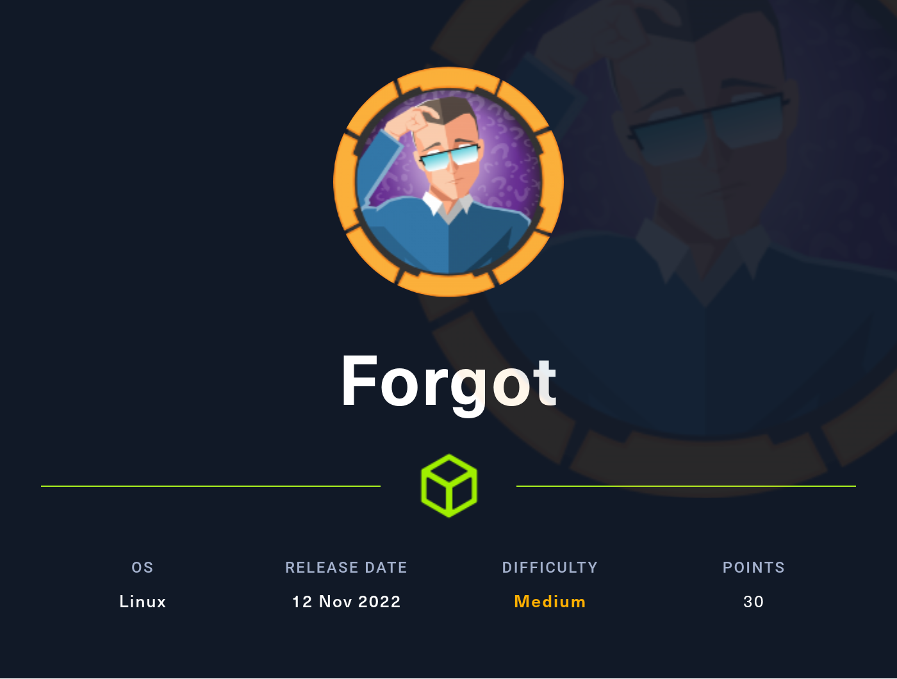
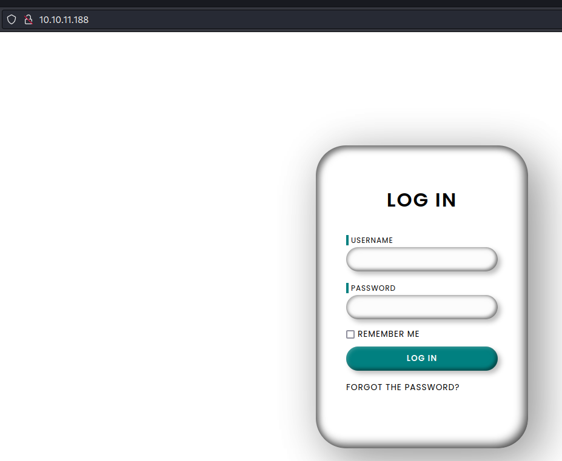

# Hackthebox - Forgot - Linux



## Nmap

```bash
┌──(kali㉿kali)-[~]
└─$ sudo nmap -T4 -sC -sV -O -Pn -p- 10.10.11.188                   
[sudo] password for kali: 
Starting Nmap 7.93 ( https://nmap.org ) at 2023-01-05 12:36 EST
Nmap scan report for 10.10.11.188
Host is up (0.050s latency).
Not shown: 65533 closed tcp ports (reset)
PORT   STATE SERVICE VERSION
22/tcp open  ssh     OpenSSH 8.2p1 Ubuntu 4ubuntu0.5 (Ubuntu Linux; protocol 2.0)
| ssh-hostkey: 
|   3072 48add5b83a9fbcbef7e8201ef6bfdeae (RSA)
|   256 b7896c0b20ed49b2c1867c2992741c1f (ECDSA)
|_  256 18cd9d08a621a8b8b6f79f8d405154fb (ED25519)
80/tcp open  http    Werkzeug/2.1.2 Python/3.8.10
| fingerprint-strings: 
|   FourOhFourRequest: 
|     HTTP/1.1 404 NOT FOUND
|     Server: Werkzeug/2.1.2 Python/3.8.10
|     Date: Thu, 05 Jan 2023 17:52:24 GMT
|     Content-Type: text/html; charset=utf-8
|     Content-Length: 207
|     X-Varnish: 32801
|     Age: 0
|     Via: 1.1 varnish (Varnish/6.2)
|     Connection: close
|     <!doctype html>
|     <html lang=en>
|     <title>404 Not Found</title>
|     <h1>Not Found</h1>
|     <p>The requested URL was not found on the server. If you entered the URL manually please check your spelling and try again.</p>
|   GetRequest: 
|     HTTP/1.1 302 FOUND
|     Server: Werkzeug/2.1.2 Python/3.8.10
|     Date: Thu, 05 Jan 2023 17:52:18 GMT
|     Content-Type: text/html; charset=utf-8
|     Content-Length: 219
|     Location: http://127.0.0.1
|     X-Varnish: 30
|     Age: 0
|     Via: 1.1 varnish (Varnish/6.2)
|     Connection: close
|     <!doctype html>
|     <html lang=en>
|     <title>Redirecting...</title>
|     <h1>Redirecting...</h1>
|     <p>You should be redirected automatically to the target URL: <a href="http://127.0.0.1">http://127.0.0.1</a>. If not, click the link.
|   HTTPOptions: 
|     HTTP/1.1 200 OK
|     Server: Werkzeug/2.1.2 Python/3.8.10
|     Date: Thu, 05 Jan 2023 17:52:19 GMT
|     Content-Type: text/html; charset=utf-8
|     Allow: OPTIONS, HEAD, GET
|     Content-Length: 0
|     X-Varnish: 32797
|     Age: 0
|     Via: 1.1 varnish (Varnish/6.2)
|     Accept-Ranges: bytes
|     Connection: close
|   RTSPRequest, SIPOptions: 
|_    HTTP/1.1 400 Bad Request
|_http-title: Login
|_http-server-header: Werkzeug/2.1.2 Python/3.8.10
1 service unrecognized despite returning data. If you know the service/version, please submit the following fingerprint at https://nmap.org/cgi-bin/submit.cgi?new-service :
SF-Port80-TCP:V=7.93%I=7%D=1/5%Time=63B70E53%P=x86_64-pc-linux-gnu%r(GetRe
SF:quest,1DF,"HTTP/1\.1\x20302\x20FOUND\r\nServer:\x20Werkzeug/2\.1\.2\x20
SF:Python/3\.8\.10\r\nDate:\x20Thu,\x2005\x20Jan\x202023\x2017:52:18\x20GM
SF:T\r\nContent-Type:\x20text/html;\x20charset=utf-8\r\nContent-Length:\x2
SF:0219\r\nLocation:\x20http://127\.0\.0\.1\r\nX-Varnish:\x2030\r\nAge:\x2
SF:00\r\nVia:\x201\.1\x20varnish\x20\(Varnish/6\.2\)\r\nConnection:\x20clo
SF:se\r\n\r\n<!doctype\x20html>\n<html\x20lang=en>\n<title>Redirecting\.\.
SF:\.</title>\n<h1>Redirecting\.\.\.</h1>\n<p>You\x20should\x20be\x20redir
SF:ected\x20automatically\x20to\x20the\x20target\x20URL:\x20<a\x20href=\"h
SF:ttp://127\.0\.0\.1\">http://127\.0\.0\.1</a>\.\x20If\x20not,\x20click\x
SF:20the\x20link\.\n")%r(HTTPOptions,117,"HTTP/1\.1\x20200\x20OK\r\nServer
SF::\x20Werkzeug/2\.1\.2\x20Python/3\.8\.10\r\nDate:\x20Thu,\x2005\x20Jan\
SF:x202023\x2017:52:19\x20GMT\r\nContent-Type:\x20text/html;\x20charset=ut
SF:f-8\r\nAllow:\x20OPTIONS,\x20HEAD,\x20GET\r\nContent-Length:\x200\r\nX-
SF:Varnish:\x2032797\r\nAge:\x200\r\nVia:\x201\.1\x20varnish\x20\(Varnish/
SF:6\.2\)\r\nAccept-Ranges:\x20bytes\r\nConnection:\x20close\r\n\r\n")%r(R
SF:TSPRequest,1C,"HTTP/1\.1\x20400\x20Bad\x20Request\r\n\r\n")%r(FourOhFou
SF:rRequest,1BE,"HTTP/1\.1\x20404\x20NOT\x20FOUND\r\nServer:\x20Werkzeug/2
SF:\.1\.2\x20Python/3\.8\.10\r\nDate:\x20Thu,\x2005\x20Jan\x202023\x2017:5
SF:2:24\x20GMT\r\nContent-Type:\x20text/html;\x20charset=utf-8\r\nContent-
SF:Length:\x20207\r\nX-Varnish:\x2032801\r\nAge:\x200\r\nVia:\x201\.1\x20v
SF:arnish\x20\(Varnish/6\.2\)\r\nConnection:\x20close\r\n\r\n<!doctype\x20
SF:html>\n<html\x20lang=en>\n<title>404\x20Not\x20Found</title>\n<h1>Not\x
SF:20Found</h1>\n<p>The\x20requested\x20URL\x20was\x20not\x20found\x20on\x
SF:20the\x20server\.\x20If\x20you\x20entered\x20the\x20URL\x20manually\x20
SF:please\x20check\x20your\x20spelling\x20and\x20try\x20again\.</p>\n")%r(
SF:SIPOptions,1C,"HTTP/1\.1\x20400\x20Bad\x20Request\r\n\r\n");
No exact OS matches for host (If you know what OS is running on it, see https://nmap.org/submit/ ).
TCP/IP fingerprint:
OS:SCAN(V=7.93%E=4%D=1/5%OT=22%CT=1%CU=30282%PV=Y%DS=2%DC=I%G=Y%TM=63B70EE6
OS:%P=x86_64-pc-linux-gnu)SEQ(SP=107%GCD=1%ISR=106%TI=Z%CI=Z%II=I%TS=A)OPS(
OS:O1=M539ST11NW7%O2=M539ST11NW7%O3=M539NNT11NW7%O4=M539ST11NW7%O5=M539ST11
OS:NW7%O6=M539ST11)WIN(W1=FE88%W2=FE88%W3=FE88%W4=FE88%W5=FE88%W6=FE88)ECN(
OS:R=Y%DF=Y%T=40%W=FAF0%O=M539NNSNW7%CC=Y%Q=)T1(R=Y%DF=Y%T=40%S=O%A=S+%F=AS
OS:%RD=0%Q=)T2(R=N)T3(R=N)T4(R=Y%DF=Y%T=40%W=0%S=A%A=Z%F=R%O=%RD=0%Q=)T5(R=
OS:Y%DF=Y%T=40%W=0%S=Z%A=S+%F=AR%O=%RD=0%Q=)T6(R=Y%DF=Y%T=40%W=0%S=A%A=Z%F=
OS:R%O=%RD=0%Q=)T7(R=Y%DF=Y%T=40%W=0%S=Z%A=S+%F=AR%O=%RD=0%Q=)U1(R=Y%DF=N%T
OS:=40%IPL=164%UN=0%RIPL=G%RID=G%RIPCK=G%RUCK=G%RUD=G)IE(R=Y%DFI=N%T=40%CD=
OS:S)

Network Distance: 2 hops
Service Info: OS: Linux; CPE: cpe:/o:linux:linux_kernel

OS and Service detection performed. Please report any incorrect results at https://nmap.org/submit/ .
Nmap done: 1 IP address (1 host up) scanned in 1082.43 seconds
```

## Port 80

If we go here http://10.10.11.188/ we land on this page  

  

### Gobuster

```bash
┌──(kali㉿kali)-[~/Documents/hackthebox/forgot]
└─$ gobuster dir -u http://10.10.11.188/ -w /usr/share/wordlists/SecLists/Discovery/Web-Content/big.txt
===============================================================
Gobuster v3.3
by OJ Reeves (@TheColonial) & Christian Mehlmauer (@firefart)
===============================================================
[+] Url:                     http://10.10.11.188/
[+] Method:                  GET
[+] Threads:                 10
[+] Wordlist:                /usr/share/wordlists/SecLists/Discovery/Web-Content/big.txt
[+] Negative Status codes:   404
[+] User Agent:              gobuster/3.3
[+] Timeout:                 10s
===============================================================
2023/01/05 13:51:44 Starting gobuster in directory enumeration mode
===============================================================
Progress: 8731 / 20476 (42.64%)[ERROR] 2023/01/05 13:52:26 [!] Get "http://10.10.11.188/forgot": context deadline exceeded (Client.Timeout exceeded while awaiting headers)
/home                 (Status: 302) [Size: 189] [--> /]
/login                (Status: 200) [Size: 5189]
/reset                (Status: 200) [Size: 5523]
/tickets              (Status: 302) [Size: 189] [--> /]
Progress: 20475 / 20476 (100.00%)===============================================================
2023/01/05 13:53:22 Finished
===============================================================
######### ===USING THIS WORDLIST https://raw.githubusercontent.com/koaj/ffw-content-discovery/master/fuzzing-wordlist-without-extension.txt ====
┌──(kali㉿kali)-[~/Documents/hackthebox/forgot]
└─$ gobuster dir -u http://10.10.11.188/ -w fuzzing-wordlist-without-extension.txt                     
===============================================================
Gobuster v3.3
by OJ Reeves (@TheColonial) & Christian Mehlmauer (@firefart)
===============================================================
[+] Url:                     http://10.10.11.188/
[+] Method:                  GET
[+] Threads:                 10
[+] Wordlist:                fuzzing-wordlist-without-extension.txt
[+] Negative Status codes:   404
[+] User Agent:              gobuster/3.3
[+] Timeout:                 10s
===============================================================
2023/01/05 14:18:21 Starting gobuster in directory enumeration mode
===============================================================
/login                (Status: 200) [Size: 5189]
/home                 (Status: 302) [Size: 189] [--> /]
/reset                (Status: 200) [Size: 5523]
/forgot               (Status: 200) [Size: 5227]
/tickets              (Status: 302) [Size: 189] [--> /]
/escalate             (Status: 302) [Size: 189] [--> /]
Progress: 30827 / 30828 (100.00%)===============================================================
2023/01/05 14:20:26 Finished
===============================================================
```

- So box is named forgot, so we might have to explore this further
- the /reset page offers to set a new password but we need a token for this
- Let's add this in /etc/hosts to enumerate subdomain `10.10.11.188    forgot.htb`

## TODO

Check portswigger academy authorization / authentication labs
