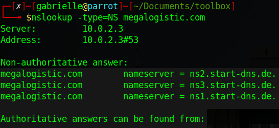

# Hackthebox - Toolbox

- Windows


- [Box on Hackthebox](https://app.hackthebox.com/machines/452)

## Nmap

```bash
PORT      STATE SERVICE       VERSION
21/tcp    open  ftp           FileZilla ftpd
| ftp-syst: 
|_  SYST: UNIX emulated by FileZilla
| ftp-anon: Anonymous FTP login allowed (FTP code 230)
|_-r-xr-xr-x 1 ftp ftp      242520560 Feb 18  2020 docker-toolbox.exe
22/tcp    open  ssh           OpenSSH for_Windows_7.7 (protocol 2.0)
| ssh-hostkey: 
|   2048 5b:1a:a1:81:99:ea:f7:96:02:19:2e:6e:97:04:5a:3f (RSA)
|   256 a2:4b:5a:c7:0f:f3:99:a1:3a:ca:7d:54:28:76:b2:dd (ECDSA)
|_  256 ea:08:96:60:23:e2:f4:4f:8d:05:b3:18:41:35:23:39 (ED25519)
135/tcp   open  msrpc         Microsoft Windows RPC
139/tcp   open  netbios-ssn   Microsoft Windows netbios-ssn
443/tcp   open  ssl/http      Apache httpd 2.4.38 ((Debian))
| tls-alpn: 
|_  http/1.1
|_ssl-date: TLS randomness does not represent time
|_http-title: MegaLogistics
| ssl-cert: Subject: commonName=admin.megalogistic.com/organizationName=MegaLogistic Ltd/stateOrProvinceName=Some-State/countryName=GR
| Not valid before: 2020-02-18T17:45:56
|_Not valid after:  2021-02-17T17:45:56
|_http-server-header: Apache/2.4.38 (Debian)
445/tcp   open  microsoft-ds?
5985/tcp  open  http          Microsoft HTTPAPI httpd 2.0 (SSDP/UPnP)
|_http-server-header: Microsoft-HTTPAPI/2.0
|_http-title: Not Found
47001/tcp open  http          Microsoft HTTPAPI httpd 2.0 (SSDP/UPnP)
|_http-server-header: Microsoft-HTTPAPI/2.0
|_http-title: Not Found
49664/tcp open  msrpc         Microsoft Windows RPC
49665/tcp open  msrpc         Microsoft Windows RPC
49666/tcp open  msrpc         Microsoft Windows RPC
49667/tcp open  msrpc         Microsoft Windows RPC
49668/tcp open  msrpc         Microsoft Windows RPC
49669/tcp open  msrpc         Microsoft Windows RPC
Service Info: OS: Windows; CPE: cpe:/o:microsoft:windows

Host script results:
| smb2-time: 
|   date: 2023-03-12T00:02:14
|_  start_date: N/A
|_clock-skew: -1s
| smb2-security-mode: 
|   3.1.1: 
|_    Message signing enabled but not required

Service detection performed. Please report any incorrect results at https://nmap.org/submit/ .
Nmap done: 1 IP address (1 host up) scanned in 148.07 seconds
```

- Let's add `admin.megalogistic.com` and `megalogistic.com` to our hosts file.

## FTP

- Anonymous FTP is allowed and we have on file on the target. Let's take it `curl --user anonymous:anonymous -o docker-toolbox.exe ftp://10.10.10.236/docker-toolbox.exe`

## Webserver

If we go to https://admin.megalogistic.com/ we have a login panel


If we put a quote in the user field we can generate a sql error  

  

- It is using `pg_query` so it is postgres sql.
- Let's try to do the most common bypass authentication payload except we translate it in postgresql this dies the trick `username='+or+1=1--&password=aaa`

  

- In the browser it looks like this


If we google the "uplusion23" we find a github user https://github.com/uplusion23. if we have a look at his github page https://uplusion23.github.io/ we find his portfolio and then we can have a look at the admin panel on CodePen [here](https://codepen.io/uplusion23/pen/yzBbXj)

- We have a todo list and a list of users

  

## subdomain




## TODO

- Enumerate subdonmain
- check the looking like wp site
- Make a list of user
- Enumerate smb
- check all the other ports

Scan Aborted: The remote website is up, but does not seem to be running WordPress.

```
Server:		10.0.2.3
Address:	10.0.2.3#53

Non-authoritative answer:
megalogistic.com	nameserver = ns2.start-dns.de.
megalogistic.com	nameserver = ns3.start-dns.de.
megalogistic.com	nameserver = ns1.start-dns.d
```
