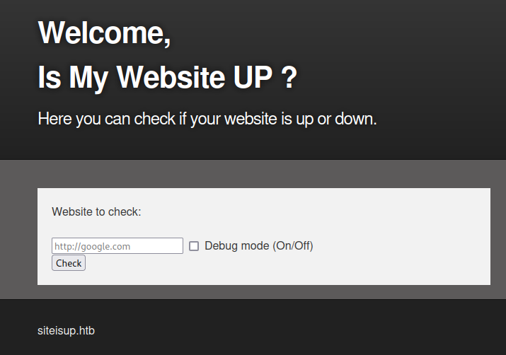
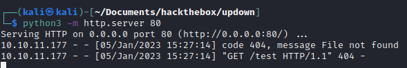
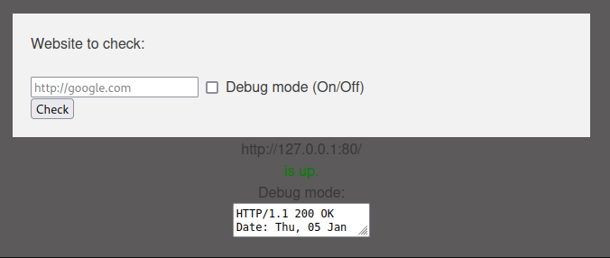
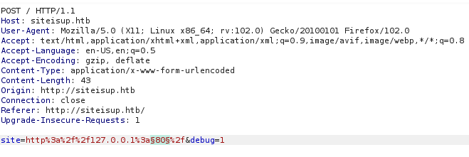
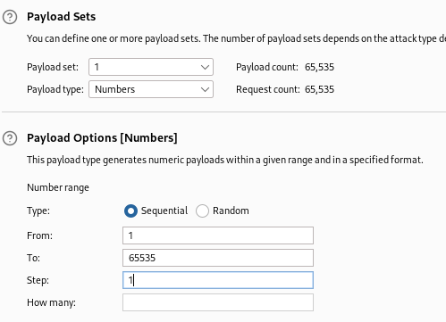
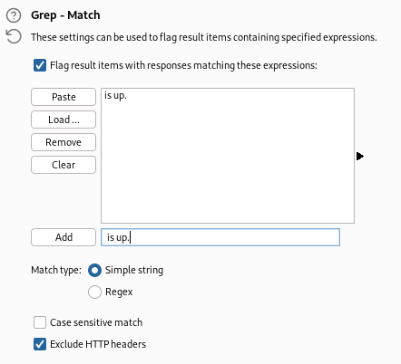
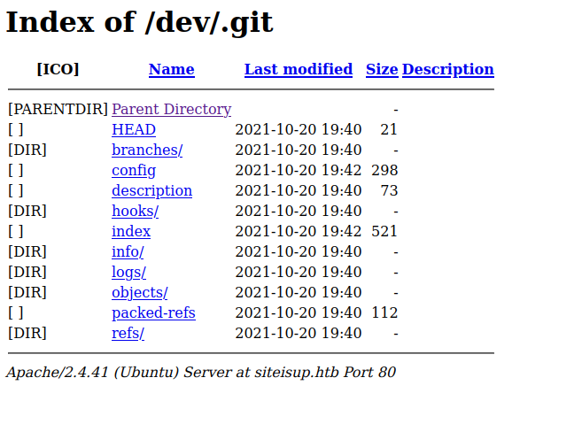
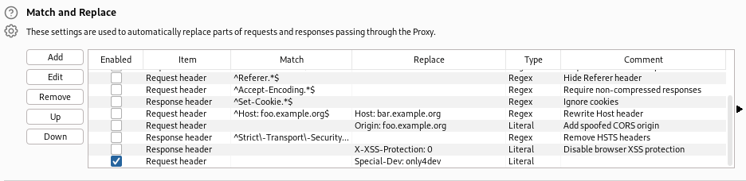
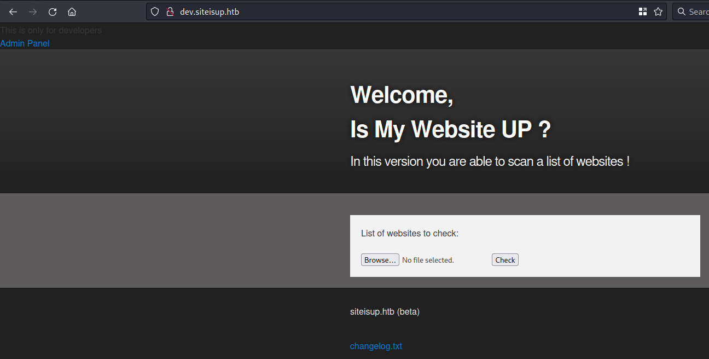

# Hackthebox - UpDown - Linux


## Nmap

```bash
┌──(kali㉿kali)-[~/Documents/hackthebox/updown]
└─$ sudo nmap -T4 -sC -sV -O -Pn -p- 10.10.11.177                                                                                                        
[sudo] password for kali: 
Starting Nmap 7.93 ( https://nmap.org ) at 2023-01-05 15:15 EST
Nmap scan report for 10.10.11.177
Host is up (0.025s latency).
Not shown: 65533 closed tcp ports (reset)
PORT   STATE SERVICE VERSION
22/tcp open  ssh     OpenSSH 8.2p1 Ubuntu 4ubuntu0.5 (Ubuntu Linux; protocol 2.0)
| ssh-hostkey: 
|   3072 9e1f98d7c8ba61dbf149669d701702e7 (RSA)
|   256 c21cfe1152e3d7e5f759186b68453f62 (ECDSA)
|_  256 5f6e12670a66e8e2b761bec4143ad38e (ED25519)
80/tcp open  http    Apache httpd 2.4.41 ((Ubuntu))
|_http-title: Is my Website up ?
|_http-server-header: Apache/2.4.41 (Ubuntu)
No exact OS matches for host (If you know what OS is running on it, see https://nmap.org/submit/ ).
TCP/IP fingerprint:
OS:SCAN(V=7.93%E=4%D=1/5%OT=22%CT=1%CU=31935%PV=Y%DS=2%DC=I%G=Y%TM=63B73002
OS:%P=x86_64-pc-linux-gnu)SEQ(SP=106%GCD=1%ISR=10C%TI=Z%CI=Z%II=I%TS=A)OPS(
OS:O1=M539ST11NW7%O2=M539ST11NW7%O3=M539NNT11NW7%O4=M539ST11NW7%O5=M539ST11
OS:NW7%O6=M539ST11)WIN(W1=FE88%W2=FE88%W3=FE88%W4=FE88%W5=FE88%W6=FE88)ECN(
OS:R=Y%DF=Y%T=40%W=FAF0%O=M539NNSNW7%CC=Y%Q=)T1(R=Y%DF=Y%T=40%S=O%A=S+%F=AS
OS:%RD=0%Q=)T2(R=N)T3(R=N)T4(R=Y%DF=Y%T=40%W=0%S=A%A=Z%F=R%O=%RD=0%Q=)T5(R=
OS:Y%DF=Y%T=40%W=0%S=Z%A=S+%F=AR%O=%RD=0%Q=)T6(R=Y%DF=Y%T=40%W=0%S=A%A=Z%F=
OS:R%O=%RD=0%Q=)T7(R=Y%DF=Y%T=40%W=0%S=Z%A=S+%F=AR%O=%RD=0%Q=)U1(R=Y%DF=N%T
OS:=40%IPL=164%UN=0%RIPL=G%RID=G%RIPCK=G%RUCK=G%RUD=G)IE(R=Y%DFI=N%T=40%CD=
OS:S)

Network Distance: 2 hops
Service Info: OS: Linux; CPE: cpe:/o:linux:linux_kernel

OS and Service detection performed. Please report any incorrect results at https://nmap.org/submit/ .
Nmap done: 1 IP address (1 host up) scanned in 42.93 seconds
```

## Port 80

- When we go to http://10.10.11.177/ we land here  

  

- Seems like we'll have some fun ^^

- Let's add this in /etc/hosts first `10.10.11.177	siteisup.htb`

### subdomain enum wfuzz

```bash
┌──(kali㉿kali)-[~]
└─$ wfuzz -c -f sub-fighter -w /usr/share/wordlists/SecLists/Discovery/DNS/bitquark-subdomains-top100000.txt -u 'http://siteisup.htb/' -H "HOST: FUZZ.siteisup.htb" --hc 200
 /usr/lib/python3/dist-packages/wfuzz/__init__.py:34: UserWarning:Pycurl is not compiled against Openssl. Wfuzz might not work correctly when fuzzing SSL sites. Check Wfuzz's documentation for more information.
********************************************************
* Wfuzz 3.1.0 - The Web Fuzzer                         *
********************************************************

Target: http://siteisup.htb/
Total requests: 100000

=====================================================================
ID           Response   Lines    Word       Chars       Payload                                                                                                                                                                     
=====================================================================

000000022:   403        9 L      28 W       281 Ch      "dev - dev"                                                                                                                                                                 
000037212:   400        10 L     35 W       301 Ch      "* - *"                                                                                                                                                                     

Total time: 347.2654
Processed Requests: 100000
Filtered Requests: 99998
Requests/sec.: 287.9641
```

- let's add the subdomain in our hosts we get a 403 here

### Gobuster

```bash
┌──(kali㉿kali)-[~/Documents/hackthebox/updown]
└─$ gobuster dir -u http://siteisup.htb/ -w /usr/share/wordlists/SecLists/Discovery/Web-Content/big.txt
===============================================================
Gobuster v3.3
by OJ Reeves (@TheColonial) & Christian Mehlmauer (@firefart)
===============================================================
[+] Url:                     http://siteisup.htb/
[+] Method:                  GET
[+] Threads:                 10
[+] Wordlist:                /usr/share/wordlists/SecLists/Discovery/Web-Content/big.txt
[+] Negative Status codes:   404
[+] User Agent:              gobuster/3.3
[+] Timeout:                 10s
===============================================================
2023/01/05 15:21:42 Starting gobuster in directory enumeration mode
===============================================================
/.htaccess            (Status: 403) [Size: 277]
/.htpasswd            (Status: 403) [Size: 277]
/dev                  (Status: 301) [Size: 310] [--> http://siteisup.htb/dev/]
/server-status        (Status: 403) [Size: 277]
Progress: 20425 / 20476 (99.75%)===============================================================
2023/01/05 15:22:46 Finished
===============================================================
```

- dev is a blank page. Let's try to run gobuster in it

```bash
┌──(kali㉿kali)-[~/Documents/hackthebox/updown]
└─$ gobuster dir -u http://siteisup.htb/dev -w /usr/share/wordlists/SecLists/Discovery/Web-Content/big.txt
===============================================================
Gobuster v3.3
by OJ Reeves (@TheColonial) & Christian Mehlmauer (@firefart)
===============================================================
[+] Url:                     http://siteisup.htb/dev
[+] Method:                  GET
[+] Threads:                 10
[+] Wordlist:                /usr/share/wordlists/SecLists/Discovery/Web-Content/big.txt
[+] Negative Status codes:   404
[+] User Agent:              gobuster/3.3
[+] Timeout:                 10s
===============================================================
2023/01/05 16:09:09 Starting gobuster in directory enumeration mode
===============================================================
/.git                 (Status: 301) [Size: 315] [--> http://siteisup.htb/dev/.git/]
/.htpasswd            (Status: 403) [Size: 277]
/.htaccess            (Status: 403) [Size: 277]
Progress: 20369 / 20476 (99.48%)===============================================================
2023/01/05 16:10:14 Finished
===============================================================
```

### Look around

- Ok now let's do what I was tempted to do since I saw the landig page
- `pyhton3 -m http.server 80`
- In the browser let's try to see if we can interact this way and enter http://10.10.14.10/test in the form
- And it works our server get an interaction from the target  
  
- Ok what happens if we request for something that exist like if I just ask for  http://10.10.14.10/ or http://127.0.0.1:80/
  
- So we should try to get files or inject command or see what open port we have using this technique
- We can fuzz for open ports with burp intruder
- We send our request to the intruder we postiton our payload in the port number like this  
  
- In the payloads tab we choose number. And start from 1 to 65535 with a step of 1.

> If you do not have the pro version of burp the best way would be to use another tool because community version might be slow for this.
- Let's grep `is up.` so in options grep match we delete the table and add our string
  
- Let's see our results. So it was worth trying but besides port 80 we do not have anything

- Let's check the git folder we found

- [This article on Hacktricks](https://book.hacktricks.xyz/network-services-pentesting/pentesting-web/git) is interesting to see how we could process with this
- `wget -r http://siteisup.htb/dev/.git/`
- then we can use `git diff` go in the dev directory and run `git diff > diff.txt` this way you can look and grep and really analyze the file
- It is worth having a look at the git [documentation](https://git-scm.com/docs/) to see useful git commands
- Other interesting commands are the  `git log` we will have the commit history and `git show <commit-id>` to have more info on a specific commit
- This commit is really interesting

```bash
┌──(kali㉿kali)-[~/…/updown/gitfolder/siteisup.htb/dev]
└─$ git show bc4ba79e596e9fd98f1b2837b9bd3548d04fe7ab                                                                                                                                                                                    1 ⚙
commit bc4ba79e596e9fd98f1b2837b9bd3548d04fe7ab
Author: Abdou.Y <84577967+ab2pentest@users.noreply.github.com>
Date:   Wed Oct 20 16:37:20 2021 +0200

    Update .htaccess
    
    New technique in header to protect our dev vhost.

diff --git a/.htaccess b/.htaccess
index 3190432..44ff240 100644
--- a/.htaccess
+++ b/.htaccess
@@ -1,5 +1,4 @@
-AuthType Basic
-AuthUserFile /var/www/dev/.htpasswd
-AuthName "Remote Access Denied"
-Require ip 127.0.0.1 ::1
-Require valid-user
+SetEnvIfNoCase Special-Dev "only4dev" Required-Header
+Order Deny,Allow
+Deny from All
+Allow from env=Required-Header
```

- With this commit we know that in order to access the .htpasswd we need this header in the request `Special-Dev: only4dev` and our Ip should be 127.0.0.1. We alse need a valid pair of credentials
- This one is also interesting

```bash
┌──(kali㉿kali)-[~/…/updown/gitfolder/siteisup.htb/dev]
└─$ git show 6ddcc7a8ac393edb7764788c0cbc13a7a521d372                                                                                                                                                                                    1 ⚙
commit 6ddcc7a8ac393edb7764788c0cbc13a7a521d372
Author: Abdou.Y <84577967+ab2pentest@users.noreply.github.com>
Date:   Wed Oct 20 15:04:38 2021 +0200

    Create .htaccess

diff --git a/.htaccess b/.htaccess
new file mode 100644
index 0000000..3190432
--- /dev/null
+++ b/.htaccess
@@ -0,0 +1,5 @@
+AuthType Basic
+AuthUserFile /var/www/dev/.htpasswd
+AuthName "Remote Access Denied"
+Require ip 127.0.0.1 ::1
+Require valid-user
```

- Let's try to add the new header everywhere and see what we get 
- To do so in [burpsuite](https://talkerinfo.com/add-custom-header-in-all-burp-requests/) this article is really helpful
- So here is what it looks like in my Burp  

  

- So let's try to navigate to http://dev.siteisup.htb/ 
- We have access to a new page, with a file upload functionality  

  
- The admin panel link and the changelog do not give anything
- I tried a php file and it is doing some checks.
- Maybe there is a way to have a look at the code using the git we found. This way we can see how to bypass this restriction.
- Ok let's try the tool git dumper mentioned in hacktricks
  - `python3 -m venv git-dumper ` I prefer to install it in a venv so that I do not mess up my local python
  - `source git-dumper/bin/activate` we activate the env
  - `pip install git-dumper` we install in in the env
  - `git-dumper http://siteisup.htb/dev/.git/ dumpedsite`
  - So now we can see some php file. the index is not where the extension is verified but the checker seems interesting. 
  This function is the one that is of interest for us

```php
if($_POST['check']){
  
	# File size must be less than 10kb.
	if ($_FILES['file']['size'] > 10000) {
        die("File too large!");
    }
	$file = $_FILES['file']['name'];
	
	# Check if extension is allowed.
	$ext = getExtension($file);
	if(preg_match("/php|php[0-9]|html|py|pl|phtml|zip|rar|gz|gzip|tar/i",$ext)){
		die("Extension not allowed!");
	}
  
	# Create directory to upload our file.
	$dir = "uploads/".md5(time())."/";
	if(!is_dir($dir)){
        mkdir($dir, 0770, true);
    }
  
  # Upload the file.
	$final_path = $dir.$file;
	move_uploaded_file($_FILES['file']['tmp_name'], "{$final_path}");
	
  # Read the uploaded file.
	$websites = explode("\n",file_get_contents($final_path));
	
	foreach($websites as $site){
		$site=trim($site);
		if(!preg_match("#file://#i",$site) && !preg_match("#data://#i",$site) && !preg_match("#ftp://#i",$site)){
			$check=isitup($site);
			if($check){
				echo "<center>{$site}<br><font color='green'>is up ^_^</font></center>";
			}else{
				echo "<center>{$site}<br><font color='red'>seems to be down :(</font></center>";
			}	
		}else{
			echo "<center><font color='red'>Hacking attempt was detected !</font></center>";
		}
	}
	
  # Delete the uploaded file.
	@unlink($final_path);
}
```

- Very convenient once our file uploaded we will even know where to fetch it (http://dev.siteisup.htb/uploads/). However it will also delete the file so we have to be quick.
- `php|php[0-9]|html|py|pl|phtml|zip|rar|gz|gzip|tar/i` here are the file not allowed. [This article on hacktricks](https://book.hacktricks.xyz/pentesting-web/file-upload) has nice information on how to bypass these protections
- It mentions phtm which is not in the list. Let's try it. We can upload it.
- The best way I can think of to gain time is to put a big url list in the file and add our payload at the end of this list
- Also be careful to put too many url at the begining because the file limit is 10kb
- phtm does not get interpreted let's try another one in hacktricks there is also .phar. Let's try it

## Todo

- Enumerate more port 80 for hidden dir
- Continue git folder exploration

