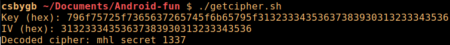
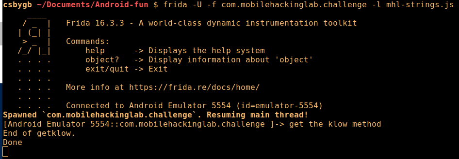
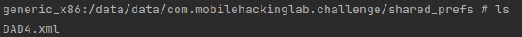
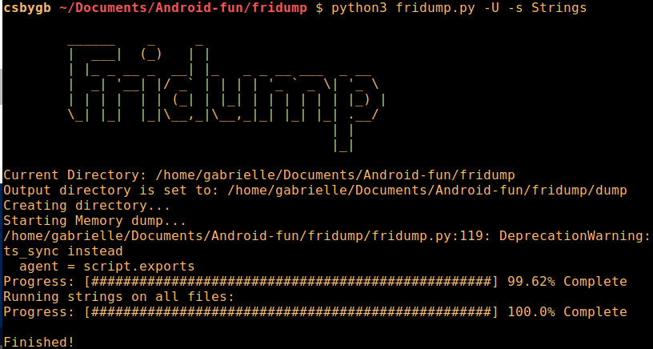
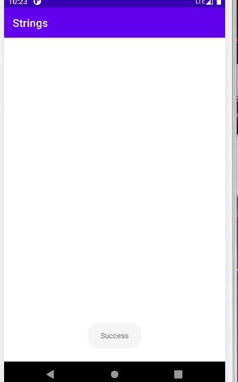
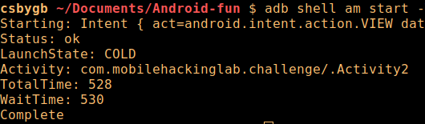
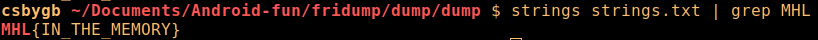

# Mobile Hacking Lab - Strings

  

- [Link to lab on Mobile Hacking Lab](https://www.mobilehackinglab.com/course/lab-strings)

## Instructions

Welcome to the Strings Challenge! In this lab,your goal is to find the flag. The flag's format should be "MHL{...}". The challenge will give you a clear idea of how intents and intent filters work on android also you will get a hands-on experience using Frida APIs.  

### Hints and Rules

- Reverse engineer the application and search for exported activities.  
- Understand the code and find a method to invoke the exported activity.  
- Utilize Frida for tracing or employ Frida's memory scanning.  
- Don't have to spend time on static analysis of the Android library, as the code is obfuscated.  
- The flag follows the format "MHL{...}".  
- Do not attempt to patch the application.  

## Process

### Launching the app


### Checking out the manifest for exported activities

- Let's connect with openvpn and pull the app from the machine to examine it locally.
- `adb shell pm list packages -f | grep com.mobilehackinglab.challenge` we list the package and grep on the one we are looking for
- `adb pull /data/app/~~p_54bM-A63QkAZxdaHHILQ==/com.mobilehackinglab.challenge-AfKKIwpsKTgv5lPYwRWv0Q==/` we pull the folder from the result of our previous command
- `cd com.mobilehackinglab.challenge-AfKKIwpsKTgv5lPYwRWv0Q\=\=/` we go locally into the folder
- `jadx-gui base.apk` we open the app with jadx-gui
- Checking out the manifest. With a search on `android:exported="true"` we find 2 exported activities. The first one is the main and the other is just Activity2.  

  

The following snippet in the manifest in the intent of Activity2 `<data android:scheme="mhl" android:host="labs"/>` is really interesting.  
Which mean we will probably try something like `adb shell am start "mhl://labs/<SOMETHING_HERE>" com.example.package/.className`.  
Let's dig in the code because as said in the instructions we need to understand what happens.  
We are going to look at the following files:  

- MainActicity
- Activity2

### Understanding the MainActivity

I am starting with this class because is the main screen of the app. Its primary function is to set up the user interface and store the current date in the app's shared preferences.

- The method `stringFromJNI()` is a native method it will fetch some text from a library and display it. You can find more info on this method [here in the offical Android Developer documentation](https://developer.android.com/ndk/samples/sample_hellojni)
- `onCreate` Method: it is called when the activity is created. It setups the UI. It then fetches a libray using the mehod mentioned above and will display it in a TextView on the screen.
- One interesting method here is `KLOW`: it sets the current date in shared preferences. 
  SharedPreferences is an interface in Android that provides a simple way to store small amounts of key-value pair data. This data persists across user sessions, meaning it remains available even if the app is closed or the device is restarted.  
  Here, the method gets an editor for the shared preferences named `DAD4` (an `Editor` is an interface used for modifying values in a SharedPreferences object).  
  It saves the current date (formatted as dd/MM/yyyy) under the key UUU0133.  
  It applies the changes, ensuring the date is saved.
  What's interesting also is that this method is not automatically called when the activity starts; it needs to be called explicitly if we want to set the date.

#### Comprehensive walkthroug of MainActivity

1. When MainActivity Starts:
   - The UI is set up using data binding.
   - A string from a native library is displayed on the screen.
2. If KLOW is Called:
   - The current date is saved in shared preferences under the key UUU0133.

### Understanding Activity2

- It will first set up the user interface
- The method `onCreate` is called when the activity is first created
- The method `setContentView` will set the layout for the activity
- When the Initialization is done (as describe above), the activity retrieves a value from shared preferences and compares it with today's date.
  - `u_1`: Retrieves a value stored under the key UUU0133.
  - `isActionView`: Checks if the intent action is VIEW.
  - `isU1Matching`: Checks if u_1 matches today's date (formatted by cd()).
  - If any of these checks fail, the activity exits.
- The activity validates the data in the intent's URI
  - `uri`: Retrieves the URI from the intent.
  - Checks if the URI scheme is `mhl` and the host is `labs`.
  - If the URI does not match these criteria, the activity exits.
- The activity decodes the last path segment of the URI and decrypts it.
  - `decodedValue`: Decodes the last segment of the URI using Base64.
  - `ds`: Converts the decoded value to a string.
  - `bytes`: Converts the secret key to bytes. We can see here that the secret key is hardcoded `your_secret_key_1234567890123456`
  - `decrypt`: Decrypts a hardcoded cipher text (`bqGrDKdQ8zo26HflRsGvVA==`) and compares it with `ds`.
  - If the decrypted value matches `ds`, it loads a native library and shows a message (the flag) (Exciting!! 🤪🤪). Otherwise, the activity exits.
- The decryption method uses AES/CBC/PKCS5Padding to decrypt a cipher text
  - `decrypt`: Decrypts the given cipher text using the specified algorithm and key.
- If all conditions are met, the flag is displayed using a native method
  - `getflag`: A native method that retrieves the flag.
  - `Toast`: Displays the flag as a toast message. (A Toast is a way to show a small message to the user. It appears as a small pop-up on the screen and automatically disappears after a short period of time, without requiring any user interaction.)

#### Comprehensive walkthrough of Activity2

1. Initialization
   - The activity sets up the UI
2. Shared Preferences Check
   - Retrieves value UUU0133 from shared preferences DAD4.
   - Compares it with today's date.
3. Intent Action Check
   - Verifies the intent action is android.intent.action.VIEW.
4. URI Check:
   - Ensures the URI scheme is mhl and host is labs.
5. Decode and Decrypt URI:
   - Decodes the URI path segment from Base64.
   - Converts decoded bytes to string.
   - Prepares decryption key and decrypts a hardcoded cipher text.
   - Compares the decrypted value with the decoded string.
6. Exit if Any Check Fails:
   - If any checks fail, the activity exits.
7. Display Flag:
   - If all checks pass, loads a native library and displays the flag using a toast message.

### Comprehensive walkthrough of the full app

1. Launch MainActivity
   - Sets up the UI using data binding.
   - Displays a string from a native library.
   - Optionally, stores the current date in shared preferences using the KLOW method.
2. Launch Activity2:
   - Sets up the UI.
   - Validates shared preferences to check if the stored date matches today's date.
   - Validates the intent action and URI.
   - Decodes and decrypts part of the URI.
   - If all checks pass, displays the flag using a toast message.

### Exploitation

So according to this analysis, in order to get the flag we have to find a way to get the value of the key (remember what happens when the URI checks path, it decrypts the decoded value with a key). This way we would be able to pass the value in the url.  
See the snippet I am referring to below (from the class Activity2)  


> Remember we have key `your_secret_key_1234567890123456`  
> And we have cipherText `bqGrDKdQ8zo26HflRsGvVA==`

I know I should probably use Go or Python, but I just love bash 🤣🤣 So I will make a bash script to solve this.  

Here is the bash script (that finally worked lol)

```bash
#!/bin/bash

# The base64 cipher we have from the source code
cipherText="bqGrDKdQ8zo26HflRsGvVA=="

# The values we found in the code
key="your_secret_key_1234567890123456"
iv="1234567890123456"

# Convert key and IV in hexadecimal format
key_hex=$(echo -n "$key" | xxd -p | tr -d '\n')
iv_hex=$(echo -n "$iv" | xxd -p | tr -d '\n')

# Debug
echo "Key (hex): $key_hex"
echo "IV (hex): $iv_hex"

# Decode from b64 and decipher
decodedCipher=$(echo "$cipherText" | base64 --decode | openssl enc -d -aes-256-cbc -K "$key_hex" -iv "$iv_hex" 2>/dev/null)

# Print results
if [ $? -eq 0 ]; then
    echo "Decoded cipher: $decodedCipher"
else
    echo "fail"
fi
```

- Here is the result of our script

  

So the value is `mhl_secret_1337`.  
We will need to convert in in base64 (if you remember what happens in Activity2), so let's add a line to our script `base64decoded=$(echo "$decodedCipher" | base64)`.  

- Here is the new output of our script

  

Our new string is `bWhsX3NlY3JldF8xMzM3Cg==`  

So now we are almost able to use adb shell and start activity2 with our new uri `adb shell am start "mhl://labs/bWhsX3NlY3JldF8xMzM3Cg==" com.mobilehackinglab.challenge/.Activity2`.  
But first, we need to write a frida script (I know I am not a fan of javascript either lol). This way we can ensure that our actions are performed in a specific order and we allow the application to be in the correct state before interacting with it.  
Here is what our script does:

- The script first hooks into the constructor of MainActivity to ensure it runs the getKLOW function after MainActivity is instantiated.
- The getKLOW function finds instances of MainActivity and calls the KLOW method.
- Once the KLOW method is called, the launchActivity2 function is triggered to find instances of Activity2 and interact with them by calling cd and attempting to call getflag.

Here is our script

```js
/*
GOAL:
This script hooks into the application to invoke methods on MainActivity and Activity2. 
The main goal is to interact with these activities to retrieve the flag.
*/
// Java.perform ensures that all the Java-related code runs in the context of the Java virtual machine (VM) used by the target application.
Java.perform(function () {
// This function uses Java.choose to find instances of MainActivity and invokes the KLOW method on each instance found.
    function getKLOW() {
        Java.choose("com.mobilehackinglab.challenge.MainActivity", {
            onMatch: function (instance) {
                instance.KLOW();
                console.log("get the klow method");
            },
            onComplete: function () {
                console.log("End of getklow.");
                launchActivity2();
            }
        });
    }
// This function uses Java.choose to find instances of Activity2 and performs some actions on each instance found.
    function launchActivity2() {
        Java.choose("com.mobilehackinglab.challenge.Activity2", {
            onMatch: function (instance) {
                var res = instance.cd();
                console.log(res);

                try {
                    var flag = instance.getflag();
                    console.log("get the Flag: " + flag);
                } catch (e) {
                    console.log("Debug error in getflag: " + e.message);
                }
            },
            onComplete: function () {
                console.log("Done");
            }
        });
    }
// This section hooks into the initialization method of MainActivity to trigger the getKLOW function after a short delay.
    var MainActivity = Java.use("com.mobilehackinglab.challenge.MainActivity");
    MainActivity.$init.overload().implementation = function () {
        var result = this.$init.apply(this, arguments);
        setTimeout(getKLOW, 2000);
        return result;
    };
});
```

If we launch the script our xml for the shared preferences is created.  
See here the script launch from my terminal:  

  

If we `ls` in android studio console, our xml is indeed created:  

  

So now let's try our adb command. This does not give anything quite yet. I was a little lost for a moment, and then I remembered this from the challenge description `Utilize Frida for tracing or employ Frida's memory scanning.`  
So let's try to dump the memory.  
We can do this with objection.  

- `objection --gadget com.mobilehackinglab.challenge explore`
- `memory dump all memory.txt`

Apparently the memory is too big to dump it all with objection.  
Let's try [fridump](https://github.com/Nightbringer21/fridump)

```bash
git clone https://github.com/Nightbringer21/fridump.git
cd fridump/
python3 fridump.py -U -s Strings
```

  

Once the memory is dump you can get it in the dump folder and it is called strings.txt.  

I was not able to find the flag in my dump.  
I realized that my adb command was wrong and not working.  
First I forgot to remove the 2 `=` symbols in the end of the uri.  
Then I need to explicitly set the intent action and data with -a and -d. And finally I need to use -W to wait for the launch to complete. My initial command did not have this flag and thus did not wait for the activity to finish launching.  
So our new command looks like this `adb shell am start -W -a android.intent.action.VIEW -d "mhl://labs/bWhsX3NlY3JldF8xMzM3" -n com.mobilehackinglab.challenge/.Activity2Starting: Intent { act=android.intent.action.VIEW dat=mhl://labs/bWhsX3NlY3JldF8xMzM3 cmp=com.mobilehackinglab.challenge/.Activity2 }`  

This way we also get a screen I did not get before when launching the previous adb command.  


And here is the result of our command:  

  

Now let's try to dump the memory again and see if we can find the flag in our dump.  

And it works! We finally get the flag.  


