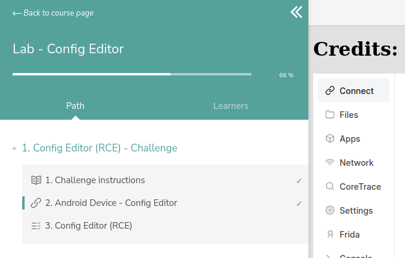

# Writeups of labs on Mobile Hacking Lab

- [Link to mobile hacking lab](https://www.mobilehackinglab.com)

## Setup

You can use it like HTB and openvpn.  
Just go to the connect tab (see screen below) to get your ovpn file and then connect with `sudo openvpn file.ovpn`  

  

Once connected to the vpn, you just need to launch adb connect like this `adb connect IP:PORT` (the IP and port are given in the connect page)  

You can then `adb root` and finally `adb shell`  

The app you want to pull should usually be in /data/app