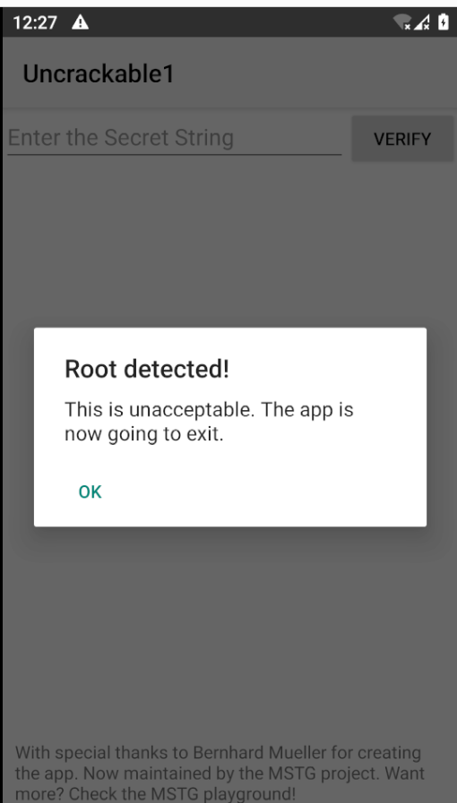
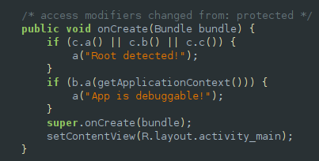

# OWASP

## Android UnCrackable L1

Once installed if our emulator is rooted we get this message when launching the app  

  

If we take a look at the code using jadx, We can from the manifest locate the main activity.  
we can see the root detection here  

  

> Note that it will also block us if the app is debuggable.  
> Let's try to install the app on an unrooted avd.
