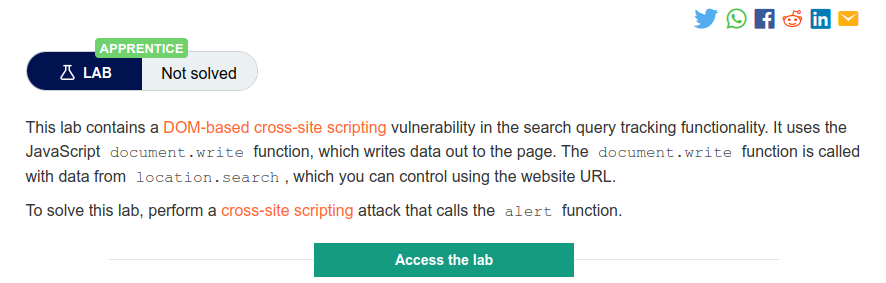
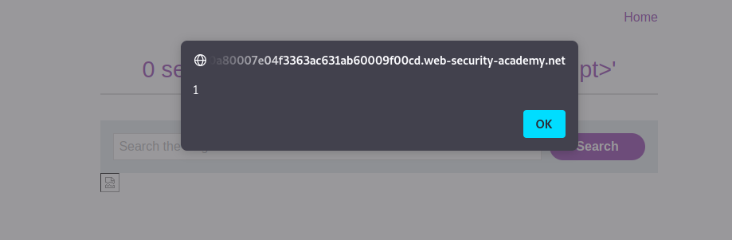

# PortSwigger Web Security Academy - DOM XSS

## Lab: DOM XSS in document.write sink using source location.search

- [Lab on PortSwigger](https://portswigger.net/web-security/cross-site-scripting/dom-based/lab-document-write-sink)

### Instructions



- We click on access the lab

### Resolution

- We land on this page  

  

- It mentions a location.search source in the title so the search box is definitely where we should try our injection.
- Here is the js code for the search

```js
function trackSearch(query) {
    document.write('');
}
var query = (new URLSearchParams(window.location.search)).get('search');
if(query) {
    trackSearch(query);
}
```

- We can see that it is taking our input and it will be used in the img tag.
- Indeed if we type test for example, we can then if we inspect the element see that our string is in the src of the image tag  

  

- So to get an alert we can try to close the img tag and put another tag with an alert in it let's try this `"><script>alert(1)</script>`

  

- And it works!  

