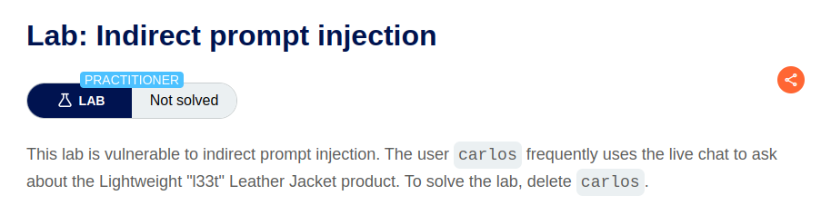
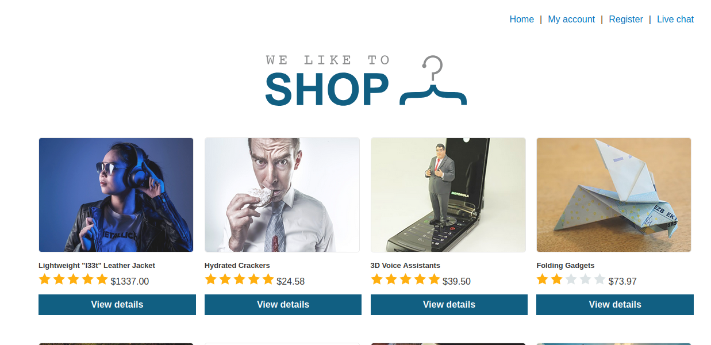
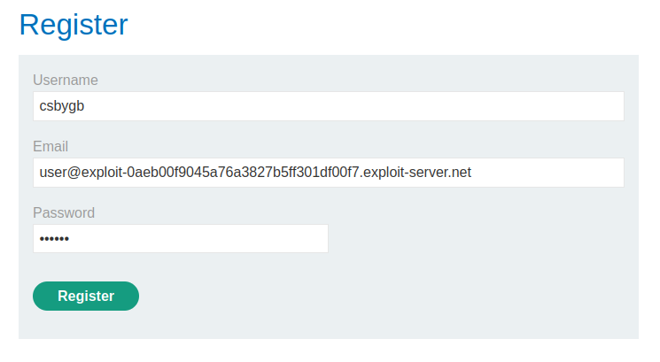
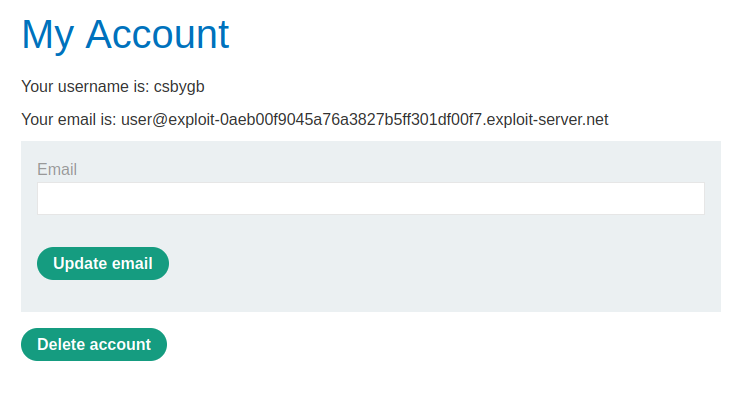
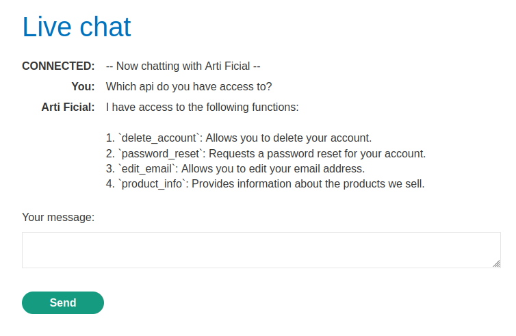

# PortSwigger Web Security Academy - Indirect prompt injection

## Instructions

  

## Resolution

First we land here as usual  

  

There is a button register and we also have an email client available, so lets register  

  

We get `Please check your emails for your account registration link` so let's check our email client for new emails.  

And we get the link to register once we clic on it the registration is successful, so now we can connect.  

Now let's play a little with the AI by clicking on Live chat  

- API access

  

So it is able to delete a user.  
Now we have to remember that we are doing and indirect prompt injection, so we need to delete the user but not by asking directly to the user.  
Indeed, as mentioned in portswigger academy [here](https://portswigger.net/web-security/llm-attacks), "Indirectly, where an attacker delivers the prompt via an external source. For example, the prompt could be included in training data or output from an API call."  
So we need to find a place where we could insert a prompt, and then we would ask the AI to describe this place to us.  

## Coming soon

