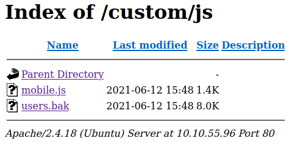
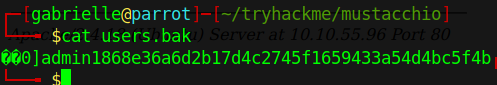
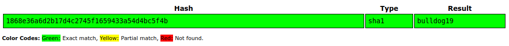
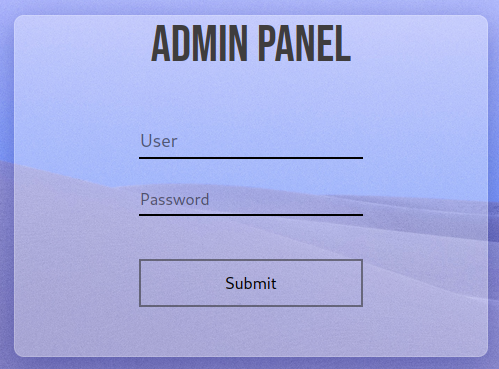
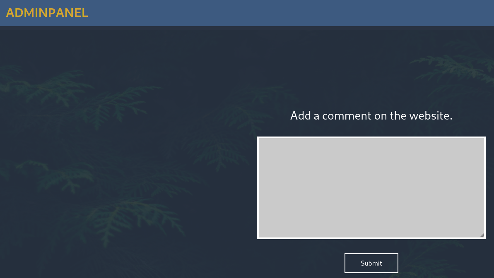
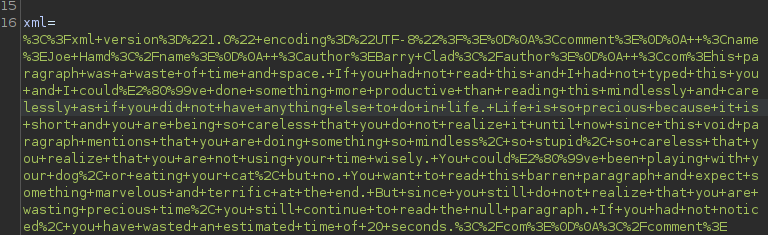
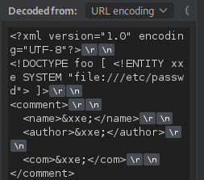
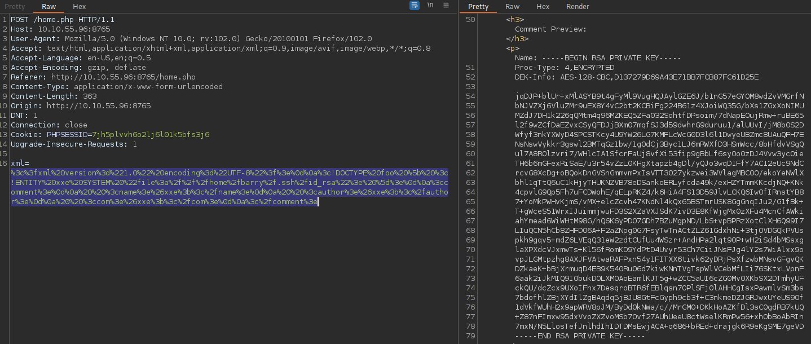
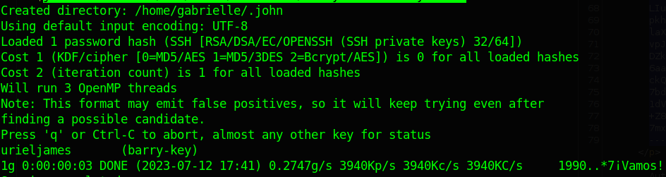
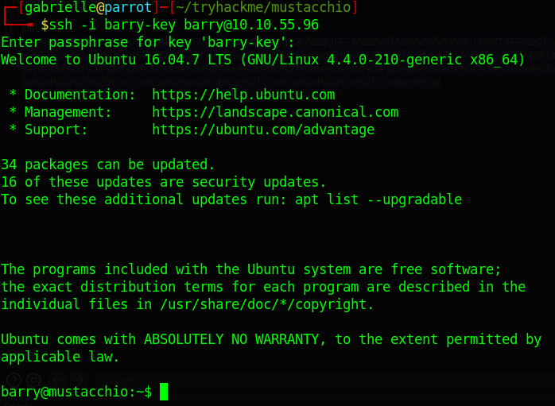

# TryHackMe - Mustacchio


## Nmap

```bash
┌─[gabrielle@parrot]─[~]
└──╼ $sudo nmap -Pn -sV -sC -p- 10.10.55.96
Nmap scan report for 10.10.55.96
Host is up (0.22s latency).
Not shown: 65532 filtered tcp ports (no-response)
PORT     STATE SERVICE VERSION
22/tcp   open  ssh     OpenSSH 7.2p2 Ubuntu 4ubuntu2.10 (Ubuntu Linux; protocol 2.0)
| ssh-hostkey: 
|   2048 581b0c0ffacf05be4cc07af1f188611c (RSA)
|   256 3cfce8a37e039a302c77e00a1ce452e6 (ECDSA)
|_  256 9d59c6c779c554c41daae4d184710192 (ED25519)
80/tcp   open  http    Apache httpd 2.4.18 ((Ubuntu))
|_http-server-header: Apache/2.4.18 (Ubuntu)
|_http-title: Mustacchio | Home
| http-robots.txt: 1 disallowed entry 
|_/
8765/tcp open  http    nginx 1.10.3 (Ubuntu)
|_http-server-header: nginx/1.10.3 (Ubuntu)
|_http-title: Mustacchio | Login
Service Info: OS: Linux; CPE: cpe:/o:linux:linux_kernel

Service detection performed. Please report any incorrect results at https://nmap.org/submit/ .
Nmap done: 1 IP address (1 host up) scanned in 456.90 seconds
```

## Port 80

We land here  


When browsing around we can see that directory listing is enabled.  
We find file users.bak  

  

Here is the content of the file  

  

If we enter the md5 hash in crackstation we find the password  

  

So we have the following credentials `admin:bulldog19`

## Port 8765

We find the admin panel.  
  
Let's try the credentials we found in the website  
We are logged in  
  

If we inspect the request it seems to take an xml parameter  

```http
POST /home.php HTTP/1.1
Host: 10.10.55.96:8765
User-Agent: Mozilla/5.0 (Windows NT 10.0; rv:102.0) Gecko/20100101 Firefox/102.0
Accept: text/html,application/xhtml+xml,application/xml;q=0.9,image/avif,image/webp,*/*;q=0.8
Accept-Language: en-US,en;q=0.5
Accept-Encoding: gzip, deflate
Referer: http://10.10.55.96:8765/home.php
Content-Type: application/x-www-form-urlencoded
Content-Length: 8
Origin: http://10.10.55.96:8765
DNT: 1
Connection: close
Cookie: PHPSESSID=7jh5plvvh6o2lj6l01k5bfs3j6
Upgrade-Insecure-Requests: 1

xml=test
```

When we see xml we need to try XXE attacks.  
Also this snippet of code seems will prompt us for xml code  

```javascript
   <script type="text/javascript">
      //document.cookie = "Example=/auth/dontforget.bak"; 
      function checktarea() {
      let tbox = document.getElementById("box").value;
      if (tbox == null || tbox.length == 0) {
        alert("Insert XML Code!")
      }
  }
</script>
```

There's also a big hint in a comment in the page `<!-- Barry, you can now SSH in using your key!-->`  

This means if our xxe works we could try to find Barry's key

We can check the example `/auth/dontforget.bak`  

```xml
<?xml version="1.0" encoding="UTF-8"?>
<comment>
  <name>Joe Hamd</name>
  <author>Barry Clad</author>
  <com>his paragraph was a waste of time and space. If you had not read this and I had not typed this you and I could’ve done something more productive than reading this mindlessly and carelessly as if you did not have anything else to do in life. Life is so precious because it is short and you are being so careless that you do not realize it until now since this void paragraph mentions that you are doing something so mindless, so stupid, so careless that you realize that you are not using your time wisely. You could’ve been playing with your dog, or eating your cat, but no. You want to read this barren paragraph and expect something marvelous and terrific at the end. But since you still do not realize that you are wasting precious time, you still continue to read the null paragraph. If you had not noticed, you have wasted an estimated time of 20 seconds.</com>
</comment>
```

It's perfect for us we can use this for our attack  
After putting this in the text box we can see that it is sent url encoded in the parameter  

  

Let's send this to repeater and play around with it  
We can modify the paylaod in the inspector like this  

  

This way we get the passwd file  
We indeed see a user Barry let's try and fetch his key  
And it works!  

  

Let's try to connect on the server with it. It prompts for a password.  
Let's try to crack it with john the ripper.  

- `wget https://raw.githubusercontent.com/magnumripper/JohnTheRipper/bleeding-jumbo/run/ssh2john.py`
- `python ssh2john.py barry-key > barry.hash`
- `john --wordlist=/usr/share/wordlists/rockyou.txt barry.hash `  

  

Here is the password `urieljames`  
And it works  
  

And we get the user flag.

## COMING SOON