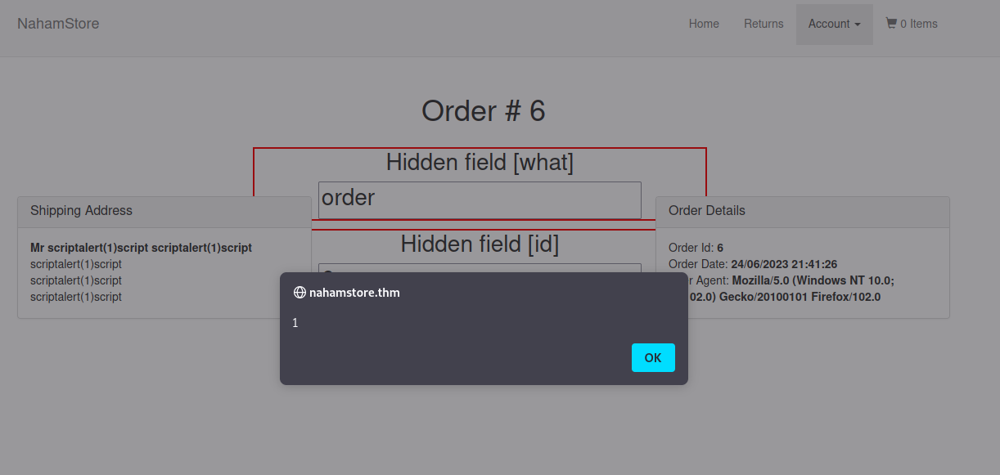

# Tryhackme Nahamstore

- [Room](https://tryhackme.com/room/nahamstore)

## Recon

### tips and general things to try

- You can browse all the website with burp you can even make a crawl scan.
- You can make an account and browse again with burp

### wfuzz

- You can subdomain enum with wfuzz `wfuzz -c -f sub-fighter -w /usr/share/seclists/Discovery/DNS/subdomains-top1million-5000.txt -u 'http://nahamstore.thm/' -H "HOST:FUZZ.nahamstore.thm"` inspecting the results we can see that we need filter it with `--hw 65`

```txt
┌─[✗]─[gabrielle@parrot]─[~]
└──╼ $wfuzz -c -f sub-fighter -w /usr/share/seclists/Discovery/DNS/subdomains-top1million-5000.txt -u 'http://nahamstore.thm/' -H "HOST:FUZZ.nahamstore.thm" --hw 65
 /usr/lib/python3/dist-packages/wfuzz/__init__.py:34: UserWarning:Pycurl is not compiled against Openssl. Wfuzz might not work correctly when fuzzing SSL sites. Check Wfuzz's documentation for more information.
********************************************************
* Wfuzz 3.1.0 - The Web Fuzzer                         *
********************************************************

Target: http://nahamstore.thm/
Total requests: 4989

=====================================================================
ID           Response   Lines    Word       Chars       Payload                                                                                                                      
=====================================================================

000000001:   301        7 L      13 W       194 Ch      "www - www"                                                                                                                  
000000037:   301        7 L      13 W       194 Ch      "shop - shop"                                                                                                                
000000254:   200        41 L     92 W       2025 Ch     "marketing - marketing"                                                                                                      
000000960:   200        0 L      1 W        67 Ch       "stock - stock"                                                                                                              

Total time: 206.7410
Processed Requests: 4989
Filtered Requests: 4985
Requests/sec.: 24.13163
```

- Once we get our results we need to add the to the `/etc/hosts` file
- shop and www redirects to the website we already have
- Marketing gives this

  

- Stock gives this really interesting results worth keeping aside for further investigation


- And if we access /product from there we get this

  

### gobuster

```txt
┌─[✗]─[gabrielle@parrot]─[~]
└──╼ $gobuster dir -u http://nahamstore.thm/ -w /usr/share/seclists/Discovery/Web-Content/big.txt
===============================================================
Gobuster v3.1.0
by OJ Reeves (@TheColonial) & Christian Mehlmauer (@firefart)
===============================================================
[+] Url:                     http://nahamstore.thm/
[+] Method:                  GET
[+] Threads:                 10
[+] Wordlist:                /usr/share/seclists/Discovery/Web-Content/big.txt
[+] Negative Status codes:   404
[+] User Agent:              gobuster/3.1.0
[+] Timeout:                 10s
===============================================================
2023/06/23 15:33:55 Starting gobuster in directory enumeration mode
===============================================================
/basket               (Status: 200) [Size: 2465]
/css                  (Status: 301) [Size: 178] [--> http://127.0.0.1/css/]
/js                   (Status: 301) [Size: 178] [--> http://127.0.0.1/js/] 
/login                (Status: 200) [Size: 3099]                           
/logout               (Status: 302) [Size: 0] [--> /]                      
/register             (Status: 200) [Size: 3138]                           
/returns              (Status: 200) [Size: 3628]                           
/robots.txt           (Status: 200) [Size: 13]                             
/search               (Status: 200) [Size: 3351]                           
/staff                (Status: 200) [Size: 2287]                           
/uploads              (Status: 301) [Size: 178] [--> http://127.0.0.1/uploads/]
                                                                               
===============================================================
2023/06/23 15:45:45 Finished
===============================================================
```

- We did not have the page staff let's check it out


- Pretty juicy, let's keep it in mind for later

### nmap

I wanted to make an nmap scan to make sure I did not miss anything

```txt
nmap nahamstore.thm -sC -sV
Starting Nmap 7.93 ( https://nmap.org ) at 2023-06-24 13:33 EDT
Nmap scan report for nahamstore.thm (10.10.186.158)
Host is up (0.38s latency).
Not shown: 997 closed tcp ports (conn-refused)
PORT     STATE SERVICE VERSION
22/tcp   open  ssh     OpenSSH 7.6p1 Ubuntu 4ubuntu0.3 (Ubuntu Linux; protocol 2.0)
| ssh-hostkey: 
|   2048 846e52cadb9edf0aaeb5703d07d69178 (RSA)
|   256 1a1ddbca998a64b18b10dfa939d55cd3 (ECDSA)
|_  256 f63616b7668e7b350907cb90c9846338 (ED25519)
80/tcp   open  http    nginx 1.14.0 (Ubuntu)
|_http-title: NahamStore - Home
| http-cookie-flags: 
|   /: 
|     session: 
|_      httponly flag not set
|_http-server-header: nginx/1.14.0 (Ubuntu)
8000/tcp open  http    nginx 1.18.0 (Ubuntu)
|_http-title: Site doesn't have a title (text/html; charset=UTF-8).
|_http-open-proxy: Proxy might be redirecting requests
| http-robots.txt: 1 disallowed entry 
|_/admin
|_http-server-header: nginx/1.18.0 (Ubuntu)
Service Info: OS: Linux; CPE: cpe:/o:linux:linux_kernel

Service detection performed. Please report any incorrect results at https://nmap.org/submit/ .
Nmap done: 1 IP address (1 host up) scanned in 58.96 seconds
```

- This way we get this page on port 8000 `http://nahamstore.thm:8000/admin/login`


### Summary

#### Subdomains

- Here is what I have in my hosts file so far

```txt
10.10.186.158 nahamstore.thm something.nahamstore.thm www.nahamstore.thm shop.nahamstore.thm marketing.nahamstore.thm stock.nahamstore.thm
```

- nahamstore.thm
- www.nahamstore.thm (same as the 1st one)
- shop.nahamstore.thm (same as the 1est one)
- marketing.nahamstore.thm
- stock.nahamstore.thm

#### Pages to keep aside for later and notes

- `http://nahamstore.thm:8000/admin/login`
- `http://nahamstore.thm/staff`

Using gobuster, I did not find anything under marketing and under store I only got the page product that I had already found.  

I just could not find the answer for the first question (I think I missed a subdomain or something) so I moved to the next one planning on getting back to it later.  

## XSS

### Vulnerable endpoint

If we play around in marketing when we tamper with the url of one of the campaign we get an url with an interesting parameter that reflects its value in the page.  

  

If we inject there, we get a reflected xss  


### User-Agent

When we place an order it stores the user agent in the database and it is reflected to us  

  

So if we inject in this header we get a stored XSS  

  

  

### Id parameter

When looking for XSS we can see that the parameter id is vulnerable to both XSS and SQL injection.  
URL with injection point `http://nahamstore.thm/product?id=%3Cscript%3Ealert(1)%3C/script%3E&name=blah`

- Javascript executed


- SQL Error

  

This way we know it is using MySQL  
We can keep this aside for the SQLi question later.  

### Hidden parameter

- There's a question asking about a hidden parameter in the home page. If we check in the code using F12 we can find a form with a hidden `q` parameter.  

  

Let's try to make it pop an alert.  

Our brackets are removed but if we use double quotes we move away form the search box

- Request

  

- Response

  

What ended up to work was trying to inject in the search field `';alert(1);'` don't forget the last semi-colon it kinda drove me crazy lol

  

### H1 tag

When trying a few things out and tampering with the url we get a Page Not Found 404.
If we inject inside the h1 tag we get an XSS

  

Here is the edited response  


> Note that if we inject like this it also works `http://nahamstore.thm/%3Cscript%3Ealert(1)%3C/script%3E`

### Other hidden parameter

To answer this question I used [arjun](https://github.com/s0md3v/Arjun/wiki/Usage) to fuzz for possible hidden parameter.  
It was a good opportunity to try it out. It is quite efficient as it found really quickly the other hidder parameter that we found before.


Even though this tool is really good, it is not how I found the hidden parameter.  
When we order an item we can try to add a discount code in the dedicated field. This sends a post parameter `discount` we can try to use it as a GET method in the url and see if it is injectable like this `http://nahamstore.thm/product?discount=<script>alert(1)</script>`.  
And it works!  

  

## Open Redirect

### Parameter 1

This one was found using the previous results I got from arjun  
The parameter r can produce and Open Redirect.  
If we use burp collaborator to generate and url and we paste it in the parameter like this `http://nahamstore.thm/?r=https://ccswimp6q43ue36mhiqkujheh5nwbmzb.oastify.com` we get redirected.  
If we open this link and a private tab (or another firefpx container) it works as well.  
This proves it is vulnerable.

> Note: We do not have to use the collaborator we can paste in any website

### Parameter 2

As I browsed a lot in the website I had a pretty decently populated sitemap. I filtered it to show only redirections and found the `redirect_url` that is the other parameter vulnerable to open redirection.  
Now we can look it up in our proxy history and see where it is used to try and exploit it.  
We can see that it is used after the registering and after adding a new address.
Let's connect and try to exploit after adding an address to our address book.  
Let's do the whole workflow.  

- We make an account on the shop
- We put something in the basket
- We add a new address
- After validating the form the process is to redirect the user to the basket. This way we can use the parameter and modify the request to change the redirection location.

=> **Original request**

  

=> **Modified request**

  

=> **Response making the redirection**


## CSRF

Using burp to show the hidden fields we can quickly see which page has a csrf protection or not.

- Email page with csrf protection


- Password page without csrf protection


### csrf_protect token analysis

With further analysis we can see that the token is using base64

- Orignal token `eyJkYXRhIjoiZXlKMWMyVnlYMmxrSWpvMExDSjBhVzFsYzNSaGJYQWlPaUl4TmpnM09EQXlPVGc0SW4wPSIsInNpZ25hdHVyZSI6ImE2NjNmZWIyYTcxNGYzZDA5Njc2OGYyNDNmNjY4YWUwIn0=`

- Decoded token `{"data":"eyJ1c2VyX2lkIjo0LCJ0aW1lc3RhbXAiOiIxNjg3ODAyOTg4In0=","signature":"a663feb2a714f3d096768f243f668ae0"}`

- Decoded data parameter `{"user_id":4,"timestamp":"1687802988"}`

### Exploitation

#### Password field

We can use burp to generate a csrf poc for us from the request to change the password. We can right click on it and select generate csrf poc in engagement tools.  

We copy the html and paste it in a file.
Now we can open it in our browser, send the request and see if our attack worked.  


Our attack worked  


#### Email field

For the email field we can process the same way we just need to remove the csrf_protect hidden field that is not used anyway by the app as we can see here in burp repeater. We were able to change the password without the csrf token.  


## IDOR

### Address

We can see that the orders are fetch with an id like this `/account/orders/4`  
Let's check other orders
Using the post request to validate an order we have an address_id field that we can tamper with to get other peeps address.  


 If we put 1 we get the address of another customer  

 

To answer the question we can play with the parameter until we find the address in NY.

### Orders

If we get the pdf receipt of an order it will use an endpoint pdf generator. The request will look like this  

  

However here we get a pdf that says the order does not belong to us and it mentions something that could be a parameter.  
  
We could try to add user_id in our request. We need to do this lively (not with repeater). user_id 1 and 2 do not work. We are successful with 3. I struggled a little and figured that it need to be url encoded otherwise it would not work.  
Like this:  

  

## LFI

When I see and image on a website I always use the open image in new tab to see what we can do and play around with it.
Here we can see that the image is fetched using a parameter `file=`.

  

We can try the usual payloads they mention the file path `/lfi/flag.txt` first I tried the usual dir traversal with ../ but it did not work, sometimes if you double the chars you can bypass the filters. that is how I got the file. You have to try one dir at a time until you find at which you level you need to go up to to find it.  
Here's what worked for this context  
  

## SSRF

When looking around the app, we can see that if we click on the check stock for an item it actually requests a server.  

  

### COMING SOON

## Resources

- [Using burp for open redirect - Portswigger](https://portswigger.net/support/using-burp-to-test-for-open-redirections)
- [Using Burp to Test for Cross-Site Request Forgery (CSRF) - Portswigger](https://portswigger.net/support/using-burp-to-test-for-cross-site-request-forgery)
- [Generate CSRF PoC - Burp](https://portswigger.net/burp/documentation/desktop/tools/engagement-tools/generate-csrf-poc)