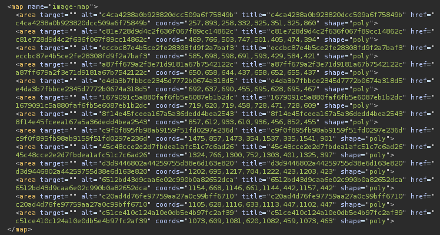
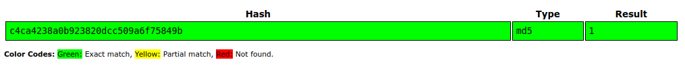
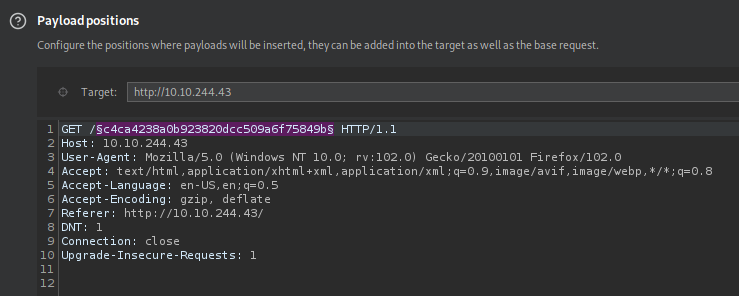
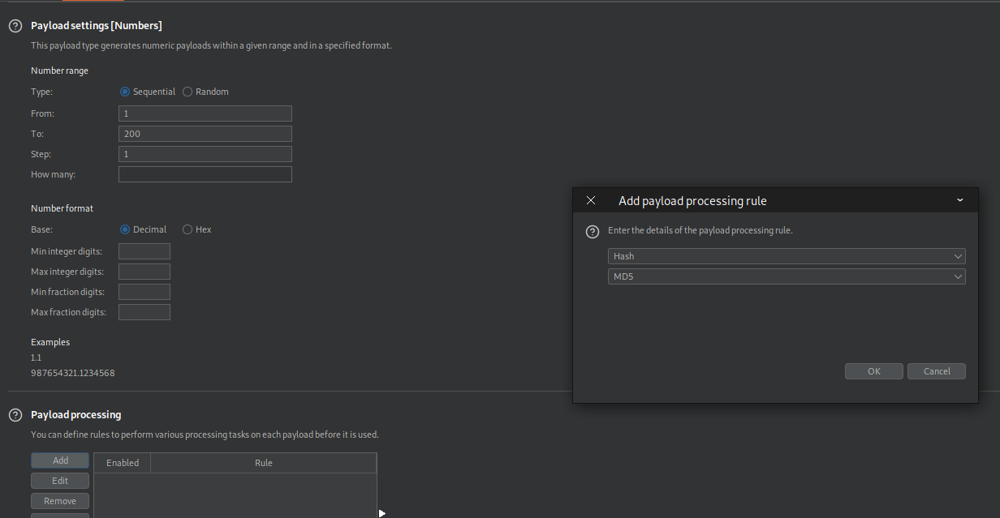

# TryHackMe - Corridor

  

- [Room on THM](https://tryhackme.com/room/corridor)

When we acces the website, We land on this page.  

  

Each door sends somewhere  

If we analyse the hashes they seem to be md5. Let's check one on [crackstation](https://crackstation.net/)  

  

Let's use intruder to increment the number and try to find the flag  

  

These settings should do we need to process our payload and hash it in md5 like this  

  

We got nothing this way.  
Then I realized I did not try 0.  
So I hashed zero in MD5 accessed the page and got the flag! :D  
