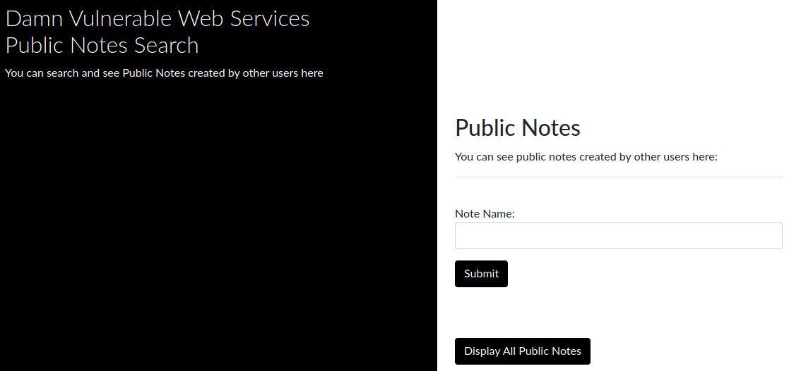
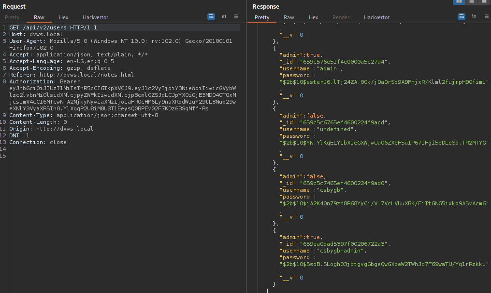

# Damn Vulnerable Web Service

## General info, Get it and deploy it

- [Official repo dvws](https://github.com/snoopysecurity/dvws-node)

### Infos

#### List of Vulnerabilities

> This is the list from the documentation  
> To keep track, I will check everytime I find one

- [x] Insecure Direct Object Reference
- [x] Horizontal Access Control Issues
- [x] Vertical Access Control Issues
- [x] Mass Assignment
- [x] Cross-Site Scripting
- [x] NoSQL Injection
- [ ] Server Side Request Forgery
- [x] JSON Web Token (JWT) Secret Key Brute Force
- [x] Information Disclosure
- [x] Hidden API Functionality Exposure
- [ ] Cross-Origin Resource Sharing Misonfiguration
- [ ] JSON Hijacking
- [ ] SQL Injection
- [x] XML External Entity Injection (XXE)
- [ ] Command Injection
- [ ] XPATH Injection
- [ ] XML-RPC User Enumeration
- [ ] Open Redirect
- [ ] Path Traversal
- [ ] Unsafe Deserialization
- [ ] Sensitive Data Exposure
- [ ] GraphQL Access Control Issues
- [ ] GraphQL Introspection Enabled
- [ ] GraphQL Arbitrary File Write
- [ ] GraphQL Batching Brute Force
- [ ] Client Side Template Injection

### Deploy it

- `git clone https://github.com/snoopysecurity/dvws-node.git`
- `cd dvws-node`
- `docker compose up`
- It should start building

  

- Once done edit your `/etc/hosts` file and add this line `127.0.0.1 dvws.local`

- All the other infos we need are here

```bash
web-1         | 🚀 XML-RPC server listening on port 9090
web-1         | 🚀 API listening at http://dvws.local (127.0.0.1)
web-1         | 🚀 GraphQL Server ready at http://localhost:4000/
```

## Hack it

- Launch burp or zap and setup your scope settings

### Exploration

#### Register

Now we can visit `http://dvws.local/` we get this page  

  

Let's create an account  

  

Once logged in we get this home page:

  

#### Home page without being logged in

However we do not need to be logged in to access the home page. We can access it right away if we go here `http://dvws.local/home.html`  

  

#### File upload functionality

Here `http://dvws.local/upload.html` we have the possibility to upload files. So this is definitely something to keep aside for later.  

  

#### PassPhrase Generator

Another page to keep for later explorations `http://dvws.local/passphrasegen.html`  

  

#### Public Notes

Another one `http://dvws.local/search.html`  



#### Admin Area

We can access the admin area as well without any cookie `http://dvws.local/admin.html`

  

  

#### Save Secret Note

This looks fun too `http://dvws.local/notes.html`  

  

If we try to create a note without a token it won't work. So we can access the page but we can not write notes.  

  

#### Directory and endpoint enumeration

- Directory enum small list

```bash
┌─[✗]─[gabrielle@parrot]─[~/vulnerable-apis/dvws-node/dvws-node]
└──╼ $wfuzz -c --hc 404 --hw 225 -w /usr/share/seclists/Discovery/Web-Content/directory-list-2.3-small.txt http://dvws.local/FUZZ
 /usr/lib/python3/dist-packages/wfuzz/__init__.py:34: UserWarning:Pycurl is not compiled against Openssl. Wfuzz might not work correctly when fuzzing SSL sites. Check Wfuzz's documentation for more information.
********************************************************
* Wfuzz 3.1.0 - The Web Fuzzer                         *
********************************************************

Target: http://dvws.local/FUZZ
Total requests: 87664

=====================================================================
ID           Response   Lines    Word       Chars       Payload                                                                                              
=====================================================================

000000164:   301        10 L     16 W       181 Ch      "uploads"                                                                                            
000000269:   301        10 L     16 W       179 Ch      "static"                                                                                             
000000549:   301        10 L     16 W       173 Ch      "css"                                                                                                
000000954:   301        10 L     16 W       171 Ch      "js"                                                                                                 
000008156:   301        10 L     16 W       173 Ch      "CSS"                                                                                                
000009299:   301        10 L     16 W       171 Ch      "JS"                                                                                                 

Total time: 63.89374
Processed Requests: 87664
Filtered Requests: 87658
Requests/sec.: 1372.027
```

- Directory enum big list

=> Nothing more than in the small one.

When I explored I saw that the schema for the api was `/api/v2`. This is good to know (I found it in my burp history). This way we have the api endpoints schema.  

- Let's try another wordlist, I really want to find the documentation. This time I will use the intruder and the wordlist swagger.txt
- Here is my position tab in the intruder

  

> Notice that I did not put a / after the GET http verb

- My payloads tab look like this


> Make sure to unchek the URL-encode these characters at the bottom

Then we can launch the attack. We order the results by Status we get to endpoints worth checking  

  

Both these endpoints have the documenation  

- http://dvws.local/api-docs/
- http://dvws.local/api-docs/swagger.json

## Mass assignment

- Create an admin user we add the parameter admin and set it to true `admin=true`


- It works. Our new user is admin



## Information disclosure

So in our burp history we have a `users` endpoint which gives a list of users and their password hashes.  

  

With this information we can for example attempt to crack the admin hash.
First let's find out which hash this is. We go to hascat examples hashes page [here](https://hashcat.net/wiki/doku.php?id=example_hashes) and we search `$2b$10` on the page.  
This way we see it is bcrypt.
Now we can crack the hash with john (or hashcat) and we get the password of the admin user `letmein`.

  

So now we can log in as admin  

  

## Horizontal Access Control

When we access our passphrases, it calls the following endpoint `/api/v2/passphrase/csbygb` so it takes the username as id.  
So we could try to access the admin one `/api/v2/passphrase/admin`  
It works! Funny thing here is we do not even need a cookie to access it.  


> Note: I added a passphrase myself for the sake of the demo here.

## Vertical Access Control Issues

When we try to access the admin area with a normal user through the browser we get redirected.  
However when we use an admin user we access the endpoint `/api/v2/sysinfo/uname`  
And the web browser shows this page.  

  

So we can try to access the same endpoint but with a user Token.  

- Access with admin Token

  

So this is the legitimate request. We get info aobut the server.

- Access with user Token

  

So this should not be possible, we access admin info with a user token.  

If we try the functionality to search for a user we see this in the browser.  

  

So it calls this endpoint and the request and response look like this in burp  

  

So we can send the request to the repeater and change the token for a user one to see if we could access to the "admin" user info for example.  
And it works!  

  

## Cross Site Scripting

If we enter a user name with an xss payload in the user field the input is not sanitized and our paylaod is interpreted.  

  

Now if we click on login we get our pop up


## JSON Web Token (JWT) Secret Key Brute Force

Let's play a little with the jwt token. For this we can use jwt_tool. See [here](https://csbygb.gitbook.io/pentips/web-pentesting/api#make-a-lab-for-api-pentest) for how to install it.  

We can do it with this command `python3 jwt_tool.py <JWT-TOKEN-HERE> -o -C -d /usr/share/wordlists/rockyou.txt`  
It works and we get the password `access`  

  

Once we get a key we can use it to update our rights and become admin by adding a permission.  
Here we can add the permission `"user:admin"`  
Here is how we could this with [jwt.io](https://jwt.io/)

  

Then we would just have to use this new generated token to access admin resources.

## XML External Entity Injection (XXE)

When playing with the user search we had an XML Content. So this is definitely the place to check for XXE.  
Let's try to insert these lines at the top

```xml
<?xml version="1.0" encoding="UTF-8"?>
<!DOCTYPE test [ <!ENTITY xxe SYSTEM "file:///etc/passwd"> ]>
```

Then we can use this `&xxe;` in the usernames tags to print the file we need (here the passwd).

And it works we get the passwd file of the server.  

  

## Insecure Direct Object Reference

When playing with the notes we have a number attributed to the secret notes we create like this:  


> Here we have a note no 4 and no 9

We could try to check if the endpoint can also request only one specific note, using this number as an id.  
This endpoint `/api/v2/notes` will return all the notes let's try something like `/api/v2/notes/note-number`  
And it works we can access any note from any user.  
For example here is a note from `csbygb` with the token of `csbygb-otheruser`  

  

After this we could enumerate all the notes with an automatic tool like burp intruder for example and by incrementing the note no.  

## NoSQL Injection

So if we play with the quotes and try some NoSQL payload (you can find some [here](https://github.com/cr0hn/nosqlinjection_wordlists/blob/master/mongodb_nosqli.txt)), we can trigger a NoSQL injection on the endpoint `/api/v2/notesearch`.  
It works and we get all the notes, including the secret ones  

  

## Hidden API Functionnality Exposure

So if we analyze the swagger we found during the enumeration phase.  
We have an endpoint that is different than the others `/api/v1/info` so this is an old functionnality.  
Well, let's try it.  
This discloses a lot of information on the server.  

  

## Resources

- [OWASP API Security Top 10](https://owasp.org/API-Security/editions/2023/en/0x00-header/)
- [OWASP Security Testing v3](https://owasp.org/www-project-web-security-testing-guide/assets/archive/OWASP_Testing_Guide_v3.pdf)
