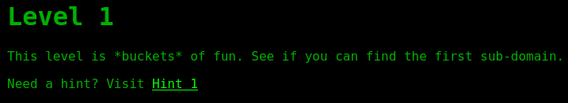
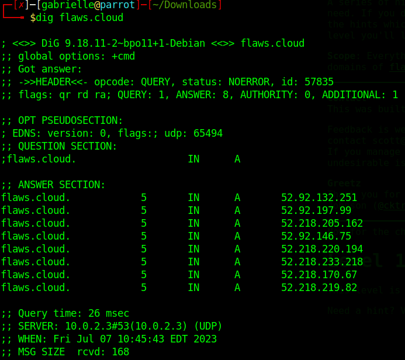
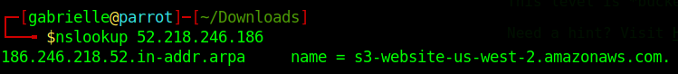
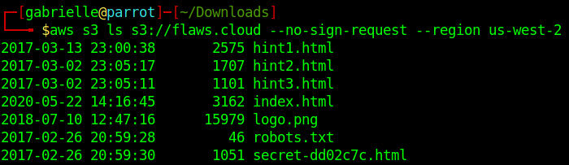
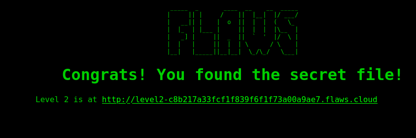
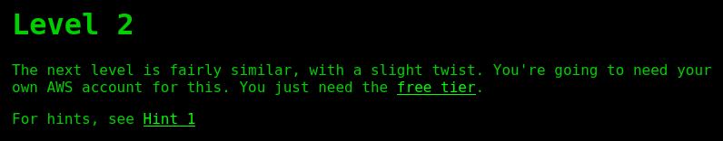
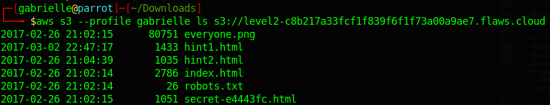
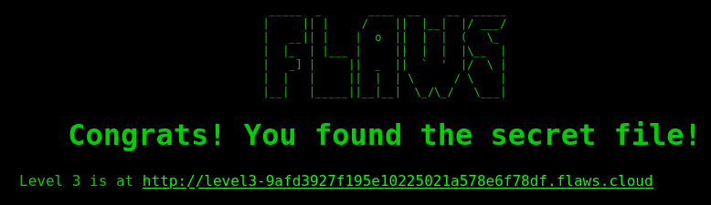

# flAWS 1 & 2

These labs are a great introduction for AWS Pentest  

- [flAWS](http://flaws.cloud/)
- [flAWS2](http://flaws2.cloud/)

## flAWS 1

### Level 1

First task is to find the first sub-domain.  

- Let's make a dig command first  

  

- Now we can nslookup on one of the IP address  

  

We now have more details about the s3 bucket, we can use aws cli `aws s3 ls s3://flaws.cloud --no-sign-request --region us-west-2` here we are doing an ls on the bucket and we specify the region.  

  
If we check the html file we end up on this page  

  

### Level 2

  

Let's check the bucket but this time with our own user `aws s3 --profile gabrielle ls s3://level2-c8b217a33fcf1f839f6f1f73a00a9ae7.flaws.cloud`

I litterally pulled my hair here xD.  
I had an access denied `An error occurred (AccessDenied) when calling the ListObjectsV2 operation: Access Denied` even with my user, what solved the problem is that I needed to add said user to a group in order for it to have permissions.  
See more about this [here](../cloud/aws.md)  
Once I had done this I tried the command again and got the ls  

  

And then again we can access the secret html file and we end up here  

  

### Level 3

