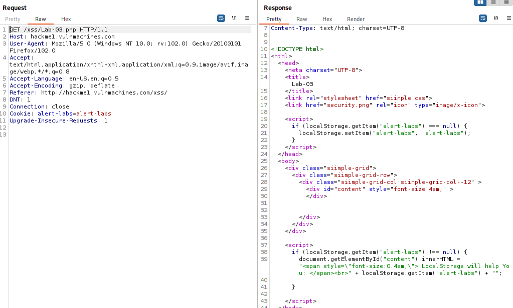
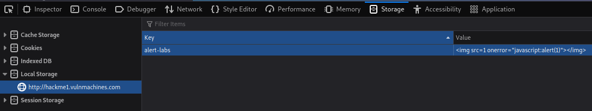

# Vulnmachines - Web - Basic Labs

## Cross Site Scripting

### XSS Lab 1

We end up here, our user agent is reflected to us:  

  

We put on the intercept on burp (we can also work in the repeater tab).  
Let's try this first `<script>alert(1)</script>`

  

It works  

  

  

### XSS Lab 2

We end up here  

  

This time our cookie is reflected to us  

  

Let's try the same paylaod `<script>alert(1)</script>`

  

It works again  

  

  

### XSS Lab 3

We land here  

  

Here is what it looks like in burp  



These 2 snippets of js are interesting  

```javascript
[STRIPPED]
<script>
if (localStorage.getItem("alert-labs") === null) {
	 localStorage.setItem("alert-labs", "alert-labs");
}
</script>
[STRIPPED]
<script>
if (localStorage.getItem("alert-labs") !== null) {
		 document.getElementById("content").innerHTML = "<span style=\"font-size:0.4em;\"> LocalStorage will help You: </span><br>" + localStorage.getItem("alert-labs") + "";
}
</script>
[STRIPPED]
```

The first snippet is going to set the local storage to `alert-labs` if null.  
The second one is going fetch the localStorage and print it in the page.  
This time we need to modify this in our browser.  
In firefox we can modify the localStorage property and enter this `</img>`. Just like this  

  

This way if we refresh the page we get our alert:  


Note that in a real context, this would require a user interaction.

The following articles are really interesting to see how a vulnerability like this could be exploited in a real context: 

- [DOM-based HTML5-storage manipulation](https://portswigger.net/web-security/dom-based/html5-storage-manipulation)
- [DOM-based vulnerabilities - Portswigger](https://portswigger.net/web-security/dom-based)
- [Wagtail XSS + LocalStorage = Account Hijack on TechAnarchy](https://www.techanarchy.net/wagtail-xss-localstorage-privesc/)
- [LocalStorage exploit via Cross Site Scripting on Appsec Ramblings](http://appsecramblings.blogspot.com/p/blog-page_8462.html)
- [XSS - The LocalStorage Robbery by Jerry Shah](https://shahjerry33.medium.com/xss-the-localstorage-robbery-d5fbf353c6b0)

- [This article](https://portswigger.net/research/web-storage-the-lesser-evil-for-session-tokens) by James Kettle is really interesting and worth reading to have a better understanding of security of Web Storage

## IDOR

We end up here so let's try and create a pdf file.  
We get an id let's take it and paste it to get our generated pdf  


Our request to get our pdf looks like this:  

  

Let's send this to the repeater and try to get other pdf_id
It seems like we can enumerate any pdf on the platform  

  

Let's do this with the intruder to find the one with our flag  

We put our var on the id like this  

  

Here is how to set the payload  

  

We can launch the attack. The length of the response will be very helpful to know which file is the one we want. There is one that is considerably different than the other  

  

Let's try it. If we show the response in the browser we find the flag in our PDF!  


## Local File Inclusion

We end up here:  

  

Let's try to click on search  

  

Here is what we see on burp  

  

Let's send this to repeater and try to access to file from the server.  
It works we can access `/etc/passwd`  

  

Apparently we do not even need to move in the folders, sending a request with just `/etc/passwd` works as well.
