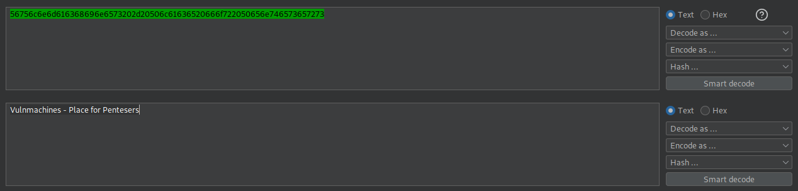

# Vulnmachines - Web - Intermediate Labs

## SSTI

We end up on this page  

  

- If we enter `{{` we get an exception

  

- Let's find out which template it uses using James Kettle tree (see more details about this [here](https://csbygb.gitbook.io/pentips/web-pentesting/webvulns/template-injection))  

- This one `{{7*7}}` evaluates

  

However this `{{7*'7'}}` seems to reveal that some char are filtered  

  

If we use double quotes instead it works `{{7*"7"}}`  

According to the tree it can be Jinja2 or Twig  

As we have a header leaking the Python version, the template should be Jinja2 as it is based on python  

  

- let's try to find the config `{{config}}`

  

We get the flag here but it seems encoded. If we use burpsuite and decode it as ASCII hex, we get the flag!

