# Vulnmachines - Cloud Labs

## Misconfigured Bucket

  

- When launching the lab we end up on this page

  

It is hosted on an AWS S3 bucket `vnm-sec-aws`.  
Googling around we find a few interesting articles and we can try this command with the aws cli `aws s3 ls s3://vnm-sec-aws --no-sign-request`  
However we get an access denied  

  

> We need to create an aws account and get access ID and secret access this way we will be able to use this account for our test.
> Check out [here](../cloud/aws.md) how to do so  

Let's try this `aws s3api get-bucket-acl --bucket <Bucket_Name>`  
`aws s3api get-bucket-acl --bucket vnm-sec-aws`  

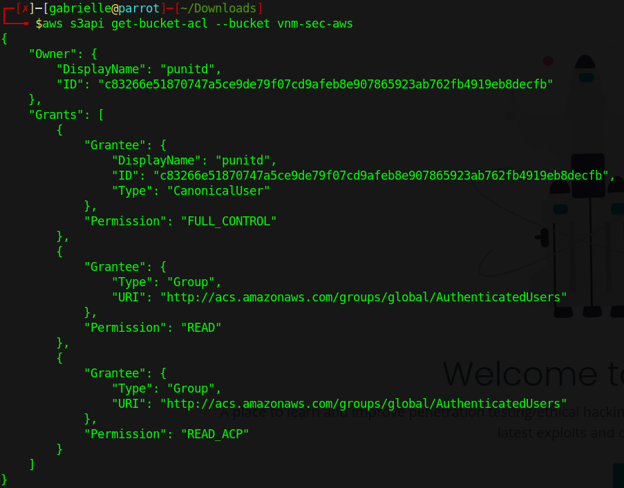

This means that all authenticated users (globally) can read the bucket.

Sounds good let's try to list the content

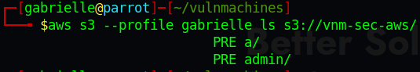  

The a folder seems interesting  

It goes like this until letter p and in the p folder we have a flag file!!  

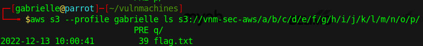  

We can cp it to our local folder `aws s3 --profile gabrielle cp s3://vnm-sec-aws/a/b/c/d/e/f/g/h/i/j/k/l/m/n/o/p/flag.txt .`  

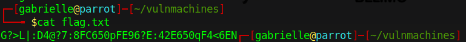

We now need to decode the flag which is in ROT47. We can use Cyberchef to decode it.  

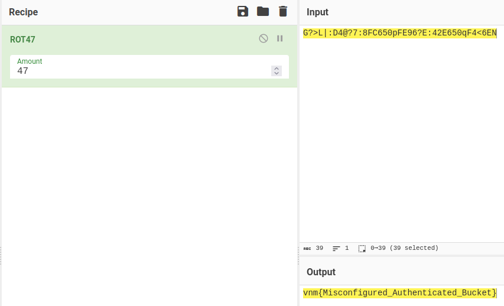  

## Public Bucket

We have this landing page  
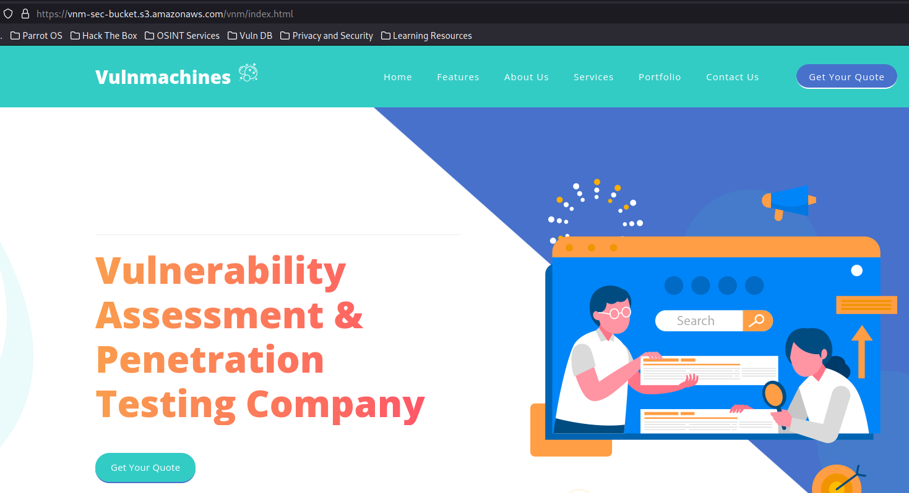

- Let's ls the bucket with this command `aws s3 ls s3://vnm-sec-bucket --no-sign-request`  

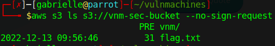

We can now try to cp the flag file `aws s3 cp s3://vnm-sec-bucket/flag.txt --no-sign-request .`  

It works and we get the flag!

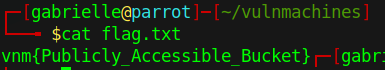

## Special Policy Bucket

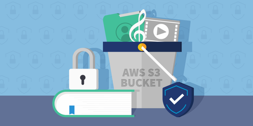

We end up here:  

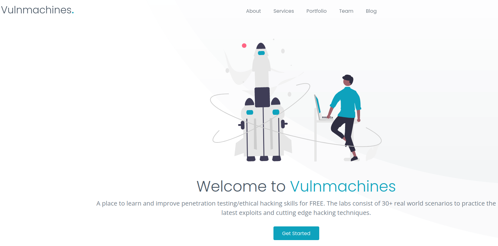  

Let's use nslookup on the IP  

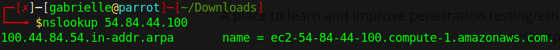  

### COMING SOON
