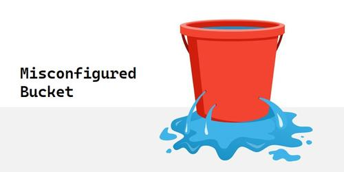
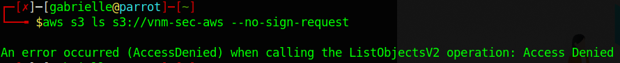

# Vulnmachines - Cloud Labs

## Misconfigured Bucket

  

- When launching the lab we end up on this page

  

It is hosted on an AWS S3 bucket `vnm-sec-aws`.  
Googling around we find a few interesting articles and we can try this command with the aws cli `aws s3 ls s3://vnm-sec-aws --no-sign-request`  
However we get an access denied  

  

Let's try this `aws s3api get-bucket-acl --bucket <Bucket_Name>`  
`aws s3api get-bucket-acl --bucket vnm-sec-aws`

We need to create an aws account and get access ID and secret access this way we will be able to use this account for our test.  
[Here](https://docs.aws.amazon.com/powershell/latest/userguide/pstools-appendix-sign-up.html) is and article on how to get the creds once our account created.

### COMING SOON